# Prometheus + Grafana 可视化监控

## 一、Prometheus + Grafana介绍

### 1. Prometheus

Prometheus 是一套开源的系统监控报警框架。它启发于 Google 的 borgmon 监控系统，由工作在 SoundCloud 的 google 前员工在 2012 年创建，作为社区开源项目进行开发，并于 2015 年正式发布。2016 年，Prometheus 正式加入 Cloud Native Computing Foundation，成为受欢迎度仅次于 Kubernetes 的项目。

作为新一代的监控框架，Prometheus 具有以下特点：

- 强大的多维度数据模型：
  1. 时间序列数据通过 metric 名和键值对来区分。
  2. 所有的 metrics 都可以设置任意的多维标签。
  3. 数据模型更随意，不需要刻意设置为以点分隔的字符串。
  4. 可以对数据模型进行聚合，切割和切片操作。
  5. 支持双精度浮点类型，标签可以设为全 unicode。

- 灵活而强大的查询语句（PromQL）：在同一个查询语句，可以对多个 metrics 进行乘法、加法、连接、取分数位等操作。
- 易于管理： Prometheus server 是一个单独的二进制文件，可直接在本地工作，不依赖于分布式存储。
- 高效：平均每个采样点仅占 3.5 bytes，且一个 Prometheus server 可以处理数百万的 metrics。
- 使用 pull 模式采集时间序列数据，这样不仅有利于本机测试而且可以避免有问题的服务器推送坏的 metrics。
- 可以采用 push gateway 的方式把时间序列数据推送至 Prometheus server 端。
- 可以通过服务发现或者静态配置去获取监控的 targets。
- 有多种可视化图形界面。
- 易于伸缩。

### 2. Prometheus架构

`Prometheus`使用`pull`模式采集应用中暴露的时间序列数据(`push gateway`可使用`push`模式)，将监控数据持久化在磁盘中，最后通过`Grafana`提供的UI界面进行数据的展示、指标统计和错误报警。


（1）Prometheus的生态组件

- Prometheus Server：主服务器，负责收集和存储时间序列数据，负责实现对监控数据的获取，存储以及查询。
-  client libraies：客户端库，目的在于为那些期望原生提供Instrumentation功能的应用程序提供便捷的开发途径（Instrumentation 插桩一般指的是获取计算机软件或者硬件状态的数据的技术）
- Pushgateway：接受那些通常由短期作业生成的指标数据的网关，并支持Prometheus Server进行指标拉取操作
-  exporter：用于暴露现有应用程序或服务的指标（不支持Instrumentation）给Prometheus Server
-  AlertManager：在 prometheus 中，支持基于 PromQL 创建告警规则，如果满足定义的规则，则会产生一条告警信息，进入 AlertManager 进行处理。可以集成邮件，微信或者通过 webhook 自定义报警。
- Data Visualization：Prometheus Web UI，即Grafana等
- Server Discovery：动态发现待监控的Target，从而完成监控配置的重要组件，在容器化环境中尤为重要

### 3. Grafana

`Grafana`使你能够把来自不同数据源比如`Elasticsearch`, `Prometheus`, `Graphite`, `influxDB`等多样的数据以绚丽的图标展示出来。它也能基于你的`metrics`数据发出告警。当一个告警状态改变时，它能通知你通过email，slack或者其他途径。

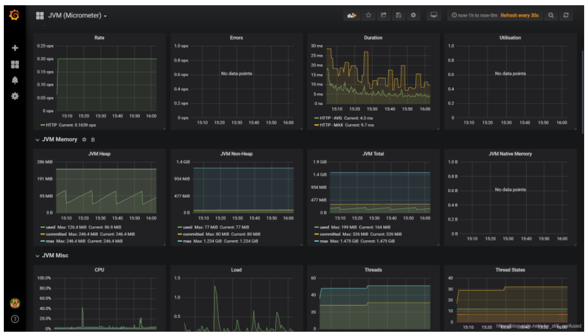

## 二、Prometheus + Grafana应用落地

### 1. 安装服务器指标监控器`node_exporter`

> 建议：该组件`node_exporter`直接安装到服务器上面，不建议使用容器的方式的安装，容器安装的可能导致收集指标数据不准确

（1）服务器安装

官网：https://prometheus.io/

下载node_exporter-1.3.1.linux-amd64.tar.gz

```shell
# 上传 node_exporter-1.3.1.linux-amd64.tar.gz 到虚拟机的/test/prometheus/ 目录

#创建目录
mkdir /test/prometheus/node_exporter

# 解压到/opt/module 目录下：
tar  -zxvf  node_exporter-1.2.2.linux-amd64.tar.gz  -C  /node_exporter
  
# 修改目录名：
cd node_exporter
mv node_exporter-1.2.2.linux-amd64 node_exporter-1.2.2  

# 启动：
cd node_exporter-1.2.2  
./node_exporter

curl http://192.168.200.104:9100/metrics
```


（2）Docker安装

```yaml
docker run -d \
--name node_exporter \
--restart=always \
--net="host" \
--pid="host" \
-v "/proc:/host/proc:ro" \
-v "/sys:/host/sys:ro" \
-v "/:/rootfs:ro" \
-e TZ=Asia/Shanghai \
-v /etc/localtime:/etc/localtime \
prom/node-exporter \
--path.procfs=/host/proc \
--path.rootfs=/rootfs \
--path.sysfs=/host/sys \
--collector.filesystem.ignored-mount-points='^/(sys|proc|dev|host|etc)($$|/)'
```

测试访问数据：http://192.168.200.104:9100/metrics，显示如下说明指标搜集到了

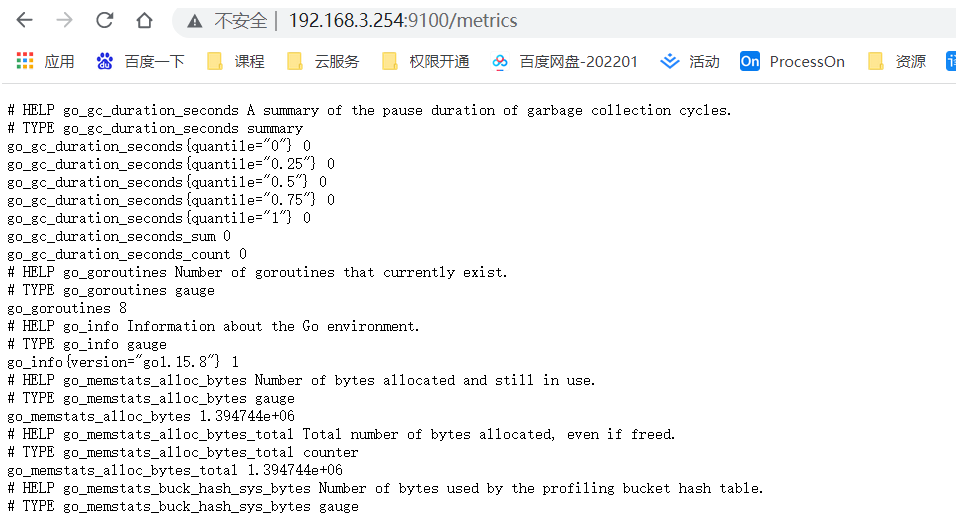

### 2. MySQL指标监控器`mysqld_exporter`

（1）建立挂载数据卷

```shell
# 建立挂载的数据卷
mkdir -p /test/prometheus/docker/mysql/data
```

（2）docker运行MySQL

```shell
#docker运行MySQL
docker run -p 3306:3306 --name mysql -v /test/prometheus/docker/mysql/data:/var/lib/mysql \
-e MYSQL_ROOT_PASSWORD=123456 -d --privileged=true hub.c.163.com/library/mysql:latest
```


（3）配置MySQL监控用户

```shell
# 创建数据库用户。
CREATE USER 'exporter'@'%' IDENTIFIED BY 'root123456';
# 可查看主从运行情况查看线程，及所有数据库。
GRANT PROCESS, REPLICATION CLIENT, SELECT ON *.* TO 'exporter'@'%';
flush privileges;
```

（4）安装`mysql_exporter`

```shell
docker run -d \
--name mysql_exporter \
--restart=always \
-p 9104:9104 \
-e DATA_SOURCE_NAME="exporter:root123456@(192.168.200.104:3306)/" \
prom/mysqld-exporter
```

### 3. prometheus搭建启动

（1）配置文件挂载目录

```shell
mkdir /test/prometheus/data
chmod -R 777 /test/prometheus/data
```


（2）prometheus.yml文件解析

```yaml
# 全局配置
global:

  # 默认抓取周期，可用单位ms、smhdwy #设置每15s采集数据一次，默认1分钟
  [ scrape_interval: <duration> | default = 1m ]

  # 默认抓取超时
  [ scrape_timeout: <duration> | default = 10s ]

  # 估算规则的默认周期 # 每15秒计算一次规则。默认1分钟
  [ evaluation_interval: <duration> | default = 1m ]

  # 和外部系统（例如AlertManager）通信时为时间序列或者警情（Alert）强制添加的标签列表
  external_labels:
    [ <labelname>: <labelvalue> ... ]
 
# 规则文件列表
rule_files:
  [ - <filepath_glob> ... ]
 
# 抓取配置列表
scrape_configs:
  [ - <scrape_config> ... ]
 
# Alertmanager相关配置
alerting:
  alert_relabel_configs:
    [ - <relabel_config> ... ]
  alertmanagers:
    [ - <alertmanager_config> ... ]
 
# 远程读写特性相关的配置
remote_write:
  [ - <remote_write> ... ]
remote_read:
  [ - <remote_read> ... ]
```

>- global：全局配置
>- alerting：告警配置
>- rule_files：告警规则
>- scrape_configs：配置数据源，称为target，每个target用job_name命名。又分为静态配置和服务发现

（3）创建prometheus.yml配置文件

```yaml
# 全局配置
global:  
  scrape_interval:     15s # 默认抓取周期，可用单位ms、smhdwy #设置每15s采集数据一次，默认1分钟
  evaluation_interval: 15s # 估算规则的默认周期 # 每15秒计算一次规则。默认1分钟
  # scrape_timeout is # 默认抓取超时 默认10s

# 抓取配置列表
scrape_configs:
# The job name is added as a label `job=<job_name>` to any timeseries scraped from this config.
- job_name: 'prometheus'
  static_configs:
  - targets: ['192.168.200.104:9090']
    labels:
      appname: 'Prometheus'
- job_name: 'node'
  scrape_interval: 10s
  static_configs:
  - targets: ['192.168.200.104:9100']
    labels:
      appname: 'node'
- job_name: 'mysql'
  scrape_interval: 10s
  static_configs:
  - targets: ['192.168.200.104:9104']
    labels:
      appname: 'mysql'
```


（4）启动Prometheus容器

```shell
docker run -d \
--name prometheus \
--restart=always \
-p 9090:9090 \
-v /test/prometheus/data:/prometheus \
-e TZ=Asia/Shanghai \
-v /etc/localtime:/etc/localtime \
-v /test/prometheus:/etc/prometheus \
prom/prometheus
```

（5）测试连接数据：http://192.168.200.104:9090/targets

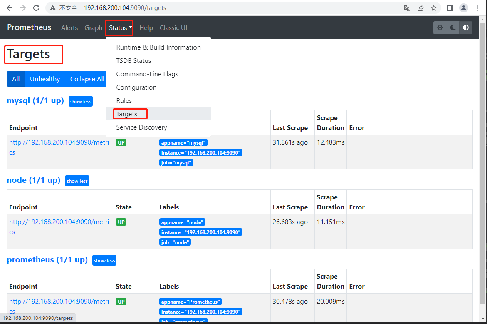

### 4. Grafana搭建

（1）启动容器

```shell
docker run -d \
--name grafana \
--restart=always \
-p 3000:3000 \
grafana/grafana
```

（2）访问Grafana

http://192.168.200.104:3000 初始化用户名密码：admin/admin

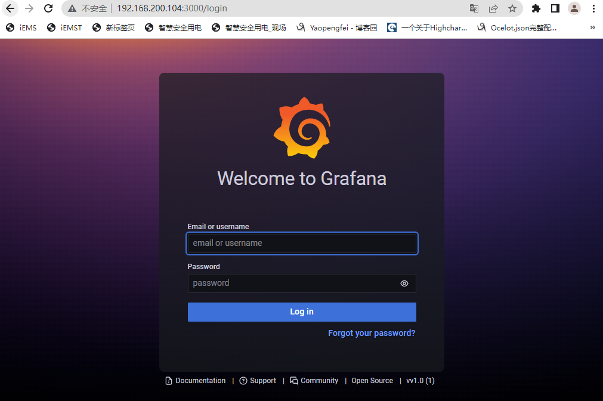

（3） 创建prometheus数据连接


（4）导入模板

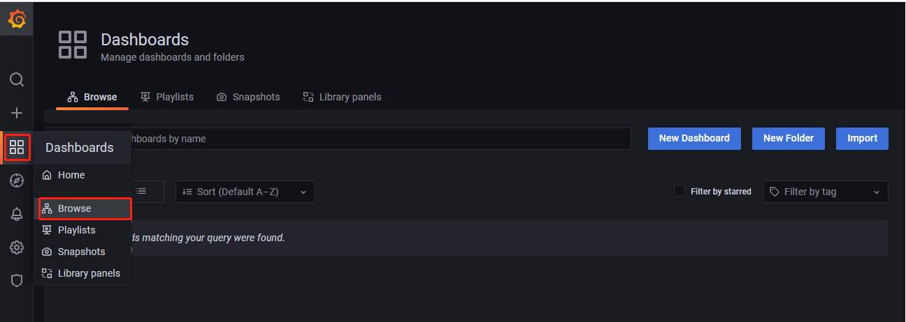

模板下载地址:https://grafana.com/grafana/dashboards，或者输入8919

（5）查看所需模板ID


（6）导入模板


（7）输入模板ID=12633（Linux主机详情模板）


（8）输入模板ID=6239（MySQL模板）


## 三、监控Dokcer指标

（1）安装`cadvisor`

> 在跑有docker容器的服务器上，安装`cadvisor`，以便于采集本机器的docker监控信息

```shell
docker run \
  --volume=/:/rootfs:ro \
  --volume=/var/run:/var/run:ro \
  --volume=/sys:/sys:ro \
  --volume=/var/lib/docker/:/var/lib/docker:ro \
  --volume=/dev/disk/:/dev/disk:ro \
  --publish=58080:8080 \
  --detach=true \
  --name=cadvisor \
  --privileged \
  --device=/dev/kmsg \
  google/cadvisor
```

访问测试: http://192.168.200.104:58080/containers/ 出现如下画面代表OK


（2）配置Prometheus

修改配置文件`prometheus.yml`，`添加`以下内容

```yaml
- job_name: 'docker'
  scrape_interval: 10s
  static_configs:
  - targets: ['192.168.200.104:58080']
```

热加载配置，即配置文件修改后，执行下列语句，无需重启服务

```shell
curl -X POST http://192.168.200.104:9090/-/reload
```

访问测试 http://192.168.200.104:58080/metrics

（3）导入Docker监控模板[13112]


## 四、服务器和容器常用监控指标

### 1. 服务器-监控CPU使用率

CPU的监控项名称是：`node_cpu_seconds_total`，使用总量

*直接执行node_cpu_seconds_total查询后会出现很多监控指标，显然不是想要的，node_cpu_seconds_total执行后会出现很多监控指标，其中各种类型的比如系统态、用户态都会由mode标签来区分*

我们想要查询CPU的使用率的思路是:

查出当前空闲的CPU百分比，最后用100减去，mode标签值idle就表示当前空闲的CPU值：


（1）获取空闲CPU监控数据

> node_cpu_seconds_total{mode="idle"}

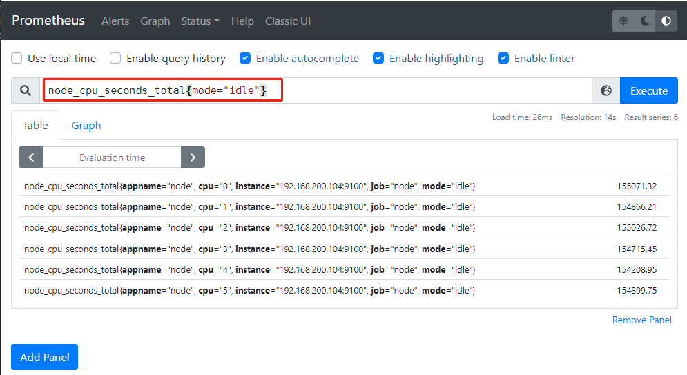

（2）获取5分钟内的监控数据

> node_cpu_seconds_total{mode="idle"}[5m]


（3）获取5分钟内的CPU平均空闲情况

我们可以使用irate和avg函数结合刚才查询出5分钟内数据做一个平均情况展示

函数的使用方法：函数(指标获取方式)

> avg(irate(node_cpu_seconds_total{mode="idle"}[5m])) by (instance)

by(instance)表示以instance标签进行分组


（4）获取CPU5分钟内使用率

最后我们可以*100得出一个百分比的空闲率，再由100-即可得到CPU的使用率

> 100 - (avg(irate(node_cpu_seconds_total{mode='idle'}[5m])) by (instance) *100)


### 2. 服务器-监控内存使用率

由于内存的监控项没有像CPU一样区分了很多标签，因此内存监控相较于CPU则需要结合很多个监控项

> node_memory_MemFree_bytes //空闲内存
>
> node_memory_MemTotal_bytes //总内存
>
> node_memory_Cached_bytes //缓存
>
> node_memory_Buffers_bytes //缓冲区内存

监控内存使用的思路：

- 空闲内存+缓存+缓冲区内存得出空闲总内存
- 得出的空闲总内存再除总内存大小*100，得出空闲率
- 再用100-空闲率就得出使用率

（1）获取空闲内存

> (node_memory_MemFree_bytes+node_memory_Cached_bytes+node_memory_Buffers_bytes)

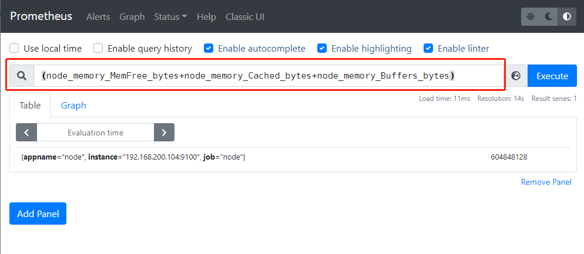

（2）获取空闲内存率

> (node_memory_MemFree_bytes+node_memory_Cached_bytes+node_memory_Buffers_bytes) / node_memory_MemTotal_bytes * 100

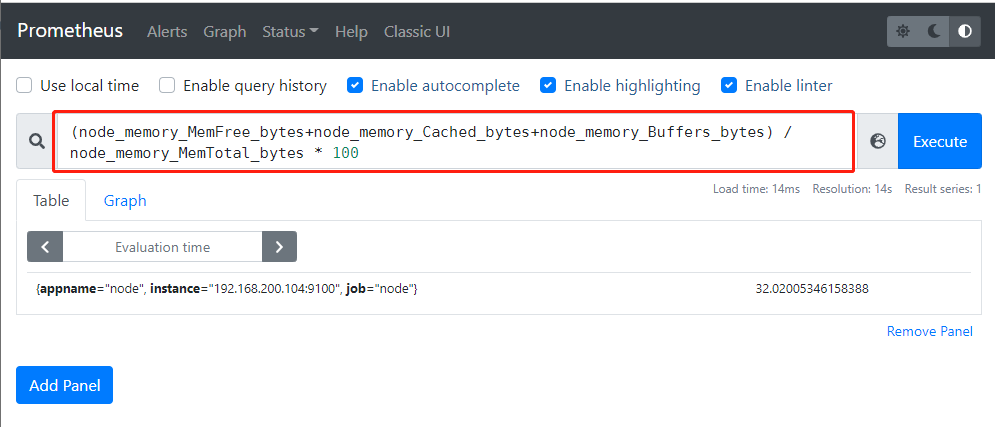

（3）获取内存使用率

> 100 - ((node_memory_MemFree_bytes+node_memory_Cached_bytes+node_memory_Buffers_bytes) / node_memory_MemTotal_bytes * 100)


### 3. 服务器-磁盘使用率

关于磁盘使用率，这里我们用到的主要有：

> node_filesystem_free_bytes //剩余磁盘空间
>
> node_filesystem_size_bytes //磁盘空间总大小

这两个监控项中都有相同的标签可以关联，我们这里用到的标签有fstype，fstype标签值是关于磁盘的文件系统类型，对于磁盘监控，我们主要对xfs、ext4等文件系统的磁盘进行监控，像tmpfs这种的不必要监控，另一个主要的标签是mountpoint，这个标签值主要用来储存磁盘的挂载点，我们可以通过标签来选择要对那个挂载点的磁盘进行监控

磁盘使用率实现思路：

- 由磁盘空闲容量除磁盘总容量乘100即可得到磁盘空闲率

- 用100减磁盘空闲率即可得到磁盘使用率

（1）获取磁盘空闲率

> node_filesystem_free_bytes{fstype=~"ext4|xfs",mountpoint="/"} / node_filesystem_size_bytes{fstype=~"ext4|xfs",mountpoint="/"} *100

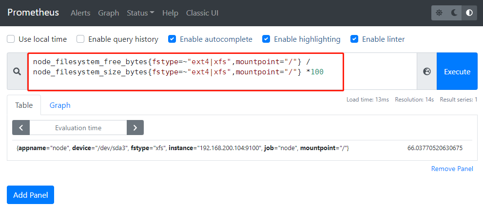

（2）获取磁盘使用率

> 100 - (node_filesystem_free_bytes{fstype=~"ext4|xfs",mountpoint="/"} / node_filesystem_size_bytes{fstype=~"ext4|xfs",mountpoint="/"} *100)

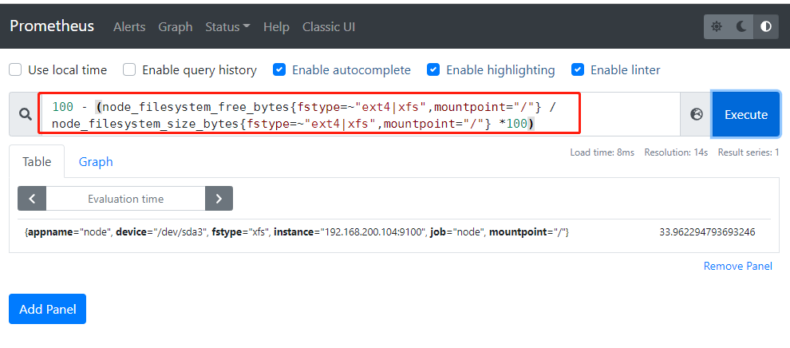

### 4. Dokcer-监控CPU、内存、磁盘使用率

> container_cpu_usage_seconds_total 
>
> 提示：只能根据镜像名称筛选


> 容器CPU使用率:
> sum(irate(container_cpu_usage_seconds_total{image!=""}[1m])) without (cpu)
>
> 查询容器内存使用量（单位：字节）:
> container_memory_usage_bytes{image!=""}
>
> 查询容器网络接收量速率（单位：字节/秒）：
> sum(rate(container_network_receive_bytes_total{image!=""}[1m])) without (interface)
>
> 查询容器网络传输量速率（单位：字节/秒）：
> sum(rate(container_network_transmit_bytes_total{image!=""}[1m])) without (interface)
>
> 查询容器文件系统读取速率（单位：字节/秒）：
> sum(rate(container_fs_reads_bytes_total{image!=""}[1m])) without (device)
>
> 查询容器文件系统写入速率（单位：字节/秒）：
> sum(rate(container_fs_writes_bytes_total{image!=""}[1m])) without (device)

## 五、配置警告

### 1. 报警通知模板

`alertmanager.yml`

```yml
 创建alertmanager.yml报警通知文件
```

### 2. 邮件通知模板

```yml
{{ define "wechat.default.message" }}
{{ range $i, $alert :=.Alerts }}
========监控报警==========
告警状态：{{   .Status }}
告警级别：{{ $alert.Labels.severity }}
告警类型：{{ $alert.Labels.alertname }}
告警应用：{{ $alert.Annotations.summary }}
告警主机：{{ $alert.Labels.instance }}
告警详情：{{ $alert.Annotations.description }}
触发阀值：{{ $alert.Annotations.value }}
告警时间：{{ $alert.StartsAt.Format "2006-01-02 15:04:05" }}
========end=============
{{ end }}
{{ end }}
```

### 3. 部署alertmanager

```shell
docker run -d -p 9093:9093 --name alertmanager  -v /test/alertmanager/alertmanager.yml:/etc/alertmanager/alertmanager.yml -v /test/alertmanager/template:/etc/alertmanager/template docker.io/prom/alertmanager:latest
```

访问测试：http://192.168.200.104:9093/

### 4. 规则文件rules.yml

```yml
groups:
- name: example #定义规则组
  rules:
  - alert: InstanceDown  #定义报警名称
    expr: up == 0   #Promql语句，触发规则
    for: 10s            # 一分钟
    labels:       #标签定义报警的级别和主机
      name: instance
      severity: Critical
    annotations:  #注解
      summary: " {{ $labels.appname }}" #报警摘要，取报警信息的appname名称
      description: " 服务停止运行 "   #报警信息
      value: "{{ $value }}%"  # 当前报警状态值
- name: Host
  rules:
  - alert: HostMemory Usage
    expr: (node_memory_MemTotal_bytes - (node_memory_MemFree_bytes + node_memory_Buffers_bytes + node_memory_Cached_bytes)) / node_memory_MemTotal_bytes * 100 >  80
    for: 10s
    labels:
      name: Memory
      severity: Warning
    annotations:
      summary: " {{ $labels.appname }} "
      description: "宿主机内存使用率超过80%."
      value: "{{ $value }}"
  - alert: HostCPU Usage
    expr: sum(avg without (cpu)(irate(node_cpu_seconds_total{mode!='idle'}[5m]))) by (instance,appname) > 0.65
    for: 10s
    labels:
      name: CPU
      severity: Warning
    annotations:
      summary: " {{ $labels.appname }} "
      description: "宿主机CPU使用率超过65%."
      value: "{{ $value }}"
  - alert: HostLoad 
    expr: node_load5 > 4
    for: 10s
    labels:
      name: Load
      severity: Warning
    annotations:
      summary: "{{ $labels.appname }} "
      description: " 主机负载5分钟超过4."
      value: "{{ $value }}"
  - alert: HostFilesystem Usage
    expr: 1-(node_filesystem_free_bytes / node_filesystem_size_bytes) >  0.8
    for: 10s
    labels:
      name: Disk
      severity: Warning
    annotations:
      summary: " {{ $labels.appname }} "
      description: " 宿主机 [ {{ $labels.mountpoint }} ]分区使用超过80%."
      value: "{{ $value }}%"
  - alert: HostDiskio
    expr: irate(node_disk_writes_completed_total{job=~"Host"}[1m]) > 10
    for: 10s
    labels:
      name: Diskio
      severity: Warning
    annotations:
      summary: " {{ $labels.appname }} "
      description: " 宿主机 [{{ $labels.device }}]磁盘1分钟平均写入IO负载较高."
      value: "{{ $value }}iops"
  - alert: Network_receive
    expr: irate(node_network_receive_bytes_total{device!~"lo|bond[0-9]|cbr[0-9]|veth.*|virbr.*|ovs-system"}[5m]) / 1048576  > 3 
    for: 10s
    labels:
      name: Network_receive
      severity: Warning
    annotations:
      summary: " {{ $labels.appname }} "
      description: " 宿主机 [{{ $labels.device }}] 网卡5分钟平均接收流量超过3Mbps."
      value: "{{ $value }}3Mbps"
  - alert: Network_transmit
    expr: irate(node_network_transmit_bytes_total{device!~"lo|bond[0-9]|cbr[0-9]|veth.*|virbr.*|ovs-system"}[5m]) / 1048576  > 3
    for: 10s
    labels:
      name: Network_transmit
      severity: Warning
    annotations:
      summary: " {{ $labels.appname }} "
      description: " 宿主机 [{{ $labels.device }}] 网卡5分钟内平均发送流量超过3Mbps."
      value: "{{ $value }}3Mbps"
- name: Container
  rules:
  - alert: ContainerCPU Usage
    expr: (sum by(name,instance) (rate(container_cpu_usage_seconds_total{image!=""}[5m]))*100) > 60
    for: 10s
    labels:
      name: CPU
      severity: Warning
    annotations:
      summary: "{{ $labels.name }} "
      description: " 容器CPU使用超过60%."
      value: "{{ $value }}%"
  - alert: ContainerMem Usage
#    expr: (container_memory_usage_bytes - container_memory_cache)  / container_spec_memory_limit_bytes   * 100 > 10  
    expr:  container_memory_usage_bytes{name=~".+"}  / 1048576 > 1024
    for: 10s
    labels:
      name: Memory
      severity: Warning
    annotations:
      summary: "{{ $labels.name }} "
      description: " 容器内存使用超过1GB."
      value: "{{ $value }}G"
```

### 5. 添加报警规则

```yml
alerting:       #指定alertmanager报警组件地址
  alertmanagers:
  - static_configs:
    - targets: ['192.168.200.104:9093']

rule_files:  #指定报警规则文件
  - "rules.yml"
```

文件结构如下：


### 6. 重新启动Prometheus

访问Alert，配置全部生效，则说明配置成功


### 7. 测试告警

停止监视中的服务，例如node_exporter，则告警

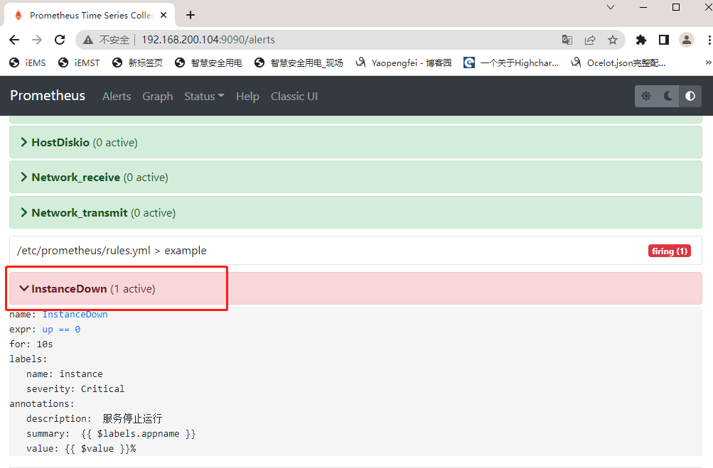

