# CoreCLR （.NET Core Common language Runtime）

## 一、内存模型

## 1. 栈和堆

程序运行时，它的数据必须存储在`内存`中。一个数据项需要多大的内存、存储在什么地方、以及如何存储都依赖于该数据项的类型。

运行中的程序使用两个内存区域来存储数据：栈和堆。

### 1.1 栈

栈是一个内存数组（连续分配内存空间，代表不产生内存碎片），是一个LIFO（last-in first-out，后进先出）的数据结构。栈存储几种类型的数据：某些类型变量的值、程序当前的执行环境、传递给方法的参数。

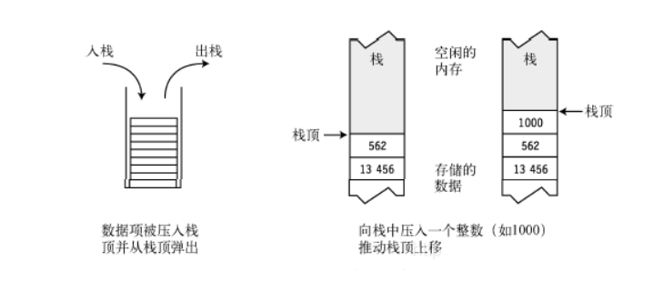

**栈的特点：**

（1）数据只能从栈的顶端插入和删除。

（2）把数据放到栈顶称为入栈。

（3）从栈顶删除数据称为出栈。

### 1.2 堆

堆是一块内存区域，在堆里可以分配大块的内存用于存储某种类型的数据`对象`。与栈不同，堆里的内存能够以任意顺序存入和移除。下图展示了一个在堆里放了4项数据的程序。

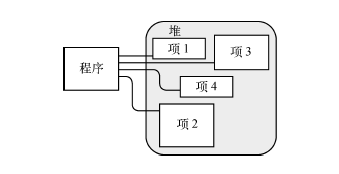

虽然程序可以在堆里保存数据，但并不能显式地删除它们。CLR的自动垃圾收集器在判断出程序的代码将不会再访问某数据项时，会自动清除无主的堆对象。下图阐明了垃圾收集过程。

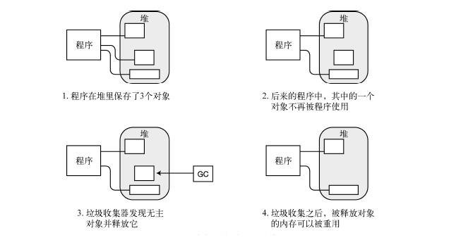

## 2. 分配空间

C#中变量和对象在栈和堆中如何分配空间

### 2.1 栈分配

对于分配在堆栈上的局部变量来说，操作系统维护着一个堆栈指针来指向下一个自由空间的地址，并且堆栈的内存地址是由高位到低位向下填充。以下例而言：

```C#
public static void Main()  
{      
    int x = 100;      
    char c = 'A';  
} 
```

 假设线程栈的初始化地址为50000，因此堆栈指针首先指向50000地址空间。代码由入口函数Main开始执行，首先进入作用域的是整型局部变量x，它将在栈上分配4Byte（整型需要四个字节）的内存空间，因此堆栈指针向下移动4个字节，则值100将保存在

49997~50000单位，而堆栈指针移动到下一个自由空间地址为49996，如图所示：

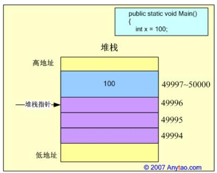

接着进入下一行代码，将为字符型变量c分配2Byte的内存空间，堆栈指针向下移动2个字节至49994单位，值’A’会保存在49995~49996单位，地址的分配如图：


最后，执行到Main方法的右括号，方法体执行结束，变量x和c的作用域也随之结束，CLR需要立刻删除变量x和c在堆栈内存中的值，其释放过程和分配过程刚好相反：首先删除c的内存，堆栈指针向上递增2个字节，然后删除x的内存，堆栈指针继续向上递增4个字节，程序执行结束，此时的内存状况为：

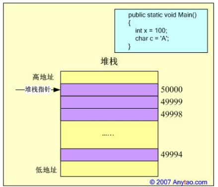

堆栈中的空间，只要出了作用域，立刻就被释放了，也就意味着栈上的内存分配，效率较高，但是内存容量不大，同时变量的生存周期随着方法的结束而消亡。

### 2.2 托管堆分配

​	引用类型的实例分配于托管堆上，而线程栈却是对象生命周期开始的地方。对32位处理器来说，应用程序完成进程初始化后，CLR将在进程的可用地址空间上分配一块保留的地址空间，它是进程（每个进程可使用4GB）中可用地址空间上的一块内存区域，但并不对应于任何物理内存，这块地址空间即是托管堆。

　托管堆又根据存储信息的不同划分为多个区域，其中最重要的是垃圾回收堆（GC Heap）和加载堆（Loader Heap）

- GC Heap用于存储对象实例，受GC管理；

- Loader Heap又分为High-Frequency Heap、Low-Frequency Heap和Stub Heap，不同的堆上又存储不同的信息。

  Loader Heap(Type)最重要的信息就是元数据相关的信息，也就是Type对象，每个Type在Loader Heap上体现为一个Method Table {类元信息【构造函数，属性，方法，成员】}（方法表），而Method Table中则记录了存储的元数据信息，例如基类型、静态字段、实现的接口、所有的方法等等。Loader Heap不受GC控制，其生命周期为从创建到AppDomain卸载。

　在进入实际的内存分配分析之前，有必要对几个基本概念做以交代，以便更好的在接下来的分析中展开讨论。

　- TypeHandle：类型句柄，指向对应实例的方法表，每个对象创建时都包含该附加成员，并且占用4个字节的内存空间。我们知道，每个类型都对应于一个方法表，方法表创建于编译时，主要包含了类型的特征信息、实现的接口数目、方法表的slot数目等。
　- SyncBlockIndex：用于线程同步，每个对象创建时也包含该附加成员，它指向一块被称为Synchronization Block的内存块，用于管理对象同步，同样占用4个字节的内存空间。

　　• NextObjPtr：由托管堆维护的一个指针，用于标识下一个新建对象分配时在托管堆中所处的位置。CLR初始化时，NextObjPtr位于托管堆的基地址。

　　因此，我们对引用类型分配过程应该有个基本的了解，在此本文实现一个相对简单的类型来做说明：

```C#
public class UserInfo  
{      
    private Int32 age = -1;      
    private char level = 'A';  
}  
public class User{      
    private Int32 id;    
    private UserInfo user;  
}  
public class VIPUser : User  
{      
    public bool isVip;      
    public bool IsVipUser()      
    {          
    	return isVip;      
    }      
    public static void Main()      
    {          
    	VIPUser aUser;          
    	aUser = new VIPUser();          
    	aUser.isVip = true;          
    	Console.WriteLine(aUser.IsVipUser());    
     }  
}  

```

将上述实例的执行过程，反编译为IL语言可知：

new关键字被编译为newobj指令来完成对象创建工作，进而调用类型的构造器来完成其初始化操作，在此我们详细的描述其执行的具体过程：

（1）首先，将声明一个引用类型变量aUser：

　　VIPUser aUser;

　　它仅是一个引用（指针），保存在线程的堆栈上，占用4Byte的内存空间，将用于保存VIPUser对象的有效地址，其执行过程正是上文描述的在线程栈上的分配过程。此时aUser未指向任何有效的实例，因此被自行初始化为null，试图对aUser的任何操作将抛出NullReferenceException异常。

（2）接着，通过new操作执行对象创建：

　　aUser = new VIPUser();

　　如上文所言，该操作对应于执行newobj指令，其执行过程又可细分为以下几步：

　　(a)CLR按照其继承层次进行搜索，计算类型及其所有父类的字段，该搜索将一直递归到System.Object类型，并返回字节总数，以本例而言类型VIPUser需要的字节总数为15Byte，具体计算为：VIPUser类型本身字段isVip（bool型）为1Byte；父类User类型的字段id（Int32型）为4Byte，字段user保存了指向UserInfo型的引用，因此占4Byte，而同时还要为UserInfo分配6Byte字节的内存。

　　(b)实例对象所占的字节总数还要加上对象附加成员所需的字节总数，其中附加成员包括TypeHandle和SyncBlockIndex，共计8字节（在32位CPU平台下）。因此，需要在托管堆上分配的字节总数为23字节，而堆上的内存块总是按照4Byte的倍数进行分配，因此本例中将分配24字节的地址空间。

　　(c)CLR在当前AppDomain对应的托管堆上搜索，找到一个未使用的24字节的连续空间，并为其分配该内存地址。事实上，GC使用了非常高效的算法来满足该请求，NextObjPtr指针只需要向前推进24个字节，并清零原NextObjPtr指针和当前NextObjPtr指针之间的字节，然后返回原NextObjPtr指针地址即可，该地址正是新创建对象的托管堆地址，也就是aUser引用指向的实例地址。而此时的NextObjPtr仍指向下一个新建对象的位置。注意，栈的分配是向低地址扩展，而堆的分配是向高地址扩展。

另外，实例字段的存储是有顺序的，由上到下依次排列，父类在前子类在后

在上述操作时，如果试图分配所需空间而发现内存不足时，GC将启动垃圾收集操作来回收垃圾对象所占的内存，我们将以后对此做详细的分析。

（3）最后，调用对象构造器，进行对象初始化操作，完成创建过程。该构造过程，又可细分为以下几个环节：

　　(a)构造VIPUser类型的Type对象，主要包括静态字段、方法表、实现的接口等，并将其分配在上文提到托管堆的Loader Heap上。

　　(b)初始化aUser的两个附加成员：TypeHandle和SyncBlockIndex。将TypeHandle指针指向Loader Heap上的MethodTable，CLR将根据TypeHandle来定位具体的Type；将SyncBlockIndex指针指向Synchronization Block的内存块，用于在多线程环境下对实例对象的同步操作。

　　(c)调用VIPUser的构造器，进行实例字段的初始化。实例初始化时，会首先向上递归执行父类初始化，直到完成System.Object类型的初始化，然后再返回执行子类的初始化，直到执行VIPUser类为止。以本例而言，初始化过程为首先执行System.Object类，再执行User类，最后才是VIPUser类。最终，newobj分配的托管堆的内存地址，被传递给VIPUser的this参数，并将其引用传给栈上声明的aUser。

　　上述过程，基本完成了一个引用类型创建、内存分配和初始化的整个流程，然而该过程只能看作是一个简化的描述，实际的执行过程更加复杂，涉及到一系列细化的过程和操作。对象创建并初始化之后，内存的布局，可以表示为：

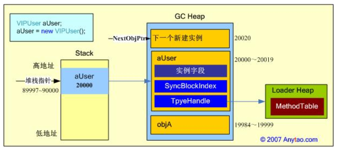


由上文的分析可知，在托管堆中增加新的实例对象，只是将NextObjPtr指针增加一定的数值，再次新增的对象将分配在当前NextObjPtr指向的内存空间，因此在托管堆栈中，连续分配的对象在内存中一定是连续的，这种分配机制非常高效。

### 2.3 其它相关问题

- **方法保存在Loader Heap的MethodTable中，那么方法调用时又是怎么样的过程？**

　如上所言，MethodTable中包含了类型的元数据信息，类在加载时会在Loader Heap上创建这些信息，一个类型在内存中对应一份MethodTable，其中包含了所有的方法、静态字段和实现的接口信息等。对象实例的TypeHandle在实例创建时，将指向MethodTable开始位置的偏移处（默认偏移12Byte），通过对象实例调用某个方法时，CLR根据TypeHandle可以找到对应的MethodTable，进而可以定位到具体的方法，再通过JIT Compiler将IL指令编译为本地CPU指令，该指令将保存在一个动态内存中，然后在该内存地址上执行该方法，同时该CPU指令被保存起来用于下一次的执行。

　　在MethodTable中，包含一个Method Slot Table，称为方法槽表，该表是一个基于方法实现的线性链表，并按照以下顺序排列：继承的虚方法，引入的虚方法，实例方法和静态方法。方法表在创建时，将按照继承层次向上搜索父类，直到System.Object类型，如果子类覆写了父类方法，则将会以子类方法覆盖父类虚方法。

- **静态字段的内存分配和释放，又有何不同？**

　　静态字段也保存在方法表中，位于方法表的槽数组后，其生命周期为从创建到AppDomain卸载。因此一个类型无论创建多少个对象，其静态字段在内存中也只有一份。静态字段只能由静态构造函数进行初始化，静态构造函数确保在类型任何对象创建前，或者在任何静态字段或方法被引用前执行

## 二、GC

## 1. 核心概念的理解

### 1.1 托管代码和非托管代码

> **概念的区分:**
> 托管代码：在CLR管理之下运行的程序指令代码(MSIL指令)
> 非托管代码：针对特定操作系统而生成的CPU机器指令
>
> **公共语言运行库CLR(.NET中的虚拟机)**
> CLS(Common Language Specification) 公共语言规范,解决不同开发语言之间的语法规范
> CTS(Common Type System) 通用类型系统，解决不同开发语言之间的数据类型差异


### 1.2 如何判断对象可以被回收

#### 1.2.1 引用计数器

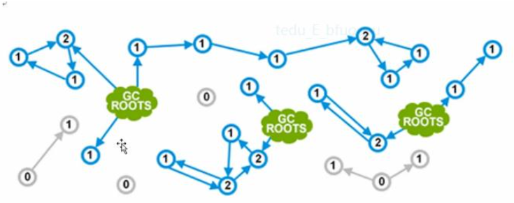

**其中:**

**1) 绿色云朵是内存中的跟对象,表示程序中正在使用的对象**

**2) 蓝色圆圈是内存中的活动对象,其中的数字表示其引用计数**

**3) 灰色圆圈是内存中没有活动对象引用的对象,表示非活动对象**

对于引用计数法,有一个很大的缺陷就是循环引用,例如:

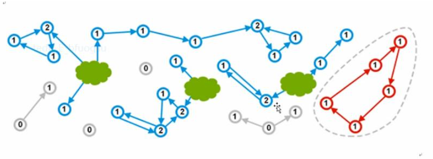

#### 1.2.3 引用跟踪算法（Gc Roots）

标记清除就是对可达对象进行标记,不可达对象即认为是垃圾,然后进行清除

**标记清除通常有两个步骤:**

1) 标记所有可到达的对象

2) 清除不可到达对象占用的内存地址

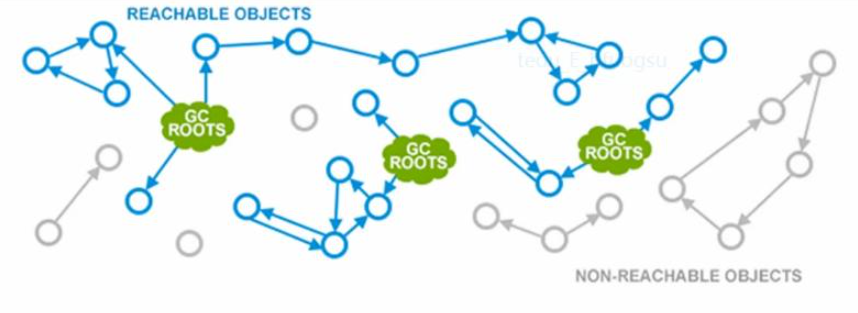


## 2. GC触发的时机

CLR会在一下情况发生时，执行GC操作

- 当GC的代的预算大小已经达到阈值而无法对新对象分配空间的时候，比如GC的第0代已满；
- 显式调用System.GC.Collect()(显示调用要慎重，因为手动调用可能会与自动执行的GC冲突，从而导致无法预知的问题)；
- 其他特殊情况，比如，操作系统内存不足、CLR卸载AppDomain、CLR关闭，甚至某些极端情况下系统参数设置改变也可能导致GC回收。

## 3. GC 主要模式

### 3.1 WorkStation GC 和 Server GC

GC 有两种形式：`WorkStation GC`和 `Server GC`

默认的.NET 程序都是 WorkStation GC ，那么 WorkStation GC 和 Server GC 有什么区别呢。

-  Server GC 的 Generation 内存更大，64位操作系统 Generation 0 的大小居然有4G ，这意味着啥？在不调用`GC.Collect` 的情况下，4G 塞满GC 才会去回收。那样性能可是有很大的提升。但是一旦回收了，4GB 的“垃圾” 也够GC 喝一壶的了。
- Server GC 拥有专门用来处理 GC的线程，而WorkStation GC 的处理线程就是你的应用程序线程。
  - WorkStation 形式下：GC 开始，所有应用程序线程挂起，GC选择最后一个应用程序线程用来跑GC，直到GC 完成。所有线程恢
  - ServerGC 形式下： 有几核 CPU ，那么就有几个专有的线程来处理 GC。每个线程都一个堆进行GC ，不同的堆的对象可以相互引用。所以在GC 的过程中，Server GC 比 WorkStation GC 更快。但是有专有线程，并不代表可以并行GC 哦。

上面两个区别，决定了 Server GC 用于对付高吞吐量的程序，而WorkStation GC 用于一般的客户端程序足以。

如果你的.NET 程序正在疲于应付 高并发，不妨开启 Server GC : https://docs.microsoft.com/zh-cn/dotnet/core/runtime-config/garbage-collector#large-object-heap-threshold

### 3.2 Concurrent GC 和 Non-Concurrent GC

GC 有两种模式：`Concurrent` 和 `Non-Concurrent`，也就是并行 GC 和 不并行 GC 。无论是 Server GC 还是 Concurrent GC 都可以开启 Concurrent GC 模式或者关闭 Concurrent GC 模式。

- Concurrent GC 当然是为了解决上述 GC 过程中所有线程挂起等待 GC 完成的问题。因为工作线程挂起将会影响 用户交互的流畅性和响应速度。

  *Concurrent 并行实际上 只发生在Generation 2 中，因为 Generation 0 和 Generation1 的处理是在太快了，相当于工作线程没有阻塞。在 GC 处理 Generation 2 中的第一步，也就是标记过程中，工作线程是可以同步进行的，工作线程仍然可以在 Generation 0 和 Generation 1 中分配对象。所以并行 GC 可以减少工作进程因为GC 需要挂起的时间。但是与此同时，在标记的过程中工作进程也可以继续分配对象，所以GC占用的内存可能更多。*

- Non-Concurrent GC 就更好理解了。

.NET 默认开启了 Concurrent 模式，可以在 https://docs.microsoft.com/zh-cn/dotnet/core/runtime-config/garbage-collector#large-object-heap-threshold 进行配置

### 3.3 Background GC

又来了一种新的 GC 模式： `Background GC` 。

 **Background GC 和 Concurrent GC 的区别是什么呢？**

- Background GC 和 Concurrent GC 都是为了减少 因为 GC 而挂起工作线程的时间，从而提升用户交互体验，程序响应速度。
- Background GC 和 Concurrent GC 一样，都是使用一个专有的GC 线程，并且都是在 Generation 2 中起作用。
- Background GC 是 Concurrent GC 的增强版，在.NET 4.0 之前都是默认使用 Concurrent GC 而 .NET 4.0+ 之后使用Background GC 代替了 Concurrent GC。

 **Background GC 比 Concurrent GC 多了什么呢？**

- Concurrent GC 在 Generation 2 中进行清理时，工作线程仍然可以在 Generation 0/1 中进行分配对象，但是这是有限制的，当 Generation 0/1 中的内存片段 Segment 用完的时候，就不能再分配了，直到 Concurrent GC 完成。
-  Background GC 没有这个限制，因为 Background GC 在 Generation 2 中进行清理时，允许了 Generation 0/1 进行清理，也就说是当 Generation 0/1 的 Segment 用完的时候， GC 可以去清理它们，这个GC 称作 `Foreground GC` ( 前台GC ) ，Foreground GC 清理完之后，工作线程就可以继续分配对象了。

所以 Background GC 比 Concurrent GC 减少了更多 工作线程暂停的时间。

**总结：**并不是使用了 Background GC 和 Concurrent GC 的程序运行速度就快，它们只是提升了用户交互的速度。因为 专有的GC 线程会对CPU 造成拖累，此外GC 的同时，工作线程分配对象 和正常的时候分配对象 是不一样的，它会对性能造成拖累。

## 4. CLR中分代回收分析

> **什么样的对象需要垃圾回收**？托管资源和存在堆里的资源（值类型和引用类型）
>
> - **托管资源：**一般指被CLR控制的内存资源，这些资源的管理可以有CLR控制，例如程序中分配的对象，作用域的变量，大部分对象都是托管资源。
> - **非托管资源：**文件流，数据库连接等第三方资源，打印机，系统的窗口句柄都是非托管资源

### 1. CLR 堆模型图

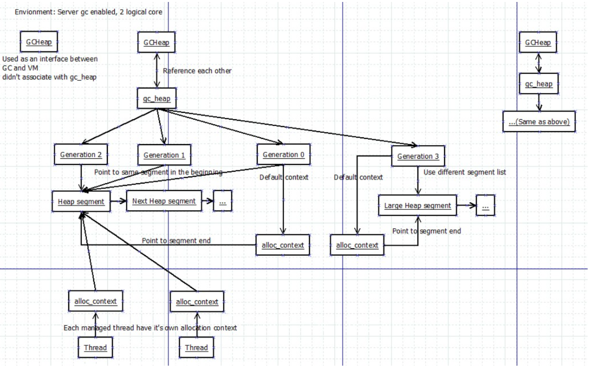


### 2. 垃圾回收策略

#### 2.1 代约束

 CLR中的GC是基于**代的垃圾回收器**：

1. 对象越新，生存周期越短;
2. 对象越老，生存周期越长；
3. 回收堆的一部分，速度快于回收整个堆。

#### 2.2 堆分代内存模型

托管进程中有两种内存堆，分别是**本机堆**和**托管堆，CLR**在托管堆上面为.net 的所有对象分配内存（托管堆又称为GC堆）。

**托管堆**又分为两种，**小对象堆**和**大对象堆（LOH）**

- **小对象堆**：用来分配常用的资源对象内存（如类，数组等等），小对象堆的内存段进一步划分为3代，0代，1代，2代。
- 大对象堆：用来分配一些大对象和非托管资源（默认超过85000字节的对象就存放在大对象堆）


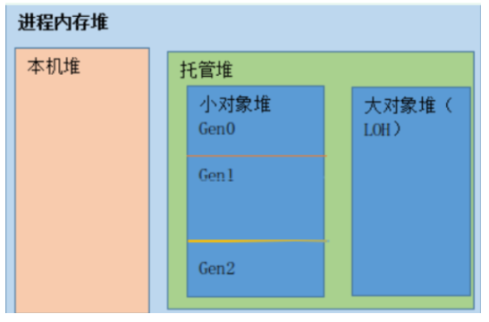


#### 2.3 GC分代回收原理

- 当程序首次运行时，新初始化的对象都为第0代对象；
- 当第0代对象占用的空间达到CLR中的预算容量时（CLR初始化时，会为每代的对象设置一个预存容量），GC开始执行，利用引用跟踪算法，将不可达的对象清理，而未清理的对象成为第1代对象。所以每次GC后，第0代就没有对象了；
- 然后新创建的对象则会分配到0代中，循环上面的清理过程。
- 当第1代对象占用的内存空间达到预设容量时，GC就是利用引用跟踪算法，清理第1代对象，而未清理的对象则会升为第2代对象（第2代对象为GC中的最高代对象，GC中只包含3代对象），在第1代对象没有达到预设容量时，则不会管第1代中的对象，就算在执行GC时，第1代中含有不可达对象，也不会在此时清理。
- 当然CLR中对每代对象的预设对象不是恒定不变的，比如：当每次回收第0代对象后，所存活的对象很少，则会减少第0代对象的内存空间预设容量；反之，每次回收第0代对象后，所存的对象很多，则会增加第0代对象的内存空间预设容量。

#### 2.4 分代回收详解

在托管堆初始化时不包含对象，添加到堆中的对象称为0代对象。

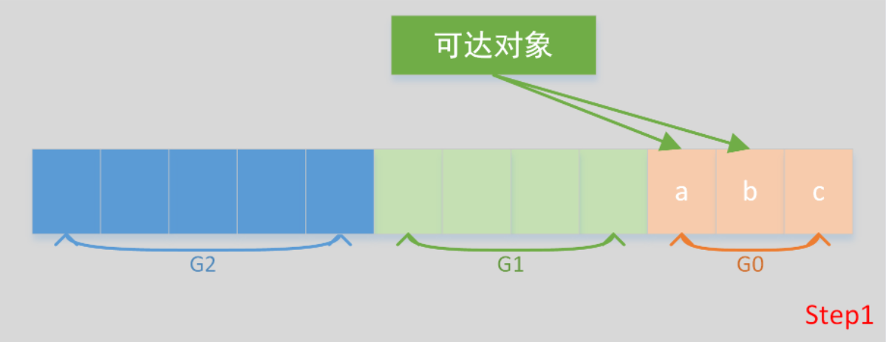

在step1中，G0中新进了3个对象，过了一会了，对象c变得不可达了，现在我要分配一个新的对象d、e、f，这时G0超过了预算了。

前面我们说过，G0总是用来分配新对象，因此虽然这时G1和G2空间是足够的，但也不能用来分配给新对象；另外，前面我们也说过，每一代的垃圾回收只有在本代的 空间预算用完后才会启动垃圾回收。

因此，我们需要启动G0的垃圾回收，将c回收掉，将a、b幸存，并升级到G1中，经过第1次的垃圾回收后如下：

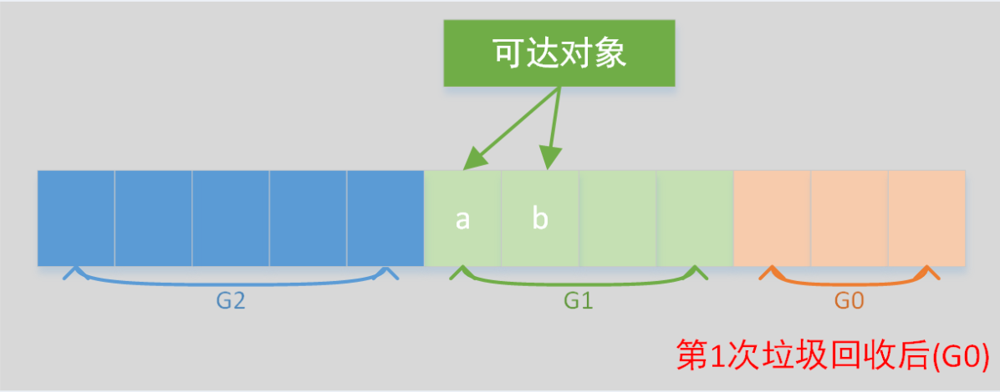

回收后的G0是空的，正好可以用来分配新进的d、e、f，如下所示：

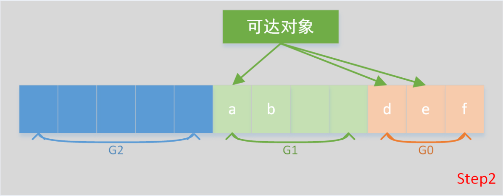

过了一段时间后，f变成可达了，现在我们要分配新的对象g、h、i，发现G0被占满了，于是回收G0（注意这时不回收G1，因为G1的空间预算还没有用完），并将d和e加入G1，经过这次的回收后如下图所示：

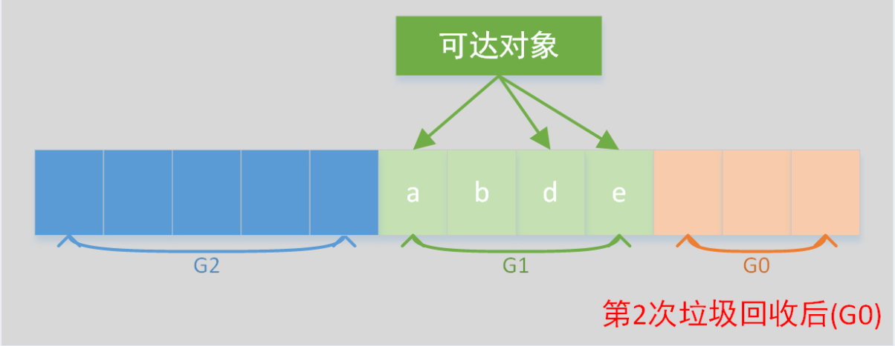

 回收后的G0又变空了，可以容纳新的对象，如下所示：

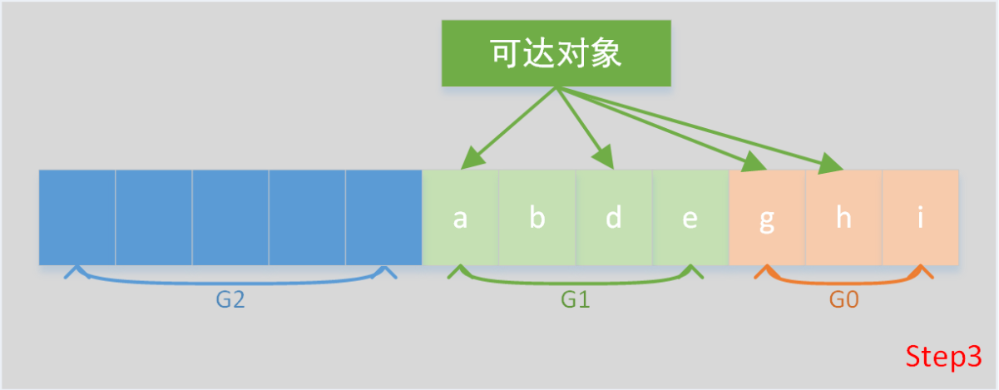

 现在，我们要分配新的对象，j、k、l，这时发现G0和G1的空间预算都用完了，于是回收G0和G1，并将G1中幸存的对象升至G2,G0中幸存的对象升至G1，经过这次的回收后如下图所示：

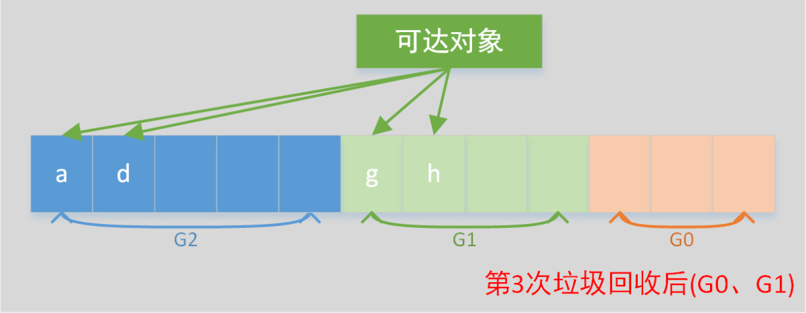

 回收过后的G0又变空了，可以容纳新的对象j、k、l。依此往复。如果没有回收到足够多的内存时，垃圾回收器就会执行一次完整的垃圾回收，如果还是不够，就抛出OutOfMemoryException异常。

#### 2.5 垃圾回收预算机制

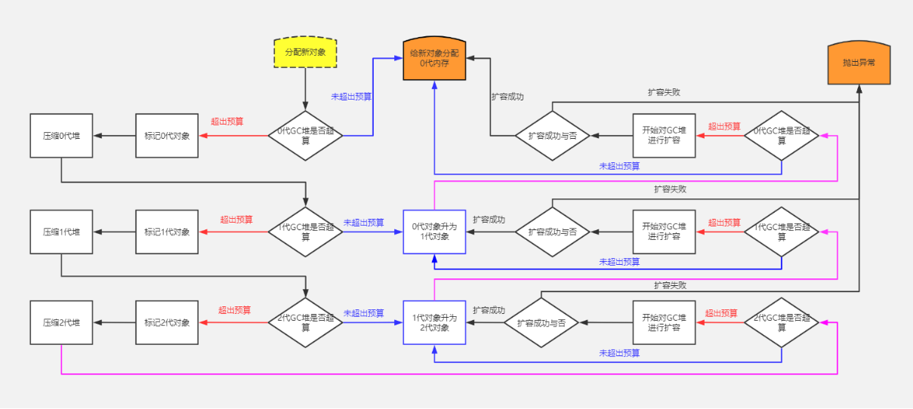


垃圾回收器会在执行垃圾回收的过程中了解应用程序的行为，同时根据行为来动态调整G0、G1、G2的预算。

假如应用程序构建了相当多的短时间使用的对象，造成G0的垃圾回收会回收大量内存，就可能减少G0的预算，这样G0的回收将更加频繁，但垃圾回收器每次做的事情也就更少了，这减少了进程的工作集。如果G0中全是垃圾，则不需要经过压缩内存，直接让NextObjPrj指针指回G0的开始处即可。这样回收起来更快！

假如垃圾回收器在回收G0时发现还有很多对象存活，就会增大G0的预算，垃圾的回收次数将减少，但每次垃圾回收时，回收的内存就会多得多。

## 5. 内存泄漏和碎片整理

### 5.1 内存泄漏

#### 5.1 .1 析构函数

作为负责垃圾收集的人，我们在打扫房子时遇到的一个问题是如何处理车内的物品。清洁时，我们需要将所有东西都清理干净。如果笔记本电脑在家里而电池在车里怎么办？

在某些情况下，GC 需要执行代码来清理非托管资源，例如文件、数据库连接、网络连接等。处理此问题的一种可能方法是通过终结器。

```C#
class Sample  
{  
      ~Sample()  
      {  
           // FINALIZER: CLEAN UP HERE  
      }  
} 

```

在对象创建期间，所有具有终结器的对象都被添加到终结队列中。假设对象 1、4 和 5 具有终结器并且在终结队列中。让我们看看当对象 2 和 4 不再被应用程序引用并准备好进行垃圾回收时会发生什么。

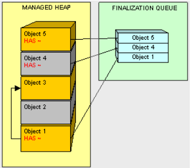

对象 2 以通常的方式处理。然而，当我们到达对象 4 时，GC 发现它在终结队列中，而不是回收对象 4 拥有的内存，而是移动对象 4，并将其终结器添加到一个名为 freachable 的特殊队列中。


有一个专用线程用于执行可访问的队列项。一旦这个线程在对象 4 上执行了终结器，它就会从 freachable 队列中删除。只有这样，Objet 4 才能准备好收集。

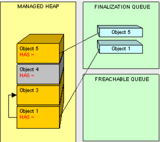

所以对象 4 一直存在到下一轮 GC。因为向我们的类添加终结器会为 GC 带来额外的工作，所以它可能非常昂贵，并且会对性能垃圾收集产生不利影响，从而影响我们的程序。**仅当绝对确定需要它们时才使用终结器。**

更好的做法是确保清理非托管资源。可以想象，最好显式关闭连接并尽可能使用 IDisposable 接口进行清理，而不是使用终结器。

#### 51.2 IDisposaible接口

实现 IDisposable 的类在 Dispose() 方法（这是接口的唯一签名）中执行清理。因此，如果我们有一个 ResouceUser 类而不是使用终结器，如下所示：

```C#

public class ResourceUser : IDisposable  
{  
      #region IDisposable Members  
      public void Dispose()  
      {  
            // CLEAN UP HERE!!!  
      }  
      #endregion  
}  

public static void DoSomething()  
{  
    ResourceUser rec = new ResourceUser();  
    using (rec)  
    {  
         // DO SOMETHING  
    } // DISPOSE CALLED HERE  
    // DON'T ACCESS rec HERE  
}  

public static void DoSomething()  
{  
    using (ResourceUser rec = new ResourceUser())  
    {  
        // DO SOMETHING  
    } // DISPOSE CALLED HERE  
}  
```

### 5.2 碎片整理

#### 5.2.1 堆中碎片如何产生的？

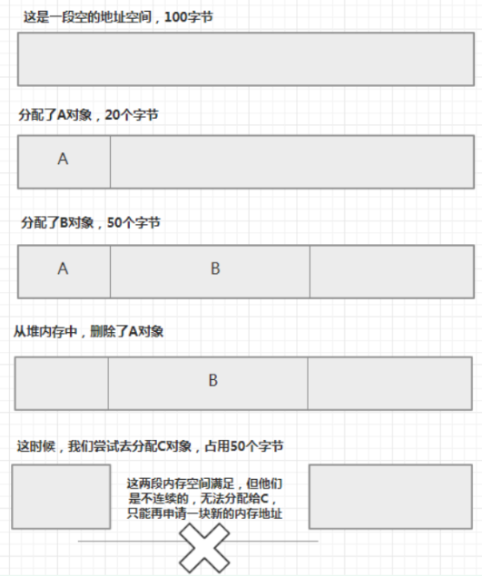

#### 5.2.2 碎片整理

压缩阶段主要的任务是将幸存的对象压缩成连续的，因为根据应用程序的局部性原理，这样更有利于减少程序集，释放了内存，解决了堆的空间碎片化问题，同时提高了缓存命中率。对于下图而言，我们就是要把acef对象压缩成连续的，其实很简单，我们只需要把c对象挪到a后面，e对象挪到c后面，依此类推，即可使这些内存对象变成连续的。

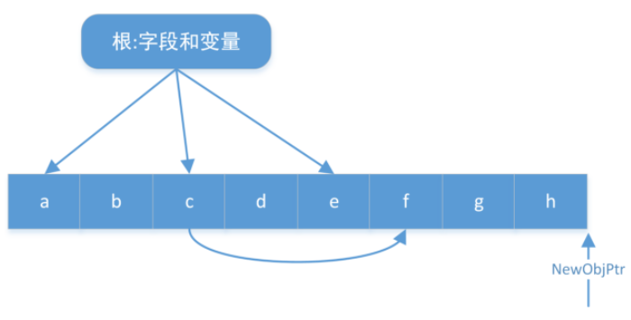

在完成这一步后，其实两个问题亟待解决：

第一个是c内存压缩后，其在堆中的实际位置变化了，根引用c的位置还是原来的，如果听任下去，将会访问旧的内存地址而造成内存损坏。所以，还要将根中引用c的地址减去在压缩中偏移的字节数，这样就能保证每个根引用的还是原来的c，只不过对象在内存中变换了位置。

第二个待解决的问题是，指向下一个对象在堆中的分配位置NewObjPtr指针也要进行偏移字节数的计算，这样才能保证新对象分配的内存与原有的堆内存是连续的。

下面是垃圾回收后的托管堆：


 经过垃圾回收过后，内存不可能泄漏了，因为对象可达图中的不可达对象，都会被回收；其次不可能因为访问不可达对象而造成内存损坏，因为现在只能引用可达的对象，不可达的对象是引用不了的。