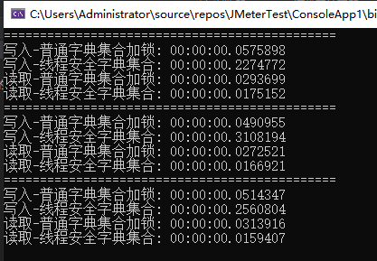
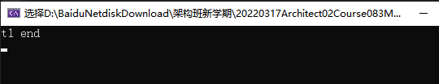
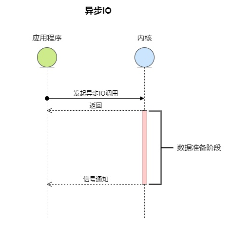

# 多线程调优

## 一、原子操作

### 1. 基于Lock实现

```C#
        private static object _obj = new object();
        /// <summary>
        /// 测试原子操作,基于Lock实现
        /// </summary>
        [TestMethod]
        public void AtomicityTestForLock()
        {
            var task = Task.Run(() =>
            {
                // 所有任务竞争变量
                long result = 0;

                Console.WriteLine("正在计数");

                Parallel.For(0, 10, (i) =>
                {
                    //lock (_obj)
                    {
                        for (int j = 0; j < 10000000; j++)
                        {
                            result++;
                        }
                    }
                    
                });

                Console.WriteLine($"操作结果应该为\t\t: {10 * 10000000}");
                Console.WriteLine($"i++操作结果\t\t: {result}");
            });
            Task.WaitAny(task);
            Assert.IsTrue(true);
        }
```


### 2. 基于CAS实现

```C#
        private static object _obj = new object();       

		/// <summary>
        /// 测试原子操作,基于CAS实现
        /// </summary>
        [TestMethod]
        public void AtomicityTestForCAS()
        {
            var task = Task.Run(() =>
            {
                long total = 0;
                long result = 0;

                Console.WriteLine("正在计数");

                Parallel.For(0, 10, (i) =>
                {
                    for (int j = 0; j < 10000000; j++)
                    {
                        // 使用CAS的API实现自增
                        Interlocked.Increment(ref total);
                        MyCalc.Increment();
                        result++;
                    }
                });

                Console.WriteLine($"操作结果应该为\t\t: {10 * 10000000}");
                Console.WriteLine($"原子操作结果\t\t: {total}");
                Console.WriteLine($"i++操作结果\t\t: {result}");
            });
            Task.WaitAny(task);
            Assert.IsTrue(true);
        }
```


### 3. 自旋锁（无锁化基础）

#### 3.1 自旋锁


**自旋锁**：它并不会放弃  CPU  时间片，而是通过自旋等待锁的释放，也就是说，它会不停地再次地尝试获取锁，如果失败就再次尝试，直到成功为止。

**非自旋锁**：非自旋锁和自旋锁是完全不一样的，如果它发现此时获取不到锁，它就把自己的线程切换状态，让线程休眠，然后 CPU 就可以在这段时间去做很多其他的事情，直到之前持有这把锁的线程释放了锁，于是 CPU 再把之前的线程恢复回来，让这个线程再去尝试获取这把锁。如果再次失败，就再次让线程休眠，如果成功，一样可以成功获取到同步资源的锁

#### 3.2 优点

自旋锁的好处，那就是自旋锁用循环去不停地尝试获取锁，让线程始终处于 Runnable 状态，节省了线程状态切换带来的开销

说明：

*阻塞和唤醒线程都是需要高昂的开销的，如果同步代码块中的内容不复杂，那么可能转换线程带来的开销比实际业务代码执行的开销还要大*。

*在很多场景下，可能我们的同步代码块的内容并不多，所以需要的执行时间也很短，如果我们仅仅为了这点时间就去切换线程状态，那么其实不如让线程不切换状态，而是让它自旋地尝试获取锁，等待其他线程释放锁，有时我只需要稍等一下，就可以避免上下文切换等开销，提高了效率*

#### 3.3 缺点

虽然避免了线程切换的开销，但是它在避免线程切换开销的同时也带来了新的开销，因为它需要不停得去尝试获取锁。如果这把锁一直不能被释放，那么这种尝试只是无用的尝试，会白白浪费处理器资源。也就是说，虽然一开始自旋锁的开销低于线程切换，但是随着时间的增加，这种开销也是水涨船高，后期甚至会超过线程切换的开销，得不偿失。

#### 3.4 适用场景

自旋锁适用于并发度不是特别高的场景，以及临界区比较短小的情况，这样我们可以利用避免线程切换来提高效率。

可是如果临界区很大，线程一旦拿到锁，很久才会释放的话，那就不合适用自旋锁，因为自旋会一直占用 CPU 却无法拿到锁，白白消耗资源

#### 3.4 测试

```C#
        //创建自旋锁
        private static SpinLock spin = new SpinLock();

        [TestMethod]
        public void TestSpinlockDemo()
        {
            Action action1 = () => 
            {
                bool lockTaken = false;
                try
                {
                    //申请获取锁
                    spin.Enter(ref lockTaken);
                    //下面为临界区
                    for (int i = 0; i < 10; ++i)
                    {
                        Console.WriteLine(200);
                    }
                }
                finally
                {
                    //工作完毕，或者发生异常时，检测一下当前线程是否占有锁，如果咱有了锁释放它
                    //以避免出现死锁的情况
                    if (lockTaken)
                        spin.Exit();
                }
            };

            Action action2 = () =>
            {
                bool lockTaken = false;
                try
                {
                    //申请获取锁
                    spin.Enter(ref lockTaken);
                    //下面为临界区
                    for (int i = 0; i < 10; ++i)
                    {
                        Console.WriteLine(100);
                    }
                }
                finally
                {
                    //工作完毕，或者发生异常时，检测一下当前线程是否占有锁，如果咱有了锁释放它
                    //以避免出现死锁的情况
                    if (lockTaken)
                        spin.Exit();
                }
            };

            Parallel.Invoke(action1, action2);
        }
```


### 4. 读写锁

#### 4.1 基本概念

- 读写锁是一个具有特殊用途的线程锁，适用于频繁读取且读取需要一定时间的场景，共享资源的读取操作通常是可以同时执行的，
- 普通的互斥锁不管是获取还是修改操作无法同时执行，如果多个线程为了读取操作而获取互斥锁，那么同一时间只有一个线程可以执行读取操作，
- 频繁读取的场景下会对吞吐量造成影响
- 读写锁把锁分为读取锁和写入锁，线程可以根据对共享资源的操作类型获取读取锁还是写入锁，读取锁可以被多个线程同时获取，写入锁不可以被多个线程
- 同时获取，且读取锁和写入锁不可以被不同的线同时获取，

| 操作       | 读取锁状态       | 写入锁状态       | 获取锁是否需要等待   |
| ---------- | ---------------- | ---------------- | -------------------- |
| 获取读取锁 | 未获取           | 未获取           | 无需等待             |
| 获取读取锁 | 已被其他线程获取 | 未获取           | 无需等待             |
| 获取读取锁 | 未获取           | 已被其他线程获取 | 需要等待其他线程释放 |
| 获取写入锁 | 未获取           | 未获取           | 无需等待             |
| 获取写入锁 | 已被其他线程获取 | 未获取           | 需要等待其他线程释放 |
| 获取写入锁 | 未获取           | 已被其他线程获取 | 需要等待其他线程释放 |

#### 4.2 读写锁测试

```C#
        private static List<int> items = new List<int>() { 0, 1, 2, 3, 4, 5 };
        private static ReaderWriterLockSlim rwl = new ReaderWriterLockSlim(LockRecursionPolicy.SupportsRecursion);
		///读锁
        static void ReaderMethod(object reader)
        {
            try
            {
                rwl.EnterReadLock();
                for (int i = 0; i < items.Count; i++)
                {
                    Console.WriteLine("读->reader {0}, loop: {1}, item: {2}", reader, i, items[i]);
                    Thread.Sleep(40);
                }
            }
            finally
            {
                rwl.ExitReadLock();
            }
        }

		///写锁
        static void WriterMethod(object writer)
        {
            try
            {
                while (!rwl.TryEnterWriteLock(50))
                {
                    Console.WriteLine("Writer {0} waiting for the write lock", writer);
                    Console.WriteLine("current reader count: {0}", rwl.CurrentReadCount);
                }
                Console.WriteLine("Writer {0} acquired the lock", writer);
                for (int i = 0; i < items.Count; i++)
                {
                    Console.WriteLine("写====>");
                    items[i]++;
                    Thread.Sleep(50);
                }
                Console.WriteLine("Writer {0} finished", writer);
            }
            finally
            {
                rwl.ExitWriteLock();
            }
        }

		///读写锁测试
        [TestMethod]
        public void TestDemo1()
        {
            var taskFactory = new TaskFactory(TaskCreationOptions.LongRunning, TaskContinuationOptions.None);
            var tasks = new Task[6];
            tasks[0] = taskFactory.StartNew(WriterMethod!, 1); // new Thread()
            tasks[1] = taskFactory.StartNew(ReaderMethod!, 1);
            tasks[2] = taskFactory.StartNew(ReaderMethod!, 2);
            tasks[3] = taskFactory.StartNew(WriterMethod!, 2);
            tasks[4] = taskFactory.StartNew(ReaderMethod!, 3);
            tasks[5] = taskFactory.StartNew(ReaderMethod!, 4);

            for (int i = 0; i < 6; i++)
            {
                tasks[i].Wait();
            }
        }
```

#### 4.3 递归方式测试

> NoRecursion：如果线程尝试以递归方式进入锁定状态，将引发异常。 某些类可能会在此设置生效时允许使用特定的递归方式。
>
> SupportsRecursion：线程可以采用递归方式进入锁定状态。 某些类可能会限制此功能。

```C#
        /// <summary>
        /// 支持递归方式
        /// </summary>
        [TestMethod]
        public void TestDemo5()
        {
            var task1 = Task.Run(() =>
            {
                //无参，默认NoRecursion，以递归方式进入锁定状态，则会出错
                //ReaderWriterLockSlim lockSlim = new ReaderWriterLockSlim();
                ReaderWriterLockSlim lockSlim = new ReaderWriterLockSlim(LockRecursionPolicy.SupportsRecursion);

                try
                {
                    Console.WriteLine("支持递归的锁实例");

                    Console.WriteLine("进入读模式");

                    lockSlim.EnterReadLock();
                    //如果不退出读模式，则会报错
                    lockSlim.ExitReadLock();

                    Console.WriteLine("再次进入写模式");

                    lockSlim.EnterWriteLock();

                    Console.WriteLine("再次进入写模式成功");
                    lockSlim.EnterWriteLock();
                }
                catch (Exception ex)
                {
                    Console.WriteLine(ex);
                    Console.WriteLine("再次进入写模式失败");
                    Console.WriteLine("对于同一把锁、即便开启了递归、也不可以在进入读模式后再次进入写模式或者可升级的读模式（在这之前必须退出读模式）。");
                }

            });

            Task.WaitAll(task1);
            Assert.IsTrue(true);
        }
    }
```


## 二、线程安全

| 类                                                           | 说明                                                         |
| ------------------------------------------------------------ | ------------------------------------------------------------ |
| [BlockingCollection](http://msdn.microsoft.com/zh-cn/library/dd267312(v=vs.100).aspx) | 为实现 [IProducerConsumerCollection](http://msdn.microsoft.com/zh-cn/library/dd287147(v=vs.100).aspx) 的线程安全集合提供阻塞和限制功能。 |
| [ConcurrentBag](http://msdn.microsoft.com/zh-cn/library/dd381779(v=vs.100).aspx) | 表示对象的线程安全的无序集合。                               |
| [ConcurrentDictionary](http://msdn.microsoft.com/zh-cn/library/dd287191(v=vs.100).aspx) | 表示可由多个线程同时访问的键值对的线程安全集合。             |
| [ConcurrentQueue](http://msdn.microsoft.com/zh-cn/library/dd267265(v=vs.100).aspx) | 表示线程安全的先进先出 (FIFO) 集合。                         |
| [ConcurrentStack](http://msdn.microsoft.com/zh-cn/library/dd267331(v=vs.100).aspx) | 表示线程安全的后进先出 (LIFO) 集合。                         |
| [OrderablePartitioner](http://msdn.microsoft.com/zh-cn/library/dd394988(v=vs.100).aspx) | 表示将一个可排序数据源拆分成多个分区的特定方式。             |
| [Partitioner](http://msdn.microsoft.com/zh-cn/library/system.collections.concurrent.partitioner(v=vs.100).aspx) | 提供针对数组、列表和可枚举项的常见分区策略。                 |
| [Partitioner](http://msdn.microsoft.com/zh-cn/library/dd381768(v=vs.100).aspx) | 表示将一个数据源拆分成多个分区的特定方式。                   |

### 1. 列表集合操作安全

（1）测试多线程下的列表集合线程安全

```C#
        [TestMethod]
        public void TestCollectionDemo1()
        {
            // Construct and fill our BlockingCollection
            using (BlockingCollection<int> blocking = new BlockingCollection<int>())
            {
                int NUMITEMS = 10000;

                for (int i = 0; i < NUMITEMS; i++)
                {
                    blocking.Add(i);
                }
                blocking.CompleteAdding();


                int outerSum = 0;

                // Delegate for consuming the BlockingCollection and adding up all items
                Action action = () =>
                {
                    int localItem;
                    int localSum = 0;

                    while (blocking.TryTake(out localItem))
                    {
                        localSum += localItem;
                    }
                    //CAS
                    Interlocked.Add(ref outerSum, localSum);
                };

                // Launch three parallel actions to consume the BlockingCollection
                Parallel.Invoke(action, action, action);

                Console.WriteLine(string.Format("Sum[0..{0}) = {1}, should be {2}", NUMITEMS, outerSum, ((NUMITEMS * (NUMITEMS - 1)) / 2)));
                Console.WriteLine(string.Format("bc.IsCompleted = {0} (should be true)", blocking.IsCompleted));

                Assert.IsTrue(true);
            }
        }
```


（2）限制容量

```C#
        /// <summary>
        /// 限制容量
        /// </summary>
        [TestMethod]
        public void TestCollectionDemo2()
        {
            BlockingCollection<int> blocking = new BlockingCollection<int>(5);

            var task1 = Task.Run(() =>
            {
                for (int i = 0; i < 20; i++)
                {
                    blocking.Add(i);
                    Console.WriteLine($"add:({i})");
                }

                blocking.CompleteAdding();
                Console.WriteLine("CompleteAdding");
            });

            // 等待先生产数据
            var task2 = Task.Delay(500).ContinueWith((t) =>
            {
                while (!blocking.IsCompleted)
                {
                    var n = 0;
                    if (blocking.TryTake(out n))
                    {
                        Console.WriteLine($"TryTake:({n})");
                    }
                }

                Console.WriteLine("IsCompleted = true");
            });

            Task.WaitAll(task1,task2);
            Assert.IsTrue(true);
        }
```


（3）在 BlockingCollection 中使用Stack

```C#
        /// <summary>
        /// 在 BlockingCollection  中使用Stack
        /// </summary>
        [TestMethod]
        public void TestCollectionStackDemo()
        {
            BlockingCollection<int> blocking = new BlockingCollection<int>(new ConcurrentStack<int>(), 5);

            var task1 = Task.Run(() =>
            {
                for (int i = 0; i < 20; i++)
                {
                    blocking.Add(i);
                    Console.WriteLine($"add:({i})");
                }

                blocking.CompleteAdding();
                Console.WriteLine("CompleteAdding");
            });

            // 等待先生产数据
            var task2 = Task.Delay(500).ContinueWith((t) =>
            {
                while (!blocking.IsCompleted)
                {
                    var n = 0;
                    if (blocking.TryTake(out n))
                    {
                        Console.WriteLine($"TryTake:({n})");
                    }
                }

                Console.WriteLine("IsCompleted = true");
            });

            Task.WaitAll(task1, task2);
            Assert.IsTrue(true);

        }
```


### 2. 字典集合线程

（1）测试字典集合的多线程线程安全

```C#
    /// <summary>
    /// 测试字典集合的多线程线程安全
    /// </summary>
    [TestClass]
    public class TestDictionarySafe
    {
        private static IDictionary<string, string> Dictionaries { get; set; } = new Dictionary<string, string>();
        private static IDictionary<string, string> ConcurrentDictionaries { get; set; } = new ConcurrentDictionary<string, string>();

        [TestMethod]
        public void TestDictionarySafeMethod()
        {
            Stopwatch sw = new Stopwatch(); //用于统计时间消耗的

            sw.Restart();
            Task t1 = Task.Factory.StartNew(() => AddDictionaries(1));
            Task t2 = Task.Factory.StartNew(() => AddDictionaries(2));
            Task t3 = Task.Factory.StartNew(() => AddDictionaries(3));

            Task.WaitAll(t1, t2, t3); //同步执行
            sw.Stop();
            Console.WriteLine("Dictionaries 当前数据量为： {0}", Dictionaries.Count);
            Console.WriteLine("Dictionaries 执行时间为： {0} ms", sw.ElapsedMilliseconds);


            sw.Restart();
            Task t21 = Task.Factory.StartNew(() => AddConcurrentDictionaries(1));
            Task t22 = Task.Factory.StartNew(() => AddConcurrentDictionaries(2));
            Task t23 = Task.Factory.StartNew(() => AddConcurrentDictionaries(3));

            Task.WaitAll(t21, t22, t23); //同步执行
            sw.Stop();
            Console.WriteLine("ConcurrentDictionaries 当前数据量为： {0}", ConcurrentDictionaries.Count);
            Console.WriteLine("ConcurrentDictionaries 执行时间为： {0} ms", sw.ElapsedMilliseconds);


            Assert.IsTrue(sw.ElapsedMilliseconds > 0);
        }

        static void AddDictionaries(int index)
        {
            Parallel.For(0, 1000000, (i) =>
            {
                var key = $"key-{index}-{i}";
                var value = $"value-{index}-{i}";

                // 不加锁会报错
                lock (Dictionaries)
                {
                    Dictionaries.Add(key, value);
                }
            });
        }

        static void AddConcurrentDictionaries(int index)
        {
            Parallel.For(0, 1000000, (i) =>
            {
                var key = $"key-{index}-{i}";
                var value = $"value-{index}-{i}";

                // 无须加锁
                ConcurrentDictionaries.Add(key, value);
            });
        }
    }
```


（2）ConcurrentDictionary与普通Dictionary带锁性能比较

> 对于写入操作速度：带锁普通词典 > 并发词典
>
> 对于读操作速度：并发字典 > 带锁普通字典
>
> - concurrentDictionary采用细粒度锁定[fine-grained locking]   
>
>   在多核多线程的情况下concurrentDictionary将有更好的性能表现
>
> -  普通带锁dictionary采用粗粒度锁定[coarse-grained locking]
>
>   
>
> 对于普通字典，带锁花费的时间都要比不带锁慢，为了线程安全，肯定要牺牲时间的。所以如果需要自己写入的话，推荐带锁普通字典，读写速度都很均衡。


```C#
        const string Item = "Dictionary item";
        public static string CurrentItem;
        static void Main(string[] args)
        {
            for(int x = 0; x < 3; x++)
            {
                Console.WriteLine("==============================================");
                var concurrentDictionary = new ConcurrentDictionary<int, string>();
                var dictionary = new Dictionary<int, string>();
                var sw = new Stopwatch();
                sw.Start();

                for (int i = 0; i < 1000000; i++)
                {
                    lock (dictionary)
                    {
                        dictionary[i] = Item;
                    }
                }
                sw.Stop();
                Console.WriteLine("写入-普通字典集合加锁: {0}", sw.Elapsed);

                sw.Restart();
                for (int i = 0; i < 1000000; i++)
                {
                    concurrentDictionary[i] = Item;
                }
                sw.Stop();
                Console.WriteLine("写入-线程安全字典集合: {0}", sw.Elapsed);

                //对于写入操作并发词典要比普通带锁词典要慢
                sw.Restart();
                for (int i = 0; i < 1000000; i++)
                {
                    lock (dictionary)
                    {
                        CurrentItem = dictionary[i];
                    }
                }
                sw.Stop();
                Console.WriteLine("读取-普通字典集合加锁: {0}", sw.Elapsed);
                //reading from dictionary with a lock: 00:00:00.0286066
                sw.Restart();
                for (int i = 0; i < 1000000; i++)
                {
                    CurrentItem = concurrentDictionary[i];
                }
                sw.Stop();
                Console.WriteLine("读取-线程安全字典集合: {0}", sw.Elapsed);
                sw.Restart();
            }
            Console.ReadKey();
        }
```

测试结果



## 三、线程池

### 1. 线程池调用

> ThreadPool线程池中有两个重载的静态方法可以直接启动工作者线程：
>
> - ThreadPool.QueueUserWorkItem(waitCallback)；
> - ThreadPool.QueueUserWorkItem(waitCallback,Object)；

（1）线程池默认线程数为1000

```C#

        public static void TestDemo1()
        {
            int i = 0;
            int j = 0;
            //前面是辅助(也就是所谓的工作者)线程，后面是I/O线程
            ThreadPool.GetMaxThreads(out i, out j);
            Console.WriteLine(i.ToString() + "   " + j.ToString()); //默认都是1000

            //获取空闲线程，由于现在没有使用异步线程，所以为空
            ThreadPool.GetAvailableThreads(out i, out j);
            Console.WriteLine(i.ToString() + "   " + j.ToString()); //默认都是1000
        }
```


（2）无参调用

```C#
        /// <summary>
        /// 无参
        /// </summary>
        public static void TestDemo2()
        {
            //工作者线程最大数目，I/O线程的最大数目
            ThreadPool.SetMaxThreads(1000, 1000);
            //启动工作者线程
            ThreadPool.QueueUserWorkItem(new WaitCallback(RunWorkerThread1!));
            Console.ReadKey();
        }

        static void RunWorkerThread1(object state)
        {
            Console.WriteLine("RunWorkerThread开始工作");
            Console.WriteLine("工作者线程启动成功!");
        }

```


（3）有参调用

```C#
        /// <summary>
        /// 有参
        /// </summary>
        public static void TestDemo3()
        {
            User u = new User(10001L, "Gerry", 30);
            //启动工作者线程
            ThreadPool.QueueUserWorkItem(new WaitCallback(RunWorkerThread2!), u);
            Console.ReadKey();
        }

        static void RunWorkerThread2(object obj)
        {
            Thread.Sleep(200);
            Console.WriteLine("线程池线程开始!");
            User? p = obj as User;
            Console.WriteLine($"name={p!.Name} Age={p!.Age}");
        }
        record User(long Id, string Name, int Age);
```


### 2. 委托调用线程

```C#
        public static void TestDemo4()
        {
            //建立委托
            MyDelegate myDelegate = new MyDelegate(GetString);
            User u = new User(10001L, "Gerry", 30);
            var task = Task.Run(() => { return myDelegate.Invoke(u); });
            Console.WriteLine("主线程继续工作!");
            //注意获取返回值的方式
            string data = task.Result;
            Console.WriteLine($"返回结果为:{data}");
        }
```


### 3. 线程池重用验证

```C#
        /// <summary>
        /// 多执行几次看结果，观察线程释放重用
        /// </summary>
        public static void TestDemo5()
        {
            Console.WriteLine($"Main 方法开始，ThreadId：{Thread.CurrentThread.ManagedThreadId}，DateTime：{DateTime.Now.ToLongTimeString()}\n");

            ThreadPool.QueueUserWorkItem(t => { Console.WriteLine($"张三，任务处理完成。ThreadId:{Thread.CurrentThread.ManagedThreadId}"); });
            ThreadPool.QueueUserWorkItem(t => { Console.WriteLine($"李四，任务处理完成。ThreadId:{Thread.CurrentThread.ManagedThreadId}"); });
            ThreadPool.QueueUserWorkItem(t => { Console.WriteLine($"王五，任务处理完成。ThreadId:{Thread.CurrentThread.ManagedThreadId}"); });
            ThreadPool.QueueUserWorkItem(t => { Console.WriteLine($"赵六，任务处理完成。ThreadId:{Thread.CurrentThread.ManagedThreadId}"); });

            Thread.Sleep(1000); Console.WriteLine();

            ThreadPool.QueueUserWorkItem(t => { Console.WriteLine($"张三，任务处理完成。ThreadId:{Thread.CurrentThread.ManagedThreadId}"); });
            ThreadPool.QueueUserWorkItem(t => { Console.WriteLine($"李四，任务处理完成。ThreadId:{Thread.CurrentThread.ManagedThreadId}"); });
            ThreadPool.QueueUserWorkItem(t => { Console.WriteLine($"王五，任务处理完成。ThreadId:{Thread.CurrentThread.ManagedThreadId}"); });
            ThreadPool.QueueUserWorkItem(t => { Console.WriteLine($"赵六，任务处理完成。ThreadId:{Thread.CurrentThread.ManagedThreadId}"); });

            Thread.Sleep(1000); Console.WriteLine();

            ThreadPool.QueueUserWorkItem(t => { Console.WriteLine($"张三，任务处理完成。ThreadId:{Thread.CurrentThread.ManagedThreadId}"); });
            ThreadPool.QueueUserWorkItem(t => { Console.WriteLine($"李四，任务处理完成。ThreadId:{Thread.CurrentThread.ManagedThreadId}"); });
            ThreadPool.QueueUserWorkItem(t => { Console.WriteLine($"王五，任务处理完成。ThreadId:{Thread.CurrentThread.ManagedThreadId}"); });
            ThreadPool.QueueUserWorkItem(t => { Console.WriteLine($"赵六，任务处理完成。ThreadId:{Thread.CurrentThread.ManagedThreadId}\n"); });

            Thread.Sleep(1000);

            Console.WriteLine($"Main 方法结束，ThreadId：{Thread.CurrentThread.ManagedThreadId}，DateTime：{DateTime.Now.ToLongTimeString()}");

            Console.ReadLine();
        }
```

测试结果


### 4. 线程池等待（信号量）

#### 4.1.  ManualResetEvent

> 多个线程可以通过调用ManualResetEvent对象的WaitOne方法进入等待或阻塞状态。
>
> 当控制线程调用Set()方法，所有等待线程将恢复并继续执行。

- ManualResetEvent manualResetEvent = new ManualResetEvent(false);

  初始化了一个值为False的ManualResetEvent对象，将阻塞所有调用WaitOne放的线程，直到有线程调用了 Set() 方法。而如果我们用值True来对ManualResetEvent对象进行初始化，所有调用WaitOne方法的线程并不会被阻塞，可以进行后续的执行。

- WaitOne方法
  卡住当前主线程，一直等到信号修改为true的时候，才会接着往下跑
- Set方法
  该方法用于给所有等待线程发送信号。 Set() 方法的调用使得ManualResetEvent对象的bool变量值为True，所有线程被释放并继续执行。
- Reset方法
  一旦我们调用了ManualResetEvent对象的Set()方法，它的bool值就变为true,我们可以调用Reset()方法来重置该值，Reset()方法重置该值为False。

```C#
        public static void TestDemo6()
        {
            //用来控制线程等待,false默认为关闭状态
            ManualResetEvent mre = new ManualResetEvent(false);
            ThreadPool.QueueUserWorkItem(p =>
            {
                DoSomethingLong("控制线程等待");
                Console.WriteLine($"线程池线程");
                //通知线程，修改信号为true
                mre.Set();
            });

            //阻止当前线程，直到等到信号为true在继续执行
            mre.WaitOne();

            //关闭线程，相当于设置成false
            mre.Reset();
            Console.WriteLine("信号被关闭了");

            ThreadPool.QueueUserWorkItem(p =>
            {
                Console.WriteLine("再次等待");
                Thread.Sleep(10000);
                mre.Set();
            });
            
            mre.WaitOne();
            Console.WriteLine("主线程结束");
        }
```

#### 4.2 AutoResetEvent

>  两个线程共享相同的AutoResetEvent对象，线程可以通过调用AutoResetEvent对象的WaitOne()方法进入等待状态，然后另外一个线程通过调用AutoResetEvent对象的Set()方法取消等待的状态。

```C#
        static AutoResetEvent evt1 = new AutoResetEvent(false);
        static AutoResetEvent evt2 = new AutoResetEvent(false);
        static AutoResetEvent evt3 = new AutoResetEvent(false);

        /// <summary>
        /// 等待线程信号——AutoResetEvent
        /// </summary>
        public static void TestAutoResetEvent()
        {
            Thread th1 = new Thread(() =>
            {
                Console.WriteLine("正在进行第一阶段……");
                Thread.Sleep(2000);
                Console.WriteLine("第一阶段处理完成！");
                // 发送信号
                evt1.Set();
            });

            Thread th2 = new Thread(() =>
            {
                // 等待第一阶段完成
                evt1.WaitOne();
                Console.WriteLine("正在进行第二阶段……");
                Thread.Sleep(2000);
                Console.WriteLine("第二阶段处理完成！");
                // 发出信号
                evt2.Set();
            });

            Thread th3 = new Thread(() =>
            {
                // 等待第二阶段完成
                evt2.WaitOne();
                Console.WriteLine("正在进行第三阶段……");
                Thread.Sleep(2000);
                Console.WriteLine("第三阶段处理完成！");
                // 发送信号
                evt3.Set();
            });

            th1.Start();
            th2.Start();
            th3.Start();

            evt3.WaitOne();
            Console.WriteLine("\n已完成所有操作。");
        }
```

#### 4.3 ManualResetEvent与AutoResetEvent区别

- 相同点

  均继承EventWaitHandle 接口，因此，均具有以下功能:
  Reset() //红灯
  Set() //绿灯
  WaitOne() // 等待信号

- 不同点

  AutoResetEvent 收到 Set 后 ， 一次只能执行一个线程,其它线程继续 WaitOne 。 （通常，当线程需要独占访问资源时使用该类）
  ManualResetEvent 收到 Set 后，所有处理 WaitOne 状态线程均继续执行。

**测试**

（1）AutoResetEvent 

```C#
        public static void AutoResetEventTest()
        {
            AutoResetEvent _autoResetEvent = new AutoResetEvent(false);
            Thread t1 = new Thread(() =>
            {
                _autoResetEvent.WaitOne();
                Console.WriteLine("t1 end");
            });
            t1.Start();
            Thread t2 = new Thread(()=>
            {
                _autoResetEvent.WaitOne();
                Console.WriteLine("t2 end");
            });
            t2.Start();
            Thread t3 = new Thread(() =>
            {
                _autoResetEvent.WaitOne();
                Console.WriteLine("t3 end");
            });
            t3.Start();
            Thread.Sleep(3000);
            _autoResetEvent.Set();
        }


```

结果



（2）ManualResetEventTest

```C#
        public static void ManualResetEventTest()
        {
            ManualResetEvent _manualResetEvent = new ManualResetEvent(false);
            Thread t1 = new Thread(() =>
            {
                _manualResetEvent.WaitOne();
                Console.WriteLine("t1 end");
            });
            t1.Start();
            Thread t2 = new Thread(() =>
            {
                _manualResetEvent.WaitOne();
                Console.WriteLine("t2 end");
            });
            t2.Start();
            Thread t3 = new Thread(() =>
            {
                _manualResetEvent.WaitOne();
                Console.WriteLine("t3 end");
            });
            t3.Start();
            Thread.Sleep(3000);
            _manualResetEvent.Set();            
        }
```

结果


总结：

AutoResetEvent ：过3秒后，要么弹出“t1 end”，要么弹出“t2 end”，弹出“t3 end”，不会三个个都弹出。也就是说，其中一个进行将会结束，而另一个进程永远不会结束。

ManualResetEvent：过3秒后，“t1 end”和“t2 end”和“t3 end”，三个都被弹出。也就是说，两个线程都结束了。

AutoResetEvent只会给一个线程发送信号，而不会给多个线程发送信号。在我们需要同步多个线程的时候，就只能采用ManualResetEvent了 

### 5. Task

> **Task.Factory.StartNew:**创建一个新的线程，Task的线程也是从线程池中拿的（ThreadPool）
>
> **Task.WaitAny:**等待一群线程中的其中一个完成，这里是卡主线程，一直等到一群线程中的最快的一个完成，才能继续往下执行（20年前我也差点被后面的给追上），打个简单的比方：从三个地方获取配置信息（数据库，config，IO），同时开启三个线程来访问，谁快我用谁。
>
> **Task.WaitAll:**等待所有线程完成，这里也是卡主线程，一直等待所有子线程完成任务，才能继续往下执行。
>
> **Task.WhenAll:**等待所有线程完成，这里不卡主线程，一直等待所有子线程完成任务，才能继续往下执行。
>
> **Task.ContinueWhenAny:**回调形式的，任意一个线程完成后执行的后续动作，这个就跟WaitAny差不多，只不是是回调形式的。
>
> **Task.ContinueWhenAll:**回调形式的，所有线程完成后执行的后续动作，理解同上

```C#
        /// <summary>
        /// 一个比较耗时的方法,循环1000W次
        /// </summary>
        /// <param name="name"></param>
        public static void DoSomethingLong(string name)
        {
            int iResult = 0;
            for (int i = 0; i < 1000000000; i++)
            {
                iResult += i;
            }

            Console.WriteLine($"******{name}*****{DateTime.Now.ToString("yyyy-MM-dd HH:mm:ss ffff")}****{Thread.CurrentThread.ManagedThreadId}****");
        }

        public static void TaskDemo1()
        {
            //线程容器
            List<Task> taskList = new List<Task>();
            Stopwatch watch = new Stopwatch();
            watch.Start();
            Console.WriteLine("************Task Begin**************");

            //启动5个线程
            for (int i = 0; i < 5; i++)
            {
                string name = $"Task:{i}";
                Task task = Task.Factory.StartNew(() =>
                {
                    DoSomethingLong(name);
                });

                taskList.Add(task);
            }

            //回调形式的，任意一个完成后执行的后续动作
            Task any = Task.Factory.ContinueWhenAny(taskList.ToArray(), task =>
            {
                Console.WriteLine("ContinueWhenAny");
            });

            //回调形式的，全部任务完成后执行的后续动作
            Task all = Task.Factory.ContinueWhenAll(taskList.ToArray(), tasks =>
            {
                Console.WriteLine($"ContinueWhenAll,线程数：{tasks.Length}");
            });

            //把两个回调也放到容器里面，包含回调一起等待
            taskList.Add(any);
            taskList.Add(all);

            //WaitAny:线程等待，当前线程等待其中一个线程完成
            Task.WaitAny(taskList.ToArray());
            Console.WriteLine("WaitAny");

            //WaitAll:线程等待，当前线程等待所有线程的完成
            Task.WaitAll(taskList.ToArray());
            Console.WriteLine("WaitAll");

            Console.WriteLine($"************Task End**************{watch.ElapsedMilliseconds},{Thread.CurrentThread.ManagedThreadId}");
            Console.ReadKey();

        }
```


### 6. 线程调度原理

下图中 Task666 先进入全局队列，随后被 Thread1 领走。Thread3 通过 WorkStealing 机制窃取了 Thread2 中的 Task2。


## 四、并行

#### 6.1 并行测试

> `Parallel`:是并行编程，在Task的基础上做了封装，.NET FrameWork 4.5之后的版本可用，调用`Parallel`线程参与执行任务。
>
> `与Task区别`: 使用Task开启子线程的时候，主线程是属于空闲状态，并不参与执行;Parallel开启子线程的时候，主线程也会参与计算

```C#
        /// <summary>
        /// 并行编程
        /// </summary>
        public static void TestDemo7()
        {
            //并行编程 
            Console.WriteLine($"*************Parallel start********{Thread.CurrentThread.ManagedThreadId}****");
            //一次性执行1个或多个线程，效果类似：Task WaitAll，只不过Parallel的主线程也参与了计算
            Parallel.Invoke(
                () => { DoSomethingLong("Parallel-1`1"); },
                () => { DoSomethingLong("Parallel-1`2"); },
                () => { DoSomethingLong("Parallel-1`3"); },
                () => { DoSomethingLong("Parallel-1`4"); },
                () => { DoSomethingLong("Parallel-1`5"); });

            //定义要执行的线程数量
            Parallel.For(0, 5, t =>
            {
                int a = t;
                DoSomethingLong($"Parallel-2`{a}");

            });
            Console.WriteLine("=====================================================================");
            {
                ParallelOptions options = new ParallelOptions()
                {
                    MaxDegreeOfParallelism = 3//执行线程的最大并发数量,执行完成一个，就接着开启一个
                };

                //遍历集合，根据集合数量执行线程数量
                Parallel.ForEach(new List<string> { "a", "b", "c", "d", "e", "f", "g" }, options, t =>
                {
                    DoSomethingLong($"Parallel-3`{t}");
                });
            }

            {
                ParallelOptions options = new ParallelOptions()
                {
                    MaxDegreeOfParallelism = 3//执行线程的最大并发数量,执行完成一个，就接着开启一个
                };

                //遍历集合，根据集合数量执行线程数量
                Parallel.ForEach(new List<string> { "a", "b", "c", "d", "e", "f", "g" }, options, (t, status) =>

                {
                    //status.Break();//这一次结束。
                    //status.Stop();//整个Parallel结束掉，Break和Stop不可以共存
                    DoSomethingLong($"Parallel-4`{t}");
                });
            }

            Console.WriteLine("*************Parallel end************");
            Console.ReadLine();

        }
```

#### 6.2 并行和并发

> 并发：指一个处理器同时处理多个任务。
> 并行：指多个处理器或者是多核的处理器同时处理多个不同的任务。
> 并发是逻辑上的同时发生（simultaneous），而并行是物理上的同时发生。
> 来个比喻：并发是一个人同时吃三个馒头，而并行是三个人同时吃三个馒头。

## 五、异步IO

### 1. 同步IO和异步IO




### 2. 异步读写文件

#### 2.1 异步写文件

```C#
        /// <summary>
        /// 异步写入文件
        /// </summary>
        /// <returns></returns>
        private static async Task WriteTextAsync()
        {
            var path = "temp.txt";
            var content = Guid.NewGuid().ToString();

            using (var fs = new FileStream(path,
                                           FileMode.OpenOrCreate, FileAccess.ReadWrite, FileShare.None, bufferSize: 4096, useAsync: true))
            {
                var buffer = Encoding.UTF8.GetBytes(content);

                //var writeTask = fs.WriteAsync(buffer, 0, buffer.Length);
                //await writeTask;
                await fs.WriteAsync(buffer, 0, buffer.Length);
            }
        }

```


#### 2.2 异步读文件

```C#
        /// <summary>
        /// 异步读取文本
        /// </summary>
        /// <param name="fileName"></param>
        /// <returns></returns>
        private static async Task<string> ReadTextAsync(string fileName)
        {
            using (var fs = new FileStream(fileName,
                                           FileMode.OpenOrCreate, FileAccess.Read, FileShare.None, bufferSize: 4096, useAsync: true))
            {
                var sb = new StringBuilder();
                var buffer = new byte[0x1000];  //十六进制 等于十进制的 4096
                var readLength = 0;

                while ((readLength = await fs.ReadAsync(buffer, 0, buffer.Length)) != 0)
                {
                    var text = Encoding.UTF8.GetString(buffer, 0, readLength);
                    sb.Append(text);
                }

                return sb.ToString();
            }
        }
```

#### 2.3 异步写入多个文件

```C#
        /// <summary>
        /// 异步写入多个文件
        /// </summary>
        /// <param name="folder"></param>
        /// <returns></returns>
        private static async Task WriteMultiTextAsync(string folder)
        {
            var tasks = new List<Task>();
            var fileStreams = new List<FileStream>();

            try
            {
                for (int i = 1; i <= 10; i++)
                {
                    var fileName = Path.Combine(folder, $"{i}.txt");
                    var content = Guid.NewGuid().ToString();
                    var buffer = Encoding.UTF8.GetBytes(content);

                    var fs = new FileStream(fileName, FileMode.OpenOrCreate, FileAccess.ReadWrite, FileShare.None, bufferSize: 4096, useAsync: true);
                    fileStreams.Add(fs);

                    var writeTask = fs.WriteAsync(buffer, 0, buffer.Length);
                    tasks.Add(writeTask);
                }

                await Task.WhenAll(tasks);
            }
            finally
            {
                foreach (var fs in fileStreams)
                {
                    fs.Close();
                    fs.Dispose();
                }
            }
        }
```


## 六、相关博客

1、[异步编程系列（Thread、Task、async/await、ajax等） - 滴答的雨 - 博客园 (cnblogs.com)](https://www.cnblogs.com/heyuquan/archive/2013/04/26/3045827.html)