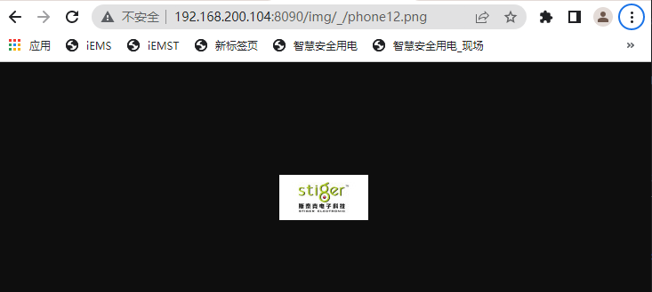
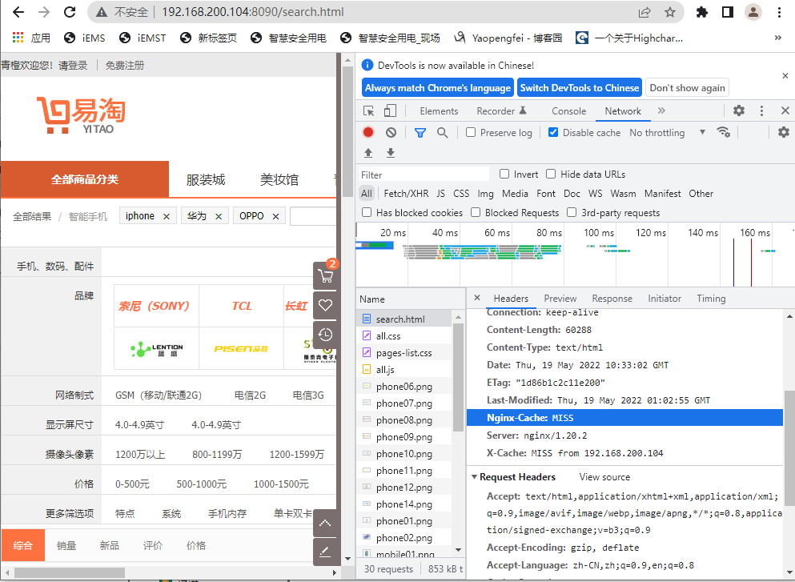
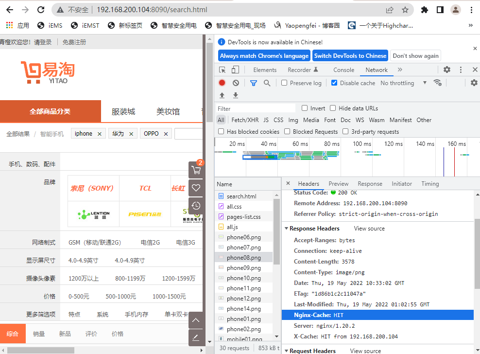
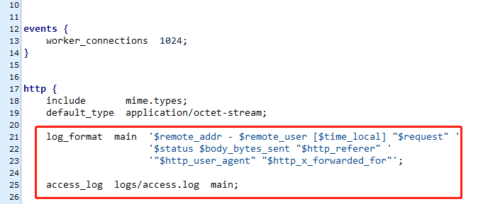
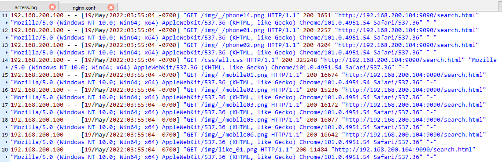
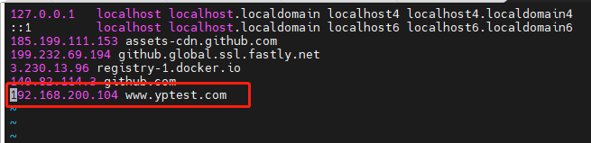

# Nginx性能优化

## 一、系统架构

Nginx 包含一个单一的 master 进程和多个 worker 进程。所有的这些进程都是单线程，并且设计为同时处理成千上万个连接。worker 进程是处理连接的地方，它用于处理客户端请求。master 进程负责读取配置文件、处理套接字、派生 worker 进程、打开日志文件等。总之， master 进程是一个可以通过处理信号响应来管理请求的进程。


## 二、参数调优

进入 /etc/nginx 文件夹，编辑 nginx.conf ，可以看到下面的参数。简单介绍下：

```shell
# nginx进程数，建议按照cpu数目来指定，一般跟cpu核数相同或为它的倍数。
worker_processes 8;

# 每个worker 进程的最大连接数
worker_connections 1024;

#为每个进程分配cpu，上例中将8个进程分配到8个cpu，当然可以写多个，或者将一个进程分配到多个cpu。
worker_cpu_affinity 00000001 00000010 00000100 00001000 00010000 00100000 01000000 10000000;

# 作用于event的I/O多路复用模型
use epoll;

#收到新连接通知后接受尽可能多的连接，作用于event
multi_accept on;
```

> epoll 接口作为 poll 接口的变体在 Linux 内核 2.5 中被引入。相比 select 实现的多路复用 I/O 模型，epoll 最大的好处在于它不会随着被监控描述符数目的增长而导致效率急速下降。

（1）`worker_processes number`：进程数

- 每个worker进程都是单线程的进程，它们会调用各个模块以实现多种多样的功能。如果这些模块确认不会出现阻塞式的调用，那么，有多少CPU内核就应该配置多少个进程；反之，如果有可能出现阻塞式调用，那么需要配置稍多一些的worker进程。例如，如果业务方面会致使用户请求大量读取本地磁盘上的静态资源文件，而且服务器上的内存较小，以至于大部分的请求访问静态资源文件时都必须读取磁盘（磁头的寻址是缓慢的），而不是内存中的磁盘缓存，那么磁盘I/O调用可能会阻塞住worker进程少量时间，进而导致服务整体性能下降。

（2）`worker_connections number`：每个worker进程的最大连接数，默认worker_connections 1024;

（3）`worker_cpu_affinity cpumask`：绑定Nginx worker进程到指定的CPU内核（该参数仅对Linux有效）

例如，如果有4颗CPU内核，就可以进行如下配置：

```shell
worker_processes 4;
worker_cpu_affinity 1000 0100 0010 0001;
```

说明：

为什么要绑定worker进程到指定的CPU内核呢？

原因：假定每一个worker进程都是非常繁忙的，如果多个worker进程都在抢同一个CPU，那么这就会出现同步问题。反之，如果每一个worker进程都独享一个CPU，就在内核的调度策略上实现了完全的并发。

（4）`worker_priority nice`：进程优先级设置

- 优先级由静态优先级和内核根据进程执行情况所做的动态调整（目前只有±5的调整）共同决定。
- nice值是进程的静态优先级，它的取值范围是–20～+19，–20是最高优先级，+19是最低优先级。因此，如果用户希望Nginx占有更多的系统资源，那么可以把nice值配置得更小一些，但不建议比内核进程的nice值（通常为–5）还要小

（5）`worker_rlimit_nofile limit`：worker进程的最大打开文件数限制

- 更改worker进程的最大打开文件数限制。如果没设置的话，这个值为操作系统的限制。设置后你的操作系统和Nginx可以处理比“ulimit -a”更多的文件，所以把这个值设高，这样nginx就不会有“too many open files”问题了。

（6）`accept_mutex_delay Nms`：使用accept锁后到真正建立连接之间的延迟时间

- 在使用accept锁后，同一时间只有一个worker进程能够取到accept锁。这个accept锁不是堵塞锁，如果取不到会立刻返回。如果只有一个worker进程试图取锁而没有取到，他至少要等待accept_mutex_delay定义的时间才能再次试图取锁。

## 三、高速缓存实战

### 1、案例分析

某电商平台商品详情页需要实现 700+ QPS，如何着手去做？


**对于商品详情页涉及了如下主要服务：**

- 商品详情页HTML页面渲染
- 价格服务
- 促销服务
- 库存状态/配送至服务
- 广告词服务
- 预售/秒杀服务
- 评价服务
- 试用服务
- 推荐服务
- 商品介绍服务
- 各品类相关的一些特殊服务

**解决方案：**

1. 采用Ajax 动态加载 价格、广告、库存等服务
2. 采用key value 缓存详情页主体html。

**方案架构：**


**问题：**

当达到500QPS 的时候很难继续压测上去。

**分析原因**：

一个详情页html 主体达平均150 kb 那么在500QPS 已接近千M局域网宽带极限。必须减少内网通信。

**基于Nginx 静态缓存的解决方案：**


### 2、缓存配置

- 客户端、代理请求缓存
- 设置缓存空间，存储缓存文件
- 在 location 中使用缓存空间
- 打开文件的缓存配置

#### 2.1 缓存配置

**准备工作**

- 未进行缓存配置的情况

（1）/usr/local/nginx/conf/追加servers/nginx-proxy-config.conf

```shell
server {
	listen 8070;
	server_name 192.168.200.104 localhost 127.0.0.1;
	location / {
		proxy_pass http://webs;
	}
}
```

（2）/usr/local/nginx/conf/追加servers/nginx-upstream.conf

```shell
upstream webs {
   server 192.168.200.104:8000 weight=1;
   server 192.168.200.104:8001 weight=1;
   server 192.168.200.104:8002 weight=8;
}
```

（3）修改/usr/local/nginx/conf/nginx.conf

```shell
#追加以下内容（http内）
# 避免直接修改原有配置文件
include servers/*;
```


- 进行缓存配置的情况

```shell
#设置缓存空间，存储缓存文件
proxy_cache_path /usr/local/nginx/cache levels=1:2 keys_zone=nginx-cache:20m max_size=50g inactive=168h;

server {
	listen 8090;
	server_name 192.168.200.104 localhost 127.0.0.1;
	
	#客户端请求主体的缓冲区大小
	client_body_buffer_size 512k;
	#客户端请求头部的缓冲区大小，这个可以根据系统分页大小来设置
	client_header_buffer_size 4k;
	client_max_body_size 512k;
	large_client_header_buffers 2 8k;
	proxy_buffer_size 16k;
	proxy_buffers 4 64k;
	proxy_busy_buffers_size 128k;
	proxy_temp_file_write_size 128k;
	#指定在何种情况下一个失败的请求应该被发送到下一台后端服务器
	proxy_next_upstream http_502 http_504 http_404 error timeout invalid_header;
	
	location / {
		proxy_set_header X-Real-IP $remote_addr;
		proxy_cache nginx-cache;
		proxy_cache_valid 200 304 302 5d;
		proxy_cache_valid any 5d;
		proxy_cache_key '$host:$server_port$request_uri';
		add_header X-Cache '$upstream_cache_status from $host';
		proxy_set_header X-Real-IP $remote_addr;
		proxy_pass http://192.168.200.104:8000;
	}
	
	#打开文件的缓存配置
	#为打开文件指定缓存，默认是没有启用的，max 指定缓存数量，建议和打开文件数一致，inactive 是指经		过多长时间文件没被请求后删除缓存。
	#open_file_cache max=65535 inactive=60s;

	#文件描述符一直是在缓存中打开的，如果有一个文件在inactive时间内一次没被使用，它将被移除。
	#open_file_cache_min_uses 1;

	#指定多长时间检查一次缓存的有效信息。
	#open_file_cache_valid 80s;
}
```

缓存参数说明：

| **父元素** | **名称**          | **描述**                                                     |
| ---------- | ----------------- | ------------------------------------------------------------ |
| http       | proxy_cache_path  | 指定缓存区的根路径                                           |
|            | levels            | 缓存目录层级最高三层，每层1~2个字符表示。如1:1:2 表示三层。  |
|            | keys_zone         | 缓存块名称 及内存块大小。如 cache_item:500m 。表示声明一个名为cache_item 大小为500m。超出大小后最早的数据将会被清除。 |
|            | inactive          | 最长闲置时间 如:10d 如果一个数据被闲置10天将会被清除         |
|            | max_size          | 缓存区硬盘最大值。超出闲置数据将会被清除                     |
| location   | proxy_cache       | 指定缓存区，对应keys_zone 中设置的值                         |
|            | proxy_cache_key   | 通过参数拼装缓存key 如：hosthosthosturiisargsis_argsisargsargs 则会以全路径md5值做做为Key |
|            | proxy_cache_valid | 为不同的状态码设置缓存有效期                                 |

结果：

- 未进行缓存配置时，每次访问search.html页面都需要请求服务器。
- 进行缓存配置后，初次访问search.html页面会将数据缓存proxy_cache_path路径中，下次请求直接从缓存中获取数据，从而缓解服务器压力。

#### 2.2 缓存清除

该功能可以采用第三方模块`ngx_cache_purge`实现。

（1）安装第三方模块`ngx_cache_purge`

```shell
#下载ngx_cache_purge 模块包 ,这里nginx 版本为1.20.2 purge 对应2.3版
wget http://labs.frickle.com/files/ngx_cache_purge-2.3.tar.gz
#查看已安装模块
./sbin/nginx -V
#进入nginx安装包目录 重新安装 --add-module为模块解压的全路径
# --prefix=/root/svr/nginx 此配置为nginx安装路径，默认为/usr/local/nginx
./configure --prefix=/root/svr/nginx --with-http_stub_status_module --with-http_ssl_module --add-module=/root/svr/nginx/models/ngx_cache_purge-2.0
#重新编译，不可知性make install否则会重新安装
make
#拷贝 安装目录/objs/nginx 文件用于替换原nginx 文件
cp /usr/local/nginx/sbin/nginx /usr/local/nginx/sbin/nginx_bk
cp /test/nginx/nginx-1.20.2/objs/nginx /usr/local/nginx/sbin/nginx
#检测查看安装是否成功
nginx -t
# 查看已安装已模块
nginx -V
```

（2）配置

```shell
server {
	listen 8090;
	server_name 192.168.200.104 localhost 127.0.0.1;
	
	#客户端请求主体的缓冲区大小
	client_body_buffer_size 512k;
	#客户端请求头部的缓冲区大小，这个可以根据系统分页大小来设置
	client_header_buffer_size 4k;
	client_max_body_size 512k;
	large_client_header_buffers 2 8k;
	proxy_buffer_size 16k;
	proxy_buffers 4 64k;
	proxy_busy_buffers_size 128k;
	proxy_temp_file_write_size 128k;
	#指定在何种情况下一个失败的请求应该被发送到下一台后端服务器
	proxy_next_upstream http_502 http_504 http_404 error timeout invalid_header;
	  
	location / {
		proxy_set_header X-Real-IP $remote_addr;
		proxy_cache nginx-cache;
		proxy_cache_valid 200 304 302 5d;
		proxy_cache_valid any 5d;
		proxy_cache_key '$host:$server_port$request_uri';
		add_header X-Cache '$upstream_cache_status from $host';
		proxy_set_header X-Real-IP $remote_addr;
		proxy_pass http://192.168.200.104:8000;
	}
 
   # 缓存清楚配置
   location ~ /purge(/.*) {
    #允许访问的IP
     allow           all;
     #配置清除指定缓存区和路径(与proxy_cache_key一致)
     proxy_cache_purge    nginx-cache '$host:$server_port$request_uri';
  }
}
```

（3）测试

缓存

http://192.168.200.104:8090/img/_/phone12.png



清除缓存

http://192.168.200.104:8090/purge/img/_/phone12.png


遇到的问题：

（1）make编译出错，报ngx_cache_purge_module.c:275: error: comparison between pointer and integer之类的错

原因：是版本不匹配，将ngx_cache_purge-2.0升级ngx_cache_purge-2.3，即可解决该问题

（2）清除缓存时，总是提示404

原因：（1）首先确认配置文件是否正确

​          （2）需要先删除历史缓存项，重新进行缓存后再清楚缓存才有效

#### 2.3指定不缓存的页面

`proxy_no_cache string`

```shell
server {

  ....
  
  # 判断当前路径是否是指定的路径
  # 访问路径是否包含search、login、register等
  if ($request_uri ~ ^/(search|login|register|password\/reset)) {
  		#设置一个变量用来存储是否是需要缓存
    	set $cookie_nocache 1;
  }
  
	location / {
    ....
    proxy_no_cache $cookie_nocache $arg_nocache $arg_comment;
    ....
	}
}
```

测试：

http://192.168.200.104:8090/search.html 每次都会请求服务器

http://192.168.200.104:8090/img/_/phone12.png 只有首次访问才会请求服务器

#### 2.4 命中显示

在http header上增加命中显示,Nginx 提供了 `$upstream_cache_status` 这个变量来显示缓存的状态，我们可以在配置中添加一个http头来显示这一状态，达到类似squid的效果。

>`$upstream_cache_status` 包含以下几种状态：
>
>- **MISS** 未命中，请求被传送到后端
>- **HIT** 缓存命中
>- **EXPIRED** 缓存已经过期请求被传送到后端
>- **UPDATING** 正在更新缓存，将使用旧的应答
>- **STALE** 后端将得到过期的应答


配置

```
server {
	location / {
    ....
    add_header Nginx-Cache "$upstream_cache_status";
    ....
	}
}
```


浏览器查看到的header：

（1）未命中




（2）命中




### 3、其他优化措施

#### 3.1 动静分离

将静态文件存储到 /usr/share/nginx/html 文件夹中，配置静态文件拦截规则。单个项目可以直接放在 /usr/share/nginx/html 根目录下，如果是多个项目，则要根据项目的根目录创建文件夹来保存静态文件。


配置拦截规则如下：

```shell
server {
	listen 9090;
	server_name 192.168.200.104 localhost 127.0.0.1;

  location ~ .*\.(eot|svg|ttf|woff|jpg|jpeg|gif|png|ico|cur|gz|svgz|mp4|ogg|ogv|webm|js|css)$ {
		#所有静态文件直接读取硬盘
		root html;
		expires 30d; #缓存30天
	}
 
  location /search.html {
		#所有静态文件直接读取硬盘
		root html;
		expires 30d; #缓存30天
	}
 
 	location / {
		proxy_pass http://192.168.200.104:8000;
	}
}
```


**结果：**整个网站的访问速度都会减少，大部分内容都将从静态文件目录或者硬盘中读取。


#### 3.2 连接超时

长时间占着连接资源不释放，最终会导致请求的堆积，Nginx 处理请求效率大大降低。所以我们对连接的控制都要注意设置超时时间，通过超时机制自动回收资源、避免资源浪费。

```shell
#客户端、服务端设置
server_names_hash_bucket_size 128;
server_names_hash_max_size 512;
# 长连接超时配置
keepalive_timeout  65;
client_header_timeout 15s;
client_body_timeout 15s;
send_timeout 60s;

#代理设置
#与后端服务器建立连接的超时时间。注意这个一般不能大于75秒
proxy_connect_timeout 30s;
proxy_send_timeout 120s;
#从后端服务器读取响应的超时
proxy_read_timeout 120s;
```


#### 3.3 GZIP压缩

在我们进行 gzip 打包压缩之前，最好将一些静态文件先进行压缩为 min 文件，请求的时候合并为同一文件。再通过 gzip 压缩后，你会发现网站加载又加速了。

```shell
#开启gzip,减少我们发送的数据量
gzip on;
#允许压缩的最小字节数
gzip_min_length 1k;
#4个单位为16k的内存作为压缩结果流缓存
gzip_buffers 4 16k;
#设置识别HTTP协议版本，默认是1.1
gzip_http_version 1.1;
#gzip压缩比，可在1~9中设置，1压缩比最小，速度最快，9压缩比最大，速度最慢，消耗CPU
gzip_comp_level 4;
#压缩的类型
gzip_types text/plain text/css application/json application/x-javascript text/xml application/xml application/xml+rss text/javascript; 
#给代理服务器用的，有的浏览器支持压缩，有的不支持，所以避免浪费不支持的也压缩，所以根据客户端的HTTP头来判断，是否需要压缩
gzip_vary on;
#禁用IE6以下的gzip压缩，IE6的某些版本对gzip的压缩支持很不好
gzip_disable "MSIE [1-6].
```

#### 3.4 访问限流

我们构建网站是为了让用户访问它们，我们希望用于合法访问。所以不得不采取一些措施限制滥用访问的用户。这种滥用指的是从同一IP每秒到服务器请求的连接数。因为这可能是在同一时间内，世界各地的多台机器上的爬虫机器人多次尝试爬取网站的内容。

```shell
#限制用户连接数来预防DOS攻击
limit_conn_zone $binary_remote_addr zone=perip:10m;
limit_conn_zone $server_name zone=perserver:10m;
#限制同一客户端ip最大并发连接数
limit_conn perip 2;
#限制同一server最大并发连接数
limit_conn perserver 20;
#限制下载速度，根据自身服务器带宽配置
limit_rate 300k;
```


#### 3.5 高效数据传输设置

```shell
#开启文件的高效传输模式。tcp_nopush和tcp_nodelay可防止网络及磁盘i/o阻塞，提升nginx工作效率;
sendfile on;
#数据包不会马上传送出去，等到数据包最大时，一次性的传输出去，这样有助于解决网络堵塞。
tcp_nopush on;
#只要有数据包产生，不管大小多少，就尽快传输
tcp_nodelay on;
```


#### 3.6 内核参数优化

编辑 /etc/sysctl.conf 文件，根据需要调整参数配置。

```shell
#如果想把timewait降下了就要把tcp_max_tw_buckets值减小，默认是180000
net.ipv4.tcp_max_tw_buckets = 5000

#开启重用功能，允许将TIME-WAIT状态的sockets重新用于新的TCP连接
net.ipv4.tcp_tw_reuse = 1

#系统中最多有多少个TCP套接字不被关联到任何一个用户文件句柄上。如果超过这个数字，孤儿连接将即刻被复位并打印出警告信息。这个限制仅仅是为了防止简单的DoS攻击
net.ipv4.tcp_max_orphans = 262144

#当keepalive起用的时候，TCP发送keepalive消息的频度。缺省是2小时。我们可以调短时间跨度
net.ipv4.tcp_keepalive_time = 30
```


#### 3.7 日志配置

日志文件对于我们日常运维至关重要，如果没有日志排查问题，你将很难判断异常的所在，要解决问题无异于大海捞针。日志的保存时必要的，不可缺少的，我们来看下怎么配置有利于排查问题？

- 关键字：其中关键字 access_log，error_log 不能改变
- error_log 错误日志级别：[debug | info | notice | warn | error | crit | alert | emerg]，级别越高记录的信息越少。不要配置 info 等级较低的级别，会带来大量的磁盘 I/O 消耗。

```shell
#定义日志模板
log_format 日志模板名称 日志格式;

#访问日志
access_log   path      format        gzip[=level]              [buffer=size]          [flush=time];
关键字     存放的路径   日志格式模板   gzip压缩,level指压缩级别   存放缓存日志的缓存大小   保存在缓存中的最长时间

#错误日志
error_log  <FILE>    <LEVEL>;
关键字     日志文件   错误日志级别

#示例
log_format main '$remote_addr - $remote_user [$time_local] "$request"'
                        '$status $body_bytes_sent "$http_referer"'
                        '"$http_user_agent" "$http_x_forwarded_for"';
```


配置：




日志：




#### 3.8 HTTP2协议配置

##### 3.8.1 Http1.1

- tcp 连接数限制

  对于同一个域名，浏览器最多只能同时创建 6~8 个 TCP 连接 (不同浏览器不一样)。因为一个tcp连接一次承载一个请求，也就是说一个时刻最多只能发起6~8个请求。

例如：*[http://a.com](https://link.zhihu.com/?target=http%3A//a.com)上有240张图片，需要发送240次http请求，底层使用上面建立的最多6个TCP连接传输，假如240个请求平均分配到6个TCP上，每个TCP上承担40个HTTP请求，在http1.1 中，每个TCP上的40个请求必须串行执行（等前一个请求图片完全传输完毕，下一个请求再出发），在http2.0 中每个TCP上的40个请求可以并发执行（同时向TCP上扔数据包，连接利用率进一步提升，效率更高）*

- “队头阻塞”问题

  每个 TCP 连接同时只能处理一个请求 - 响应，浏览器按 FIFO 原则处理请求，如果上一个响应没返回，后续请求 - 响应都会受阻。

- Header 内容多，而且每次请求 Header 不会变化太多，没有相应的压缩传输优化方案

- 了尽可能减少请求数，需要做合并文件、雪碧图、资源内联等优化工作，但是这无疑造成了单个请求内容变大延迟变高的问题，且内嵌的资源不能有效地使用缓存机制

- 明文传输不安全

##### 3.8.2 Http2

>  HTTP/2在HTTP1.1的基础上进行了更加细粒度的优化控制，并提供了包括多路复用、流优先级、流量控制、服务器推送和压缩等高级特性。非常强大。

- 多路复用

  - HTTP/1.1 协议：浏览器客户端在同一时间，针对同一域名下的请求有一定数量限制。超过限制数目的请求会被阻塞
  - HTTP/2 ：使用多路复用(Multiplexing) 则允许同时通过单一的 HTTP/2 连接发起多重的请求-响应消息。
    因此 HTTP/2 可以很容易的去实现多流并行而不用依赖建立多个 TCP 连接，HTTP/2 把 HTTP 协议通信的基本单位缩小为一个一个的帧，这些帧对应着逻辑流中的消息。并行地在同一个 TCP 连接上双向交换消息。

- 二进制分帧

  - HTTP/1.1 ：纯文本数据传输
  - HTTP/2 ：二进制数据帧

- 头部压缩

  - HTTP/1.1 ：HTTP是无状态协议，每个请求必须要携带服务器需要的所有细节。每一个请求的头部都包含这些大量的重复数据，无疑是一种很大的负担。对请求头部进行压缩，将会大大减轻这种负担，尤其对移动端来说，性能提高非常明显

  - HTTP/2 ：压缩方式是 HPACK

    HTTP2.0在客户端和服务器端使用“首部表”来跟踪和存储之前发送的键-值对，对于相同的数据，不再通过每次请求和响应发送；通信期间几乎不会改变的通用键-值对（用户代理、可接受的媒体类型，等等）只需发送一次。

- 服务器推送

  HTTP/2 的服务器推送所作的工作就是，服务器在收到客户端对某个资源的请求时，会判断客户端十有八九还要请求其他的什么资源，然后一同把这些资源都发送给客户端，即便客户端还没有明确表示它需要这些资源。

  客户端可以选择把额外的资源放入缓存中（所以这个特点也叫 Cache push），也可以选择发送一个 RST_STREAM frame 拒绝任何它不想要的资源。

##### 3.8.3 配置HTTP2

（1）安装`with-http_v2_module`

./configure  --with-http_v2_module

```shell
# --prefix=/root/svr/nginx 此配置为nginx安装路径，默认为/usr/local/nginx
# 因本次测试使用了purge模块，所以需要一起安装
./configure --with-http_stub_status_module --with-http_ssl_module --with-http_v2_module --add-module=/test/nginx/ngx_cache_purge-2.3
#重新编译，不可使用make install否则会重新安装
make
#拷贝 安装目录/objs/nginx 文件用于替换原nginx 文件
cp /usr/local/nginx/sbin/nginx /usr/local/nginx/sbin/nginx_bk
cp /test/nginx/nginx-1.20.2/objs/nginx /usr/local/nginx/sbin/nginx
#检测查看安装是否成功
nginx -t
# 查看已安装已模块
nginx -V
```

（2）添加SSL支持

要想添加SSL支持就需要添加证书，一种方式是购买或者在网上有一些免费的SSL证书可用，如果只是在测试环境中的话，还可以生成自签名证书。

这里我们介绍一下如何生的自签名证书。这里我们使用openssl命令来完成这个工作。

```shell
openssl req -x509 -nodes -days 365 -newkey rsa:2048 -keyout selfsigned.key -out selfsigned.crt
```

>自签名证书生成的命令：
>
>openssl是一个非常强大的密钥生成工具，可以完成绝大多数的密钥生成工作。
>
>req表示的是这是一个X.509 certificate signing request (CSR)。
>
>-x509表示我们希望生成的是一个自签名的证书。
>
>-nodes表示我们不需要对生成的密钥进行密码加密。
>
>-days 365表示证书的有效期。
>
>-newkey rsa:2048表示使用RSA算法同时生成证书和key，key的长度是2048。
>
>-keyout:指定key的生成路径。
>
>-out:指定证书的生成路径。


执行完成上面的命令，会要求你输入一些证书的信息如下：

```shell
Country Name (2 letter code) [AU]:CN
State or Province Name (full name) [Some-State]:SH
Locality Name (eg, city) []:SH
Organization Name (eg, company) [Internet Widgits Pty Ltd]:flydean
Organizational Unit Name (eg, section) []:yptest
Common Name (e.g. server FQDN or YOUR name) []:127.0.0.1
Email Address []:yptest@163.com
```

然后就生成了两个文件：selfsigned.crt和selfsigned.key。


（3）nginx-proxy-config.conf

```shell
# http2配置
server {
  #这里配置https和http2协议
	listen 443 ssl http2;
	server_name www.yptest.com;
	# root /usr/local/nginx/sbin/;
	try_files $uri /index.html;
 
  #下面配置ssl证书路径
  ssl_certificate /test/ssl/selfsigned.crt;  
	ssl_certificate_key /test/ssl/selfsigned.key;
	ssl_session_timeout 5m;
	ssl_ciphers ECDHE-RSA-AES128-GCM-SHA256:ECDHE:ECDH:AES:HIGH:!NULL:!aNULL:!MD5:!ADH:!RC4;
	ssl_protocols TLSv1 TLSv1.1 TLSv1.2;
	ssl_prefer_server_ciphers on;   
 
  
 	location / {
        # root /usr/local/nginx/sbin/;
    	try_files $uri /index.html;
    	proxy_set_header Host $host;
        proxy_set_header X-Real-IP $remote_addr;
        proxy_set_header X-Forwarded-For $proxy_add_x_forwarded_for;
        add_header Access-Control-Allow-Origin *;
        add_header Access-Control-Allow-Headers X-Requested-With;
        add_header Access-Control-Allow-Methods GET,POST,OPTIONS,PUT,DELETE;
        #用于强制取消浏览器缓存
    	if ($uri ~* "html$") {
    			add_header 'Cache-Control' 'no-cache';
    	}
   }
}
```


（4）/etc/hosts添加自定义域名




（5）测试

- Linux测试：

```shell
curl -k https://www.yptest.com/search.html
```

说明：

#curl -k 发送https请求时，加上-k参数，否则会有如下证书的报错

curl: (60) Peer's certificate issuer has been marked as not trusted by the user.
More details here: http://curl.haxx.se/docs/sslcerts.html

- Windows测试：

需要C:\Windows\System32\drivers\etc\host中添加域名解析

```shell
192.168.200.104 www.yptest.com
```

测试访问https://www.yptest.com/search.html
