# LVS架构搭建

## 一、OSI模型

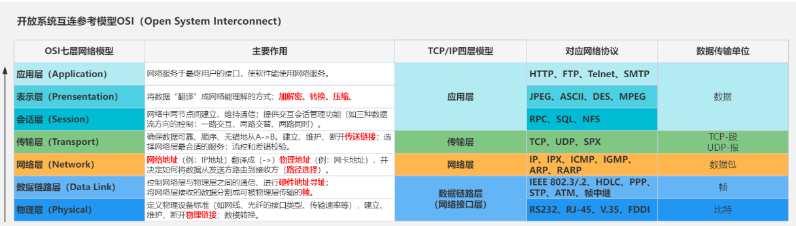

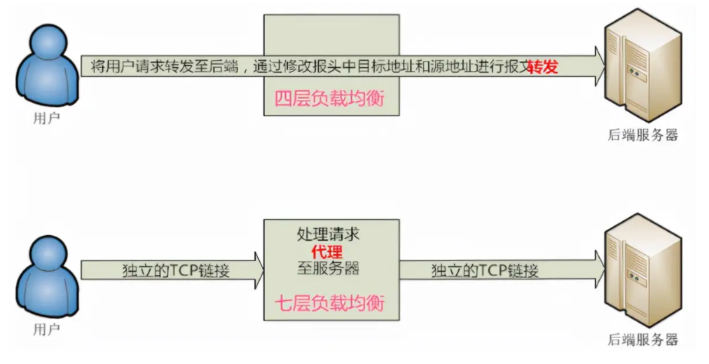

### 1. 四层负载均衡

四层负载均衡工作在 OSI 七层模型的第四层（传输层），指的是负载均衡设备通过报文中的目标IP地址、端口和负载均衡算法，选择到达的目标内部服务器，四层负载均衡对数据包只起一个数据转发的作用，无法修改或判断所请求资源的具体类型，也不会干预客户端与服务器之间应用层的通信（如三次握手等）。但在某些部署情况下，为保证服务器回包可以正确返回给负载均衡设备，在转发报文的同时可能会对报文原来的源地址进行修改。

四层负载均衡单纯的提供了终端到终端的可靠连接，并将请求转发至后端，连接至始至终都是同一个。LVS就是很典型的四层负载均衡。

### 2. 七层负载均衡

七层负载均衡工作在 OSI 模型的第七层（应用层），指的是负载均衡设备通过请求报文中的应用层信息(如URL、HTTP头部、资源类型等信息)和负载均衡算法，选择到达的目标内部服务器。七层负载均衡的功能更加丰富灵活，另外七层负载均衡两端（面向用户端和服务器端）的连接都是独立的，在一定程度上也提升了后端系统的安全性，因为像网络常见的DoS攻击，在七层负载均衡的环境下通常在负载均衡设备上就截止了，不会影响到后台服务器的正常运行。比如常见 Nginx 就是运行在七层的负载均衡软件

总之，四层负载均衡就是基于IP+端口实现的，七层负载均衡就是通过应用层资源实现的。

## 二、LVS+KeepAlived

### 1. 高可用集群

#### 1.1 定义

高可用集群(High Availability Cluster，简称HA Cluster)，是指以减少服务中断时间为目的得服务器集群技术。它通过保护用户的业务程序对外部间断提供的服务，把因为软件，硬件，认为造成的故障对业务的影响降低到最小程度。总而言之就是保证公司业务7*24小时不宕机。

#### 1.2 高可用衡量标准

衡量集群的可用性(HA)高低，可以从MTTF(平均无故障时间)和MTTR(平均故障维修时间)进行考 量，公式为:HA=MTTF/(MTTF+MTTR)*100%，具体衡量标准可以参考下表：

| 基本可用性       | 2个九 | 99%    | 年度宕机时间：87.6H |
| ---- | ---- | ---- | ---- |
| 较高可用性       | 3个九 | 99.9%  | 年度宕机时间：8.8H  |
| 具有故障自动恢复 | 4个九 | 99.99% | 年度宕机时间：53Min |
| 极高可用性       | 5个九 | 99.99% | 年度宕机时间：5Min  |

#### 1.3 自动容灾恢复能力

对集群中的服务器进行负载均衡、健康监测，并在服务器出现故障时能进行故障转移，自动切换到正常服务器是高可用保障的必要手段。

##### 1.3.1 常见的负载均衡

常见的负载均衡手段如下:

- **DNS 实现负载均衡**

  一个域名通过 DNS 解析到多个 IP，每个 IP 对应不同的服务器实例，就完成了流量的调度，这也是 DNS 实现负载均衡是最简单的方式。

  - 优点：实现简单，成本低，无需自己开发或维护负载均衡设备
  - 缺点：服务器故障切换延迟大，升级不方便、流量调度不均衡，粒度大、流量分配策略较简单，支持的算法较少、DNS 所支持的 IP 列表有限制要求。

- **硬件负载均衡**

  硬件负载均衡是通过专门的硬件设备从而来实现负载均衡功能，比如：交换机、路由器就是一个负载均衡专用的网络设备。

  目前典型的硬件负载均衡设备有两款：F5 和 A10。不过话说，能用上这种硬件负载均衡设备的企业都不是一般的公司，反而普通业务量级小的其他企业基本用不到。

  - 优点：

    （1）功能强大：支持各层级负载均衡及全面负载均衡算法；

    （2）性能强大：性能远超常见的软件负载均衡器；

    （3）稳定性高：硬件负载均衡，大规模使用肯定是严格测试过的；

    （4）安全防护：除具备负载均衡功能外，还具备防火墙、防 DDoS 攻击等安全功能；

  - 缺点：价格昂贵；可扩展性差；调试维护麻烦；

- **软件负载均衡**
  - Nginx ：支持 4 层 / 7 层负载均衡，支持 HTTP、E-mail 协议；
  - LVS ：纯 4 层负载均衡，运行在内核态，性能是软件负载均衡中最高的；
  - HAproxy ：是 7 层负载均衡软件，支持 7 层规则的设置，性能也不错；

​				优点：简单、灵活、便宜（直接在 Linux 操作系统上安装上述所使用的软件负载均衡，部署及维护较简单，4 层 和 7 层负载均衡可根据业务进行选择也可根据业务特点，比较方便进行扩展及定制功能）；

以下是nginx、haproxy、lvs 几种软件负载均衡技术比较：

| 技术    | 优点                                                         | 缺点                                                         |
| ------- | ------------------------------------------------------------ | ------------------------------------------------------------ |
| Nginx   | 可以针对http应用做一些二分流的策略；对网络稳定性的依赖非常小，；安装和配置简单，测试方便；能支撑几万的并发量；可作为静态网页和图片服务器 | 仅支持http、https和Email协议；只支持通过端口进行健康检查     |
| Haproxy | 支持通过URL进行健康检测；单纯做负载均衡，效果高于Nginx，支持TCP的负载均衡；可以对MySQL集群负载 | 不支持POP/SMTP协议；不支持Http cache功能、多进程模式；重载配置需要重启进程 |
| LVS     | 抗负载能力强，工作在网络四层，性能最好，工作稳定，之分发请求，无流量产生，保证IO性能，应用范围广 | 无法实现基于目录、URL的转发；不支持正则表达式处理；不能做动静分离；大型网站实施复杂；没有专用的Windows版本 |

**适用场景:**

1.网站建设初期，可以选用Nigix/HAproxy作为反向代理负载均衡（或者流量不大都可以不选用负载均衡），因为其配置简单，性能也能满足一般的业务场景。
  如果考虑到负载均衡器是有单点问题，可以采用Nginx/HAproxy+Keepalived来避免。
2.网站并发达到一定程度之后，为了提高稳定性和转发效率，可以使用LVS、毕竟LVS比Nginx/HAproxy要更稳定，转发效率也更高。不过维护LVS对维护人员的要求也会更高，投入成本也更大。

*参考资料*：https://blog.csdn.net/lilygg/article/details/89538862

##### 1.3.2 健康检测

常见的健康监测和自动切换软件有keepAlived和heartBeat，其二者对比如下:
**Keepalived使用更简单**:从安装、配置、使用、维护等角度上对比，Keepalived都比Heartbeat要简单;
**Heartbeat功能更强大**:Heartbeat虽然复杂，但功能更强大，配套工具更全，适合做大型集群管理，而Keepalived主要用于集群倒换，基本没有管理功能。

#### 1.4 高可用拓扑图


### 2. 软件负载均衡技术LVS

#### 2.1 LVS简介

##### 2.1.1 LVS

LVS是Linux Virtual Server的简写，在1998年5月由章文嵩博士成立。 工作在OSI模型的四层，基于IP进行负载均衡。 在linux2.2内核时，IPVS就已经以内核补丁的形式出现。 从2.4版本以后，IPVS已经成为linux官方标准内核的一部分。

##### 2.1.2 LVS官方资料

- lvs项目介绍 

  http://www.linuxvirtualserver.org/zh/lvs1.html

- lvs集群的体系结构 

  http://www.linuxvirtualserver.org/zh/lvs2.html

- lvs集群中的IP负载均衡技术 

  http://www.linuxvirtualserver.org/zh/lvs3.html

- lvs集群的负载调度 

  http://www.linuxvirtualserver.org/zh/lvs4.html

- lvs中文站点

  http://zh.linuxvirtualserver.org

##### 2.1.3 为什么要用LVS

随着 Internet 的爆炸性增长以及日常生活中的日益重要的作用，Internet 上的流量速度增长，以每年 100％ 以上的速度增长。服务器上的工作负载压力也迅速增加，因此服务器在短时间内将会过载，尤其是对于受欢迎的网站而言。为了克服服务器的过载压力问题，有两种解决方案。

- 一种是：单服务器解决方案，即将服务器升级到性能更高的服务器，但是当请求增加时，将很快过载，因此必须再次对其进行升级，升级过程复杂且成本高；
- 另一个是：多服务器解决方案，即在服务器集群上构建可扩展的网络服务系统。当负载增加时，可以简单地在群集中添加新服务器或更多服务器以满足不断增长的需求，而商用服务器具有最高的性能/成本比。因此，构建用于网络服务的服务器群集系统更具可伸缩性，并且更具成本效益。

##### 2.1.4  构建服务器集群的方法

- 基于 DNS 的负载均衡集群

  **优点**：DNS 负载均衡可能是构建网络服务群集的最简单方法。使用域名系统通过将域名解析为服务器的不同 IP 地址来将请求分发到不同的服务器。当 DNS 请求到达 DNS 服务器以解析域名时，DNS 服务器将基于调度策略发出服务器 IP 地址之一，然后来自客户端的请求使用相同的本地缓存名称服务器将在指定的名称解析生存时间（TTL）中发送到同一服务器。

  缺点：由于客户端和分层 DNS 系统的缓存特性，很容易导致服务器之间的动态负载不平衡，因此服务器很难处理其峰值负载。在 DNS 服务器上不能很好地选择名称映射的 TTL 值：

  - 如果值较小，DNS 流量很高，造成额外的网络问题，使 DNS 服务器将成为瓶颈；

  - 如果值较大，则动态负载不平衡将变得更糟。修改了DNS设置，需要等待足够的时间（刷新时间）才能发挥作用，在此期间保存了故障服务器地址的客户计算机将不能正常访问服务器。

  即使 TTL 值设置为零，调度粒度也是针对每个主机的，不同用户的访问模式可能会导致动态负载不平衡，因为有些人可能从站点中拉出很多页面，而另一些人可能只浏览了几页然后转到远。而且，它不是那么可靠，当服务器节点发生故障时，将名称映射到IP地址的客户端会发现服务器已关闭。

- **基于分派器的负载平衡集群**

  分派器，也称为负载平衡器，可用于在群集中的服务器之间分配负载，以便服务器的并行服务可以在单个IP地址上显示为虚拟服务，并且最终用户可以像单个服务器一样进行交互不知道群集中的所有服务器。与基于DNS的负载平衡相比，调度程序可以按精细的粒度（例如每个连接）调度请求，以实现服务器之间的更好负载平衡。一台或多台服务器发生故障时，可以掩盖故障。服务器管理变得越来越容易，管理员可以随时使一台或多台服务器投入使用或退出服务，而这不会中断最终用户的服务。

负载均衡可以分为两个级别，即应用程序级别和IP级别。例如，反向代理 和pWEB是用于构建可伸缩Web服务器的应用程序级负载平衡方法。他们将HTTP请求转发到群集中的其他Web服务器，获取结果，然后将其返回给客户端。由于在应用程序级别处理HTTP请求和答复的开销很高，我相信当服务器节点数增加到5个或更多时，应用程序级别的负载均衡器将成为新的瓶颈，这取决于每个服务器的吞吐量服务器。

##### 2.1.5  LVS 与 Nginx 功能对比

- LVS 比 Nginx 具有更强的抗负载能力，性能高，对内存和 CPU 资源消耗较低；
- LVS 工作在网络层，具体流量由操作系统内核进行处理，Nginx 工作在应用层，可针对 HTTP 应用实施一些分流策略；
- LVS 安装配置较复杂，网络依赖性大，稳定性高。Nginx 安装配置较简单，网络依赖性小；
- LVS 不支持正则匹配处理，无法实现动静分离效果。
- LVS 适用的协议范围广。Nginx 仅支持 HTTP、HTTPS、Email 协议，适用范围小

#### 2.2  LVS场景术语

LVS服务器(**DS**)
集群中节点服务器(**RS**)
虚拟IP地址(**VIP**)，用于向客户端提供服务的IP地址(配置于负载均衡器上)
真实服务器的IP地址(**RIP**)， 集群中节点服务器的IP地址
负载均衡器IP地址(**DIP**)，负载均衡器的IP地址，物理网卡上的IP
客户端主机IP地址(**CIP**)，终端请求用户的主机IP地址

#### 2.3 工作原理

LVS负载均衡调度技术是在linux内核中实现的，使用配置LVS时，不是直接配置内核中的IPVS，而是通 过IPVS的管理工具IPVSADM来管理配置，LVS集群负载均衡器接受所有入站客户端的请求，并根据算法 来决定由哪个集群的节点来处理请求

#### 2.4 四种工作模式

##### 2.4.1 NAT模式

NAT(Network Address Translation)模式是基于NAT技术实现的。在此模式中，LVS服务器既要处理请求的接入，又要处理请求的响应。因此存在较大的性能瓶颈。

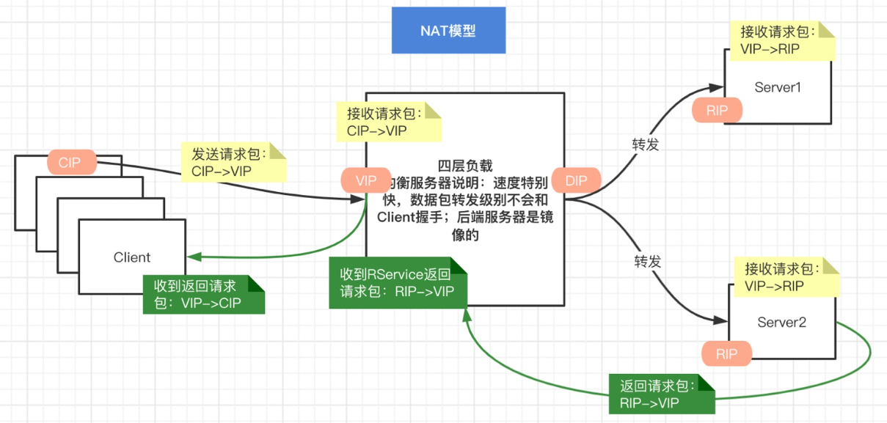

- 客户端将请求发往前端的负载均衡器，请求报文源地址是CIP(客户端IP),后面统称为CIP)，目标地址为VIP(负载均衡器前端地址，后面统称为VIP)。
- 负载均衡器收到报文后，发现请求的是在规则里面存在的地址，那么它将客户端请求报文的目标地址改为了后端服务器的RIP地址并将报文根据算法发送出去。
- 报文送到Real Server后，由于报文的目标地址是自己，所以会响应该请求，并将响应报文返还给LVS。
- 然后lvs将此报文的源地址修改为本机并发送给客户端。

**注意**：在NAT模式中，Real Server的网关必须指向LVS，否则报文无法送达客户端。

**NAT模式缺点**：
扩展性有限。当服务器节点（普通PC服务器）增长过多时,负载均衡器将成为整个系统的瓶颈，因为所有的请求包和应答包的流向都经过负载均衡器。当服务器节点过多时，大量的数据包都交汇在负载均衡器那，速度就会变慢！

##### 2.4.2 DR模式

DR(Direct Routing)模式是LVS的**默认工作模式**，也叫直接路由模式。只处理请求的接入，不处理请求的响应。因此性能高，瓶颈小。

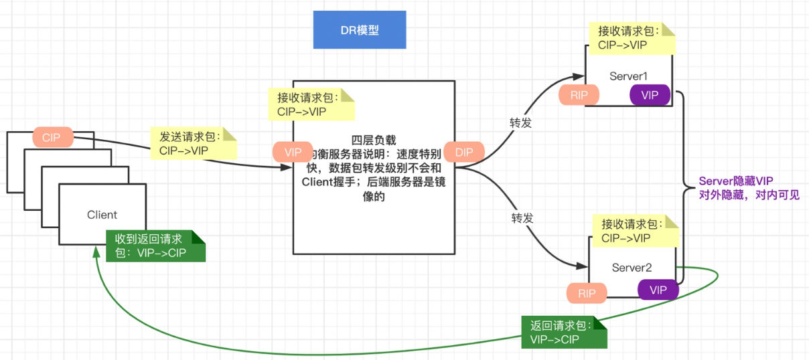

- 客户端将请求发往前端的负载均衡器，请求报文源地址是CIP，目标地址为VIP。
- 负载均衡器收到报文后，发现请求的是在规则里面存在的地址，那么它将客户端请求报文的源MAC地址改为自己DIP的MAC地址，目标MAC改为了RIP的MAC地址，并将此包发送给RS。
- RS发现请求报文中的目的MAC是自己，就会将次报文接收下来，处理完请求报文后，将响应报文通过lo接口送给eth0网卡直接发送给客户端。

**注意**：需要设置lo接口的VIP不能响应本地网络内的arp请求。

**优点**：
负载均衡器也只是分发请求，应答包通过单独的路由方法返回给客户端。因此DR模式的效率很高，但是配置稍微复杂一点，因此对于访问量不是特别大的公司可以用Haproxy/Nginx取代。日1000-2000W PV或者并发请求1万一下都可以考虑用Haproxy/Nginx。

**缺点**：所有节点和调度器只能在一个局域网里面。

##### 2.4.3 TUN模式（隧道模式）

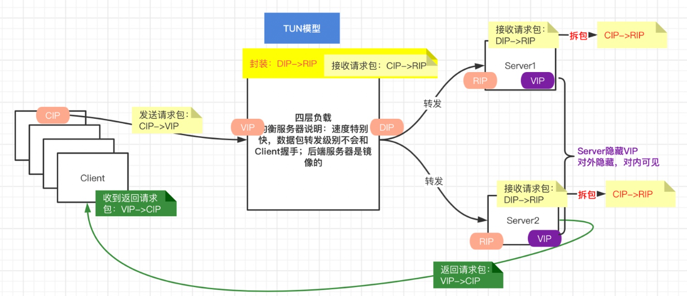

- 客户端将请求发往前端的负载均衡器，请求报文源地址是CIP，目标地址为VIP。
- 负载均衡器收到报文后，发现请求的是在规则里面存在的地址，那么它将在客户端请求报文的首部再封装一层IP报文,将源地址改为DIP，目标地址改为RIP,并将此包发送给RS。
- RS收到请求报文后，会首先拆开第一层封装,然后发现里面还有一层IP首部的目标地址是自己lo接口上的VIP，所以会处理次请求报文，并将响应报文通过lo接口送给eth0网卡直接发送给客户端。

**注意**：需要设置lo接口的VIP不能在公网上出现。
**总结**：

- TUN模式必须在所有的 realserver 机器上面绑定 VIP 的 IP 地址
- TUN模式的 vip ——>realserver 的包通信通过 TUNNEL 模式，不管是内网和外网都能通信，所以不需要 lvs vip 跟 realserver 在同一个网段内
- TUN模式 realserver 会把 packet 直接发给 client 不会给 lvs 了
- TUN模式走的隧道模式，所以运维起来比较难，所以一般不用。

**优点**：负载均衡器只负责将请求包分发给后端节点服务器，而RS将应答包直接发给用户。所以，减少了负载均衡器的大量数据流动，负载均衡器不再是系统的瓶颈，就能处理很巨大的请求量，这种方式，一台负载均衡器能够为很多RS进行分发。而且跑在公网上就能进行不同地域的分发。

**缺点**：隧道模式的RS节点需要合法IP，这种方式需要所有的服务器支持”IP Tunneling”(IP Encapsulation)协议，服务器可能只局限在部分Linux系统上。

##### 2.4.4 FULLNAT模式

**淘宝定制化的技术，linux内核不支持**。
无论是 DR 还是 NAT 模式，不可避免的都有一个问题：LVS 和 RS 必须在同一个 VLAN 下，否则 LVS 无法作为 RS 的网关。
这引发的两个问题是：

- 同一个 VLAN 的限制导致运维不方便，跨 VLAN 的 RS 无法接入。
- LVS 的水平扩展受到制约。当RS水平扩容时，总有一天其上的单点 LVS 会成为瓶颈。
  Full-NAT 由此而生，解决的是LVS和RS跨VLAN的问题，而跨VLAN问题解决后，LVS和RS不再存在VLAN上的从属关系，可以做到多个LVS对应多个RS，解决水平扩容的问题。
  在包从 LVS 转到 RS 的过程中，源地址从客户端 IP 被替换成了 LVS 的内网 IP。内网 IP 之间可以通过多个交换机跨 VLAN 通信。当 RS 处理完接受到的包，返回时，会将这个包返回给 LVS 的内网 IP，这一步也不受限于 VLAN。LVS 收到包后，在 NAT 模式修改源地址的基础上，再把 RS 发来的包中的目标地址从 LVS 内网 IP 改为客户端的 IP。
  Full-NAT 主要的思想是把网关和其下机器的通信，改为了普通的网络通信，从而解决了跨 VLAN 的问题。采用这种方式，LVS 和 RS 的部署在 VLAN 上将不再有任何限制，大大提高了运维部署的便利性。

#### 2.5 LVS 调度算法

##### 2.5.1  静态调度算法

- RR：Round Robin 轮询调度
- WRR：Weighted RR 加权轮询调度
- SH：Source Hashing源地址哈希调度
- DH：Destination Hashing目标地址哈希调度

##### 2.4.5 动态调度算法

- LC：Least Connections最小连接数调度
- WLC：Weighted LC加权最小连接数调度 (*默认*)
- SED：Shortest Expection Delay初始连接高权重优先
- NQ：Nerver Queue 第一轮平均分配，后续SED
- LBLC：Locality-Based LC 动态的DH算法
- LBLCR：LBLC with Replication 带复制功能的LBLC
- FO: Weighted Fail Over，linux内核4.15后新增的调度算法
- OVF：Overflow-connection，linux内核4.15后新增的调度算法

#### 2.6 LVS 基本命令

对于lvs的操作，主要是通过ipvsadm软件实现，Linux内核已集成lvs。常用的lvs操作命令如下：

- 集群服务管理

  ```shell
  # 此命令用来添加一个lvs策略，IP指VIP，调度算法是12种调度算法 的一种
  ipvsadm -A -t IP -s 调度算法
  # 此命令用来清除一个lvs策略
  ipvsadm -C
  # 此命令用来保存一个lvs策略
  ipvsadm -S
  # 此命令用来加载一个lvs策略
  ipvsadm -R
  # 此命令用来查看策略
  ipvsadm -L
  ```

  

- 集群RS管理

  ```shell
  # 添加一台RS，
  # IP1指VIP
  # IP2指RIP
  # -m|g|i中m是NAT
  # g是 DR，
  ipvsadm -a -t IP1 -r IP2 - m|g|i
  # 此命令用来删除一台RS，IP1指VIP，IP2指RIP
  ipvsadm -d -t IP1 -r IP2
  ```

#### 2.7 LVS 实战（DR模式）

ARP(Address Resolution Protocol)地址解析协议，是根据IP地址获取物理地址 (MAC)的一个 TCP/IP协议。主机发送信息时将包含目标IP地址的ARP请求广播到局域网络上的 所有主机，并接收返 回消息，以此确定目标的物理地址;收到返回消息后将该IP地址和物理地址 存入本机ARP缓存中并 保留一定时间，下次请求时直接查询ARP缓存以节约资源。

##### 2.7.1 DR模式服务器拓扑图

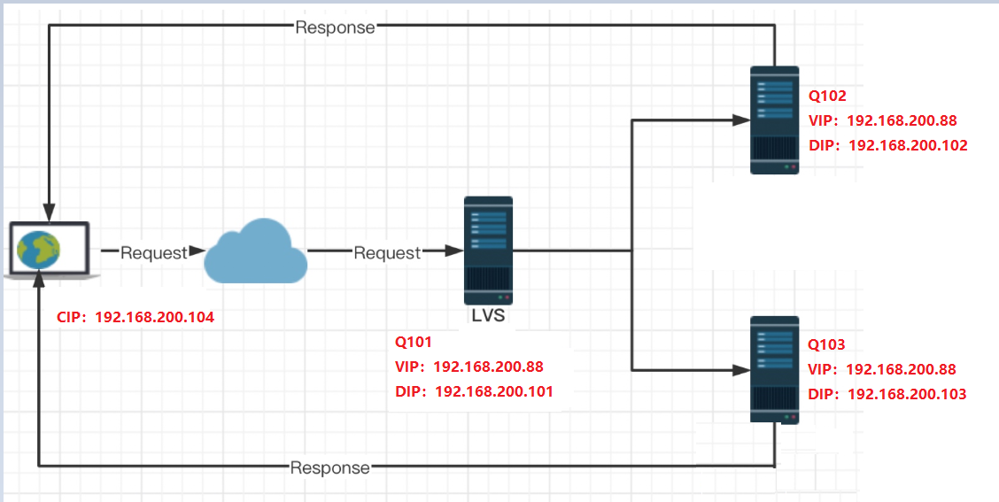

**服务器准备**：

- LVS(DS)（Q101）：CentOS7 DIP：192.168.200.101 VIP：192.168.200.104
- RS1（Q102）： CentOS7 RIP：192.168.200.102 VIP：192.168.200.104
- RS2（Q103）： CentOS7 RIP：192.168.200.103 VIP：192.168.200.104

##### 2.7.2 DR模式实现

通过拓扑图可以发现，需要让LVS和RS在同一个网段，并且在两个RS服务器上也需要绑定VIP。操作步骤如下：

（1）在两台RS服务器Q102和Q103上进行如下ARP抑制操作，并配置VIP到lo网卡上，如下:

```shell
# arp抑制，修改内核
# 因为在DR模式下，RS节点和LVS同处一个局域网网段内。
# 当网关通过ARP广播试图获取VIP的MAC地址的时候
# LVS和节点都会接收到ARP广播并且LVS和节点都绑定了192.168.0.240这个VIP，所以都会去响应网关的这个广播，导致冲突现象。
# 因此，我们需要对RS节点做抑制ARP广播的措施。
echo 1 > /proc/sys/net/ipv4/conf/ens33/arp_ignore
echo 1 > /proc/sys/net/ipv4/conf/all/arp_ignore
echo 2 > /proc/sys/net/ipv4/conf/all/arp_announce 
echo 2 > /proc/sys/net/ipv4/conf/ens33/arp_announce

# 安装ifconfig,centos7没有ifconfig
yum install net-tools.x86_64 -y
# 配置VIP到lo网卡 这里的子网掩码需要4个255。
ifconfig lo:0 192.168.200.88 netmask 255.255.255.255 broadcast 192.168.200.88
route add -host 192.168.200.88 dev lo:0
# 删除路由
# route del -net 192.168.3.88 netmask 255.255.255.255
# 删除网卡
# ifconfig lo:0 down
# 查看IP
ifconfig
# 查看网关是否生效
route -n
```

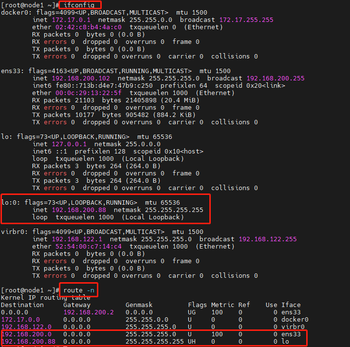


（2）在RS服务器Q102和Q103上都安装httpd服务器（测试使用）

```shell
# 下载安装httpd服务，命令如下
yum install -y httpd  / apt-get install -y yum
# 设置首页内容(RS2把内容改为this is RS2)
echo this is RS01 > /var/www/html/index.html
# 启动httpd
systemctl start httpd
```

可单独访问192.168.200.102和192.168.200.103可以正常访问。

（3）在LVS服务器Q101上安装ipvsadm，绑定VIP192.168.200.88

```shell
# 1）安装ipvsadm
yum install -y ipvsadm
# 安装ifconfig,centos7没有ifconfig
yum install net-tools.x86_64 -y
# 2）在lvs的ens33网卡上绑定VIP192.168.3.88
ifconfig ens33:0 192.168.200.88/24
route add -host 192.168.200.88 dev ens33:0
# 查看ip
ifconfig
```

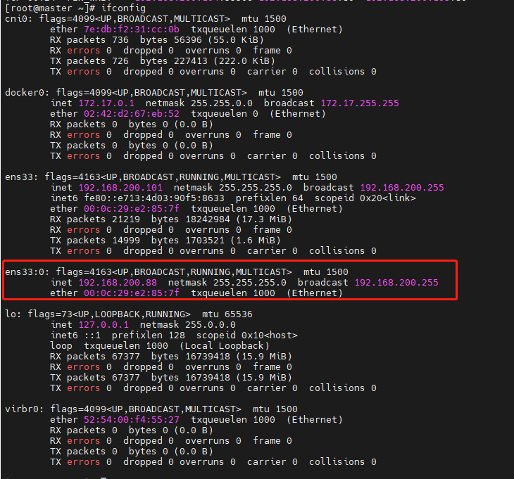

（4）LVS服务器上设置DR策略和负载规则

```shell
# 设置规则
#说明：
# -A：添加一个虚拟路由主机（LB）
# -t：指定虚拟路由主机的VIP地址和监听端口
# -s：指定负载均衡算法
# -p：指定会话保持时间
ipvsadm -A -t 192.168.200.88:80 -s rr
# 添加RS
#说明：
# -a：添加RS节点
# -t：指定虚拟路由主机的VIP地址和监听端口
# -r：指定RS节点的RIP地址和监听端口
# -g：指定DR模式
# -w：指定权值
ipvsadm -a -t 192.168.200.88:80 -r 192.168.200.102 -g
ipvsadm -a -t 192.168.200.88:80 -r 192.168.200.103 -g
#查看策略
ipvsadm -Ln
```

（5）验证

客户端测试：192.168.200.88，可以使用浏览器或者curl命令

```shell
while :;do curl 192.168.200.88;sleep 1; done
```

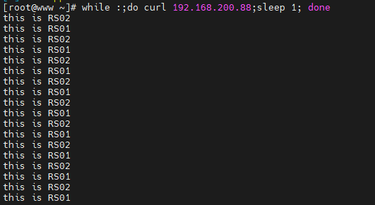

```shell
# LVS上查看调度情况
ipvsadm -Lnc
```

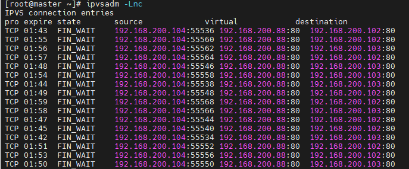

##### 2.7.3 小结

以上以DR模型搭建了一套简单的负载均衡环境，但是存在几个问题：

- 如果LVS服务器挂了会出现什么问题?
- 如何进行故障转移、自动切换?
- 如果后端某台RS服务器挂了会出现什么问题?
- 如何获知RS服务器状态?

**解决方案**：通过使用LVS+KeepAlived实现高可用架构。

### 3. KeepAlived

#### 3.1 简介

Keepalived的作用是检测服务器状态，如果有一台web服务器宕机，或工作出现故障，Keepalived将检测到，并将有故障的服务器从系统中剔除，同时使用其他服务器代替该服务器的工作，当服务器工作正常后Keepalived自动将服务器加入到服务器集群中。

#### 3.2 特点

##### 3.2.1 健康检测

**tcp_check**：工作在第4层，keepalived向后端服务器发起一个tcp连接请求，如果后端服务器 没有响应或超时，那么这个后端将从服务器池中移除。
**http_get**：工作在第5层，向指定的URL执行http请求，将得到的结果用md5加密并与指定的 md5值比较看是否匹配，不匹配则从服务器池中移除;此外还可以指定http返回 码来判断检测是否成功。HTTP_GET可以指定多个URL用于检测，这个一台服务器有多个虚拟主机的情况下比较好用。
**misc_check**：用脚本来检测，脚本如果带有参数，需将脚本和参数放入双引号内。
**ssl_get**：和http_get相似，不同的只是用SSL连接。
**smtp_check**：主要用于邮件系统SMTP协议的检测

##### 3.2.3 故障迁移

**VRRP协议**
在现实的网络环境中。主机之间的通信都是通过配置静态路由或者(默认网关)来完成的，而主机之间的 路由器一旦发生故障，通信就会失效，因此这种通信模式当中，路由器就成了一个单点瓶颈，为了解决 这个问题，就引入了VRRP协议。
VRRP协议是一种容错的主备模式的协议，保证当主机的下一跳路由出现故障时，由另一台路由器来代 替出现故障的路由器进行工作，通过VRRP可以在网络发生故障时透明的进行设备切换而不影响主机之 间的数据通信。
**故障迁移原理**
在 Keepalived 服务正常工作时，**主 Master 节点会不断地向备节点发送(多播的方式)心跳消息，用以告诉备 Backup 节点自己还活着**，当主 Master 节点发生故障时，就无法发送心跳消息，备节点也就 因此无法继续检测到来自主 Master 节点的心跳了，于是调用自身的接管程序，接管主 Master 节点的 IP 资源及服务。而当主 Master 节点恢复时，备 Backup 节点又会释放主节点故障时自身接管的 IP 资源 及服务，恢复到原来的备用角色。

#### 3.3 原理

Keepalived工作在TCP/IP参考模型的三层、四层、五层，其原理如下：

- **网络层**
  Keepalived通过ICMP协议向服务器集群中的每一个节点发送一个ICMP数据包(有点类似与 Ping的功能)，如果某个节点没有返回响应数据包，那么认为该节点发生了故障， Keepalived将报告这个节点失效，并从服务器集群中剔除故障节点。
- **传输层**
  Keepalived在传输层里利用了TCP协议的端口连接和扫描技术来判断集群节点的端口是否正常。比如对于常见的WEB服务器80端口。或者SSH服务22端口，Keepalived一旦在传输层探测到这些端口号没有数据响应和数据返回，就认为这些端口发生异常，然后强制将这些 端口所对应的节点从服务器集群中剔除掉。
- **应用层**
  Keepalived的运行方式更加全面化和复杂化，用户可以通过自定义Keepalived工作方式。 例如:可以通过编写程序或者脚本来运行Keepalived，而Keepalived将根据用户的设定参 数检测各种程序或者服务是否正常，如果Keepalived的检测结果和用户设定的不一致时， Keepalived将把对应的服务器从服务器集群中剔除。

#### 3.4 分布式选举策略

##### 3.4.1  仅设置priority

在一个一主多备的Keepalived集群中，priority值最大的将成为集群中的MASTER节点，而其他都是 BACKUP节点。在MASTER节点发生故障后，BACKUP节点之间将进行“民主选举”，通过对节点优先级值 priority和weight的计算，选出新的MASTER节点接管集群服务。

##### 3.4.2  设置priority和weight

- **weight值为正数时**
  在vrrp_script中指定的脚本如果检测成功，那么MASTER节点的权值将是weight值与priority值之和;如果脚本检测失效，那么MASTER节点的权值保持为priority值
  - MASTER 节点vrrp_script脚本检测失败时，如果MASTER节点priority值小于BACKUP节点weight值与 priority值之和，将发生主、备切换。
  - MASTER节点vrrp_script脚本检测成功时，如果MASTER节点weight值与priority值之和大于BACKUP节 点weight值与priority值之和，主节点依然为主节点，不发生切换。
- **weight值为负数时**
  在vrrp_script中指定的脚本如果检测成功，那么MASTER节点的权值仍为priority值，当脚本检测失败时，MASTER节点的权值将是priority值与weight值之差 
  - MASTER节点vrrp_script脚本检测失败时，如果MASTER节点priority值与weight值之差小于BACKUP节点priority值，将发生主、备切换。 
  - MASTER节点vrrp_scrip脚本检测成功时，如果MASTER节点priority值大于BACKUP节点priority值时，主节点依然为主节点，不发生切换。

说明：对于weight值的设置，有一个简单的标准，即weight值的绝对值要大于MASTER和BACKUP节点priority 值之差。由此可见，对于weight值的设置要非常谨慎，如果设置不好，主节点发生故障时将导致集群角 色选举失败，使集群陷于瘫痪状态。

### 4. LVS+KeepAlived

#### 4.1 网络拓扑图

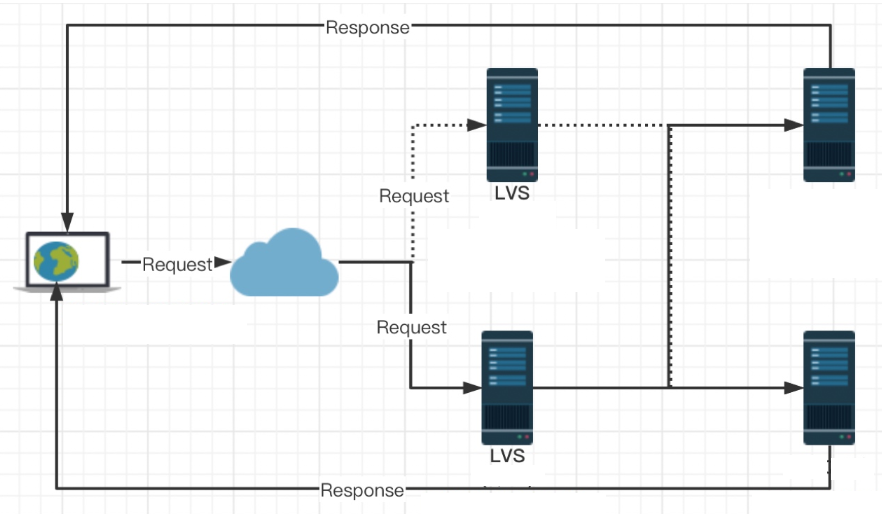

#### 4.2  keepAlived安装和配置

**部署环境**

| IP              | 简称 | 功能        |
| --------------- | ---- | ----------- |
| 192.168.200.101 | Q101 | LVS主服务器 |
| 192.168.200.104 | Q104 | LVS备服务器 |
| 192.168.200.102 | Q102 | WEB服务01   |
| 192.168.200.103 | Q103 | web服务02   |
| 192.168.200.105 | Q105 | 客户端      |

##### 4.2.1 安装KeepAlived

在两台LVS服务器(192.168.200.101,192.168.200.104)上安装KeepAlived

```shell
yum install -y keepalived
```

##### 4.2.2 配置文件解析

/etc/keepalived/keepalived.conf

```yaml

! Configuration File for keepalived
 
global_defs {					#全局配置
	notification_email {		#指定keepalived在发生切换时需要发送email到的对象，一行一个
		acassen@firewall.loc	#指定收件人邮箱
		failover@firewall.loc
		sysadmin@firewall.loc
	}
	notification_email_from Alexandre.Cassen@firewall.loc #指定发件人
	smtp_server 192.168.200.1	#指定smtp服务器地址
	smtp_connect_timeout 30		#指定smtp连接超时时间
	router_id LVS_DEVEL			#此处注意router_id为负载均衡标识，在局域网内应该是唯一的。
	vrrp_skip_check_adv_addr 	#检查收到的通告中的所有地址会非常耗时，设置此参数就不会检查收到过的主路由器的通告
	vrrp_strict                 #严格遵守VRRP协议，开启这个功能会在iptables中添加下面一条规则，导致VIP ping不通
	vrrp_garp_interval 0
	vrrp_gna_interval 0
}
 
vrrp_sync_group VG_1{				#监控多个网段的实例
	group {
		inside_network				#实例名
		outside_network
	}
	notify_master /path/xx.sh		#指定当切换到master时，执行的脚本
	netify_backup /path/xx.sh		#指定当切换到backup时，执行的脚本
	notify_fault "path/xx.sh VG_1" 	#故障时执行的脚本
	notify /path/xx.sh
	smtp_alert 						#使用global_defs中提供的邮件地址和smtp服务器发送邮件通知
}
 
vrrp_instance inside_network {
	state BACKUP 			#指定那个为master，那个为backup，如果设置了nopreempt这个值不起作用，主备考priority决定
	interface eth0 			#设置实例绑定的网卡
	dont_track_primary 		#忽略vrrp的interface错误（默认不设置）
	track_interface{ 		#设置额外的监控，里面那个网卡出现问题都会切换
		eth0
		eth1
	}
	mcast_src_ip			#发送多播包的地址，如果不设置默认使用绑定网卡的primary ip
	garp_master_delay		#在切换到master状态后，延迟进行gratuitous ARP请求
	virtual_router_id 50	#设置虚拟路由id，范围0~255，主备必须相同
	priority 99				#优先级，高优先级竞选为master
	advert_int 1			#检查间隔，默认1秒
	nopreempt				#设置为不抢占 注：这个配置只能设置在backup主机上，而且这个主机优先级要比另外一台高
	preempt_delay			#抢占延时，默认5分钟
	debug					#debug级别
	authentication {		#设置认证
		auth_type PASS		#认证方式，类型主要有PASS、AH 两种
		auth_pass 111111	#认证密码
	}
	virtual_ipaddress {		#设置vip
		192.168.36.200
	}
}
 
vrrp_instance VI_1 {		#虚拟路由的标识符
	state MASTER			#状态只有MASTER和BACKUP两种，并且要大写，MASTER为工作状态，BACKUP是备用状态
	interface eth0			#通信所使用的网络接口
    lvs_sync_daemon_inteface eth0  #这个默认没有，相当于心跳线接口，DR模式用的和上面的接口一样，也可以用机器上的其他网卡eth1，用来防止脑裂。
    virtual_router_id 51	#虚拟路由的ID号，是虚拟路由MAC的最后一位地址
    priority 100			#此节点的优先级，主节点的优先级需要比其他节点高
    advert_int 1			#通告的间隔时间
    nopreempt				#设置为不抢占 注：这个配置只能设置在backup主机上，而且这个主机优先级要比另外一台高
    preempt_delay			#抢占延时，默认5分钟
    authentication {		#认证配置
		auth_type PASS		#认证方式
        auth_pass 1111		#认证密码
    }
    virtual_ipaddress {		#虚拟ip地址,可以有多个地址，每个地址占一行，不需要子网掩码，同时这个ip 必须与我们在lvs 客户端设定的vip 相一致！
        192.168.200.16
        192.168.200.17
        192.168.200.18
    }
}
 
virtual_server 192.168.200.100 443 { #集群所使用的VIP和端口
    delay_loop 6					#健康检查间隔，单位为秒
    lb_algo rr						#lvs调度算法rr|wrr|lc|wlc|lblc|sh|dh
    nat_mask 255.255.255.0			#VIP掩码
    lb_kind NAT						#负载均衡转发规则。一般包括DR,NAT,TUN 3种
    persistence_timeout 50			#会话保持时间，会话保持，就是把用户请求转发给同一个服务器，不然刚在1上提交完帐号密码，就跳转到另一台服务器2上了
    protocol TCP					#转发协议，有TCP和UDP两种，一般用TCP，没用过UDP
    persistence_granularity <NETMASK> #lvs会话保持粒度
 
    real_server 192.168.201.100 443 { #真实服务器，包括IP和端口号
        weight 1					#默认为1,0为失效
        inhibit_on_failure			#在服务器健康检查失效时，将其设为0，而不是直接从ipvs中删除
        notify_up <string> | <quoted-string> #在检测到server up后执行脚本
        notify_down <string> | <quoted-string> #在检测到server down后执行脚本
 
		TCP_CHECK {					#通过tcpcheck判断RealServer的健康状态
            connect_timeout 3		#连接超时时间
            nb_get_retry 3			#重连次数
            delay_before_retry 3	#重连间隔时间
            connect_port 23			健康检查的端口的端口
            bindto <ip>  
        }
           
        HTTP_GET | SSL_GET {		#健康检测方式，可选有 SSL_GET、TCP_CHECK、HTTP_GET
            url {					#检查url，可以指定多个
              path /				#检查的url路径
              digest ff20ad2481f97b1754ef3e12ecd3a9cc  #需要检查到的内容。检查后的摘要信息。
              status_code 200		#检查的返回状态码
            }
            url {
              path /mrtg/
              digest 9b3a0c85a887a256d6939da88aabd8cd
            }
            connect_timeout 3		#连接超时时间
            nb_get_retry 3			#检测尝试几次
            delay_before_retry 3	#检测的时间间隔
        }
    }
}
 
virtual_server 10.10.10.2 1358 {
    delay_loop 6
    lb_algo rr
    lb_kind NAT
    persistence_timeout 50
    protocol TCP
 
    sorry_server 192.168.200.200 1358
 
    real_server 192.168.200.2 1358 {
        weight 1
        HTTP_GET {
            url {
              path /testurl/test.jsp
              digest 640205b7b0fc66c1ea91c463fac6334d
            }
            url {
              path /testurl2/test.jsp
              digest 640205b7b0fc66c1ea91c463fac6334d
            }
            url {
              path /testurl3/test.jsp
              digest 640205b7b0fc66c1ea91c463fac6334d
            }
            connect_timeout 3
            nb_get_retry 3
            delay_before_retry 3
        }
    }
 
    real_server 192.168.200.3 1358 {
        weight 1
        HTTP_GET {
            url {
              path /testurl/test.jsp
              digest 640205b7b0fc66c1ea91c463fac6334c
            }
            url {
              path /testurl2/test.jsp
              digest 640205b7b0fc66c1ea91c463fac6334c
            }
            connect_timeout 3
            nb_get_retry 3
            delay_before_retry 3
        }
    }

```

##### 4.2.3 配置keepAlived

LVS主服务器（Q101）

```shell
! Configuration File for keepalived

global_defs {
   notification_email {
     acassen@firewall.loc
     failover@firewall.loc
     sysadmin@firewall.loc
   }
   notification_email_from Alexandre.Cassen@firewall.loc
   smtp_server 192.168.200.1
   smtp_connect_timeout 30
   router_id LVS_DEVEL
   vrrp_skip_check_adv_addr
   # vrrp_strict  严格遵守VRRP协议，开启这个功能会在iptables中添加下面一条规则，导致VIP ping不通
   vrrp_garp_interval 0
   vrrp_gna_interval 0
}

vrrp_instance VI_1 {
    state MASTER
    interface ens33
    virtual_router_id 51
    priority 100
    advert_int 1
    authentication {
        auth_type PASS
        auth_pass 1111
    }
    virtual_ipaddress {
        # 192.168.200.16
        # 192.168.200.17
        # 192.168.200.18
        # 192.168.200.100         #指定VIP，不指定网卡，默认为eth0,注意：不指定/prefix,默认为/32
        # 192.168.200.101/24 dev eth1                 #指定VIP的网卡
        # 192.168.200.102/24 dev eth2 label eth2:1    #指定VIP的网卡label
        192.168.200.88/24 dev ens33 label ens33:0
    }
}

virtual_server 192.168.200.88 80 {
    delay_loop 6
    lb_algo rr
    lb_kind DR			#此处仅针对DR模式进行了测试
    persistence_timeout 50 #为了方便测试负载均衡，将此处改为0，表示不使用缓存
    protocol TCP

    real_server 192.168.200.102 80 {
        weight 1
    		HTTP_GET {
    			url {
    				path /
    				status_code 200
    			}
    			connect_timeout 3
    			nb_get_retry 3
    			delay_before_retry 3
    		}
    }

    real_server 192.168.200.103 80 {
        weight 1
    		HTTP_GET {
    			url {
    				path /
    				status_code 200
    			}
    			connect_timeout 3
    			nb_get_retry 3
    			delay_before_retry 3
    		} 
    }
}

```

LVS备服务器（Q104）

复制Q101的keepalived.conf，修改以下内容

- vrrp_instance VI_1/interface：ifconfig确认网卡位置
- vrrp_instance VI_1/state：BACKUP
- vrrp_instance VI_1/priority：修改权重为50（小于主服务器即可）

##### 4.2.4 启动keepAlived

在两台lvs服务器上分别启动keepAlived，命令如下:

```
systemctl start keepalived
```

#### 4.3 高可用测试

##### 4.3.1 测试环境检查

确认keepalived是否启动成功

```shell
# 确认ipvsadm是否启动成功
systemctl status ipvsadm
# 如果ipvsadm启动失败
# ipvsadm --save > /etc/sysconfig/ipvsadm # 解决 ipvsadm启动失败
# service ipvsadm restart

# 确认keepalived是否启动成功
systemctl status keepalived
# 确认VIP是否绑定到主服务器
ifconifg
# 确认集群服务列表
ipsvadm -ln
```

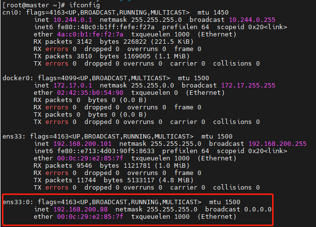

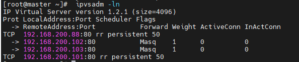

##### 4.3.2 测试负载均衡

在客户端发起请求，测试负载均衡，如下:

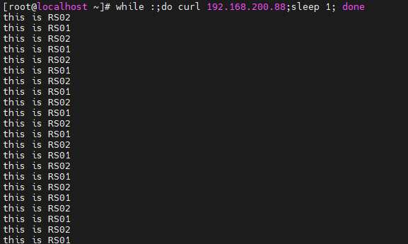

##### 4.3.3 测试RS高可用

- 关闭一台RS1(Q102)后(这里可以使用systemctl stop httpd)，客户端继续发起请求，查看是 否可以正常访问。会发现，此时客户端可以正常访问，但只有RS2在提供服务。这说明，keepAlived检测到了RS1服务器异常，将其剔除了。
- 此时再启动RS1服务器，客户端继续访问，会发现响应结果如下，keepAlived检测到RS1服务器恢复正 常，又将其加入服务列表了

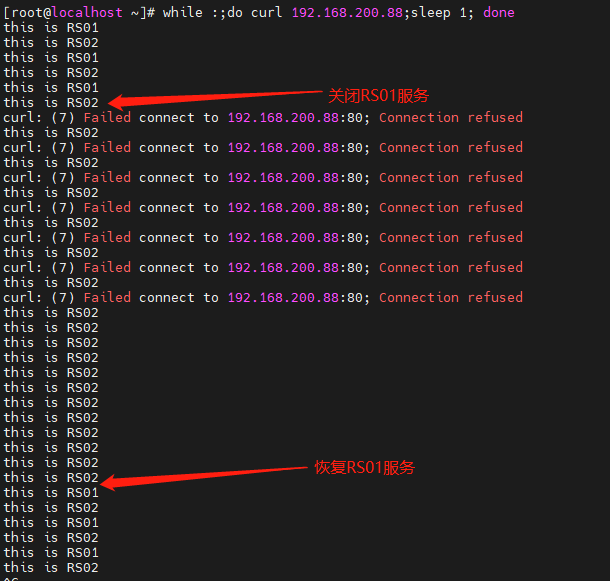

##### 4.3.4 测试LVS高可用

（1）Q101为MASTER，Q104为BACKUP时

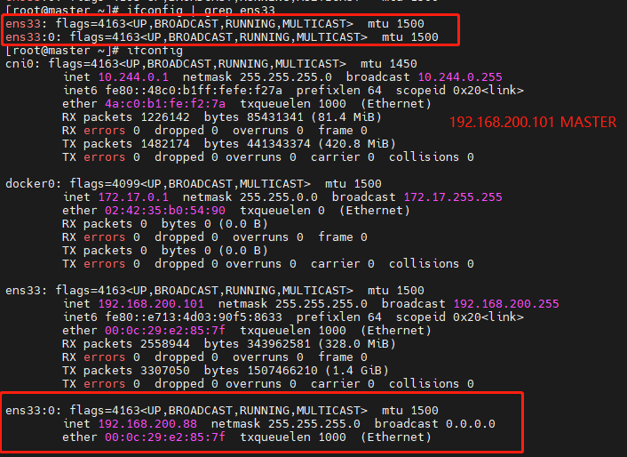

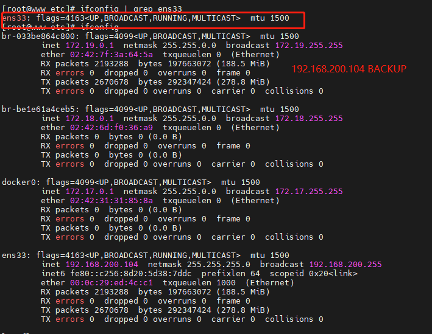

（2）LVS主服务宕机测试

使用ifconfig 网卡名 down命令，关闭主服务器网卡，此时主服务器不能提供服务。观察备份服务器是否将VIP绑定到自己，以及客户端是否可以继续正常访问。如下: 关闭主服务器网卡

```shell
# ifconfig ens33 down 
或关闭keepalived服务
systemctl stop keepalived
```

- Q101 MASTER 宕机

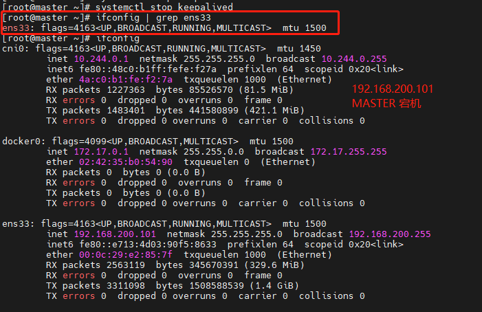

- Q104 BACKUP->MASTER 


- 观察客户端（Q105）是否可以继续正常访问

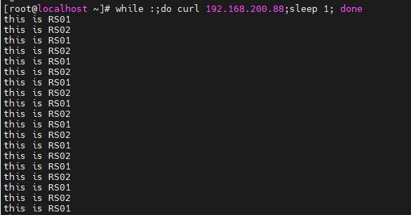

（3）测试lvs主服务器恢复 上述测试通过后，可以开启主服务器网卡，让其能够提供服务，然后观察VIP是否会回到主服务器。 开启主服务器网卡

```shell
# ifconfig ens33 up 
或关闭keepalived服务
systemctl start keepalived
```
