# MySQl的Explain

### 1. 数据准备

```sql
create table subject(
 id int(10) auto_increment,
 name varchar(20),
 teacher_id int(10),
 primary key (id),
 index idx_teacher_id (teacher_id));
 
create table teacher(
 id int(10) auto_increment,
 name varchar(20),
 teacher_no varchar(20),
 primary key (id),
 unique index unx_teacher_no (teacher_no(20)));
 
 create table student(
 id int(10) auto_increment,
 name varchar(20),
 student_no varchar(20),
 primary key (id),
 unique index unx_student_no (student_no(20)));
 
 create table student_score(
 id int(10) auto_increment,
 student_id int(10),
 subject_id int(10),
 score int(10),
 primary key (id),
 index idx_student_id (student_id),
 index idx_subject_id (subject_id));
 
 alter table teacher add index idx_name(name(20));
 
 
 insert into student(name,student_no) values ('zhangsan','20200001'),('lisi','20200002'),('yan','20200003'),('dede','20200004');
 
 insert into teacher(name,teacher_no) values('wangsi','T2010001'),('sunsi','T2010002'),('jiangsi','T2010003'),('zhousi','T2010004');
 
 insert into subject(name,teacher_id) values('math',1),('Chinese',2),('English',3),('history',4);
 
insert into student_score(student_id,subject_id,score) values(1,1,90),(1,2,60),(1,3,80),(1,4,100),(2,4,60),(2,3,50),(2,2,80),(2,1,90),(3,1,90),(3,4,100),(4,1,40),(4,2,80),(4,3,80),(4,5,100);
```

### 2. Explain的用途

- 表的读取顺序如何
- 数据读取操作有哪些操作类型
- 哪些索引可以使用
- 哪些索引被实际使用
- 表之间是如何引用
- 每张表有多少行被优化器查询

### 3. Explain的执行效果

```sql
 explain select * from teacher where
```


### 4. Explain字段


-  id：select查询的序列号，包含一组数字，表示查询中执行select子句或操作表的顺序
-  select_type：查询类型
-  table ：正在访问哪个表
-  partitions ：匹配的分区
-  type ：访问的类型
-  possible_keys ：显示可能应用在这张表中的索引，一个或多个，但不一定实际使用到
-  key：实际使用到的索引，如果为NULL，则没有使用索引
-  key_len ：表示索引中使用的字节数，可通过该列计算查询中使用的索引的长度,不损失精确度的情况下，长度越短越好;key_len显示的值为索引字段最大的可能长度，并非实际使用长度
   即key_len是根据定义计算而得，不是通过表内检索出的
-  ref ：显示索引的哪一列被使用了，如果可能的话，是一个常数，哪些列或常量被用于查找索引列上的值
-  rows：根据表统计信息及索引选用情况，大致估算出找到所需的记录所需读取的行数
-  filtered ：查询的表行占表的百分比
-  Extra ：包含不适合在其它列中显示但十分重要的额外信息

#### 4.1 id字段

- id相同

  执行顺序从上至下

  ```sql
  # 读取顺序：subject > teacher > student_score
  explain select subject.* from subject,student_score,teacher where subject.id = student_id and subject.teacher_id = teacher.id;
  ```

  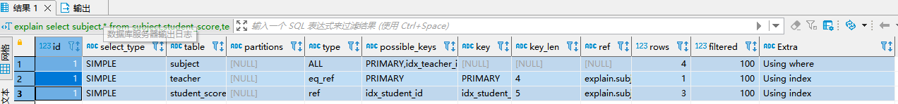

- id不同

  如果是子查询，id的序号会递增，id的值越大优先级越高，越先被执行

  ```sql
  # 读取顺序： teacher > subject >student_score
  explain select score.* from student_score as score where subject_id = (select id from subject where teacher_id = (select id from teacher where id = 2));
  ```

  

- id既有相同又有不同

  id如果相同，可以认为是一组，从上往下顺序执行
  在所有组中，id值越大，优先级越高，越先执行

  ```sql
  # 2.teacher > 2.subject > 1.subject > 1.teacher
  explain 
  select subject.* 
  from subject 
  left join teacher 
  on subject.teacher_id = teacher.id
  union
  select subject.* 
  from subject 
  right join teacher 
  on subject.teacher_id = teacher.id;
  ```

#### 4.2 select_type字段

- SIMPLE

  简单查询，不包含子查询或Union查询

  ```sql
  explain select subject.* from subject,student_score,teacher where subject.id = student_id and subject.teacher_id = teacher.id;
  ```

  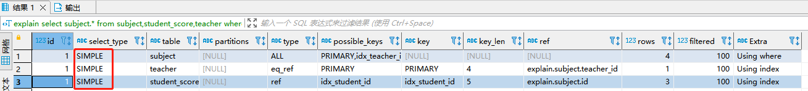

- PRIMARY 

  查询中若包含任何复杂的子部分，最外层查询则被标记为主查询

- SUBQUERY

  在select或where中包含子查询

  ```sql
  explain select score.* from student_score as score where subject_id = (select id from subject where teacher_id = (select id from teacher where id = 2));
  ```

  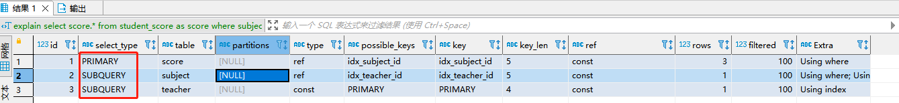

- DERIVED

  在FROM列表中包含的子查询被标记为DERIVED（衍生），MySQL会递归执行这些子查询，把结果放在临时表中
  备注：
  MySQL5.7+ 进行优化了，增加了derived_merge（派生合并），默认开启，可加快查询效率

- UNION ：

  若第二个select出现在uion之后，则被标记为UNION

- UNION RESULT

  从UNION表获取结果的select

  ```sql
  explain select subject.* from subject left join teacher on subject.teacher_id = teacher.id
  union 
  select subject.* from subject right join teacher on subject.teacher_id = teacher.id;
  ```

  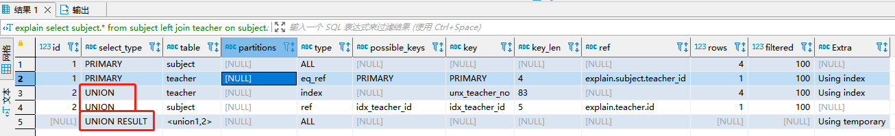

#### 4.3 type字段

> //最好到最差NULL>system>const>eq_ref>ref>fulltext>ref_or_null>index_merge>unique_subquery>index_subquery>range>index>ALL 
> 备注：掌握以下10种常见的即可
> NULL>system>const>eq_ref>ref>ref_or_null>index_merge>range>index>ALL

- NULL

  MySQL能够在优化阶段分解查询语句，在执行阶段用不着再访问表或索引

  ```sql
  explain select min(id) from subject;
  ```

  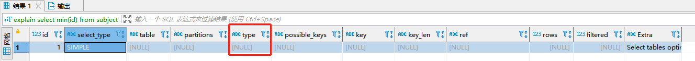

  

- system

  表只有一行记录（等于系统表），这是const类型的特列，平时不大会出现，可以忽略

- const

  表示通过索引一次就找到了，const用于比较primary key或uique索引，因为只匹配一行数据，所以很快，如主键置于where列表中，MySQL就能将该查询转换为一个常量

  ```sql
  explain select * from teacher where teacher_no = 'T2010001';
  ```

  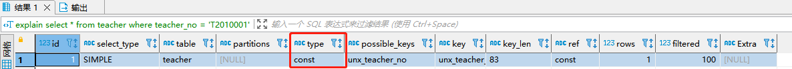

- eq_ref

  唯一性索引扫描，对于每个索引键，表中只有一条记录与之匹配，常见于主键或唯一索引扫描

  ```sql
  explain select subject.* from subject left join teacher on subject.teacher_id = teacher.id;
  ```

  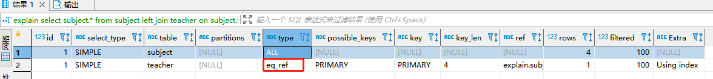

- ref

  非唯一性索引扫描，返回匹配某个单独值的所有行
  本质上也是一种索引访问，返回所有匹配某个单独值的行,然而可能会找到多个符合条件的行，应该属于查找和扫描的混合体

  ```sql
  explain select subject.* from subject,student_score,teacher where subject.id = student_id and subject.teacher_id = teacher.id;
  ```

  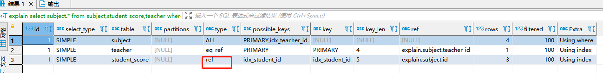

- ref_or_null

  类似ref，但是可以搜索值为NULL的行

  ```sql
  explain select * from teacher where name = 'wangsi' or name is null;
  ```

  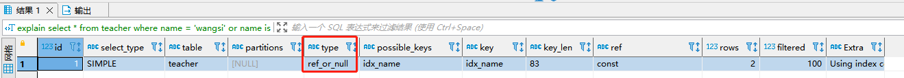

- index_merge

  表示使用了索引合并的优化方法

  ```sql
  # id、tearcher_no为两个单索引
  explain select * from teacher where id = 1 or teacher_no = 'T2010001' 
  ```

  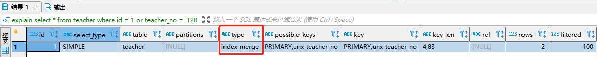

- range

  只检索给定范围的行，使用一个索引来选择行，key列显示使用了哪个索引，一般就是在你的where语句中出现between、<>、in等的查询。

  ```sql
  explain select * from subject where id between 1 and 3;
  ```

  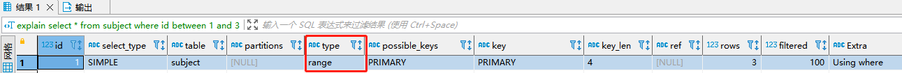

- index

  Full index Scan，Index与All区别

  index只遍历索引树，通常比All快
  因为索引文件通常比数据文件小，也就是虽然all和index都是读全表，但index是从索引中读取的，而all是从硬盘读的。

  ```sql
  explain select id from subject;
  ```

  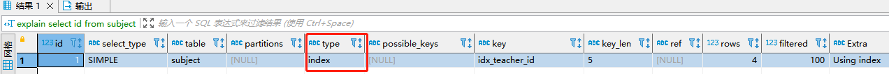

- all

  Full Table Scan，将遍历全表以找到匹配行

  ```sql
  explain select * from subject;
  ```

  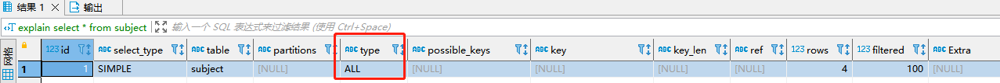

#### 4.4 Extra字段

包含不适合在其它列中显示但十分重要的额外信息

- Using filesort

  说明MySQL会对数据使用一个外部的索引排序，而不是按照表内的索引顺序进行读取
  MySQL中无法利用索引完成的排序操作称为“文件排序”

  ```sql
  explain select * from subject order by name;
  ```

  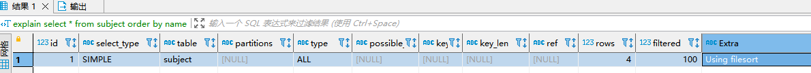

- Using temporary

  使用了临时表保存中间结果，MySQL在对结果排序时使用临时表，常见于排序order by 和分组查询group by

  ```sql
  explain select subject.* from subject left join teacher on subject.teacher_id = teacher.id
   union 
   select subject.* from subject right join teacher on subject.teacher_id = teacher.id;
  ```

  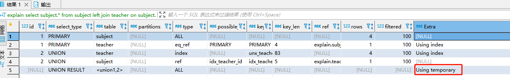

- Using index

  表示相应的select操作中使用了覆盖索引（Covering Index）,避免访问了表的数据行，效率不错！
  如果同时出现using where，表明索引被用来执行索引键值的查找；
  如果没有同时出现using where，表明索引用来读取数据而非执行查找动作；

  ```sql
  explain select subject.* from subject,student_score,teacher where subject.id = student_id and subject.teacher_id = teacher.id;
  ```

  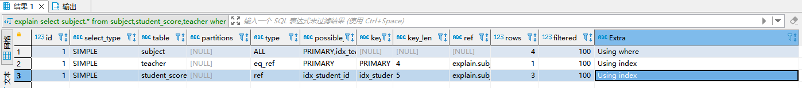

- Using Where

  ```sql
  explain select * from subject  where name = 'math'
  ```

  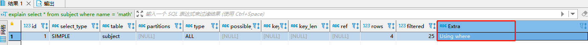

- Using join buffer

  使用了连接缓存

  ```sql
  explain select student.*,teacher.*,subject.* from student,teacher,subject;
  ```

  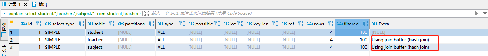

- impossible where

  where子句的值总是false，不能用来获取任何元组

  ```sql
  explain select * from teacher where name = 'wangsi' and name = 'lisi';
  ```

  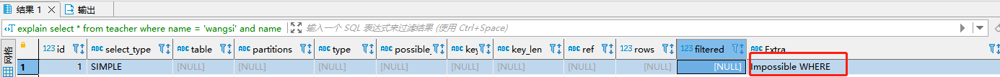

- distinct

  一旦mysql找到了与行相联合匹配的行，就不再搜索了

  ```sql
  explain select distinct teacher.name from teacher left join subject on teacher.id = subject.teacher_id;
  ```

  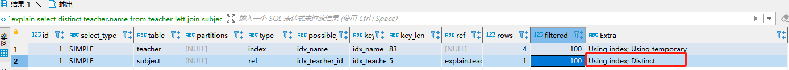

- Select tables optimized away

  SELECT操作已经优化到不能再优化了（MySQL根本没有遍历表或索引就返回数据了）

  ```sql
  explain select min(id) from subject;
  ```

  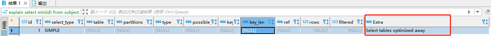
