# 索引

## 一、索引

### 1.索引是什么

- 索引（Index）是帮助 MySQL 高效获取数据的数据结构，所以说**索引的本质是：数据结构**
- 索引的目的在于提高查询效率，可以类比字典、 火车站的车次表、图书的目录等 。
- 可以简单的理解为“排好序的快速查找数据结构”，数据本身之外，**数据库还维护者一个满足特定查找算法的数据结构**，这些数据结构以某种方式引用（指向）数据，这样就可以在这些数据结构上实现高级查找算法。这种数据结构，就是索引。

常见的索引模型其实有很多，哈希表、有序数组，各种搜索树都可以实现索引结构。

下图是一种索引方式的示例（二叉搜索树）

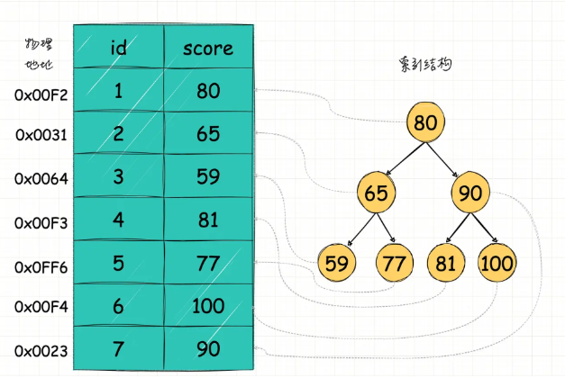

说明：

上图左边是一张简单的`学生成绩表`，只有学号 id 和成绩 score 两列（最左边的是数据的物理地址）

Eg：我们想要快速查指定成绩的学生，通过构建一个右边的二叉搜索树当索引，索引节点就是成绩数据，节点指向对应数据记录物理地址的指针，这样就可以运用二叉查找在一定的复杂度内获取到对应的数据，从而快速检索出符合条件的学生信息。

注：索引本身很大，不可能全部存储在内存中，**一般以索引文件的形式存储在磁盘上**

### 2. 优势

- 索引大大减少了服务器需要扫描的数据量（提高数据检索效率）
- 索引可以帮助服务器避免排序和临时表（降低数据排序的成本，降低 CPU 的消耗）
- 索引可以将随机 I/O 变为顺序 I/O（降低数据库 IO 成本）

### 3. 劣势

- 索引也是一张表，保存了主键和索引字段，并指向实体表的记录，所以也需要占用内存
- 虽然索引大大提高了查询速度，同时却会降低更新表的速度，如对表进行 INSERT、UPDATE 和 DELETE。 因为更新表时，MySQL 不仅要保存数据，还要保存一下索引文件每次更新添加了索引列的字段，都会调整因为更新所带来的键值变化后的索引信息

### 4. 索引分类

**从逻辑角度**

- 主键索引：主键索引是一种特殊的唯一索引，不允许有空值
- 普通索引或者单列索引：每个索引只包含单个列，一个表可以有多个单列索引
- 多列索引（复合索引、联合索引）：复合索引指多个字段上创建的索引，只有在查询条件中使用了创建索引时的第一个字段，索引才会被使用。
- 唯一索引或者非唯一索引
- Full-Text 全文索引：它查找的是文本中的关键词，而不是直接比较索引中的值
- 空间索引：空间索引是对空间数据类型的字段建立的索引

**数据结构角度**

- Hash 索引：主要就是通过 Hash 算法，将数据库字段数据转换成定长的 Hash 值，与这条数据的行指针一并存入 Hash 表的对应位置；如果发生 Hash 碰撞，则在对应 Hash 键下以链表形式存储。查询时，就再次对待查关键字再次执行相同的 Hash 算法，得到 Hash 值，到对应 Hash 表对应位置取出数据即可，Memory 引擎又是支持非唯一哈希索引的，如果发生 Hash 碰撞，会以链表的方式存放多个记录在同一哈希条目中。使用 Hash 索引的数据库并不多， 目前有 Memory 引擎和 NDB 引擎支持 Hash 索引。**缺点是，**只支持等值比较查询，像 = 、 in() 这种，不支持范围查找，比如 where id > 10 这种，也不能排序。
- B+树索引（默认为B+树索引）

**从物理存储角度**

​	聚集索引和非聚集索引都是 B+ 树结构

- 聚集索引（clustered index）
- 非聚集索引（non-clustered index），也叫辅助索引（secondary index）

## 二、索引结构

索引可以有很多种结构类型，这样可以为不同的场景提供更好的性能。

**首先要明白索引（index）是在存储引擎（storage engine）层面实现的，而不是 server 层面**。不是所有的存储引擎都支持所有的索引类型。即使多个存储引擎支持某一索引类型，它们的实现和行为也可能有所差别。

面试小问：

**MySQL 为什么不用 Hash 结构做索引?**

MySQL 也会用 Hash 做索引，Memory 存储引擎就支持 Hash 索引。只是场景用的少，Hash 结构更适用于只有等值查询的场景

**为什么不用二叉搜索树呢？**

二叉树的叉叉上只有两个数，数据量太多的话，那得多少层呀。

### 1. 磁盘IO与预读

磁盘读取数据靠的是机械运动，每次读取数据花费的时间可以分为寻道时间、旋转延迟、传输时间三个部分

- 寻道时间指的是磁臂移动到指定磁道所需要的时间，主流磁盘一般在5ms以下；
- 旋转延迟就是我们经常听说的磁盘转速，比如一个磁盘7200转，表示每分钟能转7200次，也就是说1秒钟能转120次，旋转延迟就是1/120/2 = 4.17ms；
- 传输时间指的是从磁盘读出或将数据写入磁盘的时间，一般在零点几毫秒，相对于前两个时间可以忽略不计。那么访问一次磁盘的时间，即一次磁盘IO的时间约等于5+4.17 = 9ms左右

听起来还挺不错的，但要知道一台500 -MIPS的机器每秒可以执行5亿条指令，因为指令依靠的是电的性质，换句话说执行一次IO的时间可以执行40万条指令，数据库动辄十万百万乃至千万级数据，每次9毫秒的时间，显然是个灾难。下图是计算机硬件延迟的对比图，供大家参考：

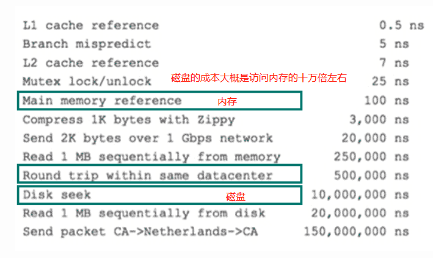

考虑到磁盘IO是非常高昂的操作，计算机操作系统做了一些优化，当一次IO时，不光把当前磁盘地址的数据，而是把相邻的数据也都读取到内存缓冲区内，因为局部预读性原理告诉我们，当计算机访问一个地址的数据的时候，与其相邻的数据也会很快被访问到。每一次IO读取的数据我们称之为一页(page)。具体一页有多大数据跟操作系统有关，一般为4k或8k，也就是我们读取一页内的数据时候，实际上才发生了一次IO，这个理论对于索引的数据结构设计非常有帮助。

参考：https://tech.meituan.com/

### 2. B树与B+树

> 有一点面试经验的同学，可能都碰到过这么一道面试题：MySQL InnoDB 索引为什么用 B+ 树，不用 B 树
>
> B-Tree == B Tree，他两是一个东西，没有 B 减树 这玩意 

#### 2.1 概念

**B 树**：内部（非叶子）节点可以拥有可变数量的子节点（数量范围预先定义好）。当数据被插入或从一个节点中移除，它的子节点数量发生变化。为了维持在预先设定的数量范围内，内部节点可能会被合并或者分离。因为子节点数量有一定的允许范围，所以B 树不需要像其他自平衡查找树那样频繁地重新保持平衡，但是由于节点没有被完全填充，可能浪费了一些空间。子节点数量的上界和下界依特定的实现而设置。例如，在一个 2-3 B树（通常简称[2-3树](https://link.juejin.cn?target=https%3A%2F%2Fzh.wikipedia.org%2Fwiki%2F2-3树)），每一个内部节点只能有 2 或 3 个子节点。

**B 树中每一个内部节点会包含一定数量的键，键将节点的子树分开**。例如，如果一个内部节点有 3 个子节点（子树），那么它就必须有两个键： *a*1 和 *a*2 。左边子树的所有值都必须小于 *a*1 ，中间子树的所有值都必须在 *a*1 和 *a*2 之间，右边子树的所有值都必须大于 *a*2 。

在存取节点数据所耗时间远超过处理节点数据所耗时间的情况下，Ｂ树在可选的实现中拥有很多优势，因为存取节点的开销被分摊到里层节点的多次操作上。这通常出现在当节点存储在二级存储器如硬盘存储器上。通过最大化内部里层节点的子节点的数量，树的高度减小，存取节点的开销被缩减。另外，重新平衡树的动作也更少出现。子节点的最大数量取决于，每个子节点必需存储的信息量，和完整磁盘块的大小或者二次存储器中类似的容量。虽然 2-3 树更易于解释，实际运用中，Ｂ树使用[二级存储器](https://link.juejin.cn?target=https%3A%2F%2Fzh.wikipedia.org%2Fw%2Findex.php%3Ftitle%3D二级存储器%26action%3Dedit%26redlink%3D1)，需要大量数目的子节点来提升效率。

 **B+ 树：** 是 B 树的变种，B+ 树结构，所有的数据都存放在叶子节点上，且把叶子节点通过指针连接到一起，形成了一条数据链表，以加快相邻数据的检索效率。

#### 2.2 区别

将 `[11,13,15,16,20,23,25,30,23,27]` 用 B 树 和 B+ 树存储，看下结构

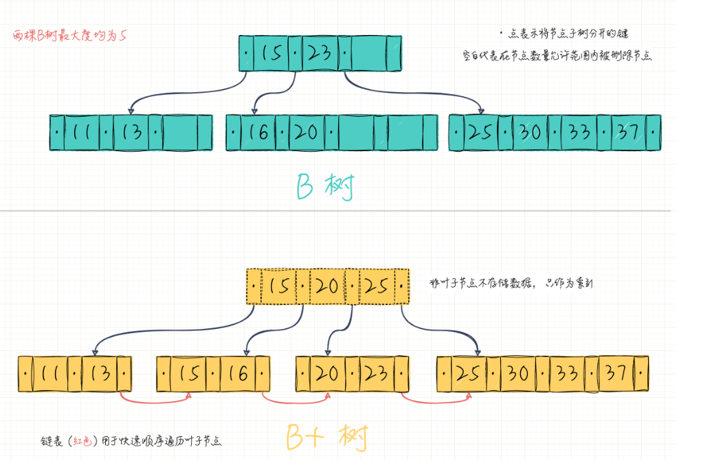


B-Tree 和 B+Tree 都是为磁盘等外存储设备设计的一种平衡查找树。

| 关键词                           | B树                                                          | B+树                                                         | 备注                                |
| -------------------------------- | ------------------------------------------------------------ | ------------------------------------------------------------ | ----------------------------------- |
| 最大分支，最小分支               | 每个结点最多有m个分支（子树），最少⌈m/2⌉（中间结点）个分支或者2个分支（是根节点非叶子结点）。 | 同左                                                         | m阶对应的就是就是最大分支           |
| n个关键字与分支的关系            | 分支等于n+1                                                  | 分支等于n                                                    | 无                                  |
| 关键字个数（B+树关键字个数要多） | 大于等于⌈m/2⌉-1小于等于m-1                                   | 大于等于⌈m/2⌉小于等于m                                       | B+树关键字个数要多，+体现在的地方。 |
| 叶子结点相同点                   | 每个节点中的元素互不相等且按照从小到大排列；所有的叶子结点都位于同一层。 | 同左                                                         | 无                                  |
| 叶子结点不相同                   | 不包含信息                                                   | 叶子结点包含信息，指针指向记录。                             | 无                                  |
| 叶子结点之间的关系               | 无                                                           | B+树上有一个指针指向关键字最小的叶子结点，所有叶子节点之间链接成一个线性链表 | 无                                  |
| 非叶子结点                       | 一个关键字对应一个记录的存储地址                             | 只起到索引的作用                                             | 无                                  |
| 存储结构                         | 相同                                                         | 同左                                                         | 无                                  |

#### 2.3 B+树相关问题

**（1）为什么要用 B+ 树**

心里有了磁盘 IO 和 B 树的概念，接下来就顺理成章了。磁盘 IO 次数越少，那查询效率肯定就越高。而 IO 次数又取决于 B+ 树的高度

我们以 InnoDB 存储引擎来说明。

系统从磁盘读取数据到内存时是以磁盘块（block）为基本单位的，位于同一个磁盘块中的数据会被一次性读取出来，而不是需要什么取什么。

InnoDB 存储引擎中有页（Page）的概念，页是其磁盘管理的最小单位。InnoDB 存储引擎中默认每个页的大小为16KB，可通过参数 `innodb_page_size` 将页的大小设置为 4K、8K、16K，在 MySQL 中可通过如下命令查看页的大小：`show variables like 'innodb_page_size';`

而系统一个磁盘块的存储空间往往没有这么大，因此 InnoDB 每次申请磁盘空间时都会是若干地址连续磁盘块来达到页的大小 16KB。InnoDB 在把磁盘数据读入到磁盘时会以页为基本单位，在查询数据时如果一个页中的每条数据都能有助于定位数据记录的位置，这将会减少磁盘 I/O 次数，提高查询效率。

**例如**

索引是为了更快的查询到数据，MySQL 数据行可能会很多内容

以范围查找为例简单看下，B Tree 结构查询 [10-25] 的数据（从根节点开始，随机查找一样的道理，只是我画的图只有 2 层，说服力强的不是那么明显罢了）

1. 加载根节点，第一个节点元素15，大于10【磁盘 I/O 操作第 1 次】
2. 通过根节点的左子节点地址加载，找到 11，13【磁盘 I/O 操作第 2 次】
3. 重新加载根节点，找到中间节点数据 16，20【磁盘 I/O 操作第 3 次】
4. 再次加载根节点，23 小于 25，再加载右子节点，找到 25，结束【磁盘 I/O 操作第 4 次】

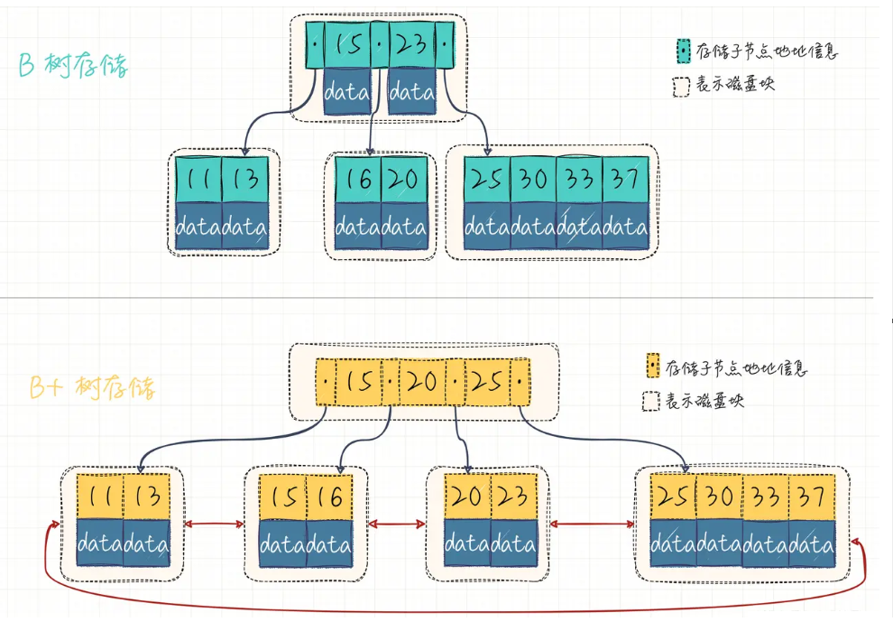

而 B+ 树对范围查找就简单了，数据都在最下边的叶子节点下，而且链起来了，我只需找到第一个然后遍历就行（暂且不考虑页分裂等其他问题）。

**（2）为什么 MySQL 索引要用 B+ 树不是 B 树？**

B+Tree 是在 B-Tree 基础上的一种优化，使其更适合实现外存储索引结构。

用 B+ 树不用 B 树考虑的是 IO 对性能的影响，B 树的每个节点都存储数据，而 B+ 树只有叶子节点才存储数据，所以查找相同数据量的情况下，B 树的高度更高，IO 更频繁。数据库索引是存储在磁盘上的，当数据量大时，就不能把整个索引全部加载到内存了，只能逐一加载每一个磁盘页（对应索引树的节点）。其中在 MySQL 底层对 B+ 树进行进一步优化：**在叶子节点中是双向链表，且在链表的头结点和尾节点也是循环指向的**。

B-Tree 结构图每个节点中不仅要包含数据的 key 值，还有 data 值。而每一个页的存储空间是有限的，如果 data 数据较大时将会导致每个节点（即一个页）能存储的 key 的数量很小，当存储的数据量很大时同样会导致 B-Tree 的深度较大，增大查询时的磁盘 I/O 次数，进而影响查询效率。在 B+Tree 中，**所有数据记录节点都是按照键值大小顺序存放在同一层的叶子节点上**，而非叶子节点上只存储 key 值信息，这样可以大大加大每个节点存储的 key 值数量，降低 B+Tree 的高度。

> IO 次数取决于 B+ 数的高度 h，假设当前数据表的数据为 N，每个磁盘块的数据项的数量是 m，则有 `h=㏒(m+1)N`，当数据量 N 一定的情况下，m 越大，h 越小；而 `m = 磁盘块的大小 / 数据项的大小`，磁盘块的大小也就是一个数据页的大小，是固定的，如果数据项占的空间越小，数据项的数量越多，树的高度越低。这就是为什么每个数据项，即索引字段要尽量的小，比如 int 占 4 字节，要比 bigint 8 字节少一半。这也是为什么 B+ 树要求把真实的数据放到叶子节点而不是内层节点，一旦放到内层节点，磁盘块的数据项会大幅度下降，导致树增高。当数据项等于 1 时将会退化成线性表。

## 三、MyISAM 和 InnoDB 索引原理

#### 1. MYISAM

MyISAM 引擎的索引文件和数据文件是分离的。**MyISAM 引擎索引结构的叶子节点的数据域，存放的并不是实际的数据记录，而是数据记录的地址**。索引文件与数据文件分离，这样的索引称为“**非聚簇索引**”。MyISAM 的主索引与辅助索引区别并不大，主键索引就是一个名为 PRIMARY 的唯一非空索引。

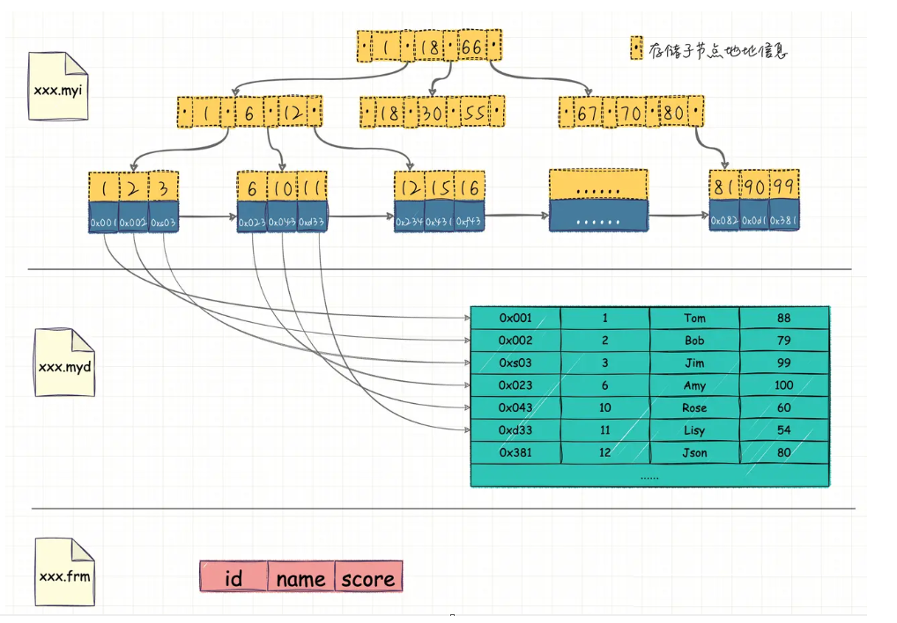

- 在 MyISAM 中，索引（含叶子节点）存放在单独的 `.myi` 文件中，叶子节点存放的是数据的物理地址偏移量（通过偏移量访问就是随机访问，速度很快）。
- 主索引是指主键索引，键值不可能重复；辅助索引则是普通索引，键值可能重复。
- 通过索引查找数据的流程：先从索引文件中查找到索引节点，从中拿到数据的文件指针，再到数据文件中通过文件指针定位了具体的数据。

辅助索引类似。

#### 2. InnoDB

**InnoDB 引擎索引结构的叶子节点的数据域，存放的就是实际的数据记录**（对于主索引，此处会存放表中所有的数据记录；对于辅助索引此处会引用主键，检索的时候通过主键到主键索引中找到对应数据行），或者说，**InnoDB 的数据文件本身就是主键索引文件**，这样的索引被称为**聚簇索引**，一个表只能有一个聚簇索引。

##### 2.1 主键索引

我们知道 InnoDB 索引是聚集索引，它的索引和数据是存入同一个 `.idb` 文件中的，因此它的索引结构是在同一个树节点中同时存放索引和数据，如下图中最底层的叶子节点有三行数据，对应于数据表中的 id、name、score 数据项。

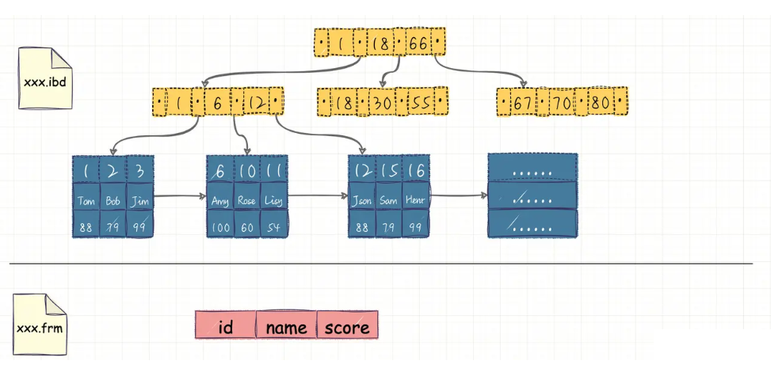

在 Innodb 中，索引分叶子节点和非叶子节点，非叶子节点就像新华字典的目录，单独存放在索引段中，叶子节点则是顺序排列的，在数据段中。

InnoDB 的数据文件可以按照表来切分（只需要开启`innodb_file_per_table)`，切分后存放在`xxx.ibd`中，不切分存放在 `xxx.ibdata`中。

>从 MySQL 5.6.6 版本开始，innodb_file_per_table的默认值就是 ON 了。
>
>扩展点：建议将这个值设置为 ON。因为，一个表单独存储为一个文件更容易管理，而且在你不需要这个表的时候，通过 drop table 命令，系统就会直接删除这个文件。而如果是放在共享表空间中，即使表删掉了，空间也是不会回收的。
>
>所以会碰到这种情况，数据库占用空间太大后，把一个最大的表删掉了一半的数据，表文件的大小还是没变~

##### 2.2 非主键索引

这次我们以示例中学生表中的 name 列建立辅助索引，它的索引结构跟主键索引的结构有很大差别，在最底层的叶子结点有两行数据，第一行的字符串是辅助索引，按照 ASCII 码进行排序，第二行的整数是主键的值。

这就意味着，对 name 列进行条件搜索，需要两个步骤：

- 在辅助索引上检索 name，到达其叶子节点获取对应的主键；
- 使用主键在主索引上再进行对应的检索操作

这也就是所谓的“**回表查询**”

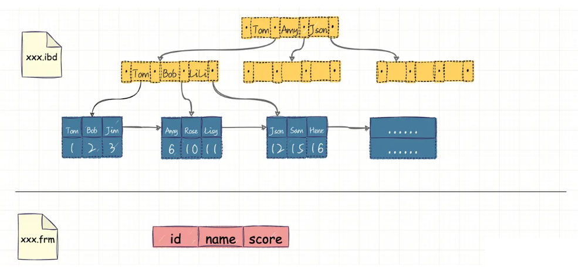

**InnoDB 索引结构需要注意的点**

- 数据文件本身就是索引文件
- 表数据文件本身就是按 B+Tree 组织的一个索引结构文件
- 聚集索引中叶节点包含了完整的数据记录
- InnoDB 表必须要有主键，并且推荐使用整型自增主键

正如我们上面介绍 InnoDB 存储结构，索引与数据是共同存储的，不管是主键索引还是辅助索引，在查找时都是通过先查找到索引节点才能拿到相对应的数据，如果我们在设计表结构时没有显式指定索引列的话，MySQL 会从表中选择数据不重复的列建立索引，如果没有符合的列，则 MySQL 自动为 InnoDB 表生成一个隐含字段作为主键，并且这个字段长度为 6 个字节，类型为整型。

#### 3. MyISAM与InnoDB区别

- innodb支持事务，而myisam不支持事务。
- innodb支持外键，而myisam不支持外键。
- innodb默认表锁，使用索引检索条件时是行锁，而myisam是表锁（每次更新增加删除都会锁住表）。
- innodb和myisam的索引都是基于b+树，但他们具体实现不一样，innodb的b+树的叶子节点是存放数据的，myisam的b+树的叶子节点是存放指针的。
- innodb是聚簇索引，必须要有主键，一定会基于主键查询，但是辅助索引就会查询两次，myisam是非聚簇索引，索引和数据是分离的，索引里保存的是数据地址的指针，主键索引和辅助索引是分开的。
- innodb不存储表的行数，所以select count( * )的时候会全表查询，而myisam会存放表的行数，select count(*）的时候会查的很快。

**总结：**mysql默认使用innodb，如果要用事务和外键就使用innodb，如果这张表只用来查询，可以用myisam。如果更新删除增加频繁就使用innodb。

### 四、索引策略

### 1. 哪些情况需要创建索引

- 主键自动建立唯一索引
- 频繁作为查询条件的字段
- 查询中与其他表关联的字段，外键关系建立索引
- 单键/组合索引的选择问题，who? 高并发下倾向创建组合索引
- 查询中排序的字段，排序字段通过索引访问大幅提高排序速度
- 查询中统计或分组字段

### 2. 哪些情况不要创建索引

- 表记录太少
- 经常增删改的表
- 数据重复且分布均匀的表字段，只应该为最经常查询和最经常排序的数据列建立索引（如果某个数据类包含太多的重复数据，建立索引没有太大意义）
- 频繁更新的字段不适合创建索引（会加重IO负担）
- where 条件里用不到的字段不创建索引

### 3. 高效索引

**如果查询中的列不是独立的，MySQL 就不会使用索引**。

“独立的列”是指索引不能是表达式的一部分，也不能是函数的参数。

```sql
explain select * FROM student where id = 2
```

在student 表中，id 是主键，有主键索引，索引 explain 出来结果就是：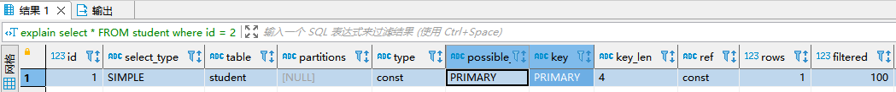

可见这次查询使用了PRIMARY KEY来优化查询

如果变成这样：

```sql
explain select * FROM student where id + 1 = 3
```

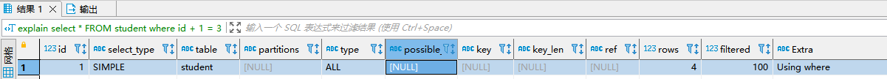

### 4. 前缀索引

前缀索引其实就是对文本的前几个字符（具体是几个字符在建立索引时指定）建立索引，这样建立起来的索引占用空间更小，所以查询更快。

```sql
ALTER TABLE table_name ADD KEY(column_name(prefix_length));
ALTER TABLE table_name ADD index index_name(column_name(prefix_length));
```

对于内容很长的列，比如 blob, text 或者很长的 varchar 列，必须使用前缀索引，MySQL 不允许索引这些列的完整长度。

所以问题就在于要选择合适长度的前缀，即 prefix_length。前缀太短，选择性太低，前缀太长，索引占用空间太大。

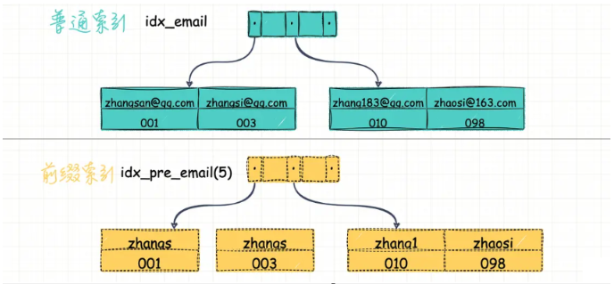

比如上图中，两个不同的索引同样执行下面的语句

```sql
select id,name,email from user where emai='zhangsan@qq.com' 
```

执行效果会有很大的差别

- 普通索引 `idx_email` 找到满足条件的记录后，再返回主键索引取出数据即可
- 前缀索引会多次查到 `zhangs`，然后返回主键索引取出数据进行对比，会扫描多次数据行。

如果前缀索引取前 7 个字节构建的话 `idx_pre_email(7)`，就只需要扫描一行。

所以使用前缀索引，定义好长度，就可以做到既节省空间，又不用额外增加太多的查询成本。为了决定前缀的合适长度，需要找到最常见的值的列表，然后和最常见的前缀列进行

**注：**前缀索引是一种能使索引更小、更快的有效办法，但另一方面也有缺点：MySQL 无法使用前缀索引做 ORDER BY 和 GROUP BY，也无法使用前缀索引做『覆盖索引』。

### 5. 覆盖索引

**覆盖索引**（Covering Index），或者叫索引覆盖， 也就是平时所说的**不需要回表操作**，即 select 的数据列只用从索引中就能够取得，不必读取数据行，MySQL 可以利用索引返回 select 列表中的字段，而不必根据索引再次读取数据文件，换句话说**查询列要被所建的索引覆盖**。

索引是高效找到行的一个方法，但是一般数据库也能使用索引找到一个列的数据，因此它不必读取整个行。毕竟索引叶子节点存储了它们索引的数据，当能通过读取索引就可以得到想要的数据，那就不需要读取行了。一个索引包含（覆盖）满足查询结果的数据就叫做覆盖索引。

**判断标准**

使用 explain，可以通过输出的 extra 列来判断，对于一个索引覆盖查询，显示为 **using index**，MySQL 查询优化器在执行查询前会决定是否有索引覆盖查询

例如：id，teacher_id为复合索引时

```sql
explain SELECT id,teacher_id  FROM  subject 
```


而以下情况则需要回表

```sql
explain SELECT id,name,teacher_id  FROM  subject where id = 1
```

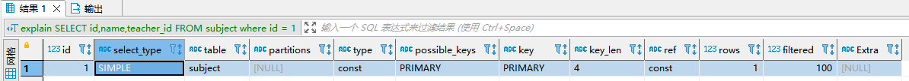


### 5. 复合索引

组合索引(concatenated index)：由多个列构成的索引，如 `create index idx_emp on emp(col1, col2, col3, ……)`，则我们称 idx_emp 索引为组合索引。

**在多个列上建立独立的单列索引大部分情况下并不能提高 MySQL 的查询性能**。对于下面的查询 where 条件，这两个单列索引都是不好的选择：

```sql
SELECT user_id,user_name FROM mydb.sys_user where user_id = 1 or user_name = 'zhang3';
```

MySQL 5.0 版本之前，MySQL 会对这个查询使用全表扫描，除非改写成两个查询 UNION 的方式。

MySQL 5.0 和后续版本引入了一种叫做“**索引合并**”的策略，查询能够同时使用这两个单列索引进行扫描，并将结果合并。这种算法有三个变种：OR 条件的联合（union），AND 条件的相交（intersection），组合前两种情况的联合及相交。索引合并策略有时候是一种优化的结果，但实际上更多时候说明了表上的索引建得很糟糕：

- 当出现服务器对多个索引做相交操作时（多个AND条件），通常意味着需要一个包含所有相关列的多列索引，而不是多个独立的单列索引。
- 当出现服务器对多个索引做联合操作时（多个OR条件），通常需要耗费大量的 CPU 和内存资源在算法的缓存、排序和合并操作上。特别是当其中有些索引的选择性不高，需要合并扫描返回的大量数据的时候。
- 如果在 explain 中看到有索引合并(Using Merge?)，应该好好检查一下查询和表的结构，看是不是已经是最优的。

#### 6. 最左前缀原则

在组合索引中有一个重要的概念：引导列(leading column)，在上面的例子中，col1 列为引导列。当我们进行查询时可以使用 ”where col1 = ? ”，也可以使用 ”where col1 = ? and col2 = ?”，这样的限制条件都会使用索引，但是”where col2 = ? ”查询就不会使用该索引。**所以限制条件中包含先导列时，该限制条件才会使用该组合索引。**

举个栗子：

当 B+ 树的数据项是复合的数据结构，比如(name,age,sex)的时候，B+ 树是按照从左到右的顺序来建立搜索树的，比如当(张三,20,F)这样的数据来检索的时候，B+ 树会优先比较 name 来确定下一步的所搜方向，如果 name 相同再依次比较 age 和 sex，最后得到检索的数据；但当 (20,F) 这样的没有 name 的数据来的时候，B+ 树就不知道下一步该查哪个节点，因为建立搜索树的时候 name 就是第一个比较因子，必须要先根据 name 来搜索才能知道下一步去哪里查询。比如当 (张三,F) 这样的数据来检索时，B+ 树可以用 name 来指定搜索方向，但下一个字段 age 的缺失，所以只能把名字等于张三的数据都找到，然后再匹配性别是 F 的数据了， 这个是非常重要的性质，即**索引的最左匹配特性**。

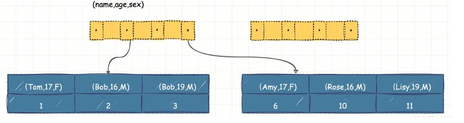

可以看到，索引项是按照索引定义里面出现的字段顺序排序的。

当你的逻辑需求是查到所有名字是“Bob”的人时，可以快速定位到 ID = 2，然后向后遍历得到所有需要的结果。

如果你要查的是所有名字第一个字母是“B”的人，你的 SQL 语句的条件是“where name like ‘B %’”。这时，你也能够用上这个索引，查找到第一个符合条件的记录是 ID=2，然后向后遍历，直到不满足条件为止。

可以看到，不只是索引的全部定义，只要满足最左前缀，就可以利用索引来加速检索。这个最左前缀可以是联合索引的最左 N 个字段，也可以是字符串索引的最左 M 个字符。

那么就会出现一个问题：**在建立联合索引的时候，如何安排索引内的字段顺序。**

这里我们的评估标准是，索引的复用能力。因为可以支持最左前缀，所以当已经有了 (a,b) 这个联合索引后，一般就不需要单独在 a 上建立索引了。因此，**第一原则是，如果通过调整顺序，可以少维护一个索引，那么这个顺序往往就是需要优先考虑采用的。**

#### 7. 索引下推

我们还是以联合索引（name,age,sex）为例。如果现在有一个需求：检索出表中“名字第一个字是 B，而且年龄是 19 岁的所有男孩”。那么，SQL 语句是这么写的：

```
mysql> select * from tuser where name like 'B %' and age=19 and sex=F;
```

你已经知道了前缀索引规则，所以这个语句在搜索索引树的时候，只能用 “B”，找到第一个满足条件的记录 ID = 2。当然，这还不错，总比全表扫描要好。(组合索引满足最左匹配，但是遇到非等值判断时匹配停止)

然后呢？

当然是判断其他条件是否满足。

在 MySQL 5.6 之前，只能从 ID = 2 开始一个个回表。到主键索引上找出数据行，再对比字段值。

而 MySQL 5.6 引入的**索引下推优化**（index condition pushdown)， 可以在索引遍历过程中，对索引中包含的字段先做判断，直接过滤掉不满足条件的记录，减少回表次数。

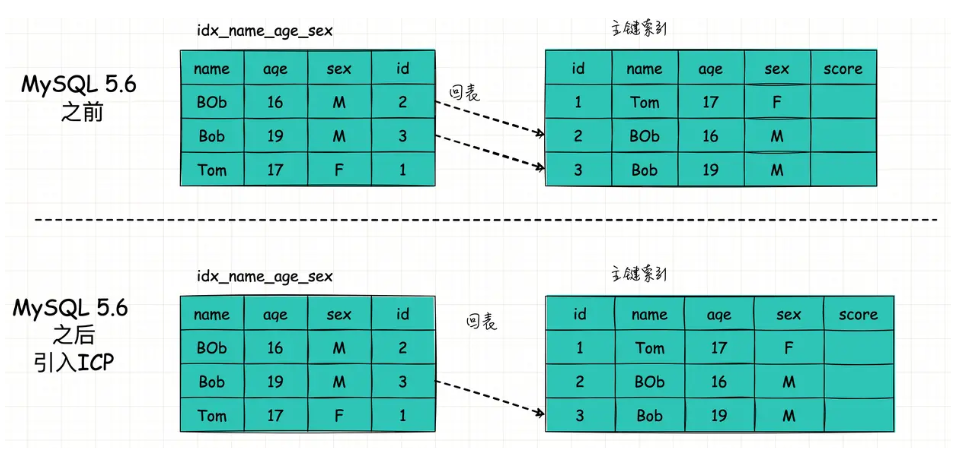

索引下推在**非主键索引**上的优化，可以有效减少回表的次数，大大提升了查询的效率

#### 8. 索引排序

MySQL 有两种方式可以生成有序的结果，通过排序操作或者按照索引顺序扫描，如果 explain 的 type 列的值为 index，则说明 MySQL 使用了索引扫描来做排序（不要和 extra 列的 Using index 搞混了，那个是使用了覆盖索引查询）。

扫描索引本身是很快的，因为只需要从一条索引记录移动到紧接着的下一条记录，但如果索引不能覆盖查询所需的全部列，那就不得不每扫描一条索引记录就回表查询一次对应的整行，这基本上都是随机 I/O，因此按索引顺序读取数据的速度通常要比顺序地全表扫描慢，尤其是在 I/O 密集型的工作负载时。

**MySQL 可以使用同一个索引既满足排序，又用于查找行，因此，如果可能，设计索引时应该尽可能地同时满足这两种任务，这样是最好的**。

只有当索引的列顺序和 order by 子句的顺序完全一致，并且所有列的排序方向（倒序或升序，创建索引时可以指定 ASC 或 DESC）都一样时，MySQL 才能使用索引来对结果做排序，如果查询需要关联多张表，则只有当 order by 子句引用的字段全部为第一个表时，才能使用索引做排序，order by 子句和查找型查询的限制是一样的，需要满足索引的最左前缀的要求，否则 MySQL 都需要执行排序操作，而无法使用索引排序。

#### 9. 压缩索引

MyISAM 使用前缀压缩来减少索引的大小，从而让更多的索引可以放入内存中，这在某些情况下能极大地提高性能。

默认只压缩字符串，但通过参数设置也可以对整数做压缩。

MyISAM 压缩每个索引块的方法是，先完全保存索引块中的第一个值，然后将其他值和第一个值进行比较得到相同前缀的字节数和剩余的不同后缀部分，把这部分存储起来即可。

例如，索引块中的第一个值是“perform“，第二个值是”performance“，那么第二个值的前缀压缩后存储的是类似”7,ance“这样的形式。MyISAM 对**行指针**也采用类似的前缀压缩方式。

压缩块使用更少的空间，代价是某些操作可能更慢。因为每个值的压缩前缀都依赖前面的值，所以 MyISAM 查找时无法在索引块使用二分查找而只能从头开始扫描。正序的扫描速度还不错，但是如果是倒序扫描——例如 ORDER BY DESC——就不是很好了。所有在块中查找某一行的操作平均都需要扫描半个索引块。

测试表明，对于 CPU 密集型应用，因为扫描需要随机查找，压缩索引使得 MyISAM 在索引查找上要慢好几倍。压缩索引的倒序扫描就更慢了。压缩索引需要在 CPU 内存资源与磁盘之间做权衡。压缩索引可能只需要十分之一大小的磁盘空间，如果是 I/O 密集型应用，对某些查询带来的好处会比成本多很多。

可以在 CREATE TABLE 语句中指定 PACK_KEYS 参数来控制索引压缩的方式。

#### 10. 重复索引与冗余索引

MySQL 允许在相同列上创建多个索引，无论是有意的还是无意的。有意的用途没想明白~

**重复索引是指在相同的列上按照相同的顺序创建的相同类型的索引**。应该避免这样创建重复索引，发现以后也应该立即移除。

**冗余索引**和重复索引有一些不同。如果创建了索引(A,B)，再创建索引(A)就是冗余索引，因为这只是前一个索引的前缀索引。因此索引(A,B)也可以当做索引(A)来使用（这种冗余只是对 B-Tree 索引来说的）。但是如果再创建索引(B,A)，则不是冗余索引，索引(B)也不是，因为B不是索引(A,B)的最左前缀。另外，其他不同类型的索引（例如哈希索引或者全文索引）也不会是 B-Tree 索引的冗余索引，而无论覆盖的索引列是什么。

#### 11. 未使用的索引

除了冗余索引和重复索引，可能还会有一些服务器永远不使用的索引，这样的索引完全是累赘，建议考虑删除，有个工具可以帮助定位未使用的索引：

- 在 percona server 或者 mariadb(MySQL衍生版) 中先打开 userstat=ON 服务器变量，默认是关闭的，然后让服务器运行一段时间，再通过查询`information_schema.index_statistics` 就能查到每个索引的使用频率。
- 使用 percona toolkit 中的 pt-index-usage 工具，该工具可以读取查询日志，并对日志中的每个查询进行explain 操作，然后打印出关于索引和查询的报告，这个工具不仅可以找出哪些索引是未使用的，还可以了解查询的执行计划。

### 五、索引优化

参照<<索引优化与查询优化>>文档

### 六、MYSQL索引

#### 1. 主键索引

主键索引又叫聚簇索引，它使用 B+ 树构建，叶子节点存储的是数据表的某一行数据。当表没有创建主键索引是，InnDB 会自动创建一个 ROWID 字段用于构建聚簇索引。规则如下：

- 在表上定义主键 PRIMARY KEY，InnoDB 将主键索引用作聚簇索引。
- 如果表没有定义主键，InnoDB 会选择第一个不为 NULL 的唯一索引列用作聚簇索引。
- 如果以上两个都没有，InnoDB 会使用一个 6 字节长整型的隐式字段 ROWID 字段构建聚簇索引。该 ROWID 字段会在插入新行时自动递增。

例如：索引结构如下

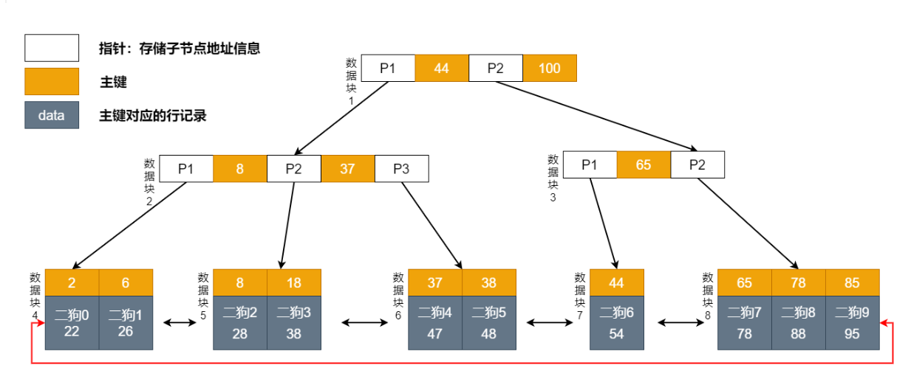

##### 1.1 主键索引等值查询

```sql
select * from student where id = 38;
```

过程如下：

- 第一次磁盘 IO：从根节点检索，将数据块 1 加载到内存，比较 38 < 44，走左边。
- 第二次磁盘 IO：将左边数据块 2 加载到内存，比较 8<37<38，走右边。
- 第三次磁盘 IO：将右边数据块 6 加载到内存，比较 37<38，38=38。查询完毕，将数据返回客户端。

流程图：**3 次磁盘 IO**

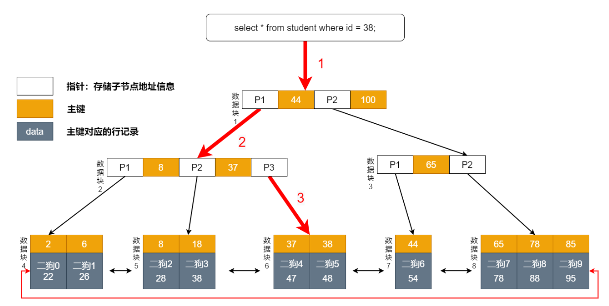

##### 1.2 主键索引范围查询

```sql
select * from student where id between 38 and 44;
```

前面也介绍说了，B+ 树因为叶子节点有双向指针，范围查询可以直接利用双向有序链表。

过程如下：

- 第一次磁盘 IO：从根节点检索，将数据块 1 加载到内存，比较 38 < 44，走左边。
- 第二次磁盘 IO：将左边数据块 2 加载到内存，比较 8<37<38，走右边。
- 第三次磁盘 IO：将右边数据块 6 加载到内存，比较 37<38，38=38。走右边。
- 第四次磁盘 IO：将右边数据块 7 加载到内存，比较 38<44=44。查询完毕，将数据返回客户端。

流程图：**一共四次磁盘IO**

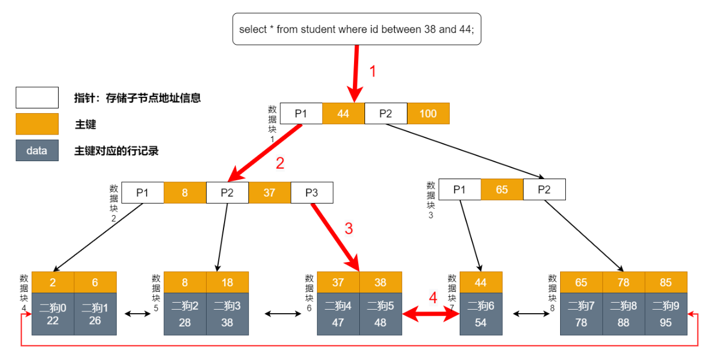

#### 2. 普通索引

##### 2.1 普通索引等值查询 

在 InnDB 中，B+ 树普通索引不存储数据，只存储数据的主键值。比如本表中的 age，它的索引结构就是这样的：

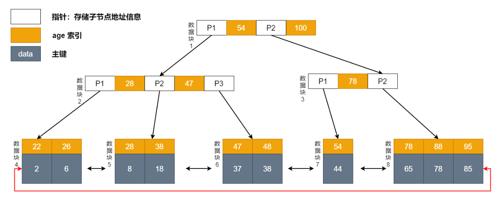

```sql
select * from student where age = 48;
```

使用普通索引需要检索两次索引。第一次检索普通索引找出 age = 48 得到主键值，再使用主键到主键索引中检索获得数据。这个过程称为回表。

也就是说，基于非主键索引的查询需要多扫描一遍索引树。因此，我们应该尽量使用主键查询。

过程如下：

- 第一次磁盘 IO：从根节点检索，将数据块1 加载到内存，比较 48 < 54，走左边。
- 第二次磁盘 IO：将左边数据块 2 加载到内存，比较 28<47<48，走右边。
- 第三次磁盘 IO：将右边数据块 6 加载到内存，比较 47<48，48=48。得到主键 38。
- 第四次磁盘 IO：从根节点检索，将根节点加载到内存，比较 38 < 44，走左边。
- 第五次磁盘 IO：将左边数据块 2 加载到内存，比较 8<37<38，走右边。
- 第六次磁盘 IO：将右边数据块 6 加载到内存，比较 37<38，38=38。查询完毕，将数据返回客户端。

流程图：**一共 6 次磁盘 IO**。

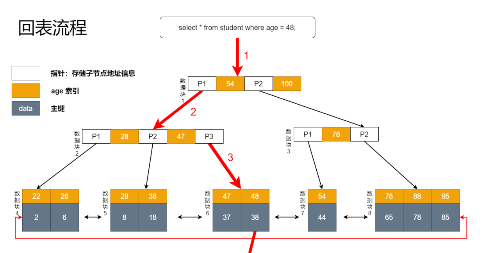

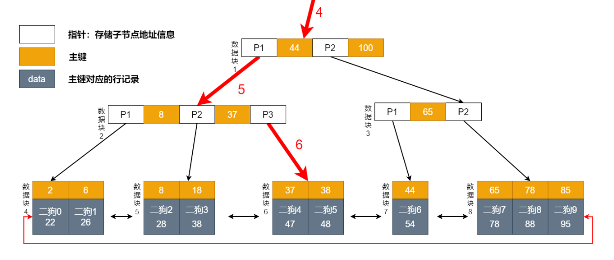

#### 3. 联合索引

如果为每一种查询都设计一个索引，索引是不是太多了？如果我现在要根据学生的姓名去查它的年龄。假设这个需求出现的概览很低，但我们也不能让它走全表扫描吧？

但是为一个不频繁的需求创建一个（姓名）索引是不是有点浪费了？那该咋做呢？我们可以建个（name，age）的联合索引来解决呀。组合索引的结构如下图所示：

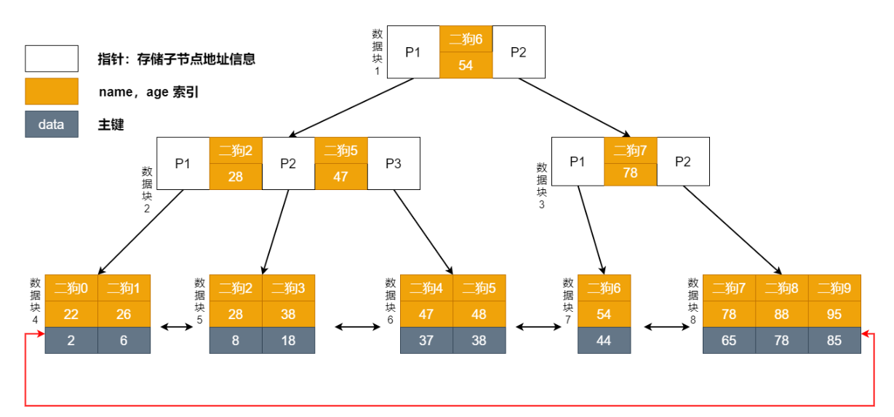

```sql
select name,age from student where name like '二狗5' and age = 48;
```

过程如下：

- 第一次磁盘 IO：从根节点检索，将数据块1 加载到内存，比较 二狗5 < 二狗6，走左边。
- 第二次磁盘 IO：将左边数据块 2 加载到内存，比较 二狗2<二狗4<二狗5，走右边。
- 第三次磁盘 IO：将右边数据块 6 加载到内存，比较 二狗4<二狗5，二狗5=二狗5。得到主键 38。
- 第四次磁盘 IO：从根节点检索，将根节点加载到内存，比较 38 < 44，走左边。
- 第五次磁盘 IO：将左边数据块 2 加载到内存，比较 8<37<38，走右边。
- 第六次磁盘 IO：将右边数据块 6 加载到内存，比较 37<38，38=38。查询完毕，将数据返回客户端。

流程图：**一共六次磁盘 IO**

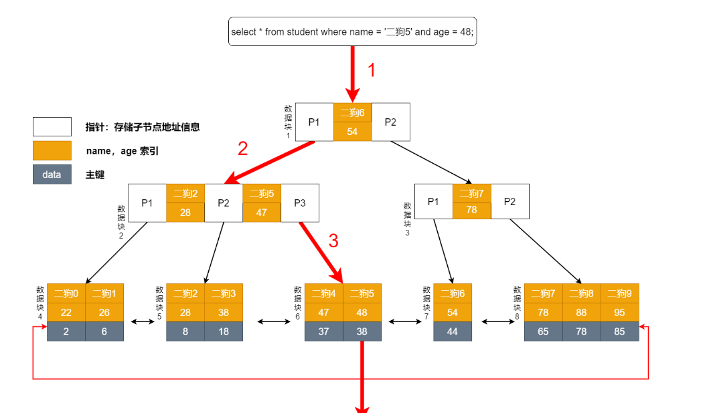