## 索引优化与查询优化

### 一、数据准备

学员表 插 50万 条， 班级表 插 1万 条。

步骤1：建表

```sql
#班级表
CREATE TABLE `class` (
`id` INT(11) NOT NULL AUTO_INCREMENT,
`className` VARCHAR(30) DEFAULT NULL,
`address` VARCHAR(40) DEFAULT NULL,
`monitor` INT NULL ,
PRIMARY KEY (`id`)
) ENGINE=INNODB AUTO_INCREMENT=1 DEFAULT CHARSET=utf8mb4;

#学员表
CREATE TABLE `student` (
`id` INT(11) NOT NULL AUTO_INCREMENT,
`stuno` INT NOT NULL ,
`name` VARCHAR(20) DEFAULT NULL,
`age` INT(3) DEFAULT NULL,
`classId` INT(11) DEFAULT NULL,
PRIMARY KEY (`id`)
#CONSTRAINT `fk_class_id` FOREIGN KEY (`classId`) REFERENCES `t_class` (`id`)
) ENGINE=INNODB AUTO_INCREMENT=1 DEFAULT CHARSET=utf8mb4;
```


步骤2：设置参数

命令开启：允许创建函数设置

```sql
# 不加global只是当前窗口有效。
set global log_bin_trust_function_creators=1;
```

步骤3：创建函数

保证每条数据都不同。

```sql
#随机产生字符串
DELIMITER //
CREATE FUNCTION rand_string(n INT) RETURNS VARCHAR(255)
BEGIN  
DECLARE chars_str VARCHAR(100) DEFAULT
'abcdefghijklmnopqrstuvwxyzABCDEFJHIJKLMNOPQRSTUVWXYZ';
DECLARE return_str VARCHAR(255) DEFAULT '';
DECLARE i INT DEFAULT 0;
WHILE i < n DO 
SET return_str =CONCAT(return_str,SUBSTRING(chars_str,FLOOR(1+RAND()*52),1)); 
SET i = i + 1;
END WHILE;
RETURN return_str;
END //
DELIMITER ;

#假如要删除
#drop function rand_string;
```

随机产生班级编号

```sql
#用于随机产生多少到多少的编号
DELIMITER //
CREATE FUNCTION rand_num (from_num INT ,to_num INT) RETURNS INT(11)
BEGIN 
DECLARE i INT DEFAULT 0; 
SET i = FLOOR(from_num +RAND()*(to_num - from_num+1))  ;
RETURN i; 
END //
DELIMITER ;

#假如要删除
#drop function rand_num;
```

步骤4：创建存储过程

创建往stu表中插入数据的存储过程

```sql
#创建往stu表中插入数据的存储过程
DELIMITER //
CREATE PROCEDURE insert_stu(  START INT , max_num INT )
BEGIN 
	DECLARE i INT DEFAULT 0; 
	SET autocommit = 0;   #设置手动提交事务
	REPEAT  #循环
	SET i = i + 1;  #赋值
	INSERT INTO student (stuno, name ,age ,classId ) VALUES
	((START+i),rand_string(6),rand_num(1,50),rand_num(1,1000)); 
	UNTIL i = max_num 
	END REPEAT; 
	COMMIT;  #提交事务
END //
DELIMITER ;

#假如要删除
#drop PROCEDURE insert_stu;
```

创建往class表中插入数据的存储过程

```sql
#执行存储过程，往class表添加随机数据
DELIMITER //
CREATE PROCEDURE `insert_class`( max_num INT )
BEGIN 
	DECLARE i INT DEFAULT 0; 
	SET autocommit = 0;  
	REPEAT 
	SET i = i + 1; 
	INSERT INTO class ( classname,address,monitor ) VALUES
	(rand_string(8),rand_string(10),rand_num(1,100000)); 
	UNTIL i = max_num 
	END REPEAT; 
	COMMIT;
END //
DELIMITER ;

#假如要删除
#drop PROCEDURE insert_class;
```

步骤5：调用存储过程

```sql
#执行存储过程，往class表添加1万条数据 
CALL insert_class(10000);
执行存储过程，往stu表添加50万条数据 
CALL insert_stu(100000,500000);
```

步骤6：删除某表上的索引 创建存储过程

```sql
DELIMITER //
CREATE  PROCEDURE `proc_drop_index`(dbname VARCHAR(200),tablename VARCHAR(200))
BEGIN
   DECLARE done INT DEFAULT 0;
   DECLARE ct INT DEFAULT 0;
   DECLARE _index VARCHAR(200) DEFAULT '';
   DECLARE _cur CURSOR FOR  SELECT  index_name  FROM
information_schema.STATISTICS  WHERE table_schema=dbname AND table_name=tablename AND
seq_in_index=1 AND  index_name <>'PRIMARY' ;
#每个游标必须使用不同的declare continue handler for not found set done=1来控制游标的结束
   DECLARE  CONTINUE HANDLER FOR NOT FOUND set done=2 ;   
#若没有数据返回,程序继续,并将变量done设为2
    OPEN _cur;
    FETCH _cur INTO _index;
    WHILE _index<>'' DO
       SET @str = CONCAT("drop index " , _index , " on " , tablename );
       PREPARE sql_str FROM @str ;
       EXECUTE sql_str;
       DEALLOCATE PREPARE sql_str;
       SET _index='';
       FETCH _cur INTO _index;
    END WHILE;
 CLOSE _cur;
END //
DELIMITER ;
```

执行存储过程

```sql
CALL proc_drop_index("dbname","tablename");
```

### 二、索引失效案例

MySQL中`提高性能`的一个最有效的方式是对数据表`设计合理的索引`。索引提供了高效访问数据的方法，并且加快 查询的速度，因此索引对查询的速度有着至关重要的影响。

- 使用索引可以快速地定位表中的某条记录，从而提高数据库查询的速度，提高数据库的性能。
- 如果查询时没有使用索引，查询语句就会扫描表中的所有记录。在数据量大的情况下，这样查询的速度会很慢。

大多数情况下都(默认)采用`B+树`来构建索引。只是空间列类型的索引使用`R-`树，并且`MEMORY`表还支持`hash索引`。

其实，用不用索引，最终都是优化器说了算。优化器是基于什么的优化器？基于`cost开销 (CostBaseOptimizer)`,它不是基于`规则(Rule-BasedOptimzer)`，也不是基于`语义`。怎么样开销小就怎么 来。另外，`SQL语句是使用索引，跟数据库版本、数据量、数据选择度都有关系`。

#### 2.1 全值匹配

系统中经常出现的sql语句如下：

```sql
EXPLAIN SELECT SQL_NO_CACHE * FROM student WHERE age=30;
EXPLAIN SELECT SQL_NO_CACHE * FROM student WHERE age=30 and classId=4;
EXPLAIN SELECT SQL_NO_CACHE * FROM student WHERE age=30 and classId=4 AND name = 'abed';
```

建立索引:

```sql
CREATE INDEX idx_age_classid_name ON student(age,classId,name);
```

可以看到，创建索引前的查询时间是116ms秒，创建索引后的查询时间是2ms秒，索引帮助我们极大的提高了查 询效率。

#### 2.2 最佳做前缀法则

在MySQL建立联合索引时会遵守`最佳左前缀匹配原则`，即最左优先，在检索数据时从联合索引的最左边开始匹配。

例如：

```sql
# 索引：CREATE INDEX idx_age_classid_name ON student(age,classId,name);
#①索引部分有效
EXPLAIN SELECT SQL_NO_CACHE * FROM student WHERE student.age=30 AND student.name = 'abcde';
#②索引全部失效
EXPLAIN SELECT SQL_NO_CACHE * FROM student WHERE student.classId=1 AND student.name = 'abed';
#③索引全部有效
EXPLAIN SELECT SQL_NO_CACHE * FROM student WHERE classid=4 AND student.age=30 AND student.name='abcde';
```

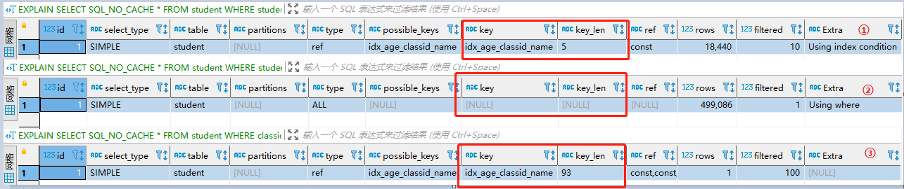

结论：MySQL可以为多个字段创建索引，一个索引可以包括16个字段。对于多列索引，过滤条件要使用索引必须 按照索引建立时的顺序，依次满足，一旦跳过某个字段，索引后面的字段都无法被使用。如果查询条件中没有使用这些字段的第1个字段时，多列（或联合）索引不会被使用。

扩展：索引长度计算方法

> #### 索引长度公式：
>
> - 所有的索引字段，如果没有设置not null，则需要加一个字节。 
> - 定长字段，int占四个字节、date占三个字节、char(n)占n个字符。 
> - 对于变成字段varchar(n)，则有n个字符+两个字节。 
> - 不同的字符集，一个字符占用的字节数不同。latin1编码的，一个字符占用一个字节，gbk编码的，一个字符占用两个字节，utf8编码的，一个字符占用三个字节。 
> - 索引长度 char()、varchar()索引长度的计算公式：
>
> Character Set：utf8mb4=4,utf8=3,gbk=2,latin1=1) * 列长度 + 1(允许null) + 2(变长列)

以③为例进行说明：

index：idx_age_classid_name 长度为93

id：int  4长度为4 如果不为NULL，则长度+1 = 5

age：int 长度为4 如果不为NULL，则长度+1 = 5

name：varchar(20)  此类型字符集为utf8mb4，则长度=20*4+1+2 = 83

故索引长度为93

#### 2.3 主键自增

对于一个 使用`InnoDB存储引擎`的表来说，在我们没有显式的创建索引时，表中的数据实际上都是存储在聚簇索引的叶子节点的。而记录又是存储在数据页中的，数据页和记录又是按照记录`主键值从小到大`的顺序进行排序， 所以如果我们`插入`的记录的`主键值是依次增大`的话，那我们每插满一个数据页就换到下一个数据页继续插，而如 果我们插入的`主键值忽大忽小`的话，就比较麻烦了，假设某个数据页存储的记录已经满了，它存储的主键值在1-100 之间：

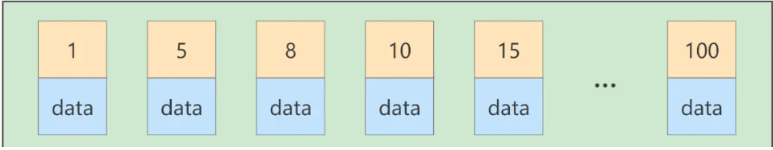

如果此时再插入一条主键值为 9的记录，那它插入的位置就如：

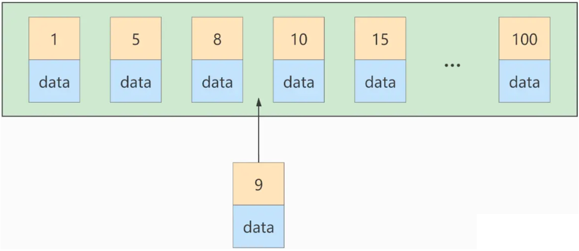

可这个数据页已经满了，我们需要把当前 `页面分裂` 成两个页面，把本页中的一些记录移动到新创建的这个页中。页面分裂和记录移位意味着什么？意味着： `性能损耗` ！所以如果我们想尽量避免这样无谓的性能损耗，最好让插入的记录的 `主键值依次递增` ，这样就不会发生这样的性能损耗了。

建议：让主键具有 `AUTO_INCREMENT` ，让存储引擎自己为表生成主键，而不是我们手动插入 ，比如： `person_info` 表：

```sql
CREATE TABLE person_info(
	 id INT UNSIGNED NOT NULL AUTO_INCREMENT,
	 name VARCHAR(100) NOT NULL,
	 birthday DATE NOT NULL,
	 phone_number CHAR(11) NOT NULL,
	 country varchar(100) NOT NULL,
	  PRIMARY KEY (id),
	  KEY idx_name_birthday_phone_number (name(10), birthday, phone_number)
);
```

我们自定义的主键列 `id` 拥有`AUTO_INCREMENT` 属性，在插入记录时存储引擎会自动为我们填入自增的主键值。这样的主键占用空间小，顺序写入，减少页分裂。

#### 2.4 计算

```sql
# 追加索引
CREATE INDEX idx_name ON student(name);
#①索引有效
EXPLAIN SELECT SQL_NO_CACHE * FROM student WHERE student.name LIKE 'abc%';
#②索引失效
EXPLAIN SELECT SQL_NO_CACHE * FROM student WHERE LEFT(student.name,3) = 'abc';
```

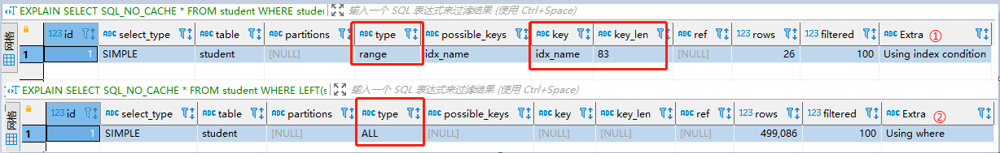

#### 2.5 函数

```sql
# 追加索引
CREATE INDEX idx_sno ON student(stuno);
#索引有效
EXPLAIN SELECT SQL_NO_CACHE id, stuno, NAME FROM student WHERE stuno = 900001;
#索引失效
EXPLAIN SELECT SQL_NO_CACHE id, stuno, NAME FROM student WHERE stuno+1 = 900001;
```

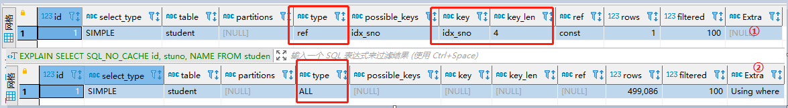

#### 2.6  类型转换

```sql
# 追加索引
# CREATE INDEX idx_name ON student(name);
#①索引有效
EXPLAIN SELECT SQL_NO_CACHE * FROM student WHERE name='123';
#②索引有效
EXPLAIN SELECT SQL_NO_CACHE * FROM student WHERE name=123;
```

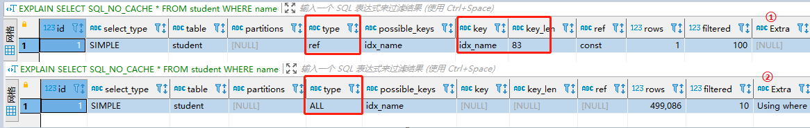

结论：设计实体类属性时，一定要与数据库字段类型相对应。否则，就会出现类型转换的情况。

#### 2.7 范围条件右边的列

```sql
#索引：CREATE INDEX idx_age_classid_name ON student(age,classId,name);
# 索引部分生效
EXPLAIN SELECT SQL_NO_CACHE * FROM student
WHERE student.age=30 AND student.classId>20 AND student.name = 'abc' ;
```

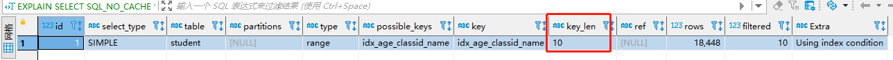

student.classId>20的右侧的student.name = ‘abc’的索引就会失效。

如果这种sql比较多，应该建立：

```sql
create index idx_age_name_classid on student(age,name,classid);
# 将范围查询条件放置语句最后：
EXPLAIN SELECT SQL_NO_CACHE * FROM student WHERE student.age=30 AND student.name = 'abc' AND student.classId>20 ;
```

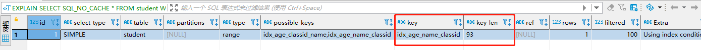

说明：应用开发中`范围查询`，例如 金额查询，日期查询往往都是范围查询。`应将查询条件放置where语句最后`。

#### 2.8 不等于(!= 或者<>)

```sql
create index ide_name on student(name);
# 索引失效
explain select SQL_NO_CACHE *from student where student.name <> 'abc';
```

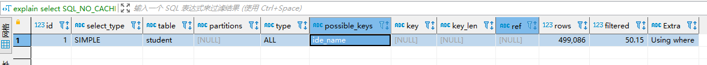

当sql语句中有!=或者<>会出现索引失效的问题，尝试改写为`等于`，或采用`覆盖索引`

#### 2.9  not null索引失效

**is null可以使用索引，is not null无法使用索引**

```sql
#①IS NULL 可以使用索引
EXPLAIN SELECT SQL_NO_CACHE * FROM student WHERE age IS NULL;
#②IS NOT NULL 无法触发索引
EXPLAIN SELECT SQL_NO_CACHE * FROM student WHERE age IS NOT NULL;
```

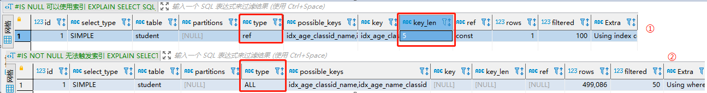

结论：最好在设计数据表的时候 就将`字段设置为 not null 约束`， 拓展，同理，在查询中使用 not like 也无法使用索引，导致`全表扫描`

#### 2.10 like以通配符%开头

```sql
#索引有效
explain select SQL_NO_CACHE * FROM student where name like 'ab%';

#索引失效
explain select SQL_NO_CACHE * FROM student where name like '%ab%';
```

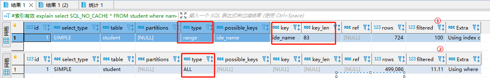

#### 2.11 OR 前后存在非索引列

在 where 子句中，如果在 OR 前的条件列进行了索引，而在OR 后的条件列没有进行索引，那么索引失效，也就是，`让OR的前后条件都具备索引，如果缺少一个就会出现索引失效`

因为 OR 的含义就是两个只要满足一个即可，因此`只有一个条件列进行了索引时没有意义的`。只要`有条件列没有索引`，就会进行`全表扫描`，因此 所有的条件列也会失效。

```sql
#索引： 
CREATE INDEX idx_age_name ON student(age,name);
# 未使用到索引
EXPLAIN SELECT SQL_NO_CACHE * FROM student WHERE age = 10 OR classid = 100;
#使用到索引
EXPLAIN SELECT SQL_NO_CACHE * FROM student WHERE age = 10 OR name = 'Abel';
```

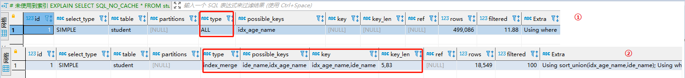

#### 2.12 字符集

统一使用utf8mb4( 5.5.3版本以上支持)兼容性更好，统一字符集可以避免由于字符集转换产生的乱码。不同的 `字符集` 进行比较前需要进行`转换`会造成索引失效。（爬坑经历）

#### 2.13 建议

假设 index(a,b,c)

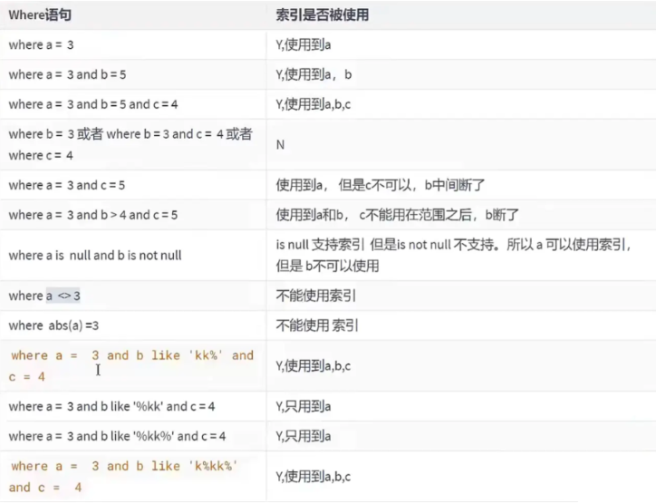

**一般性建议:**

- 对于单列索引，尽量选择针对当前query过滤性更好的索引
- 在选择组合索引的时候，当前query中过滤性最好的字段在索引字段顺序中，位置越靠前越好。
- 在选择组合索引的时候，尽量选择能够包含当前query中的where子句中更多字段的索引。
- 在选择组合索引的时候，如果某个字段可能出现范围查询时，尽量把这个字段放在索引次序的最后面。

总之，`书写SQL语句时，尽量避免造成索引失效的情况`。

### 三、查询优化

#### 3.1 数据准备

```sql
#分类
CREATE TABLE IF NOT EXISTS `stype` (
`id` INT(10) UNSIGNED NOT NULL AUTO_INCREMENT,
`card` INT(10) UNSIGNED NOT NULL,
PRIMARY KEY (`id`)
);
#图书
CREATE TABLE IF NOT EXISTS `book` (
`bookid` INT(10) UNSIGNED NOT NULL AUTO_INCREMENT,
`card` INT(10) UNSIGNED NOT NULL,
PRIMARY KEY (`bookid`)
);

#向分类表中添加20条记录
INSERT INTO stype(card) VALUES(FLOOR(1 + (RAND() * 20)));
INSERT INTO stype(card) VALUES(FLOOR(1 + (RAND() * 20)));
INSERT INTO stype(card) VALUES(FLOOR(1 + (RAND() * 20)));
INSERT INTO stype(card) VALUES(FLOOR(1 + (RAND() * 20)));
INSERT INTO stype(card) VALUES(FLOOR(1 + (RAND() * 20)));
INSERT INTO stype(card) VALUES(FLOOR(1 + (RAND() * 20)));
INSERT INTO stype(card) VALUES(FLOOR(1 + (RAND() * 20)));
INSERT INTO stype(card) VALUES(FLOOR(1 + (RAND() * 20)));
INSERT INTO stype(card) VALUES(FLOOR(1 + (RAND() * 20)));
INSERT INTO stype(card) VALUES(FLOOR(1 + (RAND() * 20)));
INSERT INTO stype(card) VALUES(FLOOR(1 + (RAND() * 20)));
INSERT INTO stype(card) VALUES(FLOOR(1 + (RAND() * 20)));
INSERT INTO stype(card) VALUES(FLOOR(1 + (RAND() * 20)));
INSERT INTO stype(card) VALUES(FLOOR(1 + (RAND() * 20)));
INSERT INTO stype(card) VALUES(FLOOR(1 + (RAND() * 20)));
INSERT INTO stype(card) VALUES(FLOOR(1 + (RAND() * 20)));
INSERT INTO stype(card) VALUES(FLOOR(1 + (RAND() * 20)));
INSERT INTO stype(card) VALUES(FLOOR(1 + (RAND() * 20)));
INSERT INTO stype(card) VALUES(FLOOR(1 + (RAND() * 20)));
INSERT INTO stype(card) VALUES(FLOOR(1 + (RAND() * 20)));

#向图书表中添加20条记录
INSERT INTO book(card) VALUES(FLOOR(1 + (RAND() * 20)));
INSERT INTO book(card) VALUES(FLOOR(1 + (RAND() * 20)));
INSERT INTO book(card) VALUES(FLOOR(1 + (RAND() * 20)));
INSERT INTO book(card) VALUES(FLOOR(1 + (RAND() * 20)));
INSERT INTO book(card) VALUES(FLOOR(1 + (RAND() * 20)));
INSERT INTO book(card) VALUES(FLOOR(1 + (RAND() * 20)));
INSERT INTO book(card) VALUES(FLOOR(1 + (RAND() * 20)));
INSERT INTO book(card) VALUES(FLOOR(1 + (RAND() * 20)));
INSERT INTO book(card) VALUES(FLOOR(1 + (RAND() * 20)));
INSERT INTO book(card) VALUES(FLOOR(1 + (RAND() * 20)));
INSERT INTO book(card) VALUES(FLOOR(1 + (RAND() * 20)));
INSERT INTO book(card) VALUES(FLOOR(1 + (RAND() * 20)));
INSERT INTO book(card) VALUES(FLOOR(1 + (RAND() * 20)));
INSERT INTO book(card) VALUES(FLOOR(1 + (RAND() * 20)));
INSERT INTO book(card) VALUES(FLOOR(1 + (RAND() * 20)));
INSERT INTO book(card) VALUES(FLOOR(1 + (RAND() * 20)));
INSERT INTO book(card) VALUES(FLOOR(1 + (RAND() * 20)));
INSERT INTO book(card) VALUES(FLOOR(1 + (RAND() * 20)));
INSERT INTO book(card) VALUES(FLOOR(1 + (RAND() * 20)));
INSERT INTO book(card) VALUES(FLOOR(1 + (RAND() * 20)));
```

#### 3.2 表连接

##### 3.2.1 连接本质

我们先建立两个简单的表并给它们填充一点数据：

```sql
CREATE TABLE t1 (m1 int, n1 char(1));
CREATE TABLE t2 (m2 int, n2 char(1));
INSERT INTO t1 VALUES(1, 'a'), (2, 'b'), (3, 'c');
INSERT INTO t2 VALUES(2, 'b'), (3, 'c'), (4, 'd');
```

`连接`的本质就是把各个连接表中的记录都取出来依次匹配的组合加入结果集并返回给用户。所以我们把`t1`和`t2`两个表连接起来的过程如下图所示：

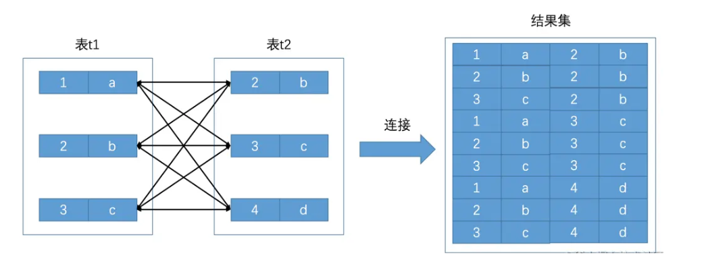

 这个过程看起来就是把`t1`表的记录和`t2`的记录连起来组成新的更大的记录，所以这个查询过程称之为`连接查询`。`连接查询的结果集中包含一个表中的每一条记录与另一个表中的每一条记录相互匹配的组合`，像这样的结果集就可以称之为`笛卡尔积`。因为表`t1`中有3条记录，表`t2`中也有3条记录，所以这两个表连接之后的笛卡尔积就有`3×3=9`行记录。在`MySQL`中，连接查询的语法也很随意，只要在`FROM`语句后边跟多个表名就好了，比如我们把`t1`表和`t2`表连接起来的查询语句可以写成这样：

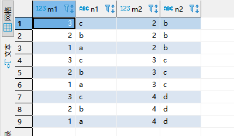

##### 3.2.2 连接过程

 如果我们乐意，我们可以连接任意数量张表，但是如果没有任何限制条件的话，这些表连接起来产生的`笛卡尔积`可能是非常巨大的。比方说3个100行记录的表连接起来产生的`笛卡尔积`就有`100×100×100=1000000`行数据！所以在连接的时候过滤掉特定记录组合是有必要的，在连接查询中的过滤条件可以分成两种：

- 涉及单表的条件

  这种只设计单表的过滤条件我们之前都提到过一万遍了，我们之前也一直称为`搜索条件`，比如`t1.m1 > 1`是只针对`t1`表的过滤条件，`t2.n2 < 'd'`是只针对`t2`表的过滤条件。

- 涉及两表的条件

  这种过滤条件我们之前没见过，比如`t1.m1 = t2.m2`、`t1.n1 > t2.n2`等，这些条件中涉及到了两个表，我们稍后会仔细分析这种过滤条件是如何使用的。

  下面我们就要看一下携带过滤条件的连接查询的大致执行过程了，比方说下面这个查询语句：

```sql
SELECT * FROM t1, t2 WHERE t1.m1 > 1 AND t1.m1 = t2.m2 AND t2.n2 < 'd';
```

在这个查询中我们指明了这三个过滤条件：

- `t1.m1 > 1`
- `t1.m1 = t2.m2`
- `t2.n2 < 'd'`

  那么这个连接查询的大致执行过程如下：

(1)首先确定第一个需要查询的表，这个表称之为`驱动表`。怎样在单表中执行查询语句我们在前一章都介绍过了，只需要选取代价最小的那种访问方法去执行单表查询语句就好了（就是说从const、ref、ref_or_null、range、index、all这些执行方法中选取代价最小的去执行查询）。此处假设使用`t1`作为驱动表，那么就需要到`t1`表中找满足`t1.m1 > 1`的记录，因为表中的数据太少，我们也没在表上建立二级索引，所以此处查询`t1`表的访问方法就设定为`all`吧，也就是采用全表扫描的方式执行单表查询。关于如何提升连接查询的性能我们之后再说，现在先把基本概念捋清楚。所以查询过程就如下图所示：

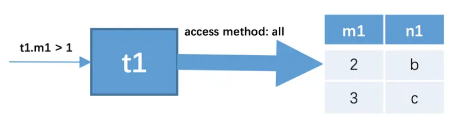

我们可以看到，`t1`表中符合`t1.m1 > 1`的记录有两条。

(2)针对上一步骤中从驱动表产生的结果集中的每一条记录，分别需要到`t2`表中查找匹配的记录，所谓`匹配的记录`，指的是符合过滤条件的记录。因为是根据`t1`表中的记录去找`t2`表中的记录，所以`t2`表也可以被称之为`被驱动表`。上一步骤从驱动表中得到了2条记录，所以需要查询2次`t2`表。此时涉及两个表的列的过滤条件`t1.m1 = t2.m2`就派上用场了：

- 当`t1.m1 = 2`时，过滤条件`t1.m1 = t2.m2`就相当于`t2.m2 = 2`，所以此时`t2`表相当于有了`t2.m2 = 2`、`t2.n2 < 'd'`这两个过滤条件，然后到`t2`表中执行单表查询。
- 当`t1.m1 = 3`时，过滤条件`t1.m1 = t2.m2`就相当于`t2.m2 = 3`，所以此时`t2`表相当于有了`t2.m2 = 3`、`t2.n2 < 'd'`这两个过滤条件，然后到`t2`表中执行单表查询。

​	所以整个连接查询的执行过程就如下图所示：

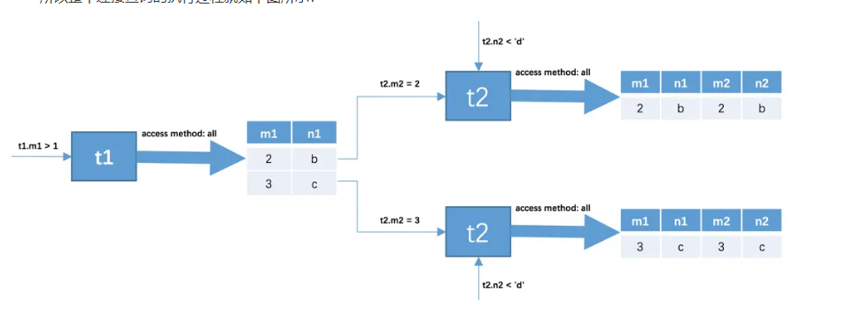

 也就是说整个连接查询最后的结果只有两条符合过滤条件的记录：

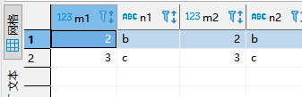

从上面两个步骤可以看出来，我们上面介绍的这个两表连接查询共需要查询1次`t1`表，2次`t2`表。当然这是在特定的过滤条件下的结果，如果我们把`t1.m1 > 1`这个条件去掉，那么从`t1`表中查出的记录就有3条，就需要查询3次`t2`表了。也就是说在两表连接查询中，驱动表只需要访问一次，被驱动表可能被访问多次。

##### 3.2.3  左外连接（右外连接同理）

```sql
#①没有索引的情况
EXPLAIN SELECT SQL_NO_CACHE * FROM `stype` LEFT JOIN book ON stype.card = book.card;
 #【被驱动表】，可以避免全表扫描
ALTER TABLE book ADD INDEX idx_book_card ( card); 
#②为被驱动表追加索引
EXPLAIN SELECT SQL_NO_CACHE * FROM `stype` LEFT JOIN book ON stype.card = book.card;
```

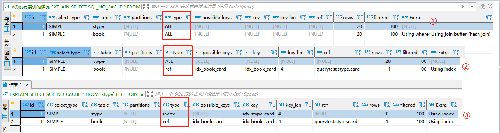

可以看到第二行的 `type` 由All-> `ref`，`rows` 也变成了优化比较明显。这是由`左连接特性决定`的。 左外连接`LEFT JOIN`条件用于确定`如何从右表搜索行，左边一定都有`，所以 `右边是我们的关键点`,一定需要建立索引。

##### 3.2.4 内连接

```sql
#①删除原有索引
drop index idx_stype_card on stype;
drop index idx_book_card on book;
EXPLAIN  SELECT SQL_NO_CACHE * FROM stype INNER JOIN book ON stype.card=book.card;
#②为book表追加索引
ALTER TABLE book ADD INDEX idx_book_card ( card); 
EXPLAIN  SELECT SQL_NO_CACHE * FROM stype INNER JOIN book ON stype.card=book.card;
#③为stype追加索引
ALTER TABLE stype  ADD INDEX idx_stype_card ( card); 
EXPLAIN SELECT SQL_NO_CACHE * FROM stype INNER JOIN book ON stype.card = book.card;
```

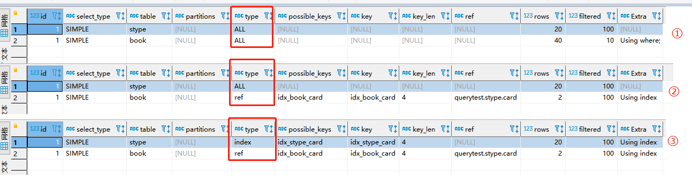

#### 3.3 join 语句原理

##### 3.3.1 驱动表和被驱动表

join方式连接多个表，本质就是各个表之间数据的循环匹配。MySQL5.5版本之前，MySQL只支持一种表间关联方 式，就是嵌套循环(Nested Loop Join)。如果关联表的数据量很大，则join关联的执行时间会非常长。在MySQL5.5 以后的版本中，MySQL通过引入BNLJ算法(块嵌套循环)来优化嵌套执行。

驱动表就是主表，被驱动表就是从表、三回区动表。

- 对于内连接来说：

```sql
 SELECT * FROM A JOIN E ON ..・
```

A一定是驱动表吗？不一定，优化器会根据你查询语句做优化，决定先查哪张表。先查询的是驱动表， 反之就是被驱动表。通过`explain`关键字可以查看。

- 对于外连接来说：

```sql
 SELECT * FROM A LEFT JOIN B ON •・•
 #或
 SELECT * FROM B RIGHT JOIN A ON ・・・
```

通常，大家会认为A就是驱动表，B就是被驱动表。但也未必。测试如下：

```sql
CREATE TABLE a(f1 INT, f2 INT, INDEX(f1))ENGINE=INNODB;
CREATE TABLE b(f1 INT, f2 INT)ENGINE=INNODB;
                  
INSERT INTO a VALUES(1,1),(2,2),(3,3),(4,4),(5,5),(6,6);
INSERT INTO b VALUES(3,3),(4,4),(5,5),(6,6),(7,7),(8,8);

# 测试1
EXPLAIN SELECT * FROM a LEFT JOIN b ON a.f1 = b.f1 WHERE a.f2 = b.f2
# 测试2
EXPLAIN SELECT * FROM a LEFT JOIN b ON a.f1 = b.f1 and  a.f2 = b.f2
```

##### 3.3.2 简单嵌套循环连接（Simple Nested-Loop Join）]

  我们前面说过，对于两表连接来说，`驱动表只会被访问一遍，但被驱动表却要被访问到好多遍`，具体访问几遍取决于对驱动表执行单表查询后的结果集中的记录条数。对于`内连接来说，选取哪个表为驱动表都没关系`，而`外连接的驱动表是固定的`，也就是说`左（外）连接的驱动表就是左边的那个表`，`右（外）连接的驱动表就是右边的那个表`。我们上面已经大致介绍过`t1`表和`t2`表执行内连接查询的大致过程，我们温习一下：

- 步骤1：选取驱动表，使用与驱动表相关的过滤条件，选取代价最低的单表访问方法来执行对驱动表的单表查询。
- 步骤2：对上一步骤中查询驱动表得到的结果集中每一条记录，都分别到被驱动表中查找匹配的记录。

通用的两表连接过程如下图所示：

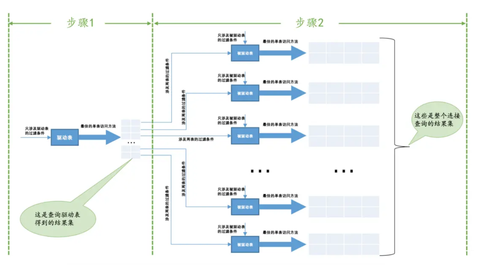

如果有3个表进行连接的话，那么`步骤2`中得到的结果集就像是新的驱动表，然后第三个表就成为了被驱动表，重复上面过程，也就是`步骤2`中得到的结果集中的每一条记录都需要到`t3`表中找一找有没有匹配的记录，用伪代码表示一下这个过程就是这样：

```sql
for each row in t1 {   #此处表示遍历满足对t1单表查询结果集中的每一条记录    
    for each row in t2 {   #此处表示对于某条t1表的记录来说，遍历满足对t2单表查询结果集中的每一条记录    
        for each row in t3 {   #此处表示对于某条t1和t2表的记录组合来说，对t3表进行单表查询
            if row satisfies join conditions, send to client
        }
    }
}
```

这个过程就像是一个嵌套的循环，所以这种`驱动表只访问一次`，但`被驱动表却可能被多次访问`，访问次数取决于对驱动表执行单表查询后的结果集中的记录条数的连接执行方式称之为`嵌套循环连接`（`Nested-Loop Join`），这是最简单，也是最笨拙的一种连接查询算法。

##### 3.3.3 索引嵌套循环连接(Index Nested-Loop Join)

使用索引加快连接速度,我们知道在`嵌套循环连接`的`步骤2`中可能需要访问多次被驱动表，如果访问被驱动表的方式都是全表扫描的话，妈呀，那得要扫描好多次呀～～～ 但是别忘了，查询`t2`表其实就相当于一次单表扫描，我们可以利用索引来加快查询速度哦。回顾一下最开始介绍的`t1`表和`t2`表进行内连接的例子：

```
SELECT * FROM t1, t2 WHERE t1.m1 > 1 AND t1.m1 = t2.m2 AND t2.n2 < 'd';
```

我们使用的其实是`嵌套循环连接`算法执行的连接查询，再把上面那个查询执行过程表拉下来给大家看一下：

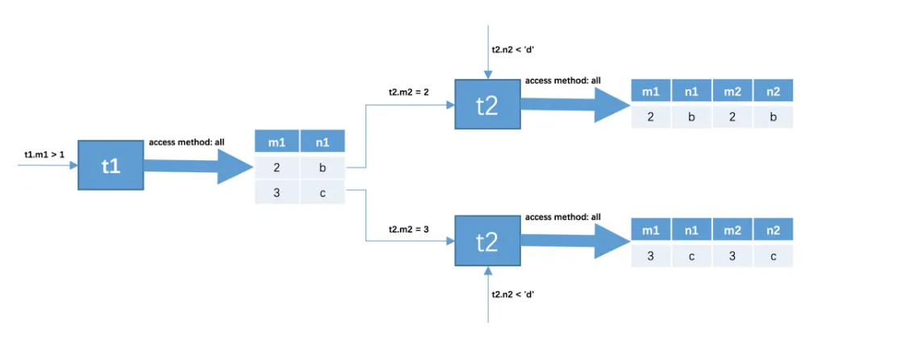

查询驱动表`t1`后的结果集中有两条记录，`嵌套循环连接`算法需要对被驱动表查询2次：

- 当`t1.m1 = 2`时，去查询一遍`t2`表，对`t2`表的查询语句相当于：

```sql
  SELECT * FROM t2 WHERE t2.m2 = 2 AND t2.n2 < 'd';
```

- 当`t1.m1 = 3`时，再去查询一遍`t2`表，此时对`t2`表的查询语句相当于：

```sql
  SELECT * FROM t2 WHERE t2.m2 = 3 AND t2.n2 < 'd';
```

可以看到，原来的`t1.m1 = t2.m2`这个涉及两个表的过滤条件在针对`t2`表做查询时关于`t1`表的条件就已经确定了，所以我们只需要单单优化对`t2`表的查询了，上述两个对`t2`表的查询语句中利用到的列是`m2`和`n2`列，我们可以：

- 在`m2`列上建立索引，因为对`m2`列的条件是等值查找，比如`t2.m2 = 2`、`t2.m2 = 3`等，所以可能使用到`ref`的访问方法，假设使用`ref`的访问方法去执行对`t2`表的查询的话，需要回表之后再判断`t2.n2 < d`这个条件是否成立。
- 这里有一个比较特殊的情况，就是假设`m2`列是`t2`表的主键或者唯一二级索引列，那么使用`t2.m2 = 常数值`这样的条件从`t2`表中查找记录的过程的代价就是常数级别的。我们知道在单表中使用主键值或者唯一二级索引列的值进行等值查找的方式称之为`const`，而设计`MySQL`的大佬把在连接查询中对被驱动表使用主键值或者唯一二级索引列的值进行等值查找的查询执行方式称之为：`eq_ref`。
- 在`n2`列上建立索引，涉及到的条件是`t2.n2 < 'd'`，可能用到`range`的访问方法，假设使用`range`的访问方法对`t2`表的查询的话，需要回表之后再判断在`m2`列上的条件是否成立。
- 假设`m2`和`n2`列上都存在索引的话，那么就需要从这两个里边儿挑一个代价更低的去执行对`t2`表的查询。当然，建立了索引不一定使用索引，只有在`二级索引 + 回表`的代价比全表扫描的代价更低时才会使用索引。

 另外，有时候连接查询的查询列表和过滤条件中可能只涉及被驱动表的部分列，而这些列都是某个索引的一部分，这种情况下即使不能使用`eq_ref`、`ref`、`ref_or_null`或者`range`这些访问方法执行对被驱动表的查询的话，也可以使用索引扫描，也就是`index`的访问方法来查询被驱动表。所以我们建议在真实工作中最好不要使用`*`作为查询列表，最好把真实用到的列作为查询列表。

##### 3.3.4 基于块的嵌套循环连接（Block Nested-Loop Join）

  扫描一个表的过程其实是先把这个表从磁盘上加载到内存中，然后从内存中比较匹配条件是否满足。现实生活中的表可不像`t1`、`t2`这种只有3条记录，成千上万条记录都是少的，几百万、几千万甚至几亿条记录的表到处都是。内存里可能并不能完全存放的下表中所有的记录，所以在扫描表前面记录的时候后边的记录可能还在磁盘上，等扫描到后边记录的时候可能内存不足，所以需要把前面的记录从内存中释放掉。我们前面又说过，采用`嵌套循环连接`算法的两表连接过程中，被驱动表可是要被访问好多次的，如果这个被驱动表中的数据特别多而且不能使用索引进行访问，那就相当于要从磁盘上读好几次这个表，这个`I/O`代价就非常大了，所以我们得想办法：`尽量减少访问被驱动表的次数`。

  当被驱动表中的数据非常多时，每次访问被驱动表，被驱动表的记录会被加载到内存中，在内存中的每一条记录只会和驱动表结果集的一条记录做匹配，之后就会被从内存中清除掉。然后再从驱动表结果集中拿出另一条记录，再一次把被驱动表的记录加载到内存中一遍，周而复始，驱动表结果集中有多少条记录，就得把被驱动表从磁盘上加载到内存中多少次。所以我们可不可以在`把被驱动表的记录加载到内存的时候，一次性和多条驱动表中的记录做匹配`，这样就可以大大`减少重复从磁盘上加载被驱动表的代价`了。

所以设计`MySQL`的大佬提出了一个`join buffer`的概念，`join buffer`就是执行`连接查询前申请的一块固定大小的内存`，先把若干条驱动表结果集中的记录装在这个`join buffer`中，然后开始扫描被驱动表，每一条被驱动表的记录一次性和`join buffer`中的多条驱动表记录做匹配，因为匹配的过程都是在内存中完成的，所以这样可以显著减少被驱动表的`I/O`代价。使用`join buffer`的过程如下图所示：

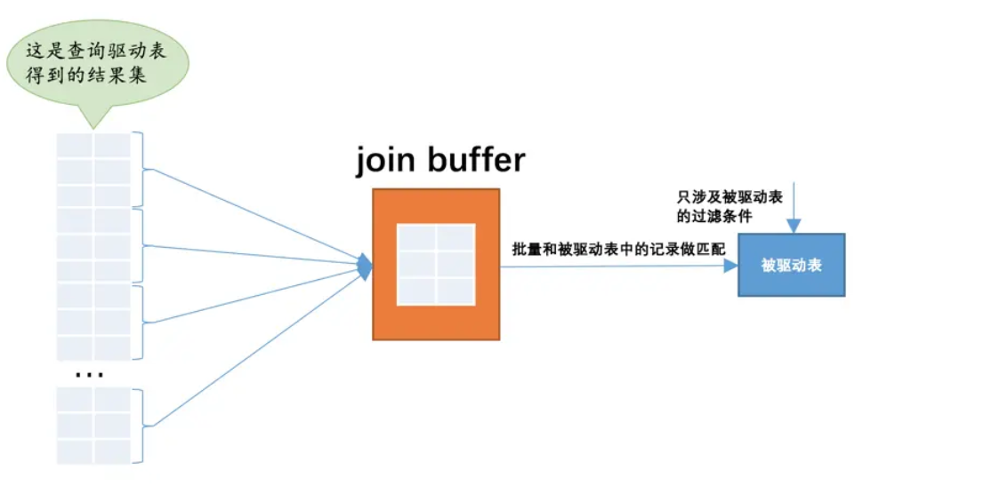

 最好的情况是`join buffer`足够大，能容纳驱动表结果集中的所有记录，这样只需要访问一次被驱动表就可以完成连接操作了。设计`MySQL`的大佬把这种加入了`join buffer`的嵌套循环连接算法称之为`基于块的嵌套连接`（Block Nested-Loop Join）算法。

  这个`join buffer`的大小是可以通过启动参数或者系统变量`join_buffer_size`进行配置，默认大小为`262144字节`（也就是`256KB`），最小可以设置为`128字节`。当然，对于优化被驱动表的查询来说，最好是为被驱动表加上效率高的索引，如果实在不能使用索引，并且自己的机器的内存也比较大可以尝试调大`join_buffer_size`的值来对连接查询进行优化。

  另外需要注意的是，驱动表的记录并不是所有列都会被放到`join buffer`中，只有查询列表中的列和过滤条件中的列才会被放到`join buffer`中，所以再次提醒我们，最好不要把`*`作为查询列表，只需要把我们关心的列放到查询列表就好了，这样还可以在`join buffer`中放置更多的记录呢。

##### 3.3.5 小结

- `整体效率比较：INLJ>BNLJ>SNLJ`
- 永远用`小结果集驱动大结果集`（其本质就是减少外层循环的数据数量）（小的度量单位指的是表行数 * 每行大 小）

- 为`被驱动表匹配的条件增加索引`（减少内层表的循环匹配次数）
- 增大`join buffer size`的大小（一次缓存的数据越多，那么内层包的扫表次数就越少）
- 减少驱动表不必要的字段查询（字段越少，`join buffer`所缓存的数据就越多）

#### 3.4 hash join

从MySQL的8.0.20版本开始将废弃`BNLJ`,因为从MySQL8.0.18版本开始就加入了hash join默认都会使用hash join

- `Nested Loop`: 对于被连接的数据子集较小的情况，`Nested Loop`是个较好的选择。
- `Hash Join`是做`大数据集连接时`的常用方式，优化器使用两个表中较小(相对较小)的表利用Join Key在内存中 建立`散列表`，然后扫描较大的表并探测散列表，找出与Hash表匹配的行。
- 这种方式适用于较小的表完全可以放于内存中的情况，这样总成本就是访问两个表的成本之和。
- 在表很大的情况下并不能完全放入内存，这时优化器会将它分割成若干不同的分区，不能放入内存的部分 就把该分区写入磁盘的临时段，此时要求有较大的临时段从而尽量提高I/O的性能。
- 它能够很好的工作于没有索引的大表和并行查询的环境中，并提供最好的性能。大多数人都说它是Join的 重型升降机。Hash Join只能应用于等值连接(如WHERE A.COL1 = B.COL2),这是由Hash的特点决定的。

#### 3.5 子查询优化

尽量将子查询优化成内外连接查询

MySQL从4.1版本开始支持子查询，使用子查询可以进行SELECT语句的嵌套查询，即一个SELECT查询的结果作为另一个SELECT语句的条件。 子查询可以一次性完成很多逻辑上需要多个步骤才能完成的SQL操作。

**子查询是 MySQL 的一项重要的功能，可以帮助我们通过一个 SQL 语句实现比较复杂的查询。但是，子查询的执行效率不高。**

**原因：**

- 执行子查询时，MySQL需要为内层查询语句的查询结果`建立一个临时表` ，然后外层查询语句`从临时表中查询记录`。查询完毕后，再 撤销这些临时表 。这样会消耗过多的CPU和IO资源，产生大量的慢查询。
- 子查询的结果集存储的临时表，不论是内存临时表还是磁盘临时表都 不会存在索引 ，所以查询性能会受到一定的影响。
- 对于返回结果集比较大的子查询，其对查询性能的影响也就越大。

在MySQL中，可以使用`连接（JOIN）查询来替代子查询`。 连接查询 不需要建立临时表，其 `速度比子查询要快` ，如果查询中使用索引的话，性能就会更好。

**结论：**尽量不要使用NOT IN 或者 NOT EXISTS，用LEFT JOIN xxx ON xx WHERE xx IS NULL替代

### 四、排序优化

#### 4.1 排序优化

##### 4.1.1 排序优化

问题：在 WHERE 条件字段上加索引，但是为什么在 ORDER BY 字段上还要加索引呢？

回答：在MySQL中，支持两种排序方式，分别是`FileSort`和`Index排序`。

- Index排序中，索引可以保证数据的有序性，不需要再进行排序，`效率更高`。
- FileSort排序则一般在`内存中`进行排序，`占用CPU较多`。如果待排结果较大，会产生临时文件I/O。到磁盘进 行排序的情况，效率较低。

**优化建议：**

- SQL 中，可以在 WHERE 子句和 ORDER BY 子句中使用索引，目的是在 WHERE 子句中 `避免全表扫描` ，在 ORDER BY 子句`避免使用 FileSort 排序` 。当然，某些情况下全表扫描，或者 FileSort 排序不一定比索引慢。但总的来说，我们还是要避免，以提高查询效率。
- 尽量使用 `Index` 完成 `ORDER BY` 排序。如果 `WHERE` 和 `ORDER BY` 后面是相同的列就使用单索引列；如果不同就使用联合索引。
- 无法使用 `Index` 时，需要对 `FileSort` 方式进行调优。

##### 4.2 测试

删除student表和class表中已创建的索弓|。

```sql
CALL querytest.proc_drop_index('querytest','class') 
CALL querytest.proc_drop_index('querytest','student') 

#删除所有索引
CALL querytest.proc_drop_index('querytest','class') 
CALL querytest.proc_drop_index('querytest','student') 
#①无索引：全表扫描、FileSort扫描
explain select sql_no_cache * from student order by age,classid;
explain select sql_no_cache * from student order by age,classid limit 10;

#②创建索引  
CREATE  INDEX idx_age_classid_name ON student (age,classid,NAME);
#不限制,查找所有数据，索引失效，即全表扫描、FileSort扫描
EXPLAIN  SELECT SQL_NO_CACHE * FROM student ORDER BY age,classid;
#增加limit过滤条件，使用上索引了。
EXPLAIN  SELECT SQL_NO_CACHE * FROM student ORDER BY age,classid LIMIT 10; 

#③创建索引age,classid,stuno
CREATE  INDEX idx_age_classid_stuno ON student (age,classid,stuno); 
#order by 顺序错误，索引失效
EXPLAIN  SELECT * FROM student ORDER BY classid LIMIT 10;
EXPLAIN  SELECT * FROM student ORDER BY classid,NAME LIMIT 10;
#order by 顺序与索引顺序一致，故索引有效
EXPLAIN  SELECT * FROM student ORDER BY age,classid,stuno LIMIT 10;

#order by 顺序与索引顺序一致，故索引有效
EXPLAIN  SELECT * FROM student ORDER BY age,classid LIMIT 10;
EXPLAIN  SELECT * FROM student ORDER BY age LIMIT 10;

#④order by时规则不一致, 索引失效 （顺序错，不索引；方向反，不索引）
EXPLAIN  SELECT * FROM student ORDER BY age DESC, classid ASC LIMIT 10;
EXPLAIN  SELECT * FROM student ORDER BY classid DESC, NAME DESC LIMIT 10;
#索引有效
EXPLAIN  SELECT * FROM student ORDER BY age DESC, classid DESC LIMIT 10;

#⑤无过滤，不索引
#索引有效(Where子句索引有效)
EXPLAIN  SELECT * FROM student WHERE age=45 ORDER BY classid
EXPLAIN  SELECT * FROM student WHERE  age=45 ORDER BY classid,NAME
#索引失效（针对Where过滤后的索引数据排序，所以索引失效）
EXPLAIN  SELECT * FROM student WHERE  classid=45 ORDER BY age
#索引有效
EXPLAIN  SELECT * FROM student WHERE  classid=45 ORDER BY age LIMIT 10;

```

##### 4.3 小结

```
INDEX a_b_c(a,b,c)
order by 能使用索引最左前缀
- ORDER BY a
- ORDER BY a,b
- ORDER BY a,b,c
- ORDER BY a DESC,b DESC,c DESC
如果WHERE使用索引的最左前缀定义为常量，则order by 能使用索引
- WHERE a = const ORDER BY b,c
- WHERE a = const AND b = const ORDER BY c
- WHERE a = const ORDER BY b,c
- WHERE a = const AND b > const ORDER BY b,c
不能使用索引进行排序
- ORDER BY a ASC,b DESC,c DESC  /* 排序不一致 */
- WHERE g = const ORDER BY b,c  /*丢失a索引*/
- WHERE a = const ORDER BY c   /*丢失b索引*/
- WHERE a = const ORDER BY a,d  /*d不是索引的一部分*/
- WHERE a in (...) ORDER BY b,c /*对于排序来说，多个相等条件也是范围查询*/
```

#### 4.2 filesort算法

**双路排序 （慢）**

- `MySQL 4.1之前是使用双路排序` ，字面意思就是两次扫描磁盘，最终得到数据， 读取行指针和`order by列` ，对他们进行排序，然后扫描已经排序好的列表，按照列表中的值重新从列表中读取对应的数据输出
- 从磁盘取排序字段，在buffer进行排序，再从 `磁盘取其他字段` 。

取一批数据，要对磁盘进行两次扫描，众所周知，IO是很耗时的，所以在mysql4.1之后，出现了第二种改进的算法，就是单路排序。

**单路排序 （快）**

从磁盘读取查询需要的 所有列 ，按照order by列在buffer对它们进行排序，然后扫描排序后的列表进行输出， 它的效率更快一些，避免了第二次读取数据。并且把随机IO变成了顺序IO，但是它会使用更多的空 间， 因为它把每一行都保存在内存中了。

> 例如：
>
> ```sql
> select * from user where name = "自由的辣条" order by age
> ```
>
> MySQL 4.1 之前使用的双路排序，通过两次扫描磁盘得到数据。读取主键id 和 order by 列并对其进行排序，扫描排序好的列表，按照列表中的值重新从列表中读取对应的数据输出。
>
> **双路排序过程:**
>
> - 从索引 name 找到第一个满足 name = ‘自由的辣条’ 的主键id
>
> - 根据主键 id 取出整行，把排序字段 age 和主键 id 这两个字段放到 sort buffer(排序缓存) 中
>
> - 从索引 name 取下一个满足 name = ‘自由的辣条’ 记录的主键 id
>
> - 重复 3、4 直到不满足 name = ‘自由的辣条’
>
> - 对 sort_buffer 中的字段 age 和主键 id 按照字段 age进行排序
>
> - 遍历排序好的 id 和字段 age ，按照 id 的值回到原表中取出 所有字段的值返回给客户端
>
>   
>
> **单路排序过程：**
>
> - 从索引name找到第一个满足 name = ‘自由的辣条’ 条件的主键 id
> - 根据主键 id 取出整行，取出所有字段的值，存入 sort_buffer(排序缓存)中
> - 从索引name找到下一个满足 name = ‘自由的辣条’ 条件的主键 id
> - 重复步骤 2、3 直到不满足 name = ‘自由的辣条’
> - 对 sort_buffer 中的数据按照字段 age 进行排序
> - 返回结果给客户端
>
> **对比：**
> 其实对比两个排序模式，单路排序会把所有需要查询的字段都放到 sort buffer 中，而双路排序只会把主键 和需要排序的字段放到 sort buffer 中进行排序，然后再通过主键回到原表查询需要的字段。

**结论及引申出的问题**

- 由于单路是后出的，总体而言好过双路
- 但是用单路有问题

**优化策略：**

- 尝试提高： sort_buffer_size

  不管用哪种算法，提高这个参数都会提高效率，要根据系统的能力去提高，因为这个参数是针对每个进程 (connection)的 1M-8M之间调整。MySQL5.7, InnoDB存储引擎默认值是 1048576字节，1MB。

```
  SHOW VARIABLES LIKE '%sort_buffer_size%'；
```

- 尝试提高 `max_length_for_sort_data``

  提高这个参数，会增加用改进算法的概率。

```
  SHOW VARIABLES LIKE '%max_length_for_sort_data%';  #默认 1024字节
```

​	（1）但是如果设的太高，数据总容量超出sort_buffer_size的概率就增大，明显症状是高的磁盘I/O活动和低的处理 器使用率。如果需要返回的列的总长度大于max」ength_for_sort_data,使用双路算法，否则使用单路算法。 1024・8192字节之间调整

​	（2）Order by 时select * 是一个大忌。最好只Query需要的字段。

​	（3）当Query的字段大小总和小于`max_length_for_sort_data` ,而且排序字段不是`TEXT|BLOB`类型时，会用改 进后的算法-一单路排序，否则用老算法一一多路排序。

​	（4）两种算法的数据都有可能超出`sort_buffer_size`的容量，超出之后，会创建tmp文件进行合并排序，导致多次IO。，但是用单路排序算法的风险会更大一些，所以要提高`sort_buffer_size`。

### 五、其他优化

#### 5.1  GROUP BY优化

- group by 使用索引的原则几乎跟order by一致 ，group by 即使没有过滤条件用到索引，也可以直接使用索引。
- group by 先排序再分组，遵照索引建的最佳左前缀法则
- 当无法使用索引列，增大 max_length_for_sort_data 和 sort_buffer_size 参数的设置
- where效率高于having，能写在where限定的条件就不要写在having中
- 减少使用order by，和业务沟通能不排序就不排序，或将排序放到程序端去做。Order by、group by、distinct这些语句较为耗费CPU，数据库的CPU资源是极其宝贵的。
- 包含了order by、group by、distinct这些查询的语句，where条件过滤出来的结果集请保持在1000行以内，否则SQL会很慢。

#### 5.2 优化分页查询

一般分页查询时，通过创建覆盖索引能够比较好地提高性能。一个常见又非常头疼的问题就是limit 2000000,10 ,此时需要MySQL排序前2000010记录，仅仅返回2000000.2000010的记录，典他记录丢弃，查询排序的代价非常大。

```sql
EXPLAIN SELECT * FROM student LIMIT 2000000,10;
```

**优化思路一：**

在索引上完成排序分页操作，最后根据主键关联回原表查询所需要的其他列内容。

```sql
EXPLAIN SELECT * FROM student t,(SELECT id FROM student ORDER BY id LIMIT 2000000,10) a 
WHERE t.id = a.id;
```

**优化思路二:**

该方案适用于主键自增的表，可以把Limit 查询转换成某个位置的查询 。

```sql
EXPLAIN SELECT * FROM student WHERE id > 2000000 LIMIT 10;
```


#### 5.3 优先考虑覆盖索引

##### 5.3.1 覆盖索引

直接通过二级索引对应的数据找到了查询结果，无需回表

- **理解方式一**：索引是高效找到行的一个方法，但是一般数据库也能使用索引找到一个列的数据，因此它不必读取整个行。毕竟索引叶子节点存储了它们索引的数据；当能通过读取索引就可以得到想要的数据，那就不需要读取行了。一个`索引包含了满足查询结果的数据就叫做覆盖索引`。
- **理解方式二**：非聚簇复合索引的一种形式，它包括在查询里的SELECT、JOIN和WHERE子句用到的所有列（即建索引的字段正好是覆盖查询条件中所涉及的字段）。

简单说就是， `索引列+主键` 包含 `SELECT 到 FROM之间查询的列` 。

```sql
#删除所有索引
CALL querytest.proc_drop_index('querytest','student')
CREATE INDEX idx_age_name ON student (age,NAME);
#索引失效
EXPLAIN SELECT * FROM student WHERE age <> 20;
#索引有效
EXPLAIN SELECT age,NAME FROM student WHERE age <> 20;

#索引有效
EXPLAIN SELECT id,age FROM student WHERE NAME LIKE '%abc';
#索引失效
EXPLAIN SELECT id,age,name,classid FROM student WHERE NAME LIKE '%abc';
```


##### 5.3.2 覆盖索引的利弊

**好处：**

- 避免Innodb表进行索引的二次查询（回表）
- Innodb是以聚集索引的顺序来存储的，对于Innodb来说，二级索引在叶子节点中所保存的是行的主键信息，如果 是用二级索引查询数据，在查找到相应的键值后，还需通过主键进行二次查询才能获取我们真实所需要的数据。
- 在覆盖索引中，二级索引的键值中可以获取所要的数据，避免了对主键的二次查询，减少了IO操作，提升了查询 效率。
- 可以把随机IO变成顺序IO加快查询效率
- 由于覆盖索引是按键值的II页序存储的，对于10密集型的范围查找来说，对比随机从磁盘读取每一行的数据10要少 的多，因此利用覆盖索引在访问时也可以把磁盘的随机读取的IO转变成索引查找的顺序IO。
- 由于覆盖索引可以减少树的搜索次数，显著提升查询性能，所以使用覆盖索引是一个常用的性能优化手段。

**弊端：**

- 索引字段的维护 `总是有代价的`。因此，在建立冗余索引来支持覆盖索引时就需要权衡考虑了。这是业务DBA，或者称为业务数据架构师的工作。

#### 5.4 如何给字符串添加索引

有一张教师表，表定义如下：

```sql
create table teacher(
	ID bigint unsigned primary key,
	email varchar(64),
	...
)engine=innodb;
```

讲师要使用邮箱登录，所以业务代码中一定会出现类似于这样的语句：

```sql
select col1, col2 from teacher where email='xxx';
```

如果email这个字段上没有索引，那么这个语句就只能做 `全表扫描`。

##### 5.4.1 前缀索引

MySQL是支持前缀索引的。默认地，如果你创建索引的语句不指定前缀长度，那么索引就会包含整个字符串。

```
alter table teacher add index index1(email);
#或
alter table teacher add index index2(email(6));
```

这两种不同的定义在数据结构和存储上有什么区别呢？下图就是这两个索引的示意图。

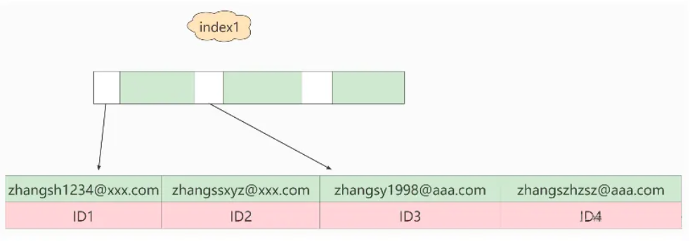

以及

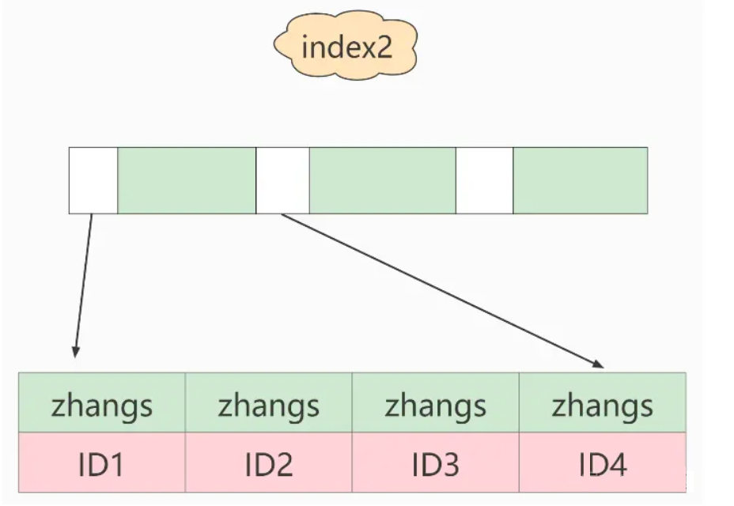

**如果使用的是index1**（即email整个字符串的索引结构），执行顺序是这样的：

- 从index1索引树找到满足索引值是’[zhangssxyz@xxx.com](https://link.juejin.cn?target=mailto%3Azhangssxyz%40xxx.com)’的这条记录，取得ID2的值；
- 到主键上查到主键值是ID2的行，判断email的值是正确的，将这行记录加入结果集；
- 取index1索引树上刚刚查到的位置的下一条记录，发现已经不满足email=’[zhangssxyz@xxx.com](https://link.juejin.cn?target=mailto%3Azhangssxyz%40xxx.com)’的条件了，循环结束。

这个过程中，只需要回主键索引取一次数据，所以系统认为只扫描了一行。

**如果使用的是index2**（即email(6)索引结构），执行顺序是这样的：

- 从index2索引树找到满足索引值是’zhangs’的记录，找到的第一个是ID1；
- 到主键上查到主键值是ID1的行，判断出email的值不是’[zhangssxyz@xxx.com](https://link.juejin.cn?target=mailto%3Azhangssxyz%40xxx.com)’，这行记录丢弃；
- 取index2上刚刚查到的位置的下一条记录，发现仍然是’zhangs’，取出ID2，再到ID索引上取整行然后判断，这次值对了，将这行记录加入结果集；
- 重复上一步，直到在idxe2上取到的值不是’zhangs’时，循环结束。

也就是说使用前缀索引，定义好长度，就可以做到既节省空间，又不用额外增加太多的查询成本。前面已经讲过区分度，区分度越高越好。因为区分度越高，意味着重复的键值越少。

**结论：**使用前缀索引就用不上覆盖索引对查询性能的优化了，这也是你在选择是否使用前缀索引时需要考虑的一个因素。
