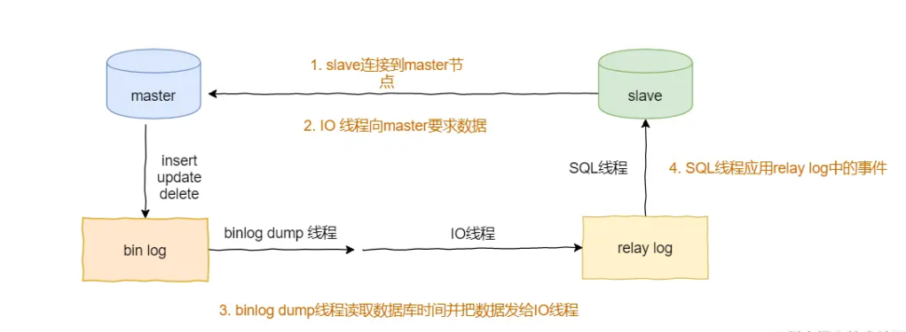
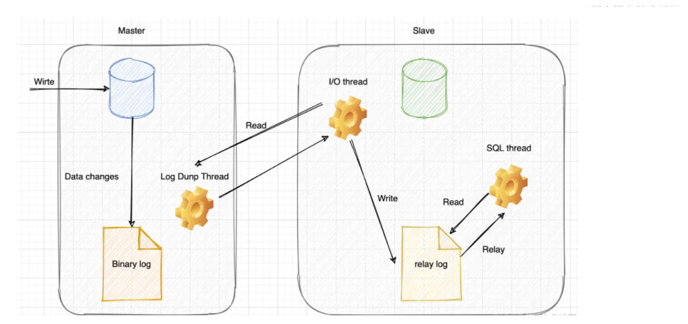
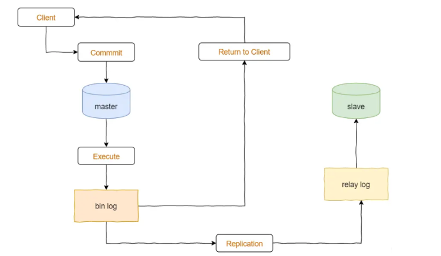
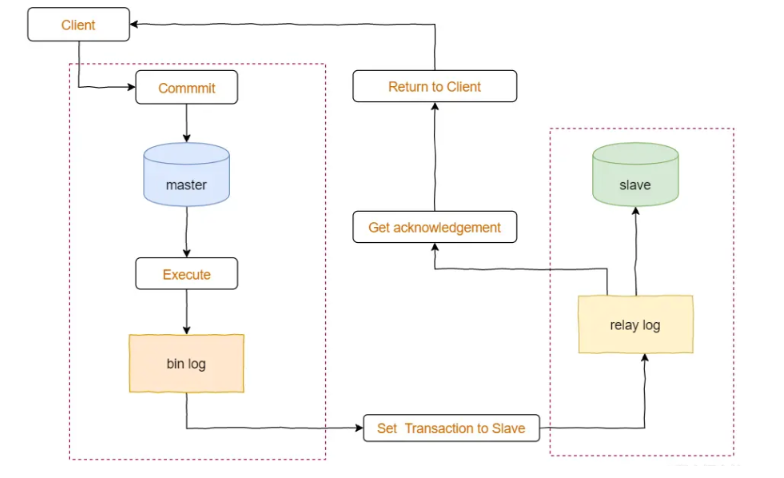

### 1. 主从复制

分布式扩展中最常用的一种模式就是主从复制，主从复制的主要作用是通过读写分离提高数据库的并发性能。

**复制**指将主数据库的DDL(data definded language) 和 DML（CURD） 操作通过二进制日志（bin log）传到从库服务器中，然后在从库上对这些日志重新执行，从而使得从库和主库的数据保持同步。Mysql支持一台主库同时向多台从库进行复制， 从库同时也可以作为其他从服务器的主库，实现链状复制。

> Mysql默认使用**异步复制**。

#### 1.1 原理

主从复制的原理如下所示，假设此时为单主单从模式：

如上图所示：

- 当master节点执行insert、update和delete等DML操作时，对应的语句会按序写入到bin log中
- slave节点需要使用mater节点提供的账号和密码连接到mater节点，并且对每一个slave节点都创建一个binlog dump线程
- 当master节点的binlog发生改变时，binlog dump线程会通知所有的slave节点，并将相应的binlog内容推送到slave节点
- 当IO线程接受到binglog内容后，就将内容写入到slave节点本地的relay log中
- SQL线程就会读取IO线程写入的relay log，并且根据relay log的内容对slave节点的数据库做相应的操作；操作执行成功后，relay log中的内容将会被删除

#### 1.2 复制方式

由于主从复制依赖于二进制日志文件（binlog），而binlog有三种格式：

- **Statement**：基于SQL语句级别，记录每条修改数据的SQL语句
- **Row**：基于行级别，记录每行数据的详细变化；一致性更好，但更大
- **Mixed**：混合模式，默认使用Statement

**开启二进制文件**

- log_bin=master-bin

因此，主从复制也就有三种方式：

- binlog_format=Statement：基于SQL语句的复制
- binlog_format=Row：基于行的复制
- binlog_format=Mixed：混合复制模式

#### 1.3 优势

主从复制的优势主要包含如下几点：

- 当master节点发生故障时，可以快速的切换到slave节点继续提供服务，保证数据库服务的**可用性**
- 可以在salve节点上执行查询操作，而master节点执行更新等改变数据的操作，从而实现**读写分离**，降低mater节点的访问压力
- 可以在slave节点中执行**备份**，以避免备份期间影响mater节点的服务

### 2. 半同步复制

Mysql默认使用的是异步复制，由于异步操作所带来的延迟，当主库由于某种原因导致binlog日志的丢失，没有成功的同步到从库上，那么就会造成主从之间的不一致性。导致不一致性出现的原因是因为：**异步复制中，主库在执行完对binlog的commit操作后即可返回客户端，无需等待binlog日志成功的传送到从库上**。

而半同步复制执行时，为了保证主库中的binlog能够被可靠的复制到从库上，主库在每次事务成功提交后，并不是立即返回给客户端，而是等待binlog**至少在一个从库**上成功提交并写入到relaylog中。只有binlog成功的写入到了其中的一个从库中，主库才会给客户端反馈。

半同步通过上述的操作保证了主库的binlog和其中某一个从库的relaylog中都至少成功了保存了日志，进一步的保证了数据的完整性和一致性。

如上所示，只要主库相关的操作过程中，因为某种原因导致事务未成功提交，这时从库也没有收到主库的binlog日志，从而保证了数据的一致性。另外，如果在从主库传输binlog到从库的过程中发生问题，那么主库会等待一段时间，如果之后仍然没有传输成功，那么复制方式会调整为异步复制，等待事务成功提交后再反馈给客户端。

### 3. 异步复制

一个主库，一个或多个从库，数据**异步同步**到从库。

这种模式下，主节点**不会主动推送数据**到从节点，主库在执行完客户端提交的事务后会立即将结果返给给客户端，并不关心从库是否已经接收并处理。

这样就会有一个问题，主节点如果崩溃掉了，此时主节点上已经提交的事务可能并没有传到从节点上，如果此时，强行将从提升为主，可能导致新主节点上的数据不完整。