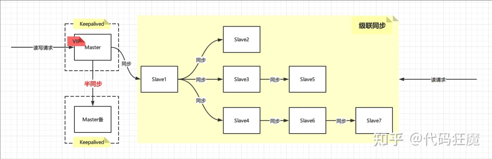
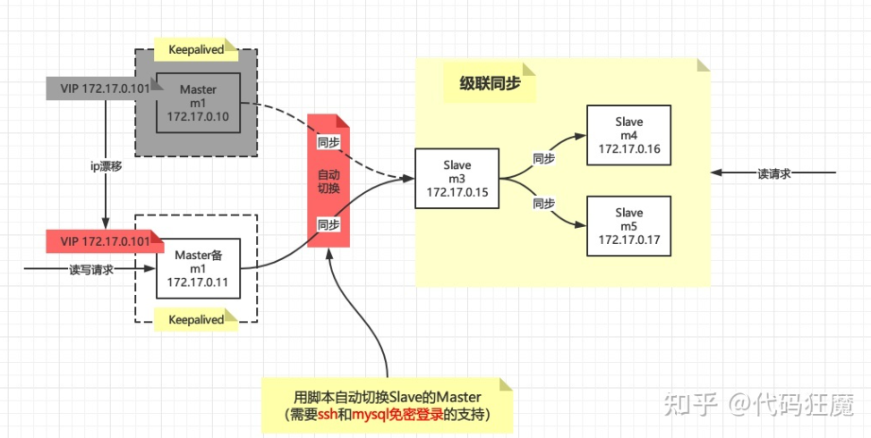
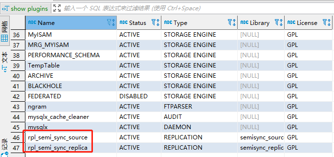
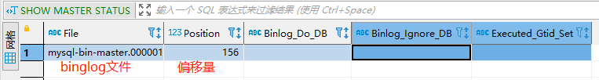
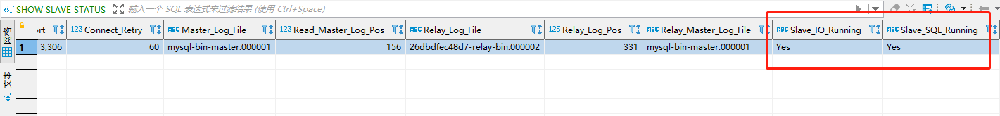
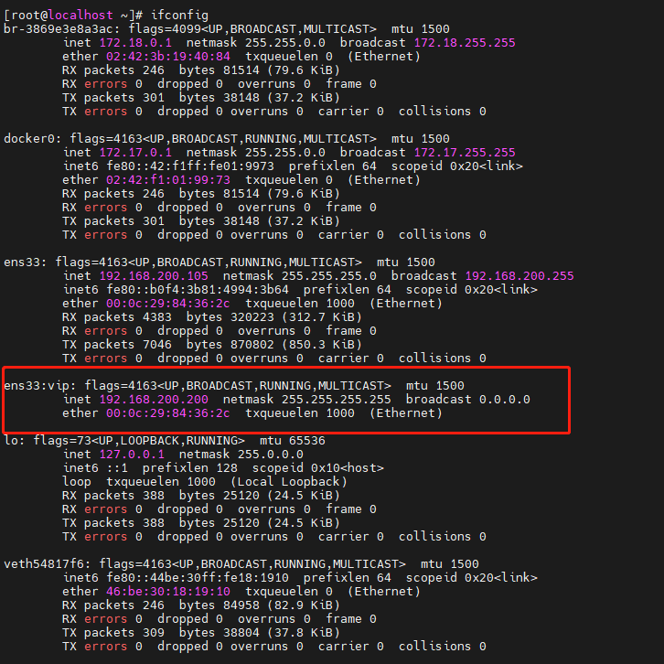
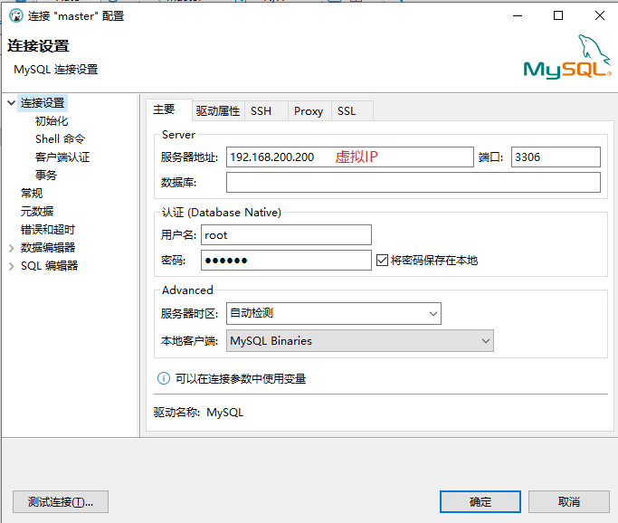
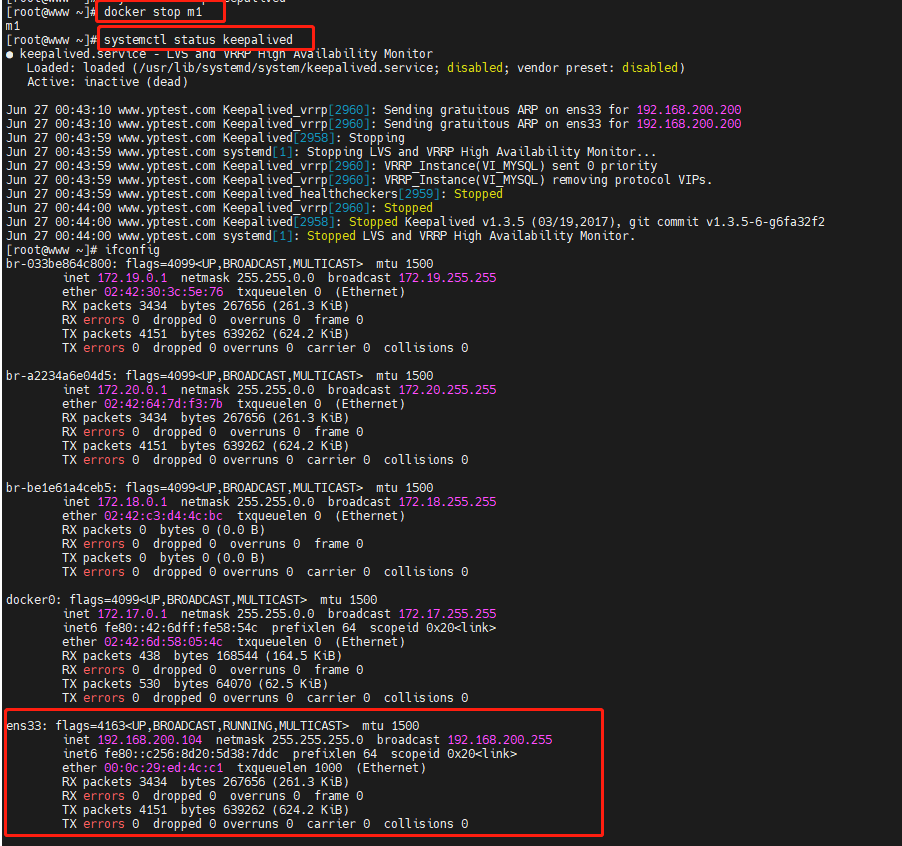
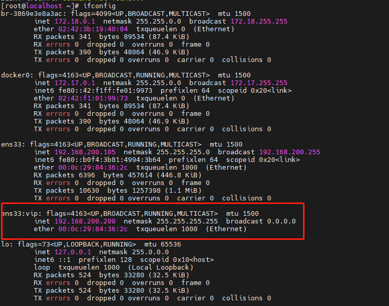

# MySQL主从架构

## 一、背景

​		随着公司业务的发展，对数据库的要求越来越高，以前的单机MySQL肯定是玩不转了，亟需升级成MySQL集群，这是一个公司在业务发展时不得不面临的问题。就单机MySQL而言，自己玩玩可以，运用到实际项目中，那肯定要挨批的。一方面数据不安全，万一数据库的电脑磁盘坏了，就坑了。另一方面数据库的并发能力是有限的，一般并发数200～500就差不多了，当然你要继续往上增，也是可以的，那就影响整体Mysql的响应时间。

## 二、集群方案

### 2.1 主从数据同步（主写从读）

具体配置参照本文档下的《主从架构配置》文件

该配置只能用于主写从读，如果向从数据库写入数据，由于不能将数据同步到主数据库，从而导致主从数据库不一致的问题。

### 2.2 普通双机热备



优点：

- 读写分离，增加整体性能
- Master有故障转移（采用Keepalived实现），当Master宕机时，备用Master自动顶上去，且IP无变化（VIP）
- Master和备用Master之间采用半同步机制，最大程度上保证数据一致性

缺点：

- Master故障转移时，Slave需要用脚本手动切换，增加复杂度
- 数据存在一致性问题，因为异步，所以Slave的数据一定不是最新的，需要等待一个时间窗后才能读取
- Slave过多时Slave对Master的负载以及网络带宽都会成为一个严重的问题

### 2.3 Keepalived双主热备

#### 2.3.1 架构

m1和m2作为双主，**互为主从**且同步方式为**半同步**，为什么呢？因为这样在Master主机宕机恢复，对Master备机写入的数据也能重新同步到Master主，此时的主备角色正好颠倒过来，所以要设置互为主从且半同步。

m3作为级联复制的中间节点，新增加m4和m5作为新的Slave，正常情况下架构如下：


当发生故障时，VIP自动漂移到Master备机上面，且通过Keepalived的状态脚本自动切换Slave，即m3到Master备机上，当Master主机（m1）恢复时，VIP又会自动漂移到m1上并且m3也会自动切换到m1上！

Keepalived状态切换脚本需要ssh和mysql免密登录的支持，其原理就是m1或者m2检测到自己成为Master角色时，通过ssh登录到m3上执行MySQL的切换命令



> 此文档只实现了Keepalive主备切换功能（即m1与m2的切换），如需切实现slave由m1切换到m2，请参照其他文档，添加相应脚本。

#### 2.3.2 环境准备

Mysql 版本： 8.0.27

```shell
docker run -d --name m1 -p 3306:3306 -e MYSQL_ROOT_PASSWORD=123456 -e TZ="Asia/Shanghai" -v /home/rebei/m1/config:/etc/mysql/conf.d mysql --authentication_policy=mysql_native_password

docker restart m1
docker exec -it m1 mysql -uroot -p123456
-----------------------------------------------------------------
docker run -d --name m2 -p 3306:3306 -e MYSQL_ROOT_PASSWORD=123456 -e TZ="Asia/Shanghai" -v /home/rebei/m2/config:/etc/mysql/conf.d mysql --authentication_policy=mysql_native_password

docker restart m2
docker exec -it m2 mysql -uroot -p123456
-----------------------------------------------------------------

#-----------------------------------------------------------------
#docker run -d --name s1 -p 4306:3306 -e MYSQL_ROOT_PASSWORD=123456 -e TZ="Asia/Shanghai" -v #/home/rebei/s1/config:/etc/mysql/conf.d mysql --authentication_policy=mysql_native_password

#docker restart s1
#docker exec -it s1 mysql -uroot -p123456
-----------------------------------------------------------------
```

注意：需要确认一下每台设备上的server_uuid是否相同，如果相同，则需重置，否则后面的主从复制会出错。

```shell
docker exec -it m1 /bin/sh
cat /var/lib/mysql/auto.cnf
#如果一致，则删除重新启动服务
rm -f /var/lib/mysql/auto.cnf
docker restart m1
```

#### 2.3.3 双主配置

> Master主机：192.168.200.104
>
> Master备机：192.168.200.105

- Master主机（m1）

  ```shell
  vim /home/rebei/m1/config/my.cnf
  # 修改配置
  [mysqld]
  user=mysql
  character-set-server=utf8mb4
  collation-server=utf8mb4_general_ci
  log-bin=mysql-bin-master
  server_id=1
  log_replica_updates=1
  plugin-load="rpl_semi_sync_source=semisync_source.so;rpl_semi_sync_replica=semisync_replica.so"
  rpl_semi_sync_source_enabled=1
  rpl_semi_sync_replica_enabled=1
  
  [client]
  default-character-set=utf8mb4
  ```

  

- Master备机（m2）

  说明：server_id必须与m1不同

  ```shell
  vim /home/rebei/m2/config/my.cnf
  # 修改配置
  [mysqld]
  user=mysql
  character-set-server=utf8mb4
  collation-server=utf8mb4_general_ci
  log-bin=mysql-bin-master
  server_id=2
  log_replica_updates=1
  plugin-load="rpl_semi_sync_source=semisync_source.so;rpl_semi_sync_replica=semisync_replica.so"
  rpl_semi_sync_source_enabled=1
  rpl_semi_sync_replica_enabled=1
  
  [client]
  default-character-set=utf8mb4
  ```

  可使用show plugins查看主从插件是否安装成功

  ```sql
  show plugins
  ```

  

- 创建同步用户

  在m1与m2机器的MySQl上执行一下脚本

  ```sql
  DROP USER 'repl'@'%' ;
  CREATE USER 'repl'@'%' IDENTIFIED BY 'repl';
  GRANT REPLICATION SLAVE ON *.* TO 'repl'@'%';
  flush privileges;
  ```

  查看Matser状态

  ```sql
  SHOW MASTER STATUS;
  ```

  

#### 2.3.4 互为主从

  （1）将Master主挂载成为Master备机的从机

  ```sql
  STOP SLAVE;
  RESET SLAVE;
  
  CHANGE MASTER TO
  MASTER_HOST='192.168.200.105',
  MASTER_USER='repl',
  MASTER_PASSWORD='repl',
  MASTER_LOG_FILE='mysql-bin-master.000001',
  MASTER_LOG_POS=156;
  
  START SLAVE;
  ```

  说明：

  MASTER_HOST：主机IP（该sql脚本是在从机上执行）

  MASTER_LOG_FILE：主机对应的偏移文件

  MASTER_LOG_POS：主机对应的偏移量

  （2）将Master备机挂载成为Master主机的从机，需修改对应的IP及偏移量

  ```sql
  STOP SLAVE;
  RESET SLAVE;
  
  CHANGE MASTER TO
  MASTER_HOST='192.168.200.104',
  MASTER_USER='repl',
  MASTER_PASSWORD='repl',
  MASTER_LOG_FILE='mysql-bin-master.000001',
  MASTER_LOG_POS=156;
  
  START SLAVE;
  ```

- 查看下是否挂载成功

  ```sql
  SHOW SLAVE STATUS;
  ```

  

- 查看半同步是否开启

  ```sql
  show variables like 'rpl_semi_sync_source_enabled';
  show variables like 'rpl_semi_sync_replica_enabled';
  ```

最后在自行测试下载Master主机上面写数据Master备机能否同步，反过来再测试下。

#### 2.3.5 配置keepalived

（1）安装keepalived

```shell
yum install -y keepalived
```

> 注意：Keepalived就安装在Docker运行的宿主机上面，安装在docker里面IP无法绑定(亲测)

（2）Master主机配置

```shell
vi /etc/keepalived/keepalived.conf
```

```conf
! Configuration File for keepalived

global_defs {
    router_id HA-M1
    script_user root
    enable_script_security
}

vrrp_script chk_mysql {
    script /etc/keepalived/chk_mysql.sh
    interval 60 
    fall 3
    rise 2
}

vrrp_instance VI_MYSQL {
    state MASTER
    interface ens33
    virtual_router_id 100
    priority 100
    advert_int 1
    
    authentication {
        auth_type PASS
        auth_pass 1111
    }
    
    virtual_ipaddress {
        192.168.200.200 dev ens33 label ens33:vip
    }
    
    track_script {
        chk_mysql
    }
}

```

- router_id：标识，两台需不一样
- state MASTER：表明这台是Master角色
- priority：优先级，MASTER角色比BACKUP高！
- virtual_router_id：虚拟路由编号，两台需要一致
- 192.168.200.200 dev ens33 label ens33:vip：这就是我们配置的VIP：192.168.200.200
- script /etc/keepalived/chk_mysql.sh：MySQL的检测脚本，定时去检测MySQL进程是否挂掉，如果挂掉，在脚本里面重启之，定时通过interval配置，上面配置的是2s检测一次

> 注意：interval如果过小可能会导致如下错误：/etc/[keepalived](https://so.csdn.net/so/search?q=keepalived&spm=1001.2101.3001.7020)/chk_nginx.sh exited due to signal 15

（3）Master备机配置

```shell
vi /etc/keepalived/keepalived.conf
```


```shell
! Configuration File for keepalived

global_defs {
    router_id HA-M2  #router id配置,与主机不一致
    script_user root
    enable_script_security
}

vrrp_script chk_mysql {	#定义MYSQL状态检测脚本
    script /etc/keepalived/chk_mysql.sh
    interval 30
    fall 3
    rise 2
}

vrrp_instance VI_MYSQL {
    state BACKUP   	#角色配置
    interface ens33	#网卡配置
    virtual_router_id 100 #必须与主机一致
    nopreempt
    priority 50		#优先级配置，必须小于MASTER
    advert_int 1
    # mcast_src_ip 192.168.200.104
    
    authentication {
        auth_type PASS
        auth_pass 1111
    }
    
    virtual_ipaddress {
        192.168.200.200 dev ens33 label ens33:vip #虚拟IP
    }
    
    track_script {
        chk_mysql
    }
}

```

（3）创建Mysql状态检测脚本

```shell
touch /etc/keepalived/chk_mysql.sh
chmod +x /etc/keepalived/chk_mysql.sh
```

chk_mysql.sh

```shell
cat > /etc/keepalived/chk_mysql.sh <<EOF
#!/bin/bash
MYSQL=/usr/bin/mysql
MYSQL_HOST=192.168.3.254
MYSQL_USER=root
MYSQL_PASSWORD=123456
CHECK_TIME=3
  
#mysql  is working MYSQL_OK is 1 , mysql down MYSQL_OK is 0
  
MYSQL_OK=1
  
function check_mysql_helth (){
    $MYSQL -h $MYSQL_HOST -u$MYSQL_USER -p${MYSQL_PASSWORD} -e "show status;" >/dev/null 2>&1
    if [ $? = 0 ] ;then
    MYSQL_OK=1
    else
    MYSQL_OK=0
    fi
    return $MYSQL_OK
}
while [ $CHECK_TIME -ne 0 ]
do
    let "CHECK_TIME -= 1"
    check_mysql_helth
if [ $MYSQL_OK = 1 ] ; then
    CHECK_TIME=0
    exit 0
fi
if [ $MYSQL_OK -eq 0 ] &&  [ $CHECK_TIME -eq 0 ]
then
    systemctl stop keepalived
    exit 1
fi
sleep 1
done
EOF
```

（4）启动keepalived，并查看虚拟IP是否绑定成功

```shell
#实时查看keepalived启动日志，看是否有错误
tail -f /var/log/messages
#启动keepalived
systemctl start keepalived
#查看虚拟IP是否绑定成功
ifconfig
```



（5）安装Mysql客户端（也可直接通过Windows连接）

```shell
wget https://dev.mysql.com/get/mysql80-community-release-el7-5.noarch.rpm
rpm -ivh mysql80-community-release-el7-5.noarch.rpm
yum install mysql-community-client
```

#### 2.3.6 测试

- 确认是否可以通过虚拟IP连接MYSQL

  先分别确认m1与m2容器中的MYSQL是否可以正常访问，再是否可以确认虚拟IP访问MYSQL

  

- 查看keepalived是否实现主备切换功能

  Master主机

  ```shell
  #关闭Master主机的MySQL服务
  docker stop m1
  查看keepalived状态
  systemctl status keepalived
  #查看虚拟IP是否绑定情况（V此时IP已经漂移到备机）
  ifconfig
  ```

  

  Master备机

  ```shell
  ifconfig
  ```

  

  

  
