## 数据库分库分表方案

## 一、数据库瓶颈

不管是IO瓶颈，还是CPU瓶颈，最终都会导致数据库的活跃连接数增加，进而逼近甚至达到数据库可承载活跃连接数的阈值。在业务Service来看就是，可用数据库连接少甚至无连接可用。接下来就可以想象了吧（并发量、吞吐量、崩溃）。

1、IO瓶颈

- 磁盘读IO瓶颈，热点数据太多，数据库缓存放不下，每次查询时会产生大量的IO，降低查询速度 -> 分库和垂直分表。
- 网络IO瓶颈，请求的数据太多，网络带宽不够 -> 分库。

2、CPU瓶颈

- SQL问题，如SQL中包含join，group by，order by，非索引字段条件查询等，增加CPU运算的操作 -> SQL优化，建立合适的索引，在业务Service层进行业务计算。
- 单表数据量太大，查询时扫描的行太多，SQL效率低，CPU率先出现瓶颈 -> 水平分表

## 二、分库分表

> 分表：从表面意思上看呢，就是把一张表分成N多个小表
>
> 分区：分区呢就是把一张表的数据分成N多个区块，这些区块可以在同一个磁盘上，也可以在不同的磁盘上

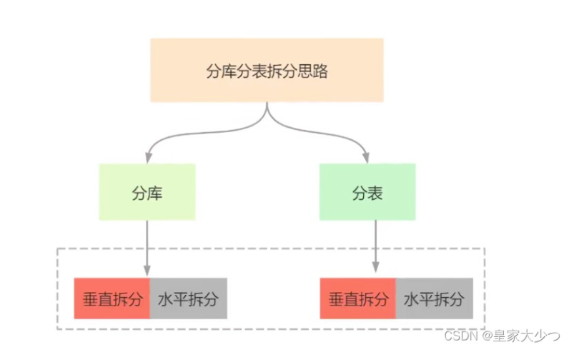

### 1. 水平拆分

#### 1.1 水平分库

如图，按会员库拆分，拆分成会员1库，会员2库，以userId拆分，userId尾号0-5为1库
6-9为2库，还有其他方式，进行取模，偶数放到1库，奇数放到2库

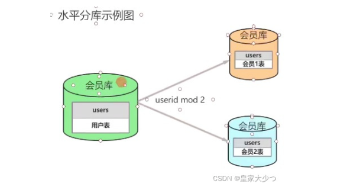

#### 1.2 水平分表


#### 1.3 水平拆分特点

- 每个库（表）的结构都一样
- 每个库（表）的数据都不一样
- 每个库（表）的并集是全量数据

#### 1.4 水平拆分优缺点

优点：

- 单库/单表的数据保持在一定量（减少），有助于性能提高
- 提高了系统的稳定性和负载能力
- 拆分表的结构相同，程序改造较少。

缺点:

- 数据的扩容很有难度维护量大
- 拆分规则很难抽象出来
- 分片事务的一致性问题部分业务无法关联join，只能通过java程序接口去调用

### 2. 垂直拆分

#### 2.1 垂直分库

根据业务拆分，如图，电商系统，拆分成订单库，会员库，商品库

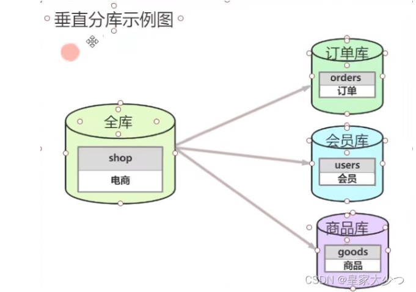


#### 2.2 垂直分表

据业务去拆分表，如图，把user表拆分成user_base表和user_info表，use_base负责存储登录，user_info负责存储基本用户信息

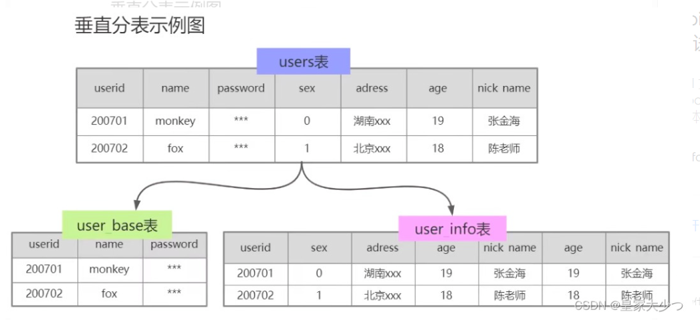

#### 2.3 垂直拆分特点

- 每个库（表）的结构都不一样
- 每个库（表）的数据至少一列一样
- 每个库（表）的并集是全量数据

#### 2.4 垂直拆分优缺点

优点：

- 拆分后业务清晰（专库专用按业务拆分）
- 数据维护简单，按业务不同，业务放到不同机器上

缺点:

- 如果单表的数据量，读写压力大
- 受某种业务决定，或者被限制，也就是说一个业务往往会影响到数据库的瓶颈（性能问题，如双十一抢购）
- 部分业务无法关联join，只能通过java程序接口去调用，提高了开发复杂度

### 3.  分库分表带来的问题

分库分表能有效的缓解单机和单库带来的性能瓶颈和压力，突破网络IO、硬件资源、连接属的瓶颈，同时也带来了一些问题

- 分库操作带来的分布式事务问题

  分库分表把数据分布到不同的数据库服务器，不可避免带来**分布式事务问题**

- 跨节点数据库Join关联查询

  数据库切分前，多表关联查询，可以通过sql join进行实现。分库分表后，数据可能分布在不同的节点上，sql join带来的问题就比较麻烦

- 执行的SQL排序、翻页、函数计算问题

  分库后，数据分布在不同的节点上， 跨节点多库进行查询时，会出现limit分页、order by排序等问题，而且当排序字段非分片字段时，更加复杂了，要在不同的分片节点中将数据进行排序并返回，然后将不同分片返回的结果集进行汇总和再次排序（也会带来更多的CPU/IO资源损耗）

- 数据库全局主键重复问题

  常规表的id是使用自增id进行实现，分库分表后，由于表中数据同时存在不同数据库中，如果用自增id，则会出现冲突问题

- 容量规划,分库分表后二次扩容问题

  业务发展快，初次分库分表后，满足不了数据存储，导致需要多次扩容

### 4. 分库分表的实现技术

- shardingJDBC

  基于AOP原理，在应用程序对本地执行的SQL进行拦截，解析，改写，路由处理。需要自行编码配置实现，支持java语言，性能较高。

- MyCat

  数据库分库分表中间件，不用调整代码即可实现分库分表，支持多种语言，性能不及shardingJDBC。

## 三、MyCat V1.6

### 1. 入门概述

#### 1.1 是什么

Mycat 是数据库中间件。 

- 数据库中间件

  中间件：是一类连接软件组件和应用的计算机软件，以便于软件各部件之间的沟通。

  例子：Tomcat，web中间件。

  数据库中间件：连接java应用程序和数据库

- 为什么要用Mycat？

  ① Java与数据库紧耦合。 

  ② 高访问量高并发对数据库的压力。 

  ③ 读写请求数据不一致

- 数据库中间件对比

  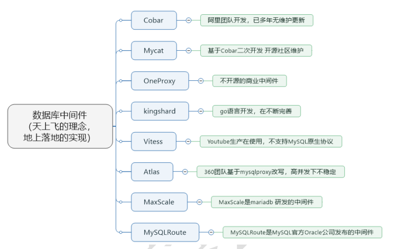

#### 1.2 干什么

- 读写分离

  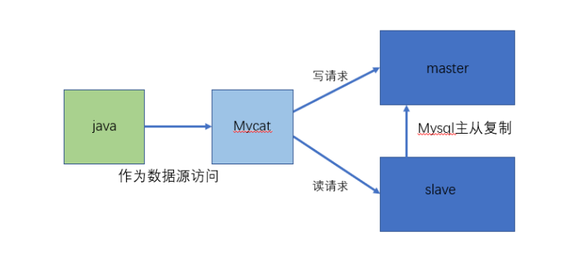

- 数据分片

  垂直拆分（分库）、水平拆分（分表）、垂直+水平拆分（分库分表）

  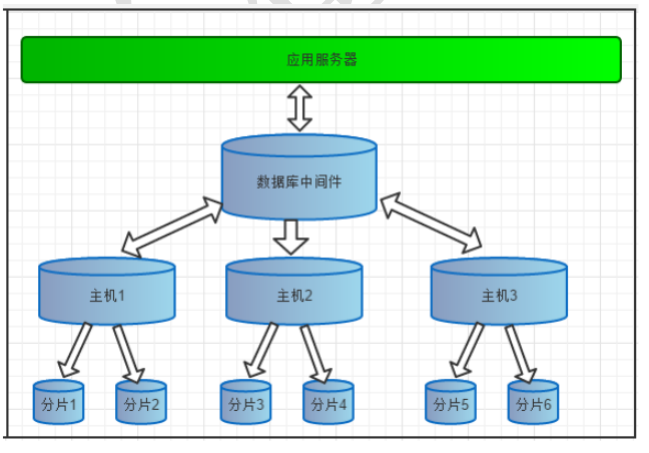

- 多数据源整合

  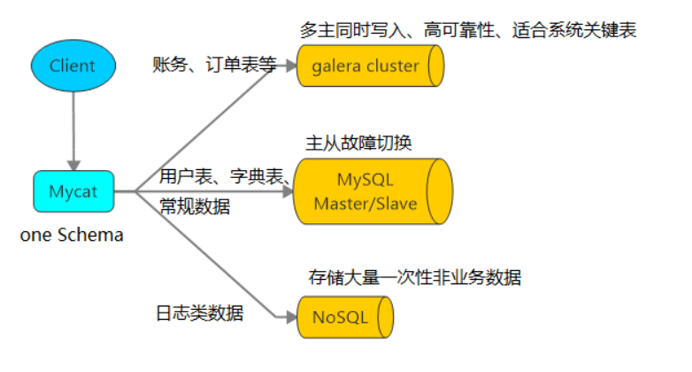

#### 1.3 原理

Mycat 的原理中最重要的一个动词是“拦截”，它拦截了用户发送过来的 SQL 语句，首先对 SQL 语句做了一些特定的分析：如分片分析、路由分析、读写分离分析、缓存分析等，然后将此 SQL 发往后端的真实数据库，并将返回的结果做适当的处理，最终再返回给用户。

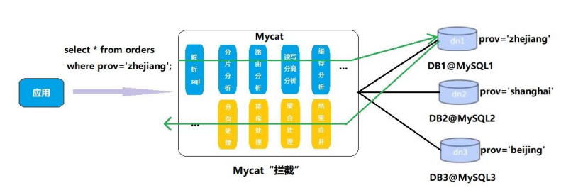

这种方式把数据库的分布式从代码中解耦出来，程序员察觉不出来后台使用 Mycat 还是MySQL。

### 2. 安装启动

#### 2.1 安装

 下载目录：http://mycat.org.cn

- 解压后即可使用

  ```shell
  #此处使用：Mycat-server-1.6.7.1
  tar -zxvf Mycat-server-1.6.7.1-release-20190627191042-linux.tar.gz
  ```

- 上传mysql8的驱动到mycat的lib目录，并赋予777的权限

  ​	为了更好的兼容MYSQL8，需替换相关Jar包

  - 删除/home/mysql/mycat/lib/mysql-connector-java-5.1.35.jar
  - 添加mysql-connector-java-8.0.23.jar
  
- 搭建Mysql环境 （基于Docker）

  ```shell
  docker run -d --name m1 -p 3306:3306 -e MYSQL_ROOT_PASSWORD=123456 -e TZ="Asia/Shanghai" -v /home/mysql/config:/etc/mysql/conf.d mysql --authentication_policy=mysql_native_password
  ```

- 三个配置文件

  ①schema.xml：定义逻辑库，表、分片节点等内容

  ②rule.xml：定义分片规则

  ③server.xml：定义用户以及系统相关变量，如端口等

#### 2.2 启动

- 修改配置文件server.xml

  修改用户信息，与MySQL区分，如下：

  ```xml
  ## 必须配置如果不配置连接不上MySQL8
  <property name="defaultSqlParser">druidparser</property>
  <property name="useHandshakeV10">1</property>
  
  #只需取消注释即可
  <property name="serverPort">8066</property> <property name="managerPort">9066</property> 
  <property name="idleTimeout">300000</property> <property name="bindIp">0.0.0.0</property>
  <property name="dataNodeIdleCheckPeriod">300000</property>
  <property name="frontWriteQueueSize">4096</property> <property name="processors">32</property>
  
  <!------------------------------>
  <user name="root">
   <property name="password">123456</property>
   <property name="schemas">TESTDB</property>
  </user>
  ```

- 修改配置文件 schema.xml

  ```xml
  <?xml version="1.0"?>
  <!DOCTYPE mycat:schema SYSTEM "schema.dtd">
  <mycat:schema xmlns:mycat="http://io.mycat/">
  	<schema name="TESTDB" checkSQLschema="true" sqlMaxLimit="100" randomDataNode="dn1">
  		<table name="t_user" dataNode="dn1" />
  	</schema>
   <dataNode name="dn1" dataHost="localhost1" database="testdb" />
  	<dataHost name="localhost1" maxCon="1000" minCon="10" balance="0"
  			  writeType="0" dbType="mysql" dbDriver="jdbc" switchType="1"  slaveThreshold="100">
  		<heartbeat>select user()</heartbeat>
  		<!-- can have multi write hosts -->
  		<writeHost host="hostM1" url="jdbc:mysql://192.168.200.105:3306?useSSL=false&amp;serverTimezone=PRC" user="root"
  				   password="123456">
  		</writeHost>
      </dataHost>
  </mycat:schema>
  ```


- 启动Mycat`./mycat start`并测试环境

  ```shell
  cd /home/mycat/bin/
  #需创建以下目录，否则mycat会启动失败
   mkdir /home/mycat/logs/
   #启动mycat
  ./mycat start
  #查看mycat启动状态
  ./mycat status
  #如果启动失败，可查看日志
  cat /home/mysql/mycat/logs
  ```

- 测试MyCat

  此处既可以通过Linux来验证，也可通过Windows客户端工具来验证
  
  ```shell
  mysql -h 192.168.200.104 -P8066 -uroot -p123456
  show databases;
  +----------+
  | DATABASE |
  +----------+
  | TESTDB   |
  +----------+
  1 row in set (0.00 sec)
  ```

### 3. 搭建读写分离

我们通过 Mycat 和 MySQL 的主从复制配合搭建数据库的读写分离，实现 MySQL 的高可用性。

我们将搭建：一主一从、双主双从两种读写分离模式。 

#### 3.1 搭建一主一从

一个主机用于处理所有写请求，一台从机负责所有读请求，架构图如下

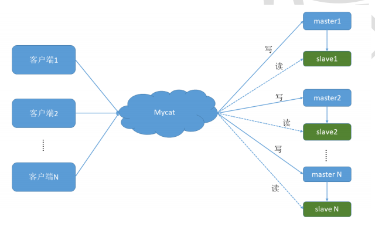

- MYSQL主从复制原理

  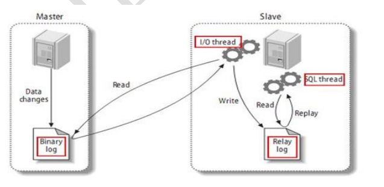

- 主从搭建

  此处可参照《性能优化\06 数据库性能优化\02 架构优化\主从架构配置

  验证是否实现读写分离

  ```sql
  -- 在主机插入表
  CREATE TABLE `t_test` (
    `id` bigint NOT NULL AUTO_INCREMENT,
    `name` varchar(100) NOT NULL,
    `age` int NOT NULL,
    PRIMARY KEY (`id`)
  ) ENGINE=InnoDB DEFAULT CHARSET=utf8mb4 COLLATE=utf8mb4_0900_ai_ci;
  
  insert into `t_test` values (1,"zhangsan",14);
  
  -- 在从机查询
  SELECT * FROM `t_test`;
  ```

- 修改配置文件schema.xml

  修改<dataHost>的balance属性，通过此属性配置读写分离的类型

  （1）balance="0", 不开启读写分离机制，所有读操作都发送到当前可用的 writeHost 上。

  （2）balance="1"，全部的 readHost 与 stand by writeHost 参与 select 语句的负载均衡，简单的说，当双主双从模式(M1->S1，M2->S2，并且 M1 与 M2 互为主备)，正常情况下，M2,S1,S2 都参与 select 语句的负载均衡。

  （3）balance="2"，所有读操作都随机的在 writeHost、readhost 上分发。

  （4）balance="3"，所有读请求随机的分发到 readhost 执行，writerHost 不负担读压力

  为了能看到读写分离的效果，把balance设置成2，会在两个主机间切换查询

  ```xml
  <?xml version="1.0"?>
  <!DOCTYPE mycat:schema SYSTEM "schema.dtd">
  <mycat:schema xmlns:mycat="http://io.mycat/">
      <schema name="TESTDB" checkSQLschema="false" sqlMaxLimit="100" dataNode="dn1">
      </schema>
      <dataNode name="dn1" dataHost="host1" database="test_db" />
      <dataHost name="host1" maxCon="1000" minCon="10" balance="2" writeType="0" dbType="mysql" dbDriver="native"
          switchType="1" slaveThreshold="100">
          <heartbeat>select user()</heartbeat>
          <!-- can have multi write hosts -->
          <writeHost host="hostM1" url="192.168.200.105:4306" user="root" password="123456">
              <!-- can have multi read hosts -->
              <readHost host="hostS1" url="192.168.200.105:5306" user="root" password="123456" />
          </writeHost>
      </dataHost>
  </mycat:schema>
  ```

- 验证读写分离

  （1）为了测试，先在写从机数据库表t_test中插入数据，然后再在主机数据库表t_test中插入数据（操作会造成主从数据不一致，即主从复制异常）

  ```sql
  -- 从机
  INSERT INTO test_db.t_test (name, age) VALUES('host5306', 18);
  -- 主机
  INSERT INTO test_db.t_test (name, age) VALUES('host4306', 18);
  ```

  （2）在Mycat里查询t_test表,可以看到查询语句在主从两个主机间切换，测试结果如下：

  ```shell
  mysql -h 192.168.200.104 -P8066 -uroot -p123456
  mysql> use TESTDB;
  mysql> select * from t_test;
  +----+----------+-----+
  | id | name     | age |
  +----+----------+-----+
  |  1 | zhangsan |  14 |
  |  2 | host4306 |  19 |
  +----+----------+-----+
  2 rows in set (0.01 sec)
  
  mysql> select * from t_test;
  +----+----------+-----+
  | id | name     | age |
  +----+----------+-----+
  |  1 | zhangsan |  14 |
  |  2 | host4306 |  19 |
  +----+----------+-----+
  2 rows in set (0.00 sec)
  
  mysql> select * from t_test;
  +----+----------+-----+
  | id | name     | age |
  +----+----------+-----+
  |  1 | zhangsan |  14 |
  |  2 | host5306 |  18 |
  +----+----------+-----+
  2 rows in set (0.00 sec)
  ```

#### 3.2 双主双从

一个主机 m1 用于处理所有写请求，它的从机 s1 和另一台主机 m2 还有它的从机 s2 负责所有读请求。当 m1 主机宕机后，m2 主机负责写请求，m1、m2 互为备机。架构图如下

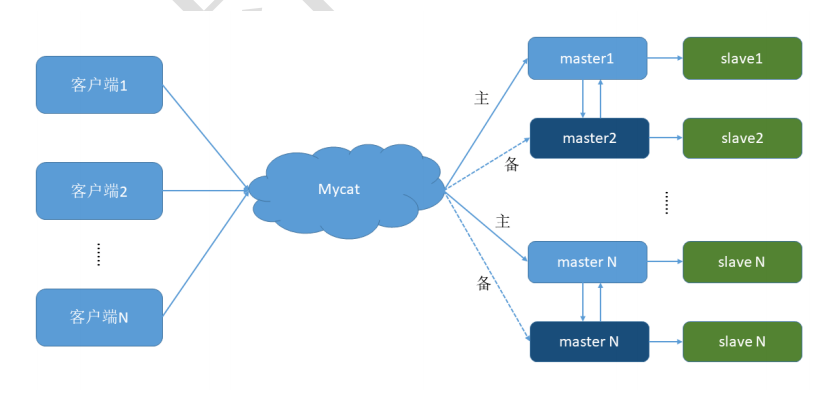


- 双主双从搭建

  此处可参照《性能优化\06 数据库性能优化\02 架构优化\02 MySQL主从架构

- 修改配置文件schema.xml

- 验证读写分离

### 4. 垂直拆分

一个数据库由很多表的构成，每个表对应着不同的业务，垂直切分是指按照业务将表进行分类，分布到不同 的数据库上面，这样也就将数据或者说压力分担到不同的库上面，如下图：

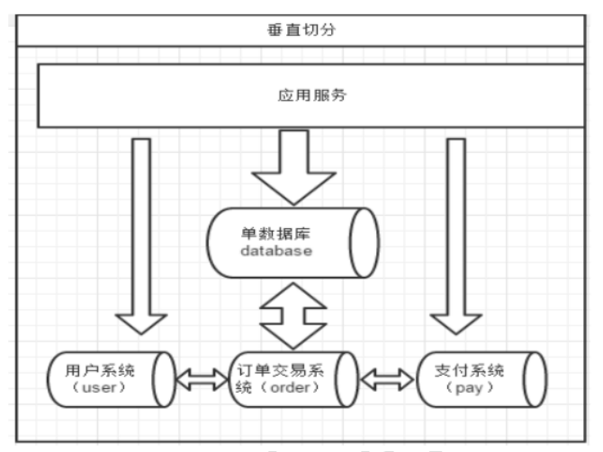

​		系统被切分成了，用户，订单交易，支付几个模块

#### 4.1 如何划分表

问题：在两台主机上的两个数据库中的表，能否关联查询？

答案：不可以关联查询。

分库的原则：有紧密关联关系的表应该在一个库里，相互没有关联关系的表可以分到不同的库里。 

```sql
#客户表 rows:20万
CREATE TABLE customer(
 id INT AUTO_INCREMENT,
 NAME VARCHAR(200),
 PRIMARY KEY(id)
);
#订单表 rows:600万
CREATE TABLE orders(
 id INT AUTO_INCREMENT,
 order_type INT,
 customer_id INT,
 amount DECIMAL(10,2),
 PRIMARY KEY(id)
); 
#订单详细表 rows:600万
CREATE TABLE orders_detail(
 id INT AUTO_INCREMENT,
 detail VARCHAR(2000),
 order_id INT,
 PRIMARY KEY(id)
);
#订单状态字典表 rows:20
CREATE TABLE dict_order_type(
 id INT AUTO_INCREMENT,
 order_type VARCHAR(200),
 PRIMARY KEY(id)
);
```

以上四个表如何分库？客户表分在一个数据库，另外三张都需要关联查询，分在另外一个数据库。

#### 4.2 实现分库

- 新增两个空白库

  分库操作不是在原来的老数据库上进行操作，需要准备两台机器分别安装新的数据库

  搭建新数据库

  ```shell
  docker run -d --name m1 -p 4306:3306 -e MYSQL_ROOT_PASSWORD=123456 -e TZ="Asia/Shanghai" -v /home/mysql/config:/etc/mysql/conf.d mysql --authentication_policy=mysql_native_password
  
  docker run -d --name m2 -p 5306:3306 -e MYSQL_ROOT_PASSWORD=123456 -e TZ="Asia/Shanghai" -v /home/mysql/config:/etc/mysql/conf.d mysql --authentication_policy=mysql_native_password
  ```

  创建表

  ```sql
  #在数据节点 dn1、dn2 上分别创建数据库 orders
  CREATE DATABASE orders;
  #在数据节点dn1上创建orders、orders_detail、dict_order_type表
  #在数据节点dn2上创建customer表
  ```

- 修改配置文件schema.xml

  ```xml
  <?xml version="1.0"?>
  <!DOCTYPE mycat:schema SYSTEM "schema.dtd">
  <mycat:schema xmlns:mycat="http://io.mycat/">
      <schema name="TESTDB" checkSQLschema="false" sqlMaxLimit="100" dataNode="dn1">
        <!-- customer表在dn2,其他默认表在dn1 -->
        <table name="customer" dataNode="dn2" ></table>
      </schema>
      <dataNode name="dn1" dataHost="host1" database="orders" />
      <dataNode name="dn2" dataHost="host2" database="orders" />
      <dataHost name="host1" maxCon="1000" minCon="10" balance="0" writeType="0" dbType="mysql" dbDriver="native"
          switchType="1" slaveThreshold="100">
          <heartbeat>select user()</heartbeat>
          <!-- can have multi write hosts -->
          <writeHost host="hostM1" url="192.168.200.105:4306" user="root" password="123456">
              <!-- can have multi read hosts -->
              <readHost host="hostS1" url="192.168.200.105:4306" user="root" password="123456" />
          </writeHost>
      </dataHost>
      <dataHost name="host2" maxCon="1000" minCon="10" balance="0" writeType="0" dbType="mysql" dbDriver="native"
          switchType="1" slaveThreshold="100">
          <heartbeat>select user()</heartbeat>
          <!-- can have multi write hosts -->
          <writeHost host="hostM2" url="192.168.200.105:5306" user="root" password="123456">
              <!-- can have multi read hosts -->
              <readHost host="hostS2" url="192.168.200.105:5306" user="root" password="123456" />
          </writeHost>
      </dataHost>
  </mycat:schema>
  ```

- 启动Mycat，进行测试

  ```shell
  ------------------mycat-----------------------
  mysql -h 192.168.200.104 -P8066 -uroot -p123456
  mysql> show tables;
  +------------------+
  | Tables_in_orders |
  +------------------+
  | customer         |
  | dict_order_type  |
  | orders           |
  | orders_detail    |
  +------------------+
  4 rows in set (0.00 sec)
  
  --------------------dn1--------------------------
  docker exec -it m1 mysql -uroot -p123456
  mysql> show tables;
  +------------------+
  | Tables_in_orders |
  +------------------+
  | dict_order_type  |
  | orders           |
  | orders_detail    |
  +------------------+
  3 rows in set (0.00 sec)
  
  -------------------dn2---------------------------
  docker exec -it m2 mysql -uroot -p123456
  mysql> show tables;
  +------------------+
  | Tables_in_orders |
  +------------------+
  | customer         |
  +------------------+
  1 row in set (0.01 sec)
  
  ```

  

### 5. 水平拆分

相对于垂直拆分，水平拆分不是将表做分类，而是按照某个字段的某种规则来分散到多个库之中，每个表中 包含一部分数据。简单来说，我们可以将数据的水平切分理解为是按照数据行的切分，就是将表中的某些行切分 到一个数据库，而另外的某些行又切分到其他的数据库中，如图：

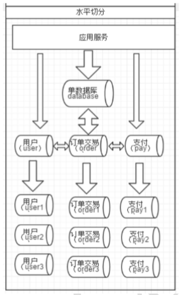

#### 5.1 实现分表

- 选择要拆分的表

  MySQL 单表存储数据条数是有瓶颈的，单表达到 1000 万条数据就达到了瓶颈，会影响查询效率，需要进行水平拆分（分表）进行优化。

  例如：例子中的 orders、orders_detail 都已经达到 600 万行数据，需要进行分表优化。 

- 分表字段

  以 orders 表为例，可以根据不同自字段进行分表

  | 编号 | 分表字段               | 效果                                                         |
  | ---- | ---------------------- | ------------------------------------------------------------ |
  | 1    | id（主键、或创建时间） | 查询订单注重失效，历史订单被查询次数少，如此分片会造成分片会造成一个节点访问多，一个访问少，不平均。 |
  | 2    | customer_id（客户 id） | 根据客户 id 去分，两个节点访问平均，一个客户的所             |

- 修改schema.xml

  #为 orders 表设置数据节点为 dn1、dn2，并指定分片规则为 mod_rule（自定义的名字）

  ```xml
  <table name="orders" dataNode="dn1,dn2" rule="mod_rule" ></table>
  ```

  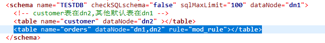

- 修改rule.xml

  ```xml
  #在 rule 配置文件里新增分片规则 mod_rule，并指定规则适用字段为 customer_id， #还有选择分片算法 mod-long（对字段求模运算），customer_id 对两个节点求模，根据结果分片
  #配置算法 mod-long 参数 count 为 2，两个节点
  <tableRule name="mod_rule">
   <rule>
   <columns>customer_id</columns>
   <algorithm>mod-long</algorithm>
   </rule>
   </tableRule>
  …
  <function name="mod-long" class="io.mycat.route.function.PartitionByMod">
   <!-- how many data nodes -->
   <property name="count">2</property>
   </function>
  ```

  如下图

  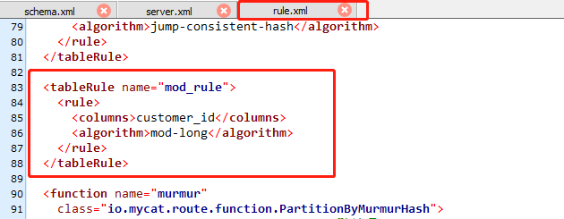

  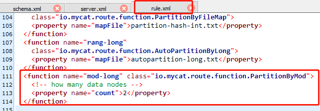

- 在数据库节点dn2创建orders表

  ```sql
  CREATE TABLE orders(
   id INT AUTO_INCREMENT,
   order_type INT,
   customer_id INT,
   amount DECIMAL(10,2),
   PRIMARY KEY(id)
  ); 
  ```

- 重启MyCat测试

  在 mycat 里向 orders 表插入数据，INSERT 字段不能省略

  ```sql
  INSERT INTO orders(id,order_type,customer_id,amount) VALUES (1,101,100,100100);
  INSERT INTO orders(id,order_type,customer_id,amount) VALUES(2,101,100,100300);
  INSERT INTO orders(id,order_type,customer_id,amount) VALUES(3,101,101,120000);
  INSERT INTO orders(id,order_type,customer_id,amount) VALUES(4,101,101,103000);
  INSERT INTO orders(id,order_type,customer_id,amount) VALUES(5,102,101,100400);
  INSERT INTO orders(id,order_type,customer_id,amount) VALUES(6,102,100,100020);
  
  ```

  在mycat、dn1、dn2中查看orders表数据，分表成功

  ```shell
  -------------------------MyCat--------------------------------
  mysql -h 192.168.200.104 -P8066 -uroot -p123456
  mysql> select * from orders;
  +----+------------+-------------+-----------+
  | id | order_type | customer_id | amount    |
  +----+------------+-------------+-----------+
  |  1 |        101 |         100 | 100100.00 |
  |  2 |        101 |         100 | 100300.00 |
  |  6 |        102 |         100 | 100020.00 |
  |  3 |        101 |         101 | 120000.00 |
  |  4 |        101 |         101 | 103000.00 |
  |  5 |        102 |         101 | 100400.00 |
  +----+------------+-------------+-----------+
  6 rows in set (0.05 sec)
  
  --------------------------dn1-------------------------------
  docker exec -it m1 mysql -uroot -p123456
  mysql> select * from orders;
  +----+------------+-------------+-----------+
  | id | order_type | customer_id | amount    |
  +----+------------+-------------+-----------+
  |  1 |        101 |         100 | 100100.00 |
  |  2 |        101 |         100 | 100300.00 |
  |  6 |        102 |         100 | 100020.00 |
  +----+------------+-------------+-----------+
  3 rows in set (0.00 sec)
  
  
  --------------------------dn2-------------------------------
  docker exec -it m2 mysql -uroot -p123456
  mysql> select * from orders;
  +----+------------+-------------+-----------+
  | id | order_type | customer_id | amount    |
  +----+------------+-------------+-----------+
  |  3 |        101 |         101 | 120000.00 |
  |  4 |        101 |         101 | 103000.00 |
  |  5 |        102 |         101 | 100400.00 |
  +----+------------+-------------+-----------+
  3 rows in set (0.00 sec)
  
  ```

#### 5.2 Mycat的分片 “join”

Orders 订单表已经进行分表操作了，和它关联的 orders_detail 订单详情表如何进行 join 查询,我们要对 orders_detail 也要进行分片操作。Join 的原理如下图： 

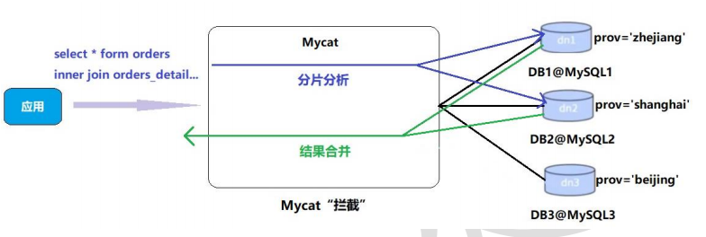

##### 5.2.1 ER表

Mycat 借鉴了 NewSQL 领域的新秀 Foundation DB 的设计思路，Foundation DB 创新性的提出了 Table Group 的概念，其将子表的存储位置依赖于主表，并且物理上紧邻存放，因此彻底解决了JION 的效率和性能问 题，根据这一思路，提出了基于 E-R 关系的数据分片策略，子表的记录与所关联的父表记录存放在同一个数据分片上。

- 修改 schema.xml 配置文件

  ```xml
   <table name="orders" dataNode="dn1,dn2" rule="mod_rule">
  	<childTable name="orders_detail" primaryKey="id" joinKey="order_id" parentKey="id" />
   </table>
  ```

  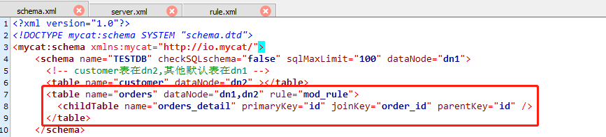

- 在 dn2 创建 orders_detail 表 

  ```sql
  CREATE TABLE orders_detail(
   id INT AUTO_INCREMENT,
   detail VARCHAR(2000),
   order_id INT,
   PRIMARY KEY(id)
  );
  ```

- 重启MyCat测试

  访问 Mycat 向 orders_detail 表插入数据

  ```sql
  INSERT INTO orders_detail(id,detail,order_id) values(1,'detail1',1);
  INSERT INTO orders_detail(id,detail,order_id) VALUES(2,'detail1',2);
  INSERT INTO orders_detail(id,detail,order_id) VALUES(3,'detail1',3);
  INSERT INTO orders_detail(id,detail,order_id) VALUES(4,'detail1',4);
  INSERT INTO orders_detail(id,detail,order_id) VALUES(5,'detail1',5);
  INSERT INTO orders_detail(id,detail,order_id) VALUES(6,'detail1',6);
  ```

  在mycat、dn1、dn2中运行两个表join语句

  ```shell
  -------------------------MyCat--------------------------------
  mysql -h 192.168.200.104 -P8066 -uroot -p123456
  
  mysql> Select o.*,od.detail from orders o inner join orders_detail od on o.id=od.order_id;
  +----+------------+-------------+-----------+---------+
  | id | order_type | customer_id | amount    | detail  |
  +----+------------+-------------+-----------+---------+
  |  1 |        101 |         100 | 100100.00 | detail1 |
  |  2 |        101 |         100 | 100300.00 | detail1 |
  |  6 |        102 |         100 | 100020.00 | detail1 |
  |  3 |        101 |         101 | 120000.00 | detail1 |
  |  4 |        101 |         101 | 103000.00 | detail1 |
  |  5 |        102 |         101 | 100400.00 | detail1 |
  +----+------------+-------------+-----------+---------+
  
  --------------------------dn1-------------------------------
  docker exec -it m1 mysql -uroot -p123456
  mysql> Select o.*,od.detail from orders o inner join orders_detail od on o.id=od.order_id;
  +----+------------+-------------+-----------+---------+
  | id | order_type | customer_id | amount    | detail  |
  +----+------------+-------------+-----------+---------+
  |  1 |        101 |         100 | 100100.00 | detail1 |
  |  2 |        101 |         100 | 100300.00 | detail1 |
  |  6 |        102 |         100 | 100020.00 | detail1 |
  +----+------------+-------------+-----------+---------+
  3 rows in set (0.00 sec)
  
  --------------------------dn2-------------------------------
  docker exec -it m2 mysql -uroot -p123456
  mysql> Select o.*,od.detail from orders o inner join orders_detail od on o.id=od.order_id;
  +----+------------+-------------+-----------+---------+
  | id | order_type | customer_id | amount    | detail  |
  +----+------------+-------------+-----------+---------+
  |  3 |        101 |         101 | 120000.00 | detail1 |
  |  4 |        101 |         101 | 103000.00 | detail1 |
  |  5 |        102 |         101 | 100400.00 | detail1 |
  +----+------------+-------------+-----------+---------+
  3 rows in set (0.00 sec)
  
  ```

##### 5.2.2 全局表

在分片的情况下，当业务表因为规模而进行分片以后，业务表与这些附属的字典表之间的关联，就成了比较 棘手的问题，考虑到字典表具有以下几个特性：

① 变动不频繁

② 数据量总体变化不大

③ 数据规模不大，很少有超过数十万条记录

鉴于此，Mycat 定义了一种特殊的表，称之为“全局表”，全局表具有以下特性：

① 全局表的插入、更新操作会实时在所有节点上执行，保持各个分片的数据一致性

② 全局表的查询操作，只从一个节点获取

③ 全局表可以跟任何一个表进行 JOIN 操作

将字典表或者符合字典表特性的一些表定义为全局表，则从另外一个方面，很好的解决了数据JOIN 的难题。通过全局表+基于 E-R 关系的分片策略，Mycat 可以满足 80%以上的企业应用开发

- 修改 schema.xml 配置文件

  ```xml
   <table name="dict_order_type" dataNode="dn1,dn2" type="global" ></table>
  ```

  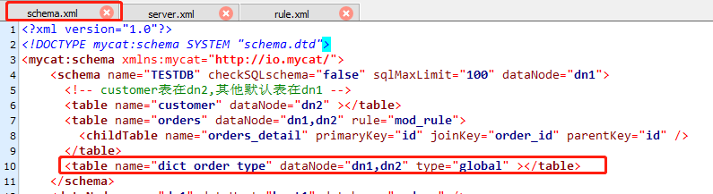

- 在 dn2 创建 dict_order_type 表 

  ```sql
  CREATE TABLE dict_order_type(
   id INT AUTO_INCREMENT,
   order_type VARCHAR(200),
   PRIMARY KEY(id)
  );
  ```

  

- 重启MyCat测试

  访问 Mycat 向 dict_order_type 表插入数据

  ```sql
  INSERT INTO dict_order_type(id,order_type) VALUES(101,'type1');
  INSERT INTO dict_order_type(id,order_type) VALUES(102,'type2');
  ```

  在Mycat、dn1、dn2中查询表数据

  ```shell
  -------------------------MyCat--------------------------------
  mysql -h 192.168.200.104 -P8066 -uroot -p123456
  mysql> select * from dict_order_type;
  +-----+------------+
  | id  | order_type |
  +-----+------------+
  | 101 | type1      |
  | 102 | type2      |
  +-----+------------+
  2 rows in set (0.14 sec)
  
  
  --------------------------dn1-------------------------------
  docker exec -it m1 mysql -uroot -p123456
  mysql> select * from dict_order_type;
  +-----+------------+
  | id  | order_type |
  +-----+------------+
  | 101 | type1      |
  | 102 | type2      |
  +-----+------------+
  2 rows in set (0.00 sec)
  
  --------------------------dn2-------------------------------
  docker exec -it m2 mysql -uroot -p123456
  mysql> select * from dict_order_type;
  +-----+------------+
  | id  | order_type |
  +-----+------------+
  | 101 | type1      |
  | 102 | type2      |
  +-----+------------+
  2 rows in set (0.00 sec)
  
  ```

#### 5.3 常用分片规则

##### 5.3.1 取模

此规则为对分片字段求摸运算。也是水平分表最常用规则。5.1 配置分表中，orders 表采用了此规则。

##### 5.3.2 分片枚举

通过在配置文件中配置可能的枚举 id，自己配置分片，本规则适用于特定的场景，比如有些业务需要按照省份或区县来做保存，而全国省份区县固定的，这类业务使用本条规则。

- 修改schema.xml配置文件

  ```xml
  <table name="orders_ware_info" dataNode="dn1,dn2" rule="sharding_by_intfile" ></table>
  ```

- 修改rule.xml配置文件

  - columns：分片字段，algorithm：分片函数
  -  mapFile：标识配置文件名称，type：0为int型、非0为String
  - defaultNode：默认节点:小于 0 表示不设置默认节点，大于等于 0 表示设置默认节点， 设置默认节点如果碰到不识别的枚举值，就让它路由到默认节点，如不设置不识别就报错

  ```xml
  #先确认该配置项是否存在 
  <tableRule name="sharding-by-intfile1">
      <rule>
        <columns>areacode</columns>
        <algorithm>hash-int1</algorithm>
      </rule>
    </tableRule>
   <function name="hash-int1" class="io.mycat.route.function.PartitionByFileMap">
     <property name="mapFile">partition-hash-int.txt</property>
     <property name="type">1</property>
     <property name="defaultNode">0</property>
   </function>
  ```
  
- 修改partition-hash-int.txt配置文件

    ```tex
    110=0
    120=1
    ```

- 重启MyCat测试

    在dn1,dn2追加表订单归属区域信息表

    ```sql
    CREATE TABLE orders_ware_info
    (
     `id` INT AUTO_INCREMENT comment '编号',
     `order_id` INT comment '订单编号',
     `address` VARCHAR(200) comment '地址',
    `areacode` VARCHAR(20) comment '区域编号',
    PRIMARY KEY(id)
    );
    ```

    在Mycat插入数据

    ```sql
    INSERT INTO orders_ware_info(id, order_id,address,areacode) VALUES (1,1,'北京','110');
    INSERT INTO orders_ware_info(id, order_id,address,areacode) VALUES (2,2,'天津','120');
    ```

    ```shell
    -------------------------MyCat--------------------------------
    mysql -h 192.168.200.104 -P8066 -uroot -p123456
    mysql> select * from orders_ware_info;
    +----+----------+---------+----------+
    | id | order_id | address | areacode |
    +----+----------+---------+----------+
    |  1 |        1 | 北京    | 110      |
    |  2 |        2 | 天津    | 120      |
    +----+----------+---------+----------+
    2 rows in set (0.00 sec)
    
    
    --------------------------dn1-------------------------------
    docker exec -it m1 mysql -uroot -p123456
    mysql> select * from orders_ware_info;
    +----+----------+---------+----------+
    | id | order_id | address | areacode |
    +----+----------+---------+----------+
    |  1 |        1 | 北京     | 110      |
    +----+----------+---------+----------+
    1 row in set (0.00 sec)
    
    
    --------------------------dn2-------------------------------
    docker exec -it m2 mysql -uroot -p123456
    mysql> select * from orders_ware_info;
    +----+----------+---------+----------+
    | id | order_id | address | areacode |
    +----+----------+---------+----------+
    |  2 |        2 | 天津     | 120      |
    +----+----------+---------+----------+
    1 row in set (0.00 sec)
    
    
    ```

##### 5.3.3  范围约定

​	此分片适用于，提前规划好分片字段某个范围属于哪个分片。

- 修改schema.xml配置文件

  ```xml
  <table name="payment_info" dataNode="dn1,dn2" rule="auto-sharding-long" ></table>
  ```

  

- 修改rule.xml配置文件

  ```xml
      <tableRule name="auto-sharding-long">
          <rule>
              <columns>order_id</columns>
              <algorithm>rang-long</algorithm>
          </rule>
      </tableRule>
      <function name="rang-long" class="io.mycat.route.function.AutoPartitionByLong">
          <property name="mapFile">autopartition-long.txt</property>
      </function>
  ```
  
- autopartition-long.txt
  ```tex
  range start-end ,data node index
  # K=1000,M=10000.
  # 0-500M=0
  # 500M-1000M=1
  # 1000M-1500M=2
  0-102=0
  103-200=1
  ```
- 重启MyCat测试

    在dn1,dn2追加支付信息表

    ```sql
    #支付信息表 
    CREATE TABLE payment_info
    (
     `id` INT AUTO_INCREMENT comment '编号',
     `order_id` INT comment '订单编号',
     `payment_status` INT comment '支付状态',
     PRIMARY KEY(id)
    );
    ```

    在Mycat插入数据

    ```sql
    INSERT INTO payment_info (id,order_id,payment_status) VALUES (1,101,0);
    INSERT INTO payment_info (id,order_id,payment_status) VALUES (2,102,1);
    INSERT INTO payment_info (id,order_id ,payment_status) VALUES (3,103,0);
    INSERT INTO payment_info (id,order_id,payment_status) VALUES (4,104,1);
    ```
    
    ```shell
    -------------------------MyCat--------------------------------
    mysql -h 192.168.200.104 -P8066 -uroot -p123456
    mysql> select * from payment_info;
    +----+----------+----------------+
    | id | order_id | payment_status |
    +----+----------+----------------+
    |  1 |      101 |              0 |
    |  2 |      102 |              1 |
    |  3 |      103 |              0 |
    |  4 |      104 |              1 |
    +----+----------+----------------+
    4 rows in set (0.02 sec)
    
    
    --------------------------dn1-------------------------------
    docker exec -it m1 mysql -uroot -p123456
    mysql> select * from  payment_info;
    +----+----------+----------------+
    | id | order_id | payment_status |
    +----+----------+----------------+
    |  1 |      101 |              0 |
    |  2 |      102 |              1 |
    +----+----------+----------------+
    2 rows in set (0.00 sec)
    
    
    --------------------------dn2-------------------------------
    docker exec -it m2 mysql -uroot -p123456
    mysql>  select * from  payment_info;
    +----+----------+----------------+
    | id | order_id | payment_status |
    +----+----------+----------------+
    |  3 |      103 |              0 |
    |  4 |      104 |              1 |
    +----+----------+----------------+
    2 rows in set (0.00 sec)
    
    ```

#### 5.4 全局序列

在实现分库分表的情况下，数据库自增主键已无法保证自增主键的全局唯一。为此，Mycat 提供了全局 sequence，并且提供了包含本地配置和数据库配置等多种实现方式。

- 本地文件

  此方式 Mycat 将 sequence 配置到文件中，当使用到 sequence 中的配置后，Mycat 会更下classpath 中的 sequence_conf.properties 文件中 sequence 当前的值。

  ① 优点：本地加载，读取速度较快

  ② 缺点：抗风险能力差，Mycat 所在主机宕机后，无法读取本地文件。 

- 数据库方式

  利用数据库一个表 来进行计数累加。但是并不是每次生成序列都读写数据库，这样效率太低。

  Mycat 会预加载一部分号段到 Mycat 的内存中，这样大部分读写序列都是在内存中完成的。

  如果内存中的号段用完了 Mycat 会再向数据库要一次。

  问：那如果 Mycat 崩溃了 ，那内存中的序列岂不是都没了？

  是的。如果是这样，那么 Mycat 启动后会向数据库申请新的号段，原有号段会弃用。

  也就是说如果 Mycat 重启，那么损失是当前的号段没用完的号码，但是不会因此出现主键重复。

  ① 建库序列脚本

  ```sql
  #在 dn1 上创建全局序列表
  CREATE TABLE MYCAT_SEQUENCE (
  NAME VARCHAR(50) NOT NULL,
  current_value INT NOT NULL,
  increment INT NOT NULL DEFAULT 100, 
  PRIMARY KEY(NAME)) ENGINE=INNODB;
  
  #创建全局序列所需函数
  DELIMITER $$ 
  CREATE FUNCTION mycat_seq_currval(seq_name VARCHAR(50)) RETURNS VARCHAR(64)
  DETERMINISTIC 
  BEGIN
  DECLARE retval VARCHAR(64);
  SET retval="-999999999,null";
  SELECT CONCAT(CAST(current_value AS CHAR),",",CAST(increment AS CHAR)) 
  INTO retval 
  FROM
  MYCAT_SEQUENCE 
  WHERE NAME = seq_name;
  RETURN retval;
  END $$
  DELIMITER ;
  DELIMITER $$
  CREATE FUNCTION mycat_seq_setval(seq_name VARCHAR(50),VALUE INTEGER) RETURNS 
  VARCHAR(64)
  DETERMINISTIC
  BEGIN
  UPDATE MYCAT_SEQUENCE
  SET current_value = VALUE
  WHERE NAME = seq_name;
  RETURN mycat_seq_currval(seq_name);
  END $$
  DELIMITER ;
  DELIMITER $$
  CREATE FUNCTION mycat_seq_nextval(seq_name VARCHAR(50)) RETURNS VARCHAR(64) 
  DETERMINISTIC
  BEGIN
  UPDATE MYCAT_SEQUENCE
  SET current_value = current_value + increment WHERE NAME = seq_name;
  RETURN mycat_seq_currval(seq_name);
  END $$
  DELIMITER
  #初始化序列表记录
  INSERT INTO MYCAT_SEQUENCE(NAME,current_value,increment) VALUES ('ORDERS', 400000,100);
  ```

  ② 修改 Mycat 配置

  - 修改sequence_db_conf.properties 

  意思是 ORDERS这个序列在dn1这个节点上，具体dn1节点是哪台机子，请参考schema.xml

  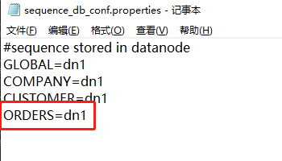

  - 修改server.xml

    全局序列类型：0-本地文件，1-数据库方式，2-时间戳方式。此处应该修改成1

    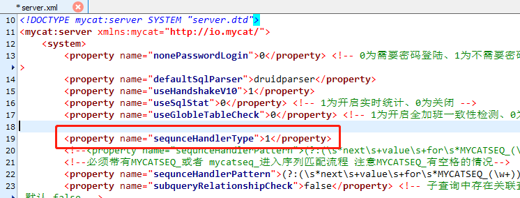

  ③ 验证全局序列

  ```sql
  insert into orders(id,amount,customer_id,order_type) values(next value for MYCATSEQ_ORDERS,1000,101,102);
  ```


​		**问题？？？？：序列号过大导致插入失败，原因不明**

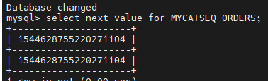

- 时间戳方式

  全局序列ID= 64 位二进制 (42(毫秒)+5(机器 ID)+5(业务编码)+12(重复累加) 换算成十进制为 18 位数的  long 类型，每毫秒可以并发 12 位二进制的累加。

    ① 优点：配置简单

    ② 缺点：18 位 ID 过长

- 自主生成全局序列

    可在 java 项目里自己生成全局序列，如下： 

    ① 根据业务逻辑组合

    ② 可以利用 redis 的单线程原子性 incr 来生成序列

    但，自主生成需要单独在工程中用 java 代码实现，还是推荐使用 Mycat 自带全局序列。

#### 6. 安全设置

##### 6.1 权限配置		

- user标签权限控制

  目前 Mycat 对于中间件的连接控制并没有做太复杂的控制，目前只做了中间件逻辑库级别的读

  写权限控制。是通过 server.xml 的 user 标签进行配置。 

  ```xml
  #server.xml配置文件user部分
  <user name="mycat">
   <property name="password">123456</property>
   <property name="schemas">TESTDB</property>
  </user>
  <user name="user">
   <property name="password">user</property>
   <property name="schemas">TESTDB</property>
   <property name="readOnly">true</property>
  </user>
  ```

  标签说明

  | 标签属性 | 说明                                                         |
  | -------- | ------------------------------------------------------------ |
  | name     | 应用连接中间件逻辑库的用户名                                 |
  | password | 该用户对应的密码                                             |
  | TESTDB   | 应用当前连接的逻辑库中所对应的逻辑表。schemas中可以配置一个或多个 |
  | readOnly | 应用连接中间件逻辑库所具有的权限。true 为只读，false 为读写都有，默认为 false |

  

- privilege标签权限控制

  在 user 标签下的 privileges 标签可以对逻辑库（schema）、表（table）进行精细化的 DML 权限控制。

  privileges 标签下的 check 属性，如为 true 开启权限检查，为 false 不开启，默认为 false。

  由于 Mycat 一个用户的 schemas 属性可配置多个逻辑库（schema） ，所以 privileges 的下级节点 schema 节点同样可配置多个，对多库多表进行细粒度的 DML 权限控制。

  ```xml
  #server.xml配置文件privileges部分
  #配置orders表没有增删改查权限
  <user name="mycat">
   <property name="password">123456</property>
   <property name="schemas">TESTDB</property>
   <!-- 表级 DML 权限设置 -->
  <privileges check="true">
  <schema name="TESTDB" dml="1111" >
  <table name="orders" dml="0000"></table>
  <!--<table name="tb02" dml="1111"></table>-->
  </schema>
  </privileges>
  </
  ```

  配置说明

  | DML  | 增加 | 更新 | 查询 | 删除 |
  | ---- | ---- | ---- | ---- | ---- |
  | 0000 | 禁止 | 禁止 | 禁止 | 禁止 |
  | 0010 | 禁止 | 禁止 | 可以 | 禁止 |
  | 1110 | 可以 | 可以 | 可以 | 禁止 |
  | 1111 | 可以 | 可以 | 可以 | 可以 |

#### 6.2 SQL拦截

firewall 标签用来定义防火墙；firewall 下 whitehost 标签用来定义 IP 白名单 ，blacklist 用来定义SQL 黑名单

- 白名单

  可以通过设置白名单，实现某主机某用户可以访问 Mycat，而其他主机用户禁止访问。

  ```xml
  设置白名单
  #server.xml配置文件firewall标签
  #配置只有192.168.140.128主机可以通过mycat用户访问
  <firewall>
   <whitehost>
   <host host="192.168.140.128" user="mycat"/>
   </whitehost>
  </firewall>
  #如下图
  ```

- 黑名单

  可以通过设置黑名单，实现 Mycat 对具体 SQL 操作的拦截，如增删改查等操作的拦截。

  ```xml
  #设置黑名单
  #server.xml配置文件firewall标签
  #配置禁止mycat用户进行删除操作
  <firewall>
   <whitehost>
   <host host="192.168.140.128" user="mycat"/>
   </whitehost>
   <blacklist check="true">
   <property name="deleteAllow">false</property>
  </blacklist>
  </firewall>
  ```

   可以设置的黑名单 SQL 拦截功能列表

| 配置项           | 缺省值 | 描述                          |
| ---------------- | ------ | ----------------------------- |
| selelctAllow     | true   | 是否允许执行 SELECT 语句      |
| deleteAllow      | true   | 是否允许执行 DELETE 语句      |
| updateAllow      | true   | 是否允许执行 UPDATE 语句      |
| insertAllow      | true   | 是否允许执行 INSERT 语句      |
| createTableAllow | true   | 是否允许创建表                |
| setAllow         | true   | 是否允许使用 SET 语法         |
| alterTableAllow  | true   | 是否允许执行 Alter Table 语句 |
| dropTableAllow   | true   | 是否允许修改表                |
| commitAllow      | true   | 是否允许执行 commit 操作      |
| rollbackAllow    | true   | 是否允许执行 roll back 操作   |

## 四、Mycat高可用

在实际项目中，Mycat 服务也需要考虑高可用性，如果 Mycat 所在服务器出现宕机，或 Mycat 服务故障，需要有备机提供服务，需要考虑 Mycat 集群。

### 1. 高可用方案

我们可以使用 HAProxy + Keepalived 配合两台 Mycat 搭起 Mycat 集群，实现高可用性。HAProxy 实现了 MyCat 多节点的集群高可用和负载均衡，而 HAProxy 自身的高可用则可以通过 Keepalived 来实现

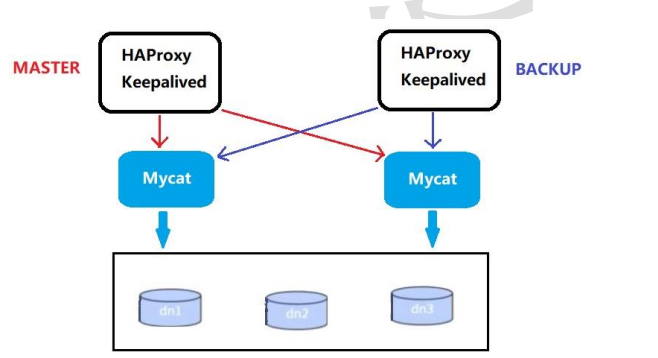

### 2. 搭建

待完成


