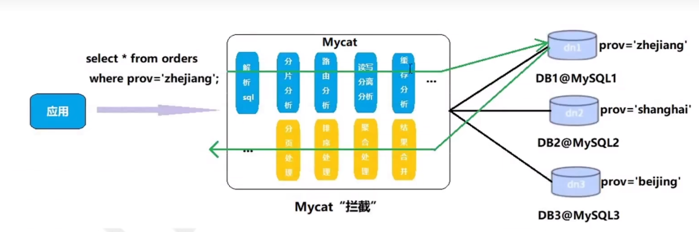
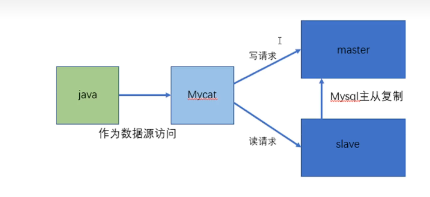
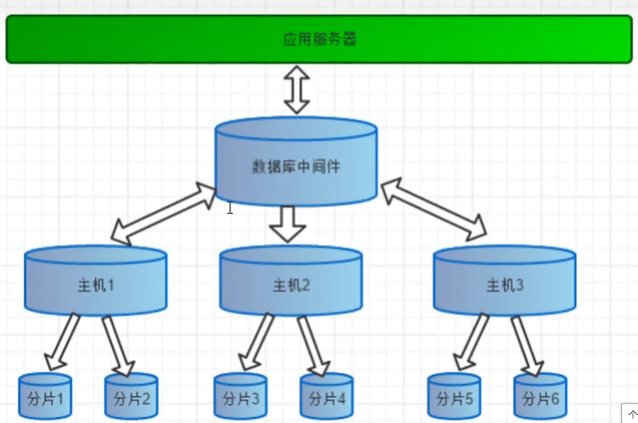
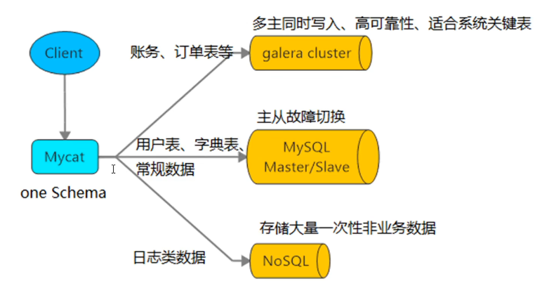

一、入门概述

1. MyCat概述

   1.1 原理

   MyCat的原理中做重要的一个动词是“拦截”，它拦截了用户发送的SQL语句，首先对SQL语句做了一些特定分析：如分片分析、路由分析、读写分离分析、缓存分析，然后将此SQL发往后端的真是数据库，并将返回的结果做适当的处理，最终再返回给用户。

   

   1.2 MyCat1.X与MyCat2.X功能对比

   | 功能                   |      | 1.6                            | 2.0                              |
   | ---------------------- | ---- | ------------------------------ | -------------------------------- |
   | 多语句                 |      | 不支持                         | 支持                             |
   | blob值（二进制大对象） |      | 支持一部分                     | 支持                             |
   | 全局二级索引           |      | 不支持                         | 支持                             |
   | 任意跨库join           |      | catlet支持                     | 支持                             |
   | 关联子查询             |      | 不支持                         | 支持一部分                       |
   | 分库同时分表           |      | 不支持                         | 支持                             |
   | 存储过程               |      | 支持固定形式的                 | 支持更多                         |
   | 支持逻辑视图           |      | 不支持                         | 支持                             |
   | 支持物理视图           |      | 支持                           | 支持                             |
   | 批量插入               |      | 不支持                         | 支持                             |
   | 执行计划管理           |      | 不支持                         | 支持                             |
   | 路由注释               |      | 支持                           | 支持                             |
   | 集群功能               |      | 支持                           | 支持更多集群类型                 |
   | 自动Hash分片算法       |      | 不支持                         | 支持                             |
   | 支持第三方监控         |      | 支持mycat-web                  | 支持Prometheus、Kafaka日志等监控 |
   | 流式合并结果集         |      | 支持                           | 支持                             |
   | 范围查询               |      | 支持                           | 支持                             |
   | 单表映射物理表         |      | 不支持                         | 支持                             |
   | XA事务                 |      | 弱XA                           | 支持，事务自动恢复               |
   | 支持MySQl8.0           |      | 需要更改MYSQL8的服务器配置支持 | 支持                             |
   | 虚拟表                 |      | 不支持                         | 支持                             |

2. 功能

   2.1 读写分离

   

   2.2 数据分片

   垂直拆分（分库），水平拆分（分表）、垂直+水平拆分（分库分表）

   

   2.3 多数据源整合

   

   