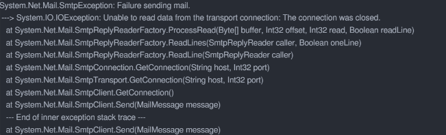

### 1. System.Net.Mail.SmtpClient通过SSLTLS协议发送邮件失败问题解决

**问题现象**

通过
使⽤SSL/TLS协议发送邮件失败并报错
System.Net.Mail.SmtpClient

System.Net.Mail.SmtpException: Failure sending mail

详细报错信息：



**问题原因**

这个问题跟SSL/TLS的协议版本有关系，SSL演化到3.0之后还是不够安全，因此⼜出现了SSL的升级版TLS协议，由于建⽴连接时的区别，⼜分别被称为显⽰SSL和隐式SSL。SSL/TLS协议通常是结对出现SSL/TLS，不过⼤家还是喜欢简称为SSL。

> ⽬前最新版本是TLS 1.3，其他可⽤版本是TLS 1.2和TLS 1.1，其中TLS1.1计划于2020年弃⽤

所以，⽬前主流的邮箱服务商加密协议使⽤的都是TLS。
但是System.Net.Mail.SmtpClient 不⽀持较新的TLS协议，具体的TLS协议版本⽀持情况MSDN上并未找到相关说明。
截⽌到2020年3⽉受影响的框架版本：
.NET Core 2.0-3.1
.NET Framework 2.0-4.8
⽬前微软MSDN已经将标记为已过期(obsolete)，但源码中并未标记，也并未给出替代实现。

**解决办法**

使用`MailKit`

[MailKit](https://github.com/jstedfast/MailKit)是一个开源的基于MimeKit的跨平台邮件收发类库,支持IMAP、POP3、SMTP。其中SmtpClient也支持TLS协议.

可以很好的支持 .NET Core以及 .NET Framework框架的邮件发送

测试环境

MailKit V3.3.0
MimeKit V3.3.0
.Net Core3.1

代码：

```C#
        static void Main(string[] args)
        {
            SendMailOfMailKit();
            Console.WriteLine("发送成功！");
            Console.ReadKey();
        }

        static void SendMailOfMailKit()
        {
            string smtpService = "smtp.qq.com";
            string sendEmail = "XXXXXX@qq.com";
            string sendpwd = "vpflpukcgmbbbdhh";//QQ授权码
            string receiveEmail = "XXXXX@testc.com";
            int port = 465;
            //string smtpService = "smtp.cet-electric.com";
            //string sendEmail = "XXXXX@test.com";
            //string sendpwd = "*********";
            //string receiveEmail = "XXXXXX@qq.com";
            //int port = 25;

            var message = new MimeMessage();
            message.From.Add(new MailboxAddress("test", sendEmail));
            message.To.Add(new MailboxAddress("test", receiveEmail));
            message.Subject = "邮件测试";

            var body = new TextPart(TextFormat.Plain)
            {
                Text = "邮件测试⽂本正⽂"
            };
            var mult = new Multipart("mixed"){ body };
            //发送附件
            foreach (var file in Directory.GetFiles(@"D:\images"))
            {
                var attachment = new MimePart();
                attachment.Content = new MimeContent(File.OpenRead(file));
                attachment.ContentDisposition = new ContentDisposition(ContentDisposition.Attachment);
                attachment.ContentTransferEncoding = ContentEncoding.Base64;
                attachment.FileName = ConvertHeaderToBase64(Path.GetFileName(file), Encoding.UTF8);//解决附件中文名问题
                mult.Add(attachment);
            }
            message.Body = mult;

            try
            {
                using (var client = new MailKit.Net.Smtp.SmtpClient())
                {
                    client.ServerCertificateValidationCallback = (s, c, h, e) => true;
                    //服务器，端⼝，是否开启smtp ssl
                    if(port == 25)
                    {
                        //client.Connect(smtpService, port, MailKit.Security.SecureSocketOptions.None);//V1.22.0.0
                        client.Connect(smtpService, port, false);//V3.3.0
                    }
                    else
                    {
                        //client.Connect(smtpService, port, MailKit.Security.SecureSocketOptions.Auto);//V1.22.0.0
                        client.Connect(smtpService, port, true);//V3.3.0
                    }
                    //需要禁用XOAUTH2身份认证，否则会报错(Mailkit/MimeKit旧版需要禁用，新版本则不需要)
                    //client.AuthenticationMechanisms.Remove("XOAUTH2");//V1.22.0.0
                    client.Authenticate(sendEmail, sendpwd);
                    client.Send(message);
                    client.Disconnect(true);
                }
            }
            catch (SmtpCommandException ex)
            {
                Console.WriteLine("{0}:{1},{2}", ex.StatusCode, ex.Message, ex.StackTrace);
            }
            catch (Exception ex)
            {
                Console.WriteLine("{0}", ex.Message);
            }
        }

		//解决附件中文名问题
        private static string ConvertHeaderToBase64(string inputStr, Encoding encoding)
        {
            var encode = !string.IsNullOrEmpty(inputStr) && inputStr.Any(c => c > 127);
            if (encode)
            {
                return "=?" + encoding.WebName + "?B?" + Convert.ToBase64String(encoding.GetBytes(inputStr)) + "?=";
            }
            return inputStr;
        }
```


